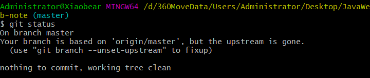

# 1、版本控制

学习git之前，我们需要先明白一个概念: **版本控制**

> 版本控制（Revision control）是一种在开发的过程中用于管理我们对文件、目录或工程等内容的修改历史，方便查看更改历史记录，备份以便恢复以前的版本的软件工程技术。
>
> - 实现跨区域多人协同开发
> - 追踪和记载一个或者多个文件的历史记录
> - 组织和保护你的源代码和文档
> - 统计工作量
> - 并行开发、提高开发效率
> - 跟踪记录整个软件的开发过程
> - 减轻开发人员的负担，节省时间，同时降低人为错误

简单说就是用于管理多人协同开发项目的技术。

没有进行版本控制或者版本控制本身缺乏正确的流程管理，在软件开发过程中将会引入很多问题，如软件代码的一致性、软件内容的冗余、软件过程的事物性、软件开发过程中的并发性、软件源代码的安全性，以及软件的整合等问题。

# 2、常见的版本控制工具

主流的版本控制器有如下这些：

- **Git**
- **SVN**（Subversion）
- **CVS**（Concurrent Versions System）
- **VSS**（Micorosoft Visual SourceSafe）
- **TFS**（Team Foundation Server）
- Visual Studio Online

版本控制产品非常的多（Perforce、Rational ClearCase、RCS（GNU Revision Control System）、Serena Dimention、SVK、BitKeeper、Monotone、Bazaar、Mercurial、SourceGear Vault），现在影响力最大且使用最广泛的是Git与SVN

# 3、版本控制分类

## 1、本地版本控制


## 2、集中版本控制  SVN

所有的版本数据都保存在服务器上，协同开发者从服务器上同步更新或上传自己的修改


所有的版本数据都存在服务器上，用户的本地只有自己以前所同步的版本，如果不连网的话，用户就看不到历史版本，也无法切换版本验证问题，或在不同分支工作。而且，所有数据都保存在单一的服务器上，有很大的风险这个服务器会损坏，这样就会丢失所有的数据，当然可以定期备份。代表产品：SVN、CVS、VSS

## 3、分布式版本控制 	Git

每个人都拥有全部的代码！安全隐患！

所有版本信息仓库全部同步到本地的每个用户，这样就可以在本地查看所有版本历史，可以离线在本地提交，只需在连网时push到相应的服务器或其他用户那里。由于每个用户那里保存的都是所有的版本数据，只要有一个用户的设备没有问题就可以恢复所有的数据，但这增加了本地存储空间的占用。

不会因为服务器损坏或者网络问题，造成不能工作的情况！

## 4、Git与SVN的主要区别

SVN是集中式版本控制系统，版本库是集中放在中央服务器的，而工作的时候，用的都是自己的电脑，所以首先要从中央服务器得到最新的版本，然后工作，完成工作后，需要把自己做完的活推送到中央服务器。集中式版本控制系统是必须联网才能工作，对网络带宽要求较高。

Git是分布式版本控制系统，没有中央服务器，每个人的电脑就是一个完整的版本库，工作的时候不需要联网了，因为版本都在自己电脑上。协同的方法是这样的：比如说自己在电脑上改了文件A，其他人也在电脑上改了文件A，这时，你们两之间只需把各自的修改推送给对方，就可以互相看到对方的修改了。Git可以直接看到更新了哪些代码和文件！

**Git是目前世界上最先进的分布式版本控制系统。**

# 4、Git的历史

同生活中的许多伟大事物一样，Git 诞生于一个极富纷争大举创新的年代。

Linux 内核开源项目有着为数众广的参与者。绝大多数的 Linux 内核维护工作都花在了提交补丁和保存归档的繁琐事务上(1991－2002年间)。到 2002 年，整个项目组开始启用一个专有的分布式版本控制系统 BitKeeper 来管理和维护代码。

Linux社区中存在很多的大佬！破解研究 BitKeeper ！

到了 2005 年，开发 BitKeeper 的商业公司同 Linux 内核开源社区的合作关系结束，他们收回了 Linux 内核社区免费使用 BitKeeper 的权力。这就迫使 Linux 开源社区(特别是 Linux 的缔造者 Linus Torvalds)基于使用 BitKeeper 时的经验教训，开发出自己的版本系统。（2周左右！） 也就是后来的 Git！

**Git是目前世界上最先进的分布式版本控制系统。**

Git是免费、开源的，最初Git是为辅助 Linux 内核开发的，来替代 BitKeeper！

# 5、Git下载

打开 [git官网] https://git-scm.com/，下载git对应操作系统的版本。

所有东西下载慢的话就可以去找镜像！

官网下载太慢，我们可以使用淘宝镜像下载：http://npm.taobao.org/mirrors/git-for-windows/

下载对应的版本即可安装！

安装：无脑下一步即可！安装完毕就可以使用了！

# 6、Git使用

## 1、配置用户名和邮箱以及ssh

https://www.runoob.com/git/git-remote-repo.html

## 2、Git创建仓库

### git init

> Git 使用 **git init** 命令来初始化一个 Git 仓库，Git 的很多命令都需要在 Git 的仓库中运行，所以 **git init** 是使用 Git 的第一个命令。在执行完成 **git init** 命令后，Git 仓库会生成一个 .git 目录，该目录包含了资源的所有元数据，其他的项目目录保持不变（不像 SVN 会在每个子目录生成 .svn 目录，Git 只在仓库的根目录生成 .git 目录）。


### git clone

一般情况下，我们是从GitHub或者gitee上创建好仓库，然后我们克隆下来就好了


```
 git clone https://github.com/yhx1001/JavaWeb-note.git
 //git clone 仓库地址
```

## 3、基本操作

这里以克隆下来为例，因为我们常用的就是这个

### 1、把自己的代码或者文件夹、文件放入克隆下来的目录

#### 从git bash进入克隆的文件目录


```
cd 仓库名称
```

### 2、git add

> git add 命令可将该文件添加到缓存


```
git add .
将所有文件添加到缓存
```

### 3、git status

命令用于查看项目的当前状态。



### 4、git commit

git commit 将缓存区内容添加到仓库中

Git 为你的每一个提交都记录你的名字与电子邮箱地址，所以第一步需要配置用户名和邮箱地址。


### 5、推送到远程仓库

推送你的新分支与数据到某个远端仓库命令:

```
git push [alias] [branch]
```


# 7、总结

我们省去那些概念以及下载，就我们常用的来说就是8步：

- gitHub或gitee创建仓库

- git bash克隆仓库到本地

	```
	git clone 地址
	```

- 把你的文件夹或者文件放到克隆的目录

- git bash进入克隆文件夹

	```
	cd 仓库名称
	```

- git add 命令可将该文件添加到缓存

	```
	git add .
	```

- git status 命令用于查看项目的当前状态（可要可不要）

- git commit 将缓存区内容添加到仓库中

	```
	git commit -m "注释"
	```

- 推送到远程仓库gitHub或者gitee

	```
	git push
	```

	