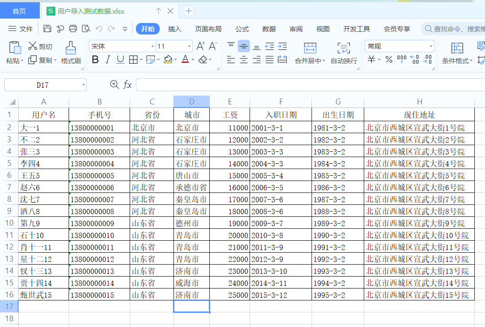

# 1、概述

> 简单的说：报表就是用表格、图表等格式来动态显示数据，可以用公式表示为：“报表 = 多样的格式 + 动态的数据”。 

## 1、环境搭建

> 功能说明：整个案例我们操作用户表，做一个企业员工（用户）数据的导入导出。

我们使用SpringBoot+通用mapper+vue方式搭建开发环境。

### 1、数据库准备

```sql
CREATE DATABASE /*!32312 IF NOT EXISTS*/`xiaobear-report` /*!40100 DEFAULT CHARACTER SET utf8 */;

USE `xiaobear-report`;


SET FOREIGN_KEY_CHECKS=0;

-- ----------------------------
-- Table structure for tb_dept
-- ----------------------------
DROP TABLE IF EXISTS `tb_dept`;
CREATE TABLE `tb_dept` (
  `id` bigint(20) DEFAULT NULL COMMENT '部门编号',
  `dept_name` varchar(100) DEFAULT NULL COMMENT '部门编号'
) ENGINE=InnoDB DEFAULT CHARSET=utf8;

-- ----------------------------
-- Records of tb_dept
-- ----------------------------
INSERT INTO `tb_dept` VALUES ('5', '资产管理部');
INSERT INTO `tb_dept` VALUES ('6', '质量监察部');
INSERT INTO `tb_dept` VALUES ('7', '营销部');
INSERT INTO `tb_dept` VALUES ('1', '销售部');
INSERT INTO `tb_dept` VALUES ('2', '人事部');
INSERT INTO `tb_dept` VALUES ('3', '财务部');
INSERT INTO `tb_dept` VALUES ('4', '技术部');

-- ----------------------------
-- Table structure for tb_province
-- ----------------------------
DROP TABLE IF EXISTS `tb_province`;
CREATE TABLE `tb_province` (
  `id` bigint(50) NOT NULL,
  `name` varchar(100) DEFAULT NULL COMMENT '省份或直辖市或特别行政区名称',
  PRIMARY KEY (`id`)
) ENGINE=InnoDB DEFAULT CHARSET=utf8;

-- ----------------------------
-- Records of tb_province
-- ----------------------------
INSERT INTO `tb_province` VALUES ('1', '北京市');
INSERT INTO `tb_province` VALUES ('2', '天津市');
INSERT INTO `tb_province` VALUES ('3', '上海市');
INSERT INTO `tb_province` VALUES ('4', '重庆市');
INSERT INTO `tb_province` VALUES ('5', '河北省');
INSERT INTO `tb_province` VALUES ('6', '山西省');
INSERT INTO `tb_province` VALUES ('7', '辽宁省');
INSERT INTO `tb_province` VALUES ('8', '吉林省');
INSERT INTO `tb_province` VALUES ('9', '黑龙江省');
INSERT INTO `tb_province` VALUES ('10', '江苏省');
INSERT INTO `tb_province` VALUES ('11', '浙江省');
INSERT INTO `tb_province` VALUES ('12', '安徽省');
INSERT INTO `tb_province` VALUES ('13', '福建省');
INSERT INTO `tb_province` VALUES ('14', '江西省');
INSERT INTO `tb_province` VALUES ('15', '山东省');
INSERT INTO `tb_province` VALUES ('16', '河南省');
INSERT INTO `tb_province` VALUES ('17', '湖北省');
INSERT INTO `tb_province` VALUES ('18', '湖南省');
INSERT INTO `tb_province` VALUES ('19', '广东省');
INSERT INTO `tb_province` VALUES ('20', '海南省');
INSERT INTO `tb_province` VALUES ('21', '四川省');
INSERT INTO `tb_province` VALUES ('22', '贵州省');
INSERT INTO `tb_province` VALUES ('23', '云南省');
INSERT INTO `tb_province` VALUES ('24', '陕西省');
INSERT INTO `tb_province` VALUES ('25', '甘肃省');
INSERT INTO `tb_province` VALUES ('26', '青海省');
INSERT INTO `tb_province` VALUES ('27', '台湾省');
INSERT INTO `tb_province` VALUES ('28', '内蒙古自治区');
INSERT INTO `tb_province` VALUES ('29', '广西壮族自治区');
INSERT INTO `tb_province` VALUES ('30', '西藏自治区');
INSERT INTO `tb_province` VALUES ('31', '宁夏回族自治区');
INSERT INTO `tb_province` VALUES ('32', '新疆维吾尔自治区');
INSERT INTO `tb_province` VALUES ('33', '香港特别行政区');
INSERT INTO `tb_province` VALUES ('34', '澳门特别行政区');

-- ----------------------------
-- Table structure for tb_resource
-- ----------------------------
DROP TABLE IF EXISTS `tb_resource`;
CREATE TABLE `tb_resource` (
  `id` bigint(20) NOT NULL AUTO_INCREMENT,
  `name` varchar(50) DEFAULT NULL,
  `price` double(10,1) DEFAULT NULL,
  `user_id` bigint(20) DEFAULT NULL,
  `need_return` tinyint(1) DEFAULT NULL COMMENT '是否需要归还',
  `photo` varchar(200) DEFAULT NULL COMMENT '照片',
  PRIMARY KEY (`id`),
  KEY `fk_user_id` (`user_id`),
  CONSTRAINT `fk_user_id` FOREIGN KEY (`user_id`) REFERENCES `tb_user` (`id`)
) ENGINE=InnoDB AUTO_INCREMENT=8 DEFAULT CHARSET=utf8;

-- ----------------------------
-- Records of tb_resource
-- ----------------------------
INSERT INTO `tb_resource` VALUES ('1', '记录本', '2.0', '3', '0', '\\resource_photos\\3\\1.jpg');
INSERT INTO `tb_resource` VALUES ('2', '笔记本电脑', '7000.0', '3', '1', '\\resource_photos\\3\\2.jpg');
INSERT INTO `tb_resource` VALUES ('3', '办公桌', '1000.0', '3', '1', '\\resource_photos\\3\\3.jpg');
INSERT INTO `tb_resource` VALUES ('4', '订书机', '50.0', '4', '1', '\\resource_photos\\4\\1.jpg');
INSERT INTO `tb_resource` VALUES ('5', '双面胶带', '5.0', '4', '0', '\\resource_photos\\4\\2.jpg');
INSERT INTO `tb_resource` VALUES ('6', '资料文件夹', '10.0', '4', '0', '\\resource_photos\\4\\3.jpg');
INSERT INTO `tb_resource` VALUES ('7', '打印机', '1200.0', '4', '1', '\\resource_photos\\4\\4.jpg');

-- ----------------------------
-- Table structure for tb_user
-- ----------------------------
DROP TABLE IF EXISTS `tb_user`;
CREATE TABLE `tb_user` (
  `id` bigint(20) NOT NULL AUTO_INCREMENT COMMENT '用户ID',
  `user_name` varchar(100) DEFAULT NULL COMMENT '姓名',
  `phone` varchar(15) DEFAULT NULL COMMENT '手机号',
  `province` varchar(50) DEFAULT NULL COMMENT '省份',
  `city` varchar(50) DEFAULT NULL COMMENT '城市',
  `salary` int(10) DEFAULT NULL,
  `hire_date` datetime DEFAULT NULL COMMENT '入职日期',
  `dept_id` bigint(20) DEFAULT NULL COMMENT '部门编号',
  `birthday` datetime DEFAULT NULL COMMENT '出生日期',
  `photo` varchar(200) DEFAULT NULL COMMENT '照片路径',
  `address` varchar(300) DEFAULT NULL COMMENT '现在住址',
  PRIMARY KEY (`id`),
  KEY `fk_dept` (`dept_id`)
) ENGINE=InnoDB DEFAULT CHARSET=utf8;

-- ----------------------------
-- Records of tb_user
-- ----------------------------
INSERT INTO `tb_user` VALUES ('1', '大一', '13800000001', '北京市', '北京市', '11000', '2001-01-01 21:18:29', '1', '1981-03-02 00:00:00', '\\static\\user_photos\\1.jpg', '北京市西城区宣武大街1号院');
INSERT INTO `tb_user` VALUES ('2', '不二', '13800000002', '河北省', '石家庄市', '12000', '2002-01-02 21:18:29', '2', '1982-03-02 00:00:00', '\\static\\user_photos\\2.jpg', '北京市西城区宣武大街2号院');
INSERT INTO `tb_user` VALUES ('3', '张三', '13800000003', '河北省', '石家庄市', '13000', '2003-03-03 21:18:29', '3', '1983-03-02 00:00:00', '\\static\\user_photos\\3.jpg', '北京市西城区宣武大街3号院');
INSERT INTO `tb_user` VALUES ('4', '李四', '13800000004', '河北省', '石家庄市', '14000', '2004-02-04 21:18:29', '4', '1984-03-02 00:00:00', '\\static\\user_photos\\4.jpg', '北京市西城区宣武大街4号院');
INSERT INTO `tb_user` VALUES ('5', '王五', '13800000005', '河北省', '唐山市', '15000', '2005-03-05 21:18:29', '5', '1985-03-02 00:00:00', '\\static\\user_photos\\5.jpg', '北京市西城区宣武大街5号院');
INSERT INTO `tb_user` VALUES ('6', '赵六', '13800000006', '河北省', '承德市省', '16000', '2006-04-06 21:18:29', '6', '1986-03-02 00:00:00', '\\static\\user_photos\\6.jpg', '北京市西城区宣武大街6号院');
INSERT INTO `tb_user` VALUES ('7', '沈七', '13800000007', '河北省', '秦皇岛市', '17000', '2007-06-07 21:18:29', '7', '1987-03-02 00:00:00', '\\static\\user_photos\\7.jpg', '北京市西城区宣武大街7号院');
INSERT INTO `tb_user` VALUES ('8', '酒八', '13800000008', '河北省', '秦皇岛市', '18000', '2008-07-08 21:18:29', '6', '1988-03-02 00:00:00', '\\static\\user_photos\\8.jpg', '北京市西城区宣武大街8号院');
INSERT INTO `tb_user` VALUES ('9', '第九', '13800000009', '山东省', '德州市', '19000', '2009-03-09 21:18:29', '1', '1989-03-02 00:00:00', '\\static\\user_photos\\9.jpg', '北京市西城区宣武大街9号院');
INSERT INTO `tb_user` VALUES ('10', '石十', '13800000010', '山东省', '青岛市', '20000', '2010-07-10 21:18:29', '4', '1990-03-02 00:00:00', '\\static\\user_photos\\10.jpg', '北京市西城区宣武大街10号院');
INSERT INTO `tb_user` VALUES ('11', '肖十一', '13800000011', '山东省', '青岛市', '21000', '2011-12-11 21:18:29', '4', '1991-03-02 00:00:00', '\\static\\user_photos\\11.jpg', '北京市西城区宣武大街11号院');
INSERT INTO `tb_user` VALUES ('12', '星十二', '13800000012', '山东省', '青岛市', '22000', '2012-05-12 21:18:29', '4', '1992-03-02 00:00:00', '\\static\\user_photos\\12.jpg', '北京市西城区宣武大街12号院');
INSERT INTO `tb_user` VALUES ('13', '钗十三', '13800000013', '山东省', '济南市', '23000', '2013-06-13 21:18:29', '3', '1993-03-02 00:00:00', '\\static\\user_photos\\13.jpg', '北京市西城区宣武大街13号院');
INSERT INTO `tb_user` VALUES ('14', '贾十四', '13800000014', '山东省', '威海市', '24000', '2014-06-14 21:18:29', '2', '1994-03-02 00:00:00', '\\static\\user_photos\\14.jpg', '北京市西城区宣武大街14号院');
INSERT INTO `tb_user` VALUES ('15', '甄世武', '13800000015', '山东省', '济南市', '25000', '2015-06-15 21:18:29', '4', '1995-03-02 00:00:00', '\\static\\user_photos\\15.jpg', '北京市西城区宣武大街15号院');


-- ----------------------------
-- Table structure for tb_month
-- ----------------------------
DROP TABLE IF EXISTS `tb_month`;
CREATE TABLE `tb_month` (
  `name` varchar(2) DEFAULT NULL COMMENT '月份'
) ENGINE=InnoDB DEFAULT CHARSET=utf8;

-- ----------------------------
-- Records of tb_month
-- ----------------------------
INSERT INTO `tb_month` VALUES ('01');
INSERT INTO `tb_month` VALUES ('02');
INSERT INTO `tb_month` VALUES ('03');
INSERT INTO `tb_month` VALUES ('04');
INSERT INTO `tb_month` VALUES ('05');
INSERT INTO `tb_month` VALUES ('06');
INSERT INTO `tb_month` VALUES ('07');
INSERT INTO `tb_month` VALUES ('08');
INSERT INTO `tb_month` VALUES ('09');
INSERT INTO `tb_month` VALUES ('10');
INSERT INTO `tb_month` VALUES ('11');
INSERT INTO `tb_month` VALUES ('12');
```


### 2、页面搭建

> 整个页面都是已经搭建好的，主要还是后台的实现

### 3、启动项目

访问地址：http://localhost:8080/list.html


# 2、Excel

## 1、Excel简介

> 在企业级应用开发中，Excel报表是一种最常见的报表需求。Excel报表开发一般分为两种形式：
> 1、为了方便操作，基于Excel的报表批量上传数据，也就是把Excel中的数据导入到系统中。
> 2、通过java代码生成Excel报表。也就是把系统中的数据导出到Excel中，方便查阅。

### 1、Excel版本

> 目前世面上的Excel分为两个大的版本**Excel2003**和**Excel2007**及以上两个版本；

|             | Excel2003                          | Excel2007                           |
| ----------- | ---------------------------------- | ----------------------------------- |
| 后缀        | xls                                | xlsx                                |
| 结构        | 二进制格式，核心是复合文档类型结构 | XML类型结构                         |
| 单sheet数量 | 行：65525，列：256                 | 行：1048576，列：16384              |
| 特点        | 存储容量有限                       | 基于xml压缩，占用空间小，操作效率高 |

### 2、常见的Excel操作工具

> Java中常见的用来操作Excel的方式一般有2种：**JXL**和**POI**。

#### 1、JXL

> JXL只能对Excel进行操作,属于比较老的框架，它只支持到Excel 95-2000的版本。现在已经停止更新和维护.

#### 2、POI

> POI是apache的项目,可对微软的Word,Excel,PPT进行操作,包括office2003和2007,Excle2003和2007。poi现在一直有更新。所以现在主流使用POI。
>
> Apache POI是Apache软件基金会的开源项目，由Java编写的免费开源的跨平台的 Java API，ApachePOI提供API给Java语言操作Microsoft Office的功能。

**API对象介绍**

|                    | Excle2003    | Excle2007    |
| ------------------ | ------------ | ------------ |
| 工作簿（WorkBook） | HSSFWordBook | XSSFWorkBook |
| 工作表（Sheet）    | HSSFSheet    | XSSFSheet    |
| 行（Row）          | HSSFRow      | XSSFRow      |
| 单元格（Cell）     | HSSFCell     | XSSCell      |


## 2、JXL导出excel

### 1、JXL导出基本知识点

> 通过WritableWorkbook，WritableSheet，Label这三个对象我们就可以实现Excel文件的导出工作。

1、 创建可写入的Excel工作薄

```java
WritableWorkbook workbook= Workbook.createWorkbook(输出流);
```

2、创建工作表

```java
WritableSheet sheet= workbook.createSheet(工作表的名称, 工作表的索引值);
```

3、创建单元格，添加文本类单元格

```java
Label labelC = new Label(列索引值, 行索引值, "单元格中的内容");

sheet.addCell(labelC);
```

4、写入到文件

```java
workbook.write();// 写入数据
```

5、释放资源：

```java
workbook.close();// 关闭文件
```


### 2、代码实现

```java
/**
     * 通过JSL进行下载
     * @param response
     */
public void downLoadByJxl(HttpServletResponse response){
    try{
        //输出流
        ServletOutputStream outputStream = response.getOutputStream();
        //创建一个工作簿
        WritableWorkbook wb = Workbook.createWorkbook(outputStream);
        //创建一个sheet页 s：sheet名 i:sheet号
        WritableSheet wbSheet = wb.createSheet("xiaobear第一个报表文件", 0);

        //设置列宽 col:列 wid:宽d
        wbSheet.setColumnView(0,5);
        wbSheet.setColumnView(1,8);
        wbSheet.setColumnView(2,8);
        wbSheet.setColumnView(3,8);
        wbSheet.setColumnView(4,10);
        wbSheet.setColumnView(5,30);
        //创建单元格
        // Label labelC = new Label(列索引值, 行索引值, "单元格中的内容");
        //sheet.addCell(labelC);
        Label label = null;
        String[] titles = new String[]{"编号","名称","电话","生日","入职日期","住址"};
        //处理标题
        for (int i = 0; i < titles.length; i++) {
            label = new Label(i, 0, titles[i]);
            wbSheet.addCell(label);
        }
        //查询数据进行处理
        List<User> users = findAll();
        //行初始化值
        int rowIndex = 1;
        for (User user : users) {
            //编号
            label = new Label(0, rowIndex, user.getId().toString());
            wbSheet.addCell(label);
            //名称
            label = new Label(1, rowIndex, user.getUserName());
            wbSheet.addCell(label);
            //电话
            label = new Label(2, rowIndex, user.getPhone());
            wbSheet.addCell(label);
            //生日
            label = new Label(3, rowIndex, sd.format(user.getBirthday()));
            wbSheet.addCell(label);
            //入职日期
            label = new Label(4, rowIndex, sd.format(user.getHireDate()));
            wbSheet.addCell(label);
            //地址
            label = new Label(5, rowIndex, user.getAddress());
            wbSheet.addCell(label);
            //行+1
            rowIndex++;
        }
        //导出的文件名称
        String fileName = "JXL导出示例.xls";
        // 设置文件的打开方式和mime类型
        response.setHeader("Content-Disposition","attachment;filename="  + new String(fileName.getBytes(),"ISO8859-1"));
        response.setContentType("application/vnd.ms-excel");
        //导出
        wb.write();
        //关闭资源
        wb.close();
        outputStream.close();

    }catch (Exception e){
        e.printStackTrace();
    }
}
```


## 3、POI操作Excel

```xml
<!--poi所需要的依赖-->
<dependency>
    <groupId>org.apache.poi</groupId>
    <artifactId>poi</artifactId>
    <version>4.0.1</version>
</dependency>

<dependency>
    <groupId>org.apache.poi</groupId>
    <artifactId>poi-ooxml</artifactId>
    <version>4.0.1</version>
</dependency>

<dependency>
    <groupId>org.apache.poi</groupId>
    <artifactId>poi-ooxml-schemas</artifactId>
    <version>4.0.1</version>
</dependency>
```

### 1、版本之间的区别

在POI包中有如下几个主要对象和excel的几个对象对应：

| 对应excel名称 | 低版本中的类名 | 高版本中的类名 |
| :------------ | :------------- | :------------- |
| 工作簿        | HSSFWorkbook   | XSSFWorkbook   |
| 工作表        | HSSFSheet      | XSSFSheet      |
| 行            | HSSFRow        | XSSFRow        |
| 单元格        | HSSFCell       | XSSFCell       |
| 单元格样式    | HSSFCellStyle  | XSSFCellStyle  |

#### 1、2003操作excel

```java
/**
     * 通过低版本创建excel
     */
public static void CreateExcelBy2003() throws IOException {
    //创建一个工作簿
    HSSFWorkbook hssfWorkbook = new HSSFWorkbook();
    //创建一个sheet页
    HSSFSheet sheet = hssfWorkbook.createSheet("低版本");
    //创建行
    HSSFRow row = sheet.createRow(0);
    //创建列
    HSSFCell cell = row.createCell(0);
    //创建单元格
    cell.setCellValue("xiaobear so nice");
    hssfWorkbook.write(new FileOutputStream("D://test.xls"));

}
```

#### 2、2007操作excel

```java
/**
     * 通过高版本创建excel
     */
public static void CreateExcelBy2007() throws IOException {
    //创建一个工作簿
    Workbook workbook = new XSSFWorkbook();
    //创建一个sheet页
    Sheet sheet = workbook.createSheet("低版本");
    //创建行
    Row row = sheet.createRow(0);
    //创建列
    Cell cell = row.createCell(0);
    //创建单元格
    cell.setCellValue("xiaobear so nice");
    workbook.write(new FileOutputStream("D://test.xls"));

}
```

### 2、数据导入

> 数据的导入就是读取excel中的内容，转成对象插入到数据库中



导入上图的数据

#### 1、思路

> 一般来说，即将导入的文件，每个列代表什么意思基本上都是固定的，比如第1列就是用户姓名，最后一列就是用户的现住址，并且在做excel时对每个列的类型都是有要求的，这样就可以给我们开发带来很大的简便。
>
> 最终的目标就是读取每一行数据，把数据转成用户的对象，保存到表中

**步骤**：

1. 根据上传的文件创建Workbook
2. 获取到第一个sheet工作表
3. 从第二行开始读取数据
4. 读取每一个单元格，把内容放入到用户对象的相关的属性中

#### 2、代码实现

```java
/**
     * 用户导入数据
     * @param file
     * @throws IOException
     * @throws ParseException
     */
public void importUserByExcel(MultipartFile file) throws IOException, ParseException {
    //通过文件流返回一个工作薄
    XSSFWorkbook wb = new XSSFWorkbook(file.getInputStream());
    //获取第一个sheet页
    XSSFSheet sheet = wb.getSheetAt(0);
    //获取最后一行
    int lastRowNum = sheet.getLastRowNum();
    //遍历获取数据 开始循环每行，获取每行的单元格中的值，放入到user属性中
    User user;
    for (int i = 1; i <= lastRowNum ; i++) {
        user = new User();
        String userName = sheet.getRow(i).getCell(0).getStringCellValue();
        user.setUserName(userName);
        //手机号
        String phone = null;
        try {
            phone = sheet.getRow(i).getCell(1).getStringCellValue();
        } catch (IllegalStateException e) {
            phone = sheet.getRow(i).getCell(1).getNumericCellValue()+"";
        }
        user.setPhone(phone);
        //省份
        String province = sheet.getRow(i).getCell(2).getStringCellValue();
        //城市
        String city = sheet.getRow(i).getCell(3).getStringCellValue();
        user.setCity(city);
        // 因为在填写excel中的数据时就可以约定这个列只能填写数值，所以可以直接用getNumericCellValue方法
        //工资
        Integer salary = ((Double)sheet.getRow(i).getCell(4).getNumericCellValue()).intValue();
        user.setSalary(salary);
        //入职日期
        String hireDateStr = sheet.getRow(i).getCell(5).getStringCellValue();
        Date hireDate = sd.parse(hireDateStr);
        user.setHireDate(hireDate);
        //出生日期
        String birthdayStr = sheet.getRow(i).getCell(6).getStringCellValue();
        Date birthday = sd.parse(birthdayStr);
        user.setBirthday(birthday);
        //现住地址
        String address = sheet.getRow(i).getCell(7).getStringCellValue();
        user.setProvince(province);
        user.setAddress(address);
        userMapper.insert(user);
    }
}
```

### 3、数据导出

> 用户导出跟JXL导出差不多

```java
/**
     * 用户导出
     * @param response
     * @throws IOException
     */
public void exportUser(HttpServletResponse response) throws IOException {
    //        创建一个空的工作薄
    org.apache.poi.ss.usermodel.Workbook workbook = new XSSFWorkbook();

    //        在工作薄中创建一个工作表
    Sheet sheet = workbook.createSheet("测试");
    //        设置列宽
    sheet.setColumnWidth(0,5*256);
    sheet.setColumnWidth(1,12*256);
    sheet.setColumnWidth(2,15*256);
    sheet.setColumnWidth(3,15*256);
    sheet.setColumnWidth(4,30*256);
    //            处理标题
    String[] titles = new String[]{"编号","姓名","手机号","入职日期","现住址"};
    //        创建标题行
    Row titleRow = sheet.createRow(0);
    Cell cell = null;
    for (int i = 0; i < titles.length; i++) {
        cell = titleRow.createCell(i);
        cell.setCellValue(titles[i]);
    }
    //        处理内容
    List<User> userList = this.findAll();
    int rowIndex = 1;
    Row row = null;
    for (User user : userList) {
        row = sheet.createRow(rowIndex);
        cell = row.createCell(0);
        cell.setCellStyle(contentStyle);
        cell.setCellValue(user.getId());

        cell = row.createCell(1);
        cell.setCellStyle(contentStyle);
        cell.setCellValue(user.getUserName());

        cell = row.createCell(2);
        cell.setCellStyle(contentStyle);
        cell.setCellValue(user.getPhone());

        cell = row.createCell(3);
        cell.setCellStyle(contentStyle);
        cell.setCellValue(sd.format(user.getHireDate()));

        cell = row.createCell(4);
        cell.setCellStyle(contentStyle);
        cell.setCellValue(user.getAddress());

        rowIndex++;
    }
    //            导出的文件名称
    String filename="员工数据.xlsx";
    //            设置文件的打开方式和mime类型
    ServletOutputStream outputStream = response.getOutputStream();
    response.setHeader( "Content-Disposition", "attachment;filename="  + new String(filename.getBytes(),"ISO8859-1"));
    response.setContentType("application/vnd.openxmlformats-officedocument.spreadsheetml.sheet");
    workbook.write(outputStream);

}
```

### 4、设置样式

> 注：**所有样式需在单元格被创建之后才能设置，否则就会报空指针**

#### 1、设置边框

```java
CellStyle contentStyle = workbook.createCellStyle();
contentStyle.setBorderBottom(BorderStyle.THIN);
contentStyle.setBorderTop(BorderStyle.THIN);
contentStyle.setBorderLeft(BorderStyle.THIN);
contentStyle.setBorderRight(BorderStyle.THIN);
```

#### 2、对齐方式

```java
//设置居中对齐
contentStyle.setAlignment(HorizontalAlignment.CENTER);
contentStyle.setVerticalAlignment(VerticalAlignment.CENTER);
```

#### 3、合并单元格

```java
//合并单元格 起始行, 结束行, 起始列, 结束列	
sheet.addMergedRegion(new CellRangeAddress(0,0,0,4));
```

#### 4、设置行高

```java
//设置行高
row1.setHeightInPoints((short) 52);
```

#### 5、设置字体样式

```java
//设置字体
CellStyle titleStyle = workbook.createCellStyle();
Font font = workbook.createFont();
font.setBold(true);
font.setFontName("黑体");
font.setFontHeightInPoints((short) 16);
titleStyle.setFont(font);
```


### 5、完整导出代码

```java
/**
     * 用户导出
     * @param response
     * @throws IOException
     */
public void exportUser(HttpServletResponse response) throws IOException {
    //        创建一个空的工作薄
    org.apache.poi.ss.usermodel.Workbook workbook = new XSSFWorkbook();

    //        在工作薄中创建一个工作表
    Sheet sheet = workbook.createSheet("测试");
    Row row1 = sheet.createRow(0);

    //设置行高
    row1.setHeightInPoints((short) 52);
    //合并单元格
    sheet.addMergedRegion(new CellRangeAddress(0,0,0,4));
    //        设置列宽
    sheet.setColumnWidth(0,5*256);
    sheet.setColumnWidth(1,12*256);
    sheet.setColumnWidth(2,15*256);
    sheet.setColumnWidth(3,15*256);
    sheet.setColumnWidth(4,30*256);
    /**
         * 设置框线
         */
    CellStyle contentStyle = workbook.createCellStyle();
    contentStyle.setBorderBottom(BorderStyle.THIN);
    contentStyle.setBorderTop(BorderStyle.THIN);
    contentStyle.setBorderLeft(BorderStyle.THIN);
    contentStyle.setBorderRight(BorderStyle.THIN);

    //设置居中对齐
    contentStyle.setAlignment(HorizontalAlignment.CENTER);
    contentStyle.setVerticalAlignment(VerticalAlignment.CENTER);

    //设置字体
    CellStyle titleStyle = workbook.createCellStyle();
    Font font = workbook.createFont();
    font.setBold(true);
    font.setFontHeightInPoints((short) 16);
    titleStyle.setFont(font);
    titleStyle.setBorderBottom(BorderStyle.THIN);
    titleStyle.setBorderLeft(BorderStyle.THIN);
    titleStyle.setBorderRight(BorderStyle.THIN);
    titleStyle.setBorderTop(BorderStyle.THIN);
    //设置居中对齐
    titleStyle.setAlignment(HorizontalAlignment.CENTER);
    titleStyle.setVerticalAlignment(VerticalAlignment.CENTER);

    //合并样式
    for (int i = 0; i < 5; i++) {
        Cell cell = row1.createCell(i);
        cell.setCellStyle(titleStyle);
    }
    row1.getCell(0).setCellValue("用户测试数据");

    //            处理标题
    String[] titles = new String[]{"编号","姓名","手机号","入职日期","现住址"};
    //        创建标题行
    Row titleRow = sheet.createRow(1);
    Cell cell = null;
    for (int i = 0; i < titles.length; i++) {
        cell = titleRow.createCell(i);
        cell.setCellValue(titles[i]);
        cell.setCellStyle(titleStyle);
    }
    //        处理内容
    List<User> userList = this.findAll();
    int rowIndex = 2;
    Row row = null;
    for (User user : userList) {
        row = sheet.createRow(rowIndex);
        cell = row.createCell(0);
        cell.setCellStyle(contentStyle);
        cell.setCellValue(user.getId());

        cell = row.createCell(1);
        cell.setCellStyle(contentStyle);
        cell.setCellValue(user.getUserName());

        cell = row.createCell(2);
        cell.setCellStyle(contentStyle);
        cell.setCellValue(user.getPhone());

        cell = row.createCell(3);
        cell.setCellStyle(contentStyle);
        cell.setCellValue(sd.format(user.getHireDate()));

        cell = row.createCell(4);
        cell.setCellStyle(contentStyle);
        cell.setCellValue(user.getAddress());

        rowIndex++;
    }
    //            导出的文件名称
    String filename="员工数据.xlsx";
    //            设置文件的打开方式和mime类型
    ServletOutputStream outputStream = response.getOutputStream();
    response.setHeader( "Content-Disposition", "attachment;filename="  + new String(filename.getBytes(),"ISO8859-1"));
    response.setContentType("application/vnd.openxmlformats-officedocument.spreadsheetml.sheet");
    workbook.write(outputStream);

}
```


# 3、写入数据

## 1、基于模板导出列表数据

>  首先准备一个excel模板，这个模板把复杂的样式和固定的内容先准备好并且放入到项目中，然后读取到模板后向里面放入数据。

### 1、准备工作

1. 准备模板内容

   

2. 第二个sheet页

   

3. 把这个模板改一个英文名称比如：userList.xlsx,放入到项目中


### 2、步骤

1. 获取模板路径
2. 获取我们设置的样式
3. 处理数据
4. 导出

### 3、实现

```java
    /**
     * 通过模板下载
     * @param request
     * @param response
     * @throws Exception
     */
    public void exportUserByTemplate(HttpServletRequest request, HttpServletResponse response) throws Exception{
        //获取根目录路径  SpringBoot项目获取根目录的方式
        String classpath = ResourceUtils.getFile("classpath:").getPath();
        File file = new File(classpath);
        //模板路径
        File templatePath = new File(file.getAbsolutePath(), "/excel_template/userList.xlsx");
        //读取模板文件产生workbook对象,这个workbook是一个有内容的工作薄
        org.apache.poi.ss.usermodel.Workbook workbook = new XSSFWorkbook(templatePath);
        Sheet sheet = workbook.getSheetAt(0);
        //获取我们设置好的样式
        CellStyle contentStyle = workbook.getSheetAt(1).getRow(0).getCell(0).getCellStyle();
        //        处理内容
        List<User> userList = this.findAll();
        int rowIndex = 2;
        Row row = null;
        Cell cell;
        for (User user : userList) {
            row = sheet.createRow(rowIndex);
            row.setHeightInPoints(15);

            cell = row.createCell(0);
            cell.setCellStyle(contentStyle);
            cell.setCellValue(user.getId());

            cell = row.createCell(1);
            cell.setCellStyle(contentStyle);
            cell.setCellValue(user.getUserName());

            cell = row.createCell(2);
            cell.setCellStyle(contentStyle);
            cell.setCellValue(user.getPhone());

            cell = row.createCell(3);
            cell.setCellStyle(contentStyle);
            cell.setCellValue(sd.format(user.getHireDate()));

            cell = row.createCell(4);
            cell.setCellStyle(contentStyle);
            cell.setCellValue(user.getAddress());

            rowIndex++;
        }
        //删除之前多余的sheet
        workbook.removeSheetAt(1);
        //            导出的文件名称
        String filename="员工数据.xlsx";
        //            设置文件的打开方式和mime类型
        ServletOutputStream outputStream = response.getOutputStream();
        response.setHeader( "Content-Disposition", "attachment;filename="  + new String(filename.getBytes(),"ISO8859-1"));
        response.setContentType("application/vnd.openxmlformats-officedocument.spreadsheetml.sheet");
        workbook.write(outputStream);
    }
```


## 2、基于模板导出详细数据

要做成这样的


### 1、准备工作

1. 制作一个excel导出模板，如下

   

2. 制作好的模板放入到项目中

   


### 2、代码实现

```java
/**
     * 通过模板下载
     * @param id
     * @param request
     * @param response
     * @throws IOException
     * @throws InvalidFormatException
     */
public void downLoadUserInfoByTemplate(Long id, HttpServletRequest request, HttpServletResponse response) throws IOException, InvalidFormatException {
    //获取根目录
    File root = new File(ResourceUtils.getFile("classpath:").getPath());
    //获取模板路径
    File file = new File(root.getAbsolutePath(), "/excel_template/userInfo.xlsx");
    //获取工作薄
    org.apache.poi.ss.usermodel.Workbook workbook = new XSSFWorkbook(file);
    //获取sheet页
    Sheet sheet = workbook.getSheetAt(0);
    //获取数据源
    User user = userMapper.selectByPrimaryKey(id);
    //设置用户名
    sheet.getRow(1).getCell(1).setCellValue(user.getUserName());
    //设置手机号
    sheet.getRow(2).getCell(1).setCellValue(user.getPhone());
    //        生日     第4行第2列  日期转成字符串
    sheet.getRow(3).getCell(1).setCellValue(sd.format(user.getBirthday()));
    // 工资 第5行第2列
    sheet.getRow(4).getCell(1).setCellValue(user.getSalary());
    // 工资 第6行第2列
    sheet.getRow(5).getCell(1).setCellValue(sd.format(user.getHireDate()));
    //省份     第7行第2列
    sheet.getRow(6).getCell(1).setCellValue(user.getProvince());
    //现住址   第8行第2列
    sheet.getRow(7).getCell(1).setCellValue(user.getAddress());
    //司龄     第6行第4列暂时先不考虑
    //城市     第7行第4列
    sheet.getRow(6).getCell(3).setCellValue(user.getCity());
    String fileName = "用户详细数据导出测试.xlsx";
    response.setHeader("Content-Disposition","attachment;fileName=" + new String(fileName.getBytes(),"ISO8859-1"));
    response.setContentType("application/vnd.openxmlformats-officedocument.spreadsheetml.sheet");
    workbook.write(response.getOutputStream());
}
```


## 3、导出数据带图片以及公式

#### 1、图片

> POI主要提供了两个类来处理照片，这两个类是Patriarch和ClientAnchor前者负责在表中创建图片，后者负责设置图片的大小位置。 

```java
//用户头像数据 创建一个字节输出流
ByteArrayOutputStream byteArrayOutputStream = new ByteArrayOutputStream();
//获取图片信息 BufferedImage是一个带缓冲区图像类,主要作用是将一幅图片加载到内存中
BufferedImage image = ImageIO.read(new File(root, user.getPhoto()));
//把读取图片放入输出流中
ImageIO.write(image,"jpg",byteArrayOutputStream);
// 创建一个绘图控制类，负责画图
Drawing<?> patriarch = sheet.createDrawingPatriarch();
// 指定把图片放到哪个位置
XSSFClientAnchor clientAnchor = new XSSFClientAnchor(0, 0, 0, 0, 2, 1, 4, 5);
// 开始把图片写入到sheet指定的位置
patriarch.createPicture(clientAnchor, workbook.addPicture(byteArrayOutputStream.toByteArray(), org.apache.poi.ss.usermodel.Workbook.PICTURE_TYPE_JPEG));
```

关于XSSFClientAnchor的8个参数说明：

```
dx1 - the x coordinate within the first cell.//定义了图片在第一个cell内的偏移x坐标，既左上角所在cell的偏移x坐标，一般可设0
dy1 - the y coordinate within the first cell.//定义了图片在第一个cell的偏移y坐标，既左上角所在cell的偏移y坐标，一般可设0
dx2 - the x coordinate within the second cell.//定义了图片在第二个cell的偏移x坐标，既右下角所在cell的偏移x坐标，一般可设0	
dy2 - the y coordinate within the second cell.//定义了图片在第二个cell的偏移y坐标，既右下角所在cell的偏移y坐标，一般可设0

col1 - the column (0 based) of the first cell.//第一个cell所在列，既图片左上角所在列
row1 - the row (0 based) of the first cell.//图片左上角所在行
col2 - the column (0 based) of the second cell.//图片右下角所在列
row2 - the row (0 based) of the second cell.//图片右下角所在行
```

#### 2、公式

> 关于POI支持公式详见官网： https://poi.apache.org/components/spreadsheet/eval-devguide.html 

***ps:其实在正常开发时应该在模板中直接设置好公式，这样打开直接导出的excel文档时公式会直接运行出我们想要的结果***

```java
sheet.getRow(5).getCell(3).setCellFormula("DATEDIF(B6,TODAY(),\"y\")");
```


## 4、基于模板引擎(按照字段写入)

### 1、说明

> 看我们刚才导出时写的代码，必须要提前知道要导出数据在哪一行哪一个单元格，但是如果模板一旦发生调整，那么我们的java代码必须要修改，我们可以自定义个导出的引擎，有了这个引擎即使模板修改了我们的java代码也不用修改

### 2、思路

> 在制作模板时，在需要插入数据的位置我们坐上标记，在导出时，对象的属性要和标记做对应，如果对应匹配一样，就把值赋值到相应的位置。
>
> 标记：通常是我们导出的字段，这样检查也好一点

### 3、实现

1. 制作模板

   

2. 添加到项目中

   

### 4、代码实现

模板引擎的工具类：

```java
public class ExcelEngineUtils {

    private static SimpleDateFormat  sdf = new SimpleDateFormat("yyyy-MM-dd");

    /**
     *
     * @param object
     * @param workbook
     * @param photoPath
     * @return
     */
    public static Workbook writeToExcel(Object object, Workbook workbook, String photoPath) throws IOException {
        //先把bean转成map
        Map<String, Object> map = EntityUtils.entityToMap(object);
        //循环遍历每一对数据，把日期型的转成字符串
        for (String s : map.keySet()) {
            Object o = map.get(s);
            if (o instanceof Date){
                map.put(s,sdf.format(o));
            }
        }
        //获取第一个sheet
        Sheet sheet = workbook.getSheetAt(0);
        Cell cell;
        Row row;
        for (int i = 0; i < 100; i++) {
            //不知道数据有多少行的情况下，当获取row为null，退出循环
            row = sheet.getRow(i);
            if (null == row){
                break;
            }else {
                //不为空，获取单元格的数据
                for (int j = 0; j < 100; j++) {
                    cell = row.getCell(j);
                    //写入单元格
                    if(null != cell){
                        writeCell(cell,map);
                    }
                }
            }
            
        }
        if (StringUtils.isNotBlank(photoPath)){
            //获取根目录
            File root = new File(ResourceUtils.getFile("classpath:").getAbsolutePath());
            //创建一个字节输出流
            ByteArrayOutputStream arrayOutputStream = new ByteArrayOutputStream();
            //获取图片信息 BufferedImage是一个带缓冲区图像类,主要作用是将一幅图片加载到内存中
            BufferedImage image = ImageIO.read(new File(root, photoPath));
            // 把读取图片放入输出流中
            ImageIO.write(image,"jpg",arrayOutputStream);

            Drawing<?> drawingPatriarch = sheet.createDrawingPatriarch();
            //获取第二个sheet页的坐标
            Sheet sheet1 = workbook.getSheetAt(1);
            Row row0 = sheet1.getRow(0);
            int col1 = ((Double) row0.getCell(0).getNumericCellValue()).intValue();
            int row1 = ((Double) row0.getCell(1).getNumericCellValue()).intValue();
            int col2 = ((Double) row0.getCell(2).getNumericCellValue()).intValue();
            int row2 = ((Double) row0.getCell(3).getNumericCellValue()).intValue();

            XSSFClientAnchor clientAnchor = new XSSFClientAnchor(0, 0, 0, 0, col1, row1, col2, row2);
            drawingPatriarch.createPicture(clientAnchor,workbook.addPicture(arrayOutputStream.toByteArray(), Workbook.PICTURE_TYPE_JPEG));
            workbook.removeSheetAt(1);
        }
        return workbook;
    }

    /**
     * 写入单元格信息
     * @param cell
     * @param map
     */
    public static void writeCell(Cell cell, Map<String, Object> map){
        //获取单元格类型
        CellType cellType = cell.getCellType();
        switch (cellType){
            case FORMULA:{
                break;
            } default:{
                String cellValue = cell.getStringCellValue();
                //就是判断一下获取到单元格中的值是否和map中的key保持一致
                if(StringUtils.isNotBlank(cellValue)){
                    for (String key : map.keySet()) {
                        if(key.equals(cellValue)){
                            cell.setCellValue(map.get(key).toString());
                        }
                    }
                }
            }
        }
    }
}
```

调用

```java
/**
     * 通过模板引擎导出
     * @param id
     * @param request
     * @param response
     */
public void downLoadUserInfoByTemplateEngine(Long id, HttpServletRequest request, HttpServletResponse response) throws IOException, InvalidFormatException {
    File root = new File(ResourceUtils.getFile("classpath:").getPath());
    //获取图片路径
    File file = new File(root.getAbsolutePath(), "/excel_template/userInfo2.xlsx");
    //获取工作薄
    org.apache.poi.ss.usermodel.Workbook workbook = new XSSFWorkbook(file);
    //查询用户信息
    User user = userMapper.selectByPrimaryKey(id);
    org.apache.poi.ss.usermodel.Workbook wb = ExcelEngineUtils.writeToExcel(user, workbook, user.getPhoto());
    String fileName = "用户模板引擎导出测试.xlsx";
    response.setHeader("Content-Disposition","attachment;filename="  + new String(fileName.getBytes(),"ISO8859-1"));
    response.setContentType("application/vnd.openxmlformats-officedocument.spreadsheetml.sheet");
    workbook.write(response.getOutputStream());

}

```


## 5、百万数据导出

### 1、概述

> 我们都知道Excel可以分为早期的Excel2003版本（使用POI的HSSF对象操作）和Excel2007版本（使用POI的XSSF操作），两者对百万数据的支持如下：
>
> - Excel 2003：在POI中使用HSSF对象时，excel 2003最多只允许存储65536条数据，一般用来处理较少的数据量。这时对于百万级别数据，Excel肯定容纳不了。
> - Excel 2007：当POI升级到XSSF对象时，它可以直接支持excel2007以上版本，因为它采用ooxml格式。这时excel可以支持1048576条数据，单个sheet表就支持近百万条数据。但实际运行时还可能存在问题，原因是执行POI报表所产生的行对象，单元格对象，字体对象，他们都不会销毁，这就导致OOM的风险。

### 2、思路

> ​	对于百万数据量的Excel导入导出，只讨论基于Excel2007的解决方法。在ApachePoi 官方提供了对操作大数据量的导入导出的工具和解决办法，操作Excel2007使用XSSF对象，可以分为三种模式：
>
> -  java代码解析xml
> -  dom4j:一次性加载xml文件再解析
> -  SAX:逐行加载，逐行解析
>
>  **用户模式：**用户模式有许多封装好的方法操作简单，但创建太多的对象，非常耗内存（之前使用的方法）
>
>  **事件模式：**基于SAX方式解析XML，SAX全称Simple API for XML，它是一个接口，也是一个软件包。它是一种XML解析的替代方法，不同于DOM解析XML文档时把所有内容一次性加载到内存中的方式，它逐行扫描文档，一边扫描，一边解析。
>
>  **SXSSF对象**：是用来生成海量excel数据文件，主要原理是借助临时存储空间生成excel


### 3、导出

#### 1、模拟数据

1. 创建表

   ```sql
   CREATE TABLE `tb_user2` (
     `id` bigint(20) NOT NULL  COMMENT '用户ID',
     `user_name` varchar(100) DEFAULT NULL COMMENT '姓名',
     `phone` varchar(15) DEFAULT NULL COMMENT '手机号',
     `province` varchar(50) DEFAULT NULL COMMENT '省份',
     `city` varchar(50) DEFAULT NULL COMMENT '城市',
     `salary` int(10) DEFAULT NULL,
     `hire_date` datetime DEFAULT NULL COMMENT '入职日期',
     `dept_id` bigint(20) DEFAULT NULL COMMENT '部门编号',
     `birthday` datetime DEFAULT NULL COMMENT '出生日期',
     `photo` varchar(200) DEFAULT NULL COMMENT '照片路径',
     `address` varchar(300) DEFAULT NULL COMMENT '现在住址' 
   ) ENGINE=InnoDB DEFAULT CHARSET=utf8;
   ```

2. 创建存储过程

   ```sql
   DELIMITER $$    -- 重新定义“;”分号
   DROP PROCEDURE IF EXISTS test_insert $$   -- 如果有test_insert这个存储过程就删除
   CREATE PROCEDURE test_insert()			  -- 创建存储过程
   
   BEGIN
   	DECLARE n int DEFAULT 1;				    -- 定义变量n=1
   	SET AUTOCOMMIT=0;						    -- 取消自动提交
   	
   		while n <= 5000000 do					
   			INSERT INTO `tb_user2` VALUES ( n, CONCAT('测试', n), '13800000001', '北京市', '北京市', '11000', '2001-03-01 21:18:29', '1', '1981-03-02 00:00:00', '\\static\\user_photos\\1.jpg', '北京市西城区宣武大街1号院');
   			SET n=n+1;
   		END while;
   		COMMIT;
   END $$
   ```

3. 开始执行

   ```sql
   CALL test_insert();
   ```

    插入500W数据大概需要200至300秒左右

```java
    /**
     * 百万数据导出
     * @param request
     * @param response
     * @throws IOException
     */
    public void downLoadMillionData(HttpServletRequest request, HttpServletResponse response) throws IOException {
        //创建工作薄
        org.apache.poi.ss.usermodel.Workbook sxssfWorkbook = new SXSSFWorkbook();
        int page = 1;
        int pageSize = 200000;
        Sheet sheet = null;
        int rowIndex = 1;
        int num = 0; //总数据量
        Cell cell;
        Row row;
        while(true){
            //用户分页 1000000为一页
            List<User> userList = this.findPage(page, pageSize);
            if(CollectionUtils.isEmpty(userList)){
                break;
            }
            if(num % 1000000 == 0){
                rowIndex = 1;

                sheet = sxssfWorkbook.createSheet("第" + num/1000000 + "个工作表");
                //设置列宽
                sheet.setColumnWidth(0,8*256);
                sheet.setColumnWidth(1,12*256);
                sheet.setColumnWidth(2,15*256);
                sheet.setColumnWidth(3,15*256);
                sheet.setColumnWidth(4,30*256);
                //            处理标题
                String[] titles = new String[]{"编号","姓名","手机号","入职日期","现住址"};
                //        创建标题行
                Row titleRow = sheet.createRow(0);

                for (int i = 0; i < titles.length; i++) {
                    cell = titleRow.createCell(i);
                    cell.setCellValue(titles[i]);
                }
            }
      
            //处理数据
            for (User user : userList) {
                row  = sheet.createRow(rowIndex);
                cell = row.createCell(0);
                cell.setCellValue(user.getId());

                row  = sheet.createRow(rowIndex);
                cell = row.createCell(1);
                cell.setCellValue(user.getUserName());

                row  = sheet.createRow(rowIndex);
                cell = row.createCell(2);
                cell.setCellValue(user.getPhone());

                row  = sheet.createRow(rowIndex);
                cell = row.createCell(3);
                cell.setCellValue(sd.format(user.getHireDate()));

                row  = sheet.createRow(rowIndex);
                cell = row.createCell(4);
                cell.setCellValue(user.getAddress());
                num++;
                rowIndex++;
            }
            page++;
        }
        //            导出的文件名称
        String filename="百万数据.xlsx";
//            设置文件的打开方式和mime类型
        ServletOutputStream outputStream = response.getOutputStream();
        response.setHeader( "Content-Disposition", "attachment;filename="  + new String(filename.getBytes(),"ISO8859-1"));
        response.setContentType("application/vnd.openxmlformats-officedocument.spreadsheetml.sheet");
        sxssfWorkbook.write(outputStream);
    }
```


## 6、百万数据导入

### 1、思路分析

> **用户模式：**加载并读取Excel时，是通过一次性的将所有数据加载到内存中再去解析每个单元格内容。当Excel数据量较大时，由于不同的运行环境可能会造成内存不足甚至OOM异常。


> **事件模式：**它逐行扫描文档，一边扫描一边解析。由于应用程序只是在读取数据时检查数据，因此不需要将数据存储在内存中，这对于大型文档的解析是个巨大优势。


### 2、实现

#### 1、步骤分析

1. 设置POI的事件模式

   > 根据Excel获取文件流
   > 根据文件流创建OPCPackage  用来组合读取到的xml 组合出来的数据占用的空间更小
   > 创建XSSFReader对象

2. Sax解析

   > **自定义Sheet处理器**
   > 创建Sax的XmlReader对象
   > 设置Sheet的事件处理器
   > 逐行读取

#### 2、自定义处理器

```java
public class SheetHandle extends XSSFSheetXMLHandler implements XSSFSheetXMLHandler.SheetContentsHandler {

    private User user;

    public SheetHandle(Styles styles, Comments comments, SharedStrings strings, SheetContentsHandler sheetContentsHandler, DataFormatter dataFormatter, boolean formulasNotResults) {
        super(styles, comments, strings, sheetContentsHandler, dataFormatter, formulasNotResults);
    }

    /**
     *  每一行的开始
     * @param i 代表的是每一个sheet的行索引
     */
    @Override
    public void startRow(int i) {
        if (0 == i){
            user = null;
        }else {
            user = new User();
        }
    }

    /**
     * 每一行的结束
     * @param i
     */
    @Override
    public void endRow(int i) {
        if(0 != i){
            System.out.println(user);
        }
    }

    /**
     * 处理每一行的单元格
     * @param s 单元格名称 A1 B2
     * @param s1 单元格的值
     * @param xssfComment
     */
    @SneakyThrows
    @Override
    public void cell(String s, String s1, XSSFComment xssfComment) {
        if (user != null) {
            //获取单元格首个字符
            String substring = s.substring(0, 1);
            switch (substring){
                case "A":{
                    user.setId(Long.parseLong(s1));
                    break;
                } case "B":{
                    user.setUserName(s1);
                    break;
                } case "C":{
                    user.setPhone(s1);
                    break;
                } case "D":{
                    user.setHireDate(new SimpleDateFormat("yyyy-MM-dd").parse(s1));
                    break;
                }case "E":{
                    user.setAddress(s1);
                    break;
                }
            }
        }
    }
}
```

#### 3、自定义解析

```java
public class ExcelParser {


    public static void parse(String path) throws Exception {
        //1.根据Excel获取OPCPackage对象
        OPCPackage pkg = OPCPackage.open(path, PackageAccess.READ);
        try {
            //2.创建XSSFReader对象
            XSSFReader reader = new XSSFReader(pkg);
            //3.获取SharedStringsTable对象
            SharedStringsTable sst = reader.getSharedStringsTable();
            //4.获取StylesTable对象
            StylesTable styles = reader.getStylesTable();
            XMLReader parser = XMLReaderFactory.createXMLReader();
            // 处理公共属性：Sheet名，Sheet合并单元格
            parser.setContentHandler(new XSSFSheetXMLHandler(styles,sst, new SheetHandle(styles,null,sst,null,null,false), false));
            XSSFReader.SheetIterator sheets = (XSSFReader.SheetIterator) reader.getSheetsData();
            while (sheets.hasNext()) {
                InputStream sheetstream = sheets.next();
                InputSource sheetSource = new InputSource(sheetstream);
                try {
                    parser.parse(sheetSource);
                } finally {
                    sheetstream.close();
                }
            }
        } finally {
            pkg.close();
        }
    }
}
```


# 4、opencsv操作csv文件

## 1、csv文件概述

> CSV文件：Comma-Separated Values，中文叫逗号分隔值或者字符分割值，其文件以纯文本的形式存储表格数据。该文件是一个字符序列，可以由任意数目的记录组成，记录间以某种换行符分割。每条记录由字段组成，字段间的分隔符是其他字符或者字符串。所有的记录都有完全相同的字段序列，相当于一个结构化表的纯文本形式。
> 用文本文件、excel或者类似与文本文件的编辑器都可以打开CSV文件。

为了简化开发，我们可以使用opencsv类库来导出csv文件

```xml
<dependency>
    <groupId>com.opencsv</groupId>
    <artifactId>opencsv</artifactId>
    <version>4.5</version>
</dependency>
```

## 2、opencsv常用API


## 3、导出csv文件

```java
/**
     * 导出csv文件
     * @param response
     */
public void downloadCSV(HttpServletResponse response) throws IOException {
    //获取输出流
    ServletOutputStream outputStream = response.getOutputStream();
    String fileName = "用户数据.csv";
    response.setHeader("Content-Disposition","attachment;filename"+ new String(fileName.getBytes(),"ISO8859-1"));
    response.setContentType("text/csv");
    //创建一个用来写入到csv文件的write
    CSVWriter csvWriter = new CSVWriter(new OutputStreamWriter(outputStream, "utf-8"));
    //设置标题
    csvWriter.writeNext(new String[]{"编号","姓名","手机号","入职日期","现住址"});
    //获取数据源
    List<User> users = userMapper.selectAll();
    if(!CollectionUtils.isEmpty(users)){
        for (User user : users) {
            csvWriter.writeNext(new String[]{user.getId().toString(),user.getUserName(),user.getPhone(),sd.format(user.getHireDate()),user.getAddress()});
        }
        csvWriter.flush();
    }
    csvWriter.close();
}
```


## 4、导入csv文件

```java
public class ImportCSV {

    private static SimpleDateFormat sdf = new SimpleDateFormat("yyyy-MM-dd");

    public static void main(String[] args) throws Exception {
        CSVReader reader = new CSVReader(new FileReader("C:\\Users\\28611\\Downloads\\downLoadCSV"));
        //读取第一行数据 标题
        String[] readNext = reader.readNext();
        User user;
        while (true){
            user = new User();
            String[] next = reader.readNext();
            if(null == next){
                break;
            }
            user.setId(Long.parseLong(next[0]));
            user.setUserName(next[1]);
            user.setPhoto(next[2]);
            user.setHireDate(sdf.parse(next[3]));
            user.setAddress(next[4]);
            System.out.println(user);
        }
    }
}
```

# 5、POI操作word

## 1、API介绍

### 1、操作Word正文

> XWPFDocument代表一个docx文档，其可以用来读docx文档，也可以用来写docx文档 
>
> 一个文档包含多个段落，一个段落包含多个Runs文本，一个Runs包含多个Run，Run是文档的最小单元

获取所有段落：

```java
List<XWPFParagraph> paragraphs = word.getParagraphs();
```

获取一个段落中的所有片段Runs：

```java
List<XWPFRun> xwpfRuns = xwpfParagraph.getRuns();
```

获取一个Runs中的一个Run：

```java
XWPFRun run = xwpfRuns.get(index);
```


### 2、操作Word表格

> 一个文档包含多个表格，一个表格包含多行，一行包含多列单元格

获取所有表格：

```java
List<XWPFTable> xwpfTables = doc.getTables();
```

获取一个表格中的所有行：

```java
List<XWPFTableRow> xwpfTableRows = xwpfTable.getRows();
```

获取一行中的所有列：

```java
List<XWPFTableCell> xwpfTableCells = xwpfTableRow.getTableCells();
```

获取一格里的内容：

```java
List<XWPFParagraph> paragraphs = xwpfTableCell.getParagraphs();
```


#### 1、word工具类

```java
public class WordUtils {

    /**
     * 导出word工具类
     * @param response
     * @param user
     * @throws Exception
     */
    public static void exportWord(HttpServletResponse response, User user) throws Exception{
        File classpath = new File(ResourceUtils.getFile("classpath:").getPath());
        File file = new File(classpath.getAbsolutePath(), "/word_template/contract_template.docx");
        //读取模板信息
        XWPFDocument document = new XWPFDocument(new FileInputStream(file));
        Map<String, String> map = new HashMap<>(10);
        map.put("userName", user.getUserName());
        map.put("hireDate",new SimpleDateFormat("yyyy-MM-dd").format(user.getHireDate()));
        map.put("address", user.getAddress());

        //处理数据 获取所有段落
        List<XWPFParagraph> paragraphs = document.getParagraphs();
        for (XWPFParagraph paragraph : paragraphs) {
            //获取所有片段
            List<XWPFRun> runs = paragraph.getRuns();
            for (XWPFRun run : runs) {
                String text = run.getText(0);
                for (String s : map.keySet()) {
                    if (text.contains(s)){
                        //替换字段
                        run.setText(text.replaceAll(s,map.get(s)),0);
                    }
                }
            }
        }
        //处理表格
        List<com.xiaobear.pojo.Resource> resourceList = user.getResourceList();
        //获取第一个表格
        XWPFTable table = document.getTables().get(0);
        //获取第一行
        XWPFTableRow row = table.getRow(0);
        int rowIndex = 1;
        for (com.xiaobear.pojo.Resource resource : resourceList) {
            //增加行
            addBlankRow(table,row,rowIndex);
            XWPFTableRow tableRow = table.getRow(rowIndex);
            tableRow.getCell(0).setText(resource.getName());
            tableRow.getCell(1).setText(resource.getPrice().toString());
            tableRow.getCell(2).setText(resource.getNeedReturn()?"需要":"不需要");
            File imageFile = new File(classpath,"/static"+resource.getPhoto());
            setCellImage(tableRow.getCell(3),imageFile);
            rowIndex++;
        }
        //     处理表格开始结束
        //        4、导出word
        String filename = "员工(" + user.getUserName() + ")合同.docx";
        response.setHeader("content-disposition", "attachment;filename=" + new String(filename.getBytes(), "ISO8859-1"));
        response.setContentType("application/vnd.openxmlformats-officedocument.spreadsheetml.sheet");
        document.write(response.getOutputStream());
    }


    /**
     * 向单元格中写入图片
     * @param cell
     * @param imageFile
     */
    private static void setCellImage(XWPFTableCell cell, File imageFile) {

        XWPFRun run = cell.getParagraphs().get(0).createRun();
        //        InputStream pictureData, int pictureType, String filename, int width, int height
        try(FileInputStream inputStream = new FileInputStream(imageFile)) {
            run.addPicture(inputStream,XWPFDocument.PICTURE_TYPE_JPEG,imageFile.getName(), Units.toEMU(100),Units.toEMU(50));
        } catch (Exception e) {
            e.printStackTrace();
        }

    }

    /**
     * 增加一个空行
     * @param table
     * @param row
     * @param rowIndex
     */
    public static void addBlankRow(XWPFTable table, XWPFTableRow row, int rowIndex){
        //插入一行 ps:没有样式
        XWPFTableRow xwpfTableRow = table.insertNewTableRow(rowIndex);
        xwpfTableRow.getCtRow().setTrPr(row.getCtRow().getTrPr());
        //获取原来row的单元格
        List<XWPFTableCell> tableCells = row.getTableCells();
        if (CollectionUtils.isEmpty(tableCells)) {
        }
        XWPFTableCell temp;
        for (XWPFTableCell cell : tableCells) {
            temp = xwpfTableRow.addNewTableCell();
            //单元格的样式、属性
            temp.getCTTc().setTcPr(cell.getCTTc().getTcPr());
            temp.getParagraphs().get(0).getCTP().setPPr(cell.getParagraphs().get(0).getCTP().getPPr());
        }

    }
}
```


# 6、EasyPOI

## 1、简介

原文档地址：https://easypoi.mydoc.io/     （比较推荐）

新地址：http://www.wupaas.com/ 

> easypoi功能如同名字easy,主打的功能就是容易,让一个没见接触过poi的人员 就可以方便的写出Excel导出,Excel模板导出,Excel导入,Word模板导出,通过简单的注解和模板 语言(熟悉的表达式语法),完成以前复杂的写法

**Easypoi的目标是什么** 

> Easypoi的目标不是替代poi,而是让一个不懂导入导出的快速使用poi完成Excel和word的各种操作,而不是看很多api才可以完成这样工作

**独特的功能**

- 基于注解的导入导出,修改注解就可以修改Excel
- 支持常用的样式自定义
- 基于map可以灵活定义的表头字段
- 支持一堆多的导出,导入
- 支持模板的导出,一些常见的标签,自定义标签
- 支持HTML/Excel转换,如果模板还不能满足用户的变态需求,请用这个功能
- 支持word的导出,支持图片,Excel

**需要的依赖**

把项目中的poi的依赖去除

```xml
<dependency>
    <groupId>cn.afterturn</groupId>
    <artifactId>easypoi-base</artifactId>
    <version>4.1.0</version>
</dependency>
<dependency>
    <groupId>cn.afterturn</groupId>
    <artifactId>easypoi-web</artifactId>
    <version>4.1.0</version>
</dependency>
<dependency>
    <groupId>cn.afterturn</groupId>
    <artifactId>easypoi-annotation</artifactId>
    <version>4.1.0</version>
</dependency>
```

**SpringBoot版本**

```xml
<dependency>
    <groupId>cn.afterturn</groupId>
    <artifactId>easypoi-spring-boot-starter</artifactId>
    <version>4.1.0</version>
</dependency>
```


## 2、Excel操作

### 1、导出

注解方式导出

1. 修改实体类，添加注解，用到的是`@Excel`注解，使用如下，必须要有空构造函数，否则会报“对象创建错误”

   | 属性           | 类型     | 类型             | 说明                                                         |
   | -------------- | -------- | ---------------- | ------------------------------------------------------------ |
   | name           | String   | null             | 列名                                                         |
   | needMerge      | boolean  | fasle            | 纵向合并单元格                                               |
   | orderNum       | String   | "0"              | 列的排序,支持name_id                                         |
   | replace        | String[] | {}               | 值得替换  导出是{a_id,b_id} 导入反过来                       |
   | savePath       | String   | "upload"         | 导入文件保存路径                                             |
   | type           | int      | 1                | 导出类型 1 是文本 2 是图片,3 是函数,10 是数字 默认是文本     |
   | width          | double   | 10               | 列宽                                                         |
   | height         | double   | 10               | 列高,后期打算统一使用@ExcelTarget的height,这个会被废弃,注意  |
   | isStatistics   | boolean  | fasle            | 自动统计数据,在追加一行统计,把所有数据都和输出这个处理会吞没异常,请注意这一点 |
   | isHyperlink    | boolean  | false            | 超链接,如果是需要实现接口返回对象                            |
   | isImportField  | boolean  | true             | 校验字段,看看这个字段是不是导入的Excel中有,如果没有说明是错误的Excel,读取失败,支持name_id |
   | exportFormat   | String   | ""               | 导出的时间格式,以这个是否为空来判断是否需要格式化日期        |
   | importFormat   | String   | ""               | 导入的时间格式,以这个是否为空来判断是否需要格式化日期        |
   | format         | String   | ""               | 时间格式,相当于同时设置了exportFormat 和 importFormat        |
   | databaseFormat | String   | "yyyyMMddHHmmss" | 导出时间设置,如果字段是Date类型则不需要设置 数据库如果是string类型,这个需要设置这个数据库格式,用以转换时间格式输出 |
   | numFormat      | String   | ""               | 数字格式化,参数是Pattern,使用的对象是DecimalFormat           |
   | imageType      | int      | 1                | 导出类型 1 从file读取 2 是从数据库中读取 默认是文件 同样导入也是一样的 |
   | suffix         | String   | ""               | 文字后缀,如% 90 变成90%                                      |
   | isWrap         | boolean  | true             | 是否换行 即支持\n                                            |
   | mergeRely      | int[]    | {}               | 合并单元格依赖关系,比如第二列合并是基于第一列 则{1}就可以了  |
   | mergeVertical  | boolean  | fasle            | 纵向合并内容相同的单元格                                     |

   ```java
   @Data
   @Table(name="tb_user")
   public class User {
       @Id
       @KeySql(useGeneratedKeys = true)
       @Excel(name = "编号",orderNum = "0",width = 5)
       private Long id;         //主键
       @Excel(name = "姓名",orderNum = "1",width = 10)
       private String userName; //员工名
       @Excel(name = "手机号",orderNum = "2",width = 15)
       private String phone;    //手机号
       @Excel(name = "省份名",orderNum = "3",width = 15)
       private String province; //省份名
       @Excel(name = "城市名",orderNum = "4",width = 15)
       private String city;     //城市名
       @Excel(name = "工资",orderNum = "5",width = 5)
       private Integer salary;   // 工资
       @JsonFormat(pattern="yyyy-MM-dd")
       @Excel(name = "入职日期",format = "yyyy-MM-dd",orderNum = "6",width = 15)
       private Date hireDate; // 入职日期
       private String deptId;   //部门id
       @Excel(name = "出生日期",format = "yyyy-MM-dd",orderNum = "7",width = 15)
       private Date birthday; //出生日期
       @Excel(name = "一寸照片",orderNum = "8",width = 15, type = 2)
       private String photo;    //一寸照片
       @Excel(name = "现在居住地址",orderNum = "9",width = 15)
       private String address;  //现在居住地址
   
       private List<Resource> resourceList; //办公用品
   }
   ```

2. 实现方法

   ```java
   /**
        * easypoi导出excel
        * @param response
        * @throws Exception
        */
   public void exportExcelByEasyPOI(HttpServletResponse response) throws Exception {
       //设置标题以及sheetName，excel导出类型
       ExportParams params = new ExportParams("员工信息","员工数据", ExcelType.XSSF);
       //获取数据源
       List<User> users = userMapper.selectAll();
       org.apache.poi.ss.usermodel.Workbook workbook = ExcelExportUtil.exportExcel(params, User.class, users);
       String fileName = "easypoi导出用户数据列表.xlsx";
       response.setHeader("Content-Disposition","attachment;filename="+new String(fileName.getBytes(),"ISO8859-1"));
       response.setContentType("application/vnd.openxmlformats-officedocument.spreadsheetml.sheet");
       workbook.write(response.getOutputStream());
   }
   ```


### 2、导入

有导出就应该有导入，我们就把刚才导出的数据库导入到表中

Excel导入时需要的参数类ImportParams常用设置说明

1. 读取指定的sheet 比如要读取上传得第二个sheet 那么需要把startSheetIndex = 1 就可以了

2. 读取几个sheet  比如读取前2个sheet,那么 sheetNum=2 就可以了

3. 读取第二个到第五个sheet 设置 startSheetIndex = 1 然后sheetNum = 4

4. 读取全部的sheet sheetNum  设置大点就可以了

5. 保存Excel 设置 needVerfiy = true,默认保存的路径为upload/excelUpload/Test/yyyyMMddHHmss 保存名称上传时间五位随机数 如果自定义路径 修改下saveUrl 就可以了,同时saveUrl也是图片上传时候的保存的路径

6. 判断一个Excel是不是合法的Excel  importFields 设置下值,就是表示表头必须至少包含的字段,如果缺一个就是不合法的excel,不导入

7. 图片的导入

   > 有图片的导出就有图片的导入,导入的配置和导出是一样的,但是需要设置保存路径 1.设置保存路径saveUrl 默认为"upload/excelUpload" 可以手动修改 ImportParams 修改下就可以了


1. 修改实体类，表明哪些需要导入，设置`isImportField = "true"`

   ```java
   @Data
   @Table(name="tb_user")
   public class User {
       @Id
       @KeySql(useGeneratedKeys = true)
       @Excel(name = "编号",orderNum = "0",width = 5, isImportField = "true")
       private Long id;         //主键
       @Excel(name = "姓名",orderNum = "1",width = 10, isImportField = "true")
       private String userName; //员工名
       @Excel(name = "手机号",orderNum = "2",width = 15, isImportField = "true")
       private String phone;    //手机号
       @Excel(name = "省份名",orderNum = "3",width = 15, isImportField = "true")
       private String province; //省份名
       @Excel(name = "城市名",orderNum = "4",width = 15, isImportField = "true")
       private String city;     //城市名
       @Excel(name = "工资",orderNum = "5",width = 5, isImportField = "true")
       private Integer salary;   // 工资
       @JsonFormat(pattern="yyyy-MM-dd")
       @Excel(name = "入职日期",format = "yyyy-MM-dd",orderNum = "6",width = 15, isImportField = "true")
       private Date hireDate; // 入职日期
       private String deptId;   //部门id
       @Excel(name = "出生日期",format = "yyyy-MM-dd",orderNum = "7",width = 15, isImportField = "true")
       private Date birthday; //出生日期
       @Excel(name = "一寸照片",orderNum = "8",width = 15, type = 2, isImportField = "true", savePath = "D:\\28611\\idea-workspace\\xiaobear\\xiaobear-report\\xiaobear-report\\src\\main\\resources\\static\\user_photos\\")
       private String photo;    //一寸照片
       @Excel(name = "现在居住地址",orderNum = "9",width = 15, isImportField = "true")
       private String address;  //现在居住地址
   
       private List<Resource> resourceList; //办公用品
   
   }
   ```

2. 代码实现

   ```java
   /**
        * easypoi导入
        * @param file
        */
   public void importUserByEasyPoi(MultipartFile file) throws Exception{
       ImportParams importParams = new ImportParams();
       //设置有一行标题
       importParams.setTitleRows(1);
       //设置有一行行头
       importParams.setHeadRows(1);
       List<User> users = ExcelImportUtil.importExcel(file.getInputStream(), User.class, importParams);
       for (User user : users) {
           user.setId(null);
           userMapper.insert(user);
       }
   }
   ```


### 3、使用模板导出数据

> 模板是处理复杂Excel的简单方法，复杂的Excel样式，可以用Excel直接编辑，完美的避开了代码编写样式的雷区，同时指令的支持，也提了模板的有效性；**采用的写法是{{}}代表表达式，然后根据表达式里面的数据取值**

关于样式问题：**easypoi不会改变excel原有的样式**

1. 制作模板

   

2. 放入项目中

   

3. 代码实现

   ```java
   /**
        * 通过easypoi导出word模板
        * @param id
        * @param request
        * @param response
        */
   public void exportUserInfoWithTemplateByEasyPoi(Long id, HttpServletRequest request, HttpServletResponse response) throws Exception {
       //获取模板的路径  SpringBoot项目获取根目录的方式
       File rootPath = new File(ResourceUtils.getURL("classpath:").getPath());
       File templatePath = new File(rootPath.getAbsolutePath(),"/excel_template/userInfo3.xlsx");
       //读取模板文件
       TemplateExportParams params = new TemplateExportParams(templatePath.getPath(), true);
       User user = userMapper.selectByPrimaryKey(id);
       //将对象转成map
       Map<String, Object> map = EntityUtils.entityToMap(user);
       //设置图片
       ImageEntity imageEntity = new ImageEntity();
       /*     imageEntity.setWidth(50);
           imageEntity.setHeight(100);*/
       imageEntity.setColspan(2);
       imageEntity.setRowspan(4);
       imageEntity.setUrl(user.getPhoto());
       map.put("photo",imageEntity);
       //进行导出
       org.apache.poi.ss.usermodel.Workbook workbook = ExcelExportUtil.exportExcel(params, map);
       //导出的文件名称
       String filename="用户详细信息数据.xlsx";
       //设置文件的打开方式和mime类型
       ServletOutputStream outputStream = response.getOutputStream();
       response.setHeader( "Content-Disposition", "attachment;filename="  + new String(filename.getBytes(),"ISO8859-1"));
       response.setContentType("application/vnd.openxmlformats-officedocument.spreadsheetml.sheet");
       workbook.write(outputStream);
   }
   ```


### 4、导出csv文件

csv的导出基本上和excel的导出一致,大体参数也是一致的

CsvExportParams 的参数描述如下：

| 属性       | 类型     | 默认值 | 功能                             |
| ---------- | -------- | ------ | -------------------------------- |
| encoding   | String   | UTF8   | 文件编码                         |
| spiltMark  | String   | ,      | 分隔符                           |
| textMark   | String   | “      | 字符串识别,可以去掉,需要前后一致 |
| titleRows  | int      | 0      | 表格头,忽略                      |
| headRows   | int      | 1      | 标题                             |
| exclusions | String[] | 0      | 忽略的字段                       |

代码：

```java

/**
     * easypoi导出csv文件
     * @param response
     */
public void downLoadCSVWithEasyPOI(HttpServletResponse response) throws Exception{
    ServletOutputStream outputStream = response.getOutputStream();
    String fileName = "用户数据.csv";
    response.setHeader("Content-Disposition","attachment;filename="+new String(fileName.getBytes(),"ISO8859-1"));
    response.setContentType("application/csv");
    CsvExportParams csvExportParams = new CsvExportParams();
    csvExportParams.setExclusions(new String[]{"照片"});
    List<User> users = userMapper.selectAll();
    CsvExportUtil.exportCsv(csvExportParams, User.class, users, outputStream);
}
```


## 3、word操作

### 导出word

> Word模板和Excel模板用法基本一致，支持的标签也是一致的，仅仅支持07版本的word也是只能生成后缀是docx的文档，poi对doc支持不好所以easyPOI中就没有支持doc，我们就拿docx做导出

模板中标签的用法：

| 指令                | 作用                                                        |
| ------------------- | ----------------------------------------------------------- |
| {{test ? obj:obj2}} | 三元运算                                                    |
| n:                  | 表示 这个cell是数值类型 {{n:}}                              |
| le:                 | 代表长度{{le:()}} 在if/else 运用{{le:() > 8 ? obj1 : obj2}} |
| fd:                 | 格式化时间 {{fd:(obj;yyyy-MM-dd)}}                          |
| fn:                 | 格式化数字 {{fn:(obj;###.00)}}                              |
| fe:                 | 遍历数据,创建row                                            |
| !fe:                | 遍历数据不创建row                                           |
| $fe:                | 下移插入,把当前行,下面的行全部下移.size()行,然后插入        |
| #fe:                | 横向遍历                                                    |
| v_fe:               | 横向遍历值                                                  |
| !if:                | 删除当前列 {{!if:(test)}}                                   |
| ‘’                  | 单引号表示常量值 ‘’ 比如’1’ 那么输出的就是 1                |
| &NULL&              | 空格                                                        |
| &INDEX&             | 表示循环中的序号,自动添加                                   |
| ]]                  | 换行符 多行遍历导出                                         |
| sum：               | 统计数据                                                    |


1. 根据指令，制作模板

   

2. 放入项目中

   

3. 代码实现

   ```java
   /**
        * easyPOI导出word模板
        * @param id
        * @param response
        */
   public void exportWordByEasyPOI(Long id, HttpServletResponse response) throws Exception{
       //获取模板
       File root = new File(ResourceUtils.getFile("classpath:").getPath());
       File templatePath = new File(root.getAbsolutePath(), "/word_template/contract_template2.docx");
   
       //获取数据
       User user = this.findById(id);
       Map<String,Object> map = new HashMap<>();
       map.put("userName",user.getUserName());
       map.put("hireDate",sd.format(user.getHireDate()));
       map.put("address",user.getAddress());
       //正文照片
       ImageEntity imageEntity1 = new ImageEntity();
       imageEntity1.setHeight(180);
       imageEntity1.setWidth(240);
       imageEntity1.setUrl(root.getPath()+user.getPhoto());
       map.put("photo",imageEntity1);
       //处理word表格
       List<Map> list = new ArrayList<>();
       Map<String, Object> map1;
       for (com.xiaobear.pojo.Resource resource : user.getResourceList()) {
           map1 = new HashMap<>();
           map1.put("name",resource.getName());
           map1.put("price",resource.getPrice());
           map1.put("needReturn",resource.getNeedReturn());
           //表格照片
           ImageEntity imageEntity = new ImageEntity();
           imageEntity.setHeight(180);
           imageEntity.setWidth(240);
           imageEntity.setUrl(root.getPath()+"\\static"+resource.getPhoto());
           map1.put("photo",imageEntity);
           list.add(map1);
       }
       map.put("list",list);
       XWPFDocument document = WordExportUtil.exportWord07(templatePath.getPath(), map);
   
       //导出
       String filename=user.getUserName()+"_合同.docx";
       //            设置文件的打开方式和mime类型
       ServletOutputStream outputStream = response.getOutputStream();
       response.setHeader( "Content-Disposition", "attachment;filename="  + new String(filename.getBytes(),"ISO8859-1"));
       response.setContentType("application/vnd.openxmlformats-officedocument.wordprocessingml.document");
       document.write(outputStream);
   
   }
   ```

   


# 7、图表报表

> 在大数据时代，人们需要对大量的数据进行分析，帮助用户或公司领导更直观的察觉差异，做出判断，减少时间成本，而在web项目中除了表格显示数据外，还可以通过图表来表现数据，这种图表形式表现数据使人看的清楚明白且更加直观。对于web项目展示图形报表使用最多的技术就是基于js的前端报表框架，目前前端市场使用最多的图形报表框架有：**JfreeChart、ECharts、Highcharts**、FusionCharts、amCharts等。

因为这里主要是说后端操作，所以主要讲JFreeChart

## 1、JFreeChart

### 1、简介

> JFreeChart是JAVA平台上的一个开放的图表绘制类库。它完全使用JAVA语言编写，可生成饼图（pie charts）、柱状图（bar charts）、散点图（scatter plots）、时序图（time series）、甘特图（Gantt charts）等等多种图表，并且可以产生PNG和JPEG格式的输出，还可以与PDF或EXCEL关联。

需要的依赖：

```xml
<dependency>
    <groupId>org.jfree</groupId>
    <artifactId>jfreechart</artifactId>
    <version>1.5.0</version>
</dependency>
```

### 2、生成饼图

```java
public class PieChart {

    public static void main(String[] args) throws Exception {
        //数据集
        DefaultPieDataset dataset = new DefaultPieDataset();
        dataset.setValue("语文",110);
        dataset.setValue("数学",119);
        dataset.setValue("英语",108);
        dataset.setValue("物理",90);
        //设置字体以及中文乱码
        StandardChartTheme chartTheme = new StandardChartTheme("CN");
        //设置标题字体
        chartTheme.setExtraLargeFont(new Font("华文宋体",Font.BOLD,20));
        //设置图例的字体
        chartTheme.setRegularFont(new Font("华文宋体", Font.BOLD,15));
        //设置轴向的字体
        chartTheme.setLargeFont(new Font("华文宋体",Font.BOLD,15));
        //应用主题样式
        ChartFactory.setChartTheme(chartTheme);
        //绘制3d饼形图
        JFreeChart pieChart3D = ChartFactory.createPieChart3D("成绩表", dataset, true, true, true);
        //绘制饼形图
        JFreeChart pieChart = ChartFactory.createPieChart("成绩表", dataset, true, true, true);
        //保存图片
        ChartUtils.saveChartAsPNG(new File("D:\\pieChart.png"), pieChart, 400, 400);
    }
}
```


### 3、生成折线图

```java
public class LineChart {

    public static void main(String[] args) throws Exception{
        //数据集
        DefaultCategoryDataset dataset = new DefaultCategoryDataset();
        dataset.addValue(110,"语文","2021年");
        dataset.addValue(119,"数学","2021年");
        dataset.addValue(108,"英语","2021年");
        dataset.addValue(90,"物理","2021年");

        dataset.addValue(106,"语文","2020年");
        dataset.addValue(142,"数学","2020年");
        dataset.addValue(142,"英语","2020年");
        dataset.addValue(100,"物理","2020年");

        dataset.addValue(130,"语文","2019年");
        dataset.addValue(129,"数学","2019年");
        dataset.addValue(118,"英语","2019年");
        dataset.addValue(98,"物理","2019年");

        dataset.addValue(120,"语文","2018年");
        dataset.addValue(149,"数学","2018年");
        dataset.addValue(148,"英语","2018年");
        dataset.addValue(99,"物理","2018年");
        //设置字体以及中文乱码
        StandardChartTheme chartTheme = new StandardChartTheme("CN");
        //设置标题字体
        chartTheme.setExtraLargeFont(new Font("华文宋体",Font.BOLD,20));
        //设置图例的字体
        chartTheme.setRegularFont(new Font("华文宋体", Font.BOLD,15));
        //设置轴向的字体
        chartTheme.setLargeFont(new Font("华文宋体",Font.BOLD,15));
        //应用主题样式
        ChartFactory.setChartTheme(chartTheme);

        JFreeChart lineChart = ChartFactory.createLineChart("成绩", "年度", "分数", dataset);
        ChartUtils.saveChartAsPNG(new File("D:\\lineChart.png"), lineChart, 400, 400);

    }
}
```


### 4、生成柱状图

```java
public class BarChart {

    public static void main(String[] args) throws Exception{
        //数据集
        DefaultCategoryDataset dataset = new DefaultCategoryDataset();
        dataset.addValue(110,"语文","2021年");
        dataset.addValue(119,"数学","2021年");
        dataset.addValue(108,"英语","2021年");
        dataset.addValue(90,"物理","2021年");

        dataset.addValue(106,"语文","2020年");
        dataset.addValue(142,"数学","2020年");
        dataset.addValue(142,"英语","2020年");
        dataset.addValue(100,"物理","2020年");

        dataset.addValue(130,"语文","2019年");
        dataset.addValue(129,"数学","2019年");
        dataset.addValue(118,"英语","2019年");
        dataset.addValue(98,"物理","2019年");

        dataset.addValue(120,"语文","2018年");
        dataset.addValue(149,"数学","2018年");
        dataset.addValue(148,"英语","2018年");
        dataset.addValue(99,"物理","2018年");
        //设置字体以及中文乱码
        StandardChartTheme chartTheme = new StandardChartTheme("CN");
        //设置标题字体
        chartTheme.setExtraLargeFont(new Font("华文宋体",Font.BOLD,20));
        //设置图例的字体
        chartTheme.setRegularFont(new Font("华文宋体", Font.BOLD,15));
        //设置轴向的字体
        chartTheme.setLargeFont(new Font("华文宋体",Font.BOLD,15));
        //应用主题样式
        ChartFactory.setChartTheme(chartTheme);

        JFreeChart barChart = ChartFactory.createBarChart("成绩", "年度", "分数", dataset);
        ChartUtils.saveChartAsPNG(new File("D:\\barChart.png"), barChart, 400, 400);

    }
}
```


