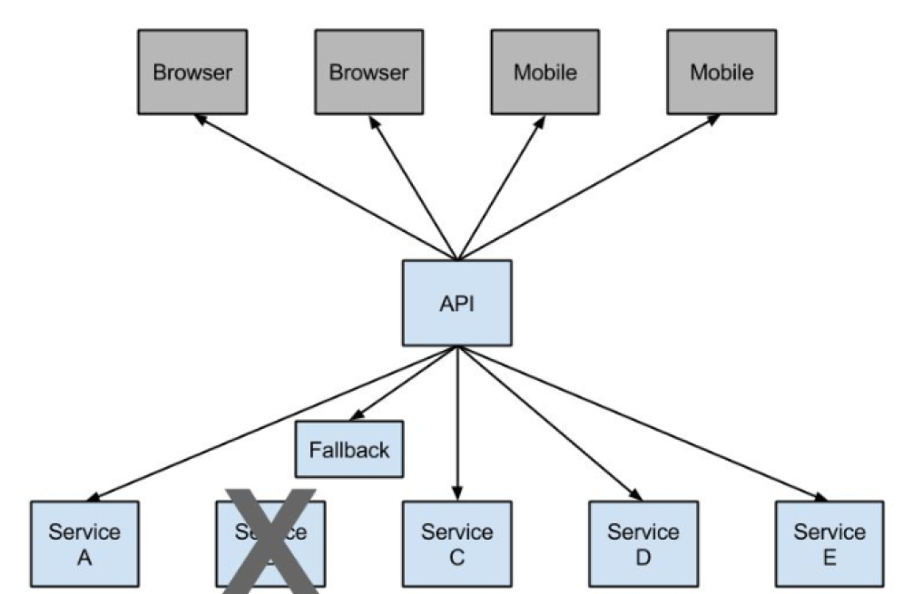
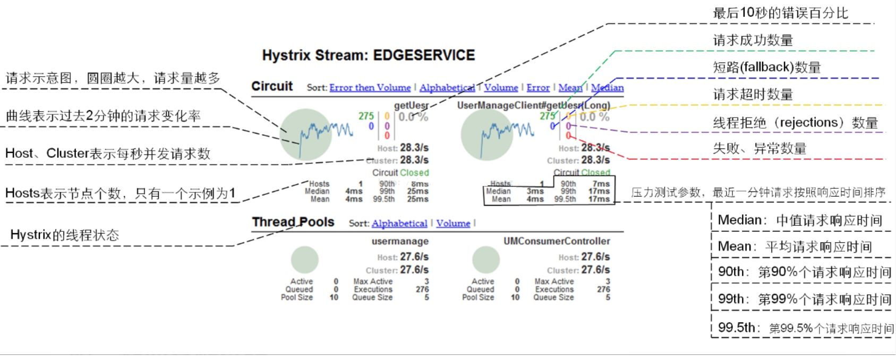
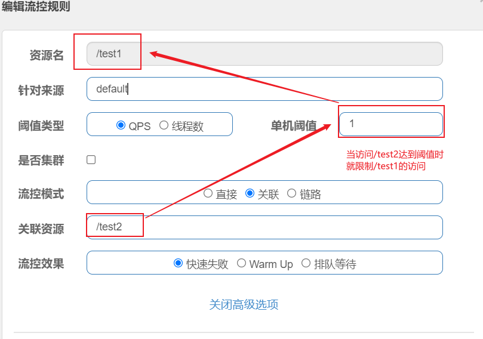

# 1、微服务

在系统架构与设计的实践中，从宏观上可以总结为三个阶段；

**集中式架构**：就是把所有的功能、模块都集中到一个项目中，部署在一台服务器上，从而对外提供服务（单体架构、单体服务、单体应用）；

直白一点：就是只有一个项目，只有一个war；

**分布式架构：**就是把所有的功能、模块拆分成不同的子项目，部署在多台不同的服务器上，这些子项目相互协作共同对外提供服务。

直白一点：就是有很多项目，有很多war包，这些项目相互协作完成需要的功能，不是一个war能完成的，一个war包完成不了；

比如：

Shop项目：单体应用

Shop项目：拆分--> (user-center, order-center, trade-center) 分布式应用

**微服务架构：**分布式强调系统的拆分，微服务也是强调系统的拆分，微服务架构属于分布式架构的范畴；

并且到目前为止，微服务并没有一个统一的标准的定义，那么微服务究竟是什

么？ 

## 1、什么是微服务

```
The microservice architectural style is an approach to developing a single application as a suite of small services, each running in its own process and communicating with lightweight mechanisms, often an HTTP resource API. These services are built around business capabilities and independently deployable by fully automated deployment machinery. There is a bare minimum of centralized management of these services , which may be written in different programming languages and use different data storage technologies.
```

> 首先微服务并没有一个官方的定义，想要直接描述微服务比较困难，我们可以通过对比传统WEB应用，来理解什么是微服务。

### 1、传统的web项目VS微服务

#### 1、传统的Web项目

> 传统的WEB应用核心分为业务逻辑、适配器以及API或通过UI访问的WEB界面。业务逻辑定义业务流程、业务规则以及领域实体。适配器包括数据库访问组件、消息组件以及访问接口等。

尽管也是遵循模块化开发，但最终它们会打包并部署为单体式应用。例如Java应用程序会被打包成WAR，部署在Tomcat或者Jetty上。

这种单体应用比较适合于小项目，优点是：

- 开发简单直接，集中式管理
- 基本不会重复开发
- 功能都在本地，没有分布式的管理开销和调用开销


它的缺点也十分明显，特别对于互联网公司来说：

- 开发效率低：所有的开发在一个项目改代码，递交代码相互等待，代码冲突不断
- 代码维护难：代码功能耦合在一起，新人不知道何从下手
- 部署不灵活：构建时间长，任何小修改必须重新构建整个项目，这个过程往往很长
- 稳定性不高：一个微不足道的小问题，可以导致整个应用挂掉
- 扩展性不够：无法满足高并发情况下的业务需求

#### 2、微服务项目

> 现在主流的设计一般会采用微服务架构。其思路不是开发一个巨大的单体式应用，而是将应用分解为小的、互相连接的微服务。一个微服务完成某个特定功能，比如乘客管理和下单管理等。每个微服务都有自己的业务逻辑和适配器。一些微服务还会提供API接口给其他微服务和应用客户端使用

**微服务架构的优点**

- 解决了复杂性问题

  > 它将单体应用分解为一组服务。虽然功能总量不变，但应用程序已被分解为可管理的模块或服务。这些服务定义了明确的RPC或消息驱动的API边界。微服务架构强化了应用模块化的水平，而这通过单体代码库很难实现。因此，微服务开发的速度要快很多，更容易理解和维护。

- 单独开发每个服务，与其他服务互不干扰

  > 只要符合服务API契约，开发人员可以自由选择开发技术。这就意味着开发人员可以采用新技术编写或重构服务，由于服务相对较小，所以这并不会对整体应用造成太大影响。

- 可以独立部署每个微服务

  > 开发人员无需协调对服务升级或更改的部署。这些更改可以在测试通过后立即部署。所以微服务架构也使得CI／CD成为可能。

**微服务的缺点**

- 多服务运维难度
- 系统部署依赖
- 服务间通信成本
- 数据一致性
- 系统集成测试
- 重复工作
- 性能监控

## 2、如何实现微服务

> **四个问题**
>
> 1. 客户端如何访问这些服务？
> 2. 服务之间如何通信？
> 3. 这么多服务，怎么找?
> 4. 服务挂了怎么办？

### 1、客户端如何访问这些服务

原来的服务都是可以进行单独调用，现在按功能拆分成独立的服务，变成了一个独立的Java进程了。客户端UI如何

访问他的？后台有N个服务，前台就需要记住管理N个服务，一个服务下线/更新/升级，前台就要重新部署，这明显

不服务我们拆分的理念，特别当前台是移动应用的时候，通常业务变化的节奏更快。另外，N个小服务的调用也是

一个不小的网络开销。还有一般微服务在系统内部，通常是无状态的，用户登录信息和权限管理最好有一个统一的

地方维护管理（OAuth）。

所以，一般在后台N个服务和UI之间一般会一个代理或者叫`API Gateway`，他的作用包括

- 提供统一服务入口，让微服务对前台透明
- 聚合后台的服务，节省流量，提升性能
- 提供安全，过滤，流控等API管理功能

我的理解其实这个API Gateway可以有很多广义的实现办法，可以是一个软硬一体的盒子，也可以是一个简单

MVC框架，甚至是一个Node.js的服务端。他们最重要的作用是为前台（通常是移动应用）提供后台服务的聚合，提

供一个统一的服务出口，解除他们之间的耦合，不过API Gateway也有可能成为单点故障点或者性能的瓶颈。

### 2、 服务之间如何通信？

因为所有的微服务都是独立的Java进程跑在独立的虚拟机上，所以服务间的通行就是IPC（inter process communication），已经有很多成熟的方案。现在基本最通用的有两种方式。

- 同步调用
  - REST（JAX-RS）
  - RPC（Dubbo）
- 异步消息调用(Kafka, Notify, MetaQ)

> 一般同步调用比较简单，一致性强，但是容易出调用问题，性能体验上也会差些，特别是调用层次多的时候。RESTful和RPC的比较也是一个很有意思的话题。一般REST基于HTTP，更容易实现，更容易被接受，服务端实现技术也更灵活些，各个语言都能支持，同时能跨客户端，对客户端没有特殊的要求，只要封装了HTTP的SDK就能调用，所以相对使用的广一些。RPC也有自己的优点，传输协议更高效，安全更可控，特别在一个公司内部，如果有统一个的开发规范和统一的服务框架时，他的开发效率优势更明显些。就看各自的技术积累实际条件，自己的选择了。
>
> 而异步消息的方式在分布式系统中有特别广泛的应用，他既能减低调用服务之间的耦合，又能成为调用之间的缓冲，确保消息积压不会冲垮被调用方，同时能保证调用方的服务体验，继续干自己该干的活，不至于被后台性能拖慢。不过需要付出的代价是一致性的减弱，需要接受数据最终一致性；还有就是后台服务一般要实现幂等性，因为消息发送出于性能的考虑一般会有重复（保证消息的被收到且仅收到一次对性能是很大的考验）；最后就是必须引入一个独立的broker，如果公司内部没有技术积累，对broker分布式管理也是一个很大的挑战。

###  3、这么多服务，怎么找?

在微服务架构中，一般每一个服务都是有多个拷贝，来做负载均衡。一个服务随时可能下线，也可能应对临时访问

压力增加新的服务节点。服务之间如何相互感知？服务如何管理？这就是服务发现的问题了。一般有两类做法，也

各有优缺点。基本都是通过zookeeper等类似技术做服务注册信息的分布式管理。当服务上线时，服务提供者将自

己的服务信息注册到ZK（或类似框架），并通过心跳维持长链接，实时更新链接信息。服务调用者通过ZK寻址，

根据可定制算法，找到一个服务，还可以将服务信息缓存在本地以提高性能。当服务下线时，ZK会发通知给服务

客户端。

- 客户端做：优点是架构简单，扩展灵活，只对服务注册器依赖。缺点是客户端要维护所有调用服务的地址，有

  技术难度，一般大公司都有成熟的内部框架支持，比如Dubbo。

- 服务端做：优点是简单，所有服务对于前台调用方透明，一般在小公司在云服务上部署的应用采用的比较多。

###  4、这么多服务，服务挂了怎么办？

前面提到，Monolithic方式开发一个很大的风险是，把所有鸡蛋放在一个篮子里，一荣俱荣，一损俱损。而分布式

最大的特性就是网络是不可靠的。通过微服务拆分能降低这个风险，不过如果没有特别的保障，结局肯定是噩梦。

我们刚遇到一个线上故障就是一个很不起眼的SQL计数功能，在访问量上升时，导致数据库load彪高，影响了所在

应用的性能，从而影响所有调用这个应用服务的前台应用。所以当我们的系统是由一系列的服务调用链组成的时

候，我们必须确保任一环节出问题都不至于影响整体链路。相应的手段有很多：

- 重试机制
- 限流
- 熔断机制
- 负载均衡
- 降级（本地缓存）

## 3、经典面试

### 1、分布式和微服务有什么区别？

> 分布式，就是将巨大的一个系统划分为多个模块，这一点和微服务是一样的，都是要把系统进行拆分，部署到不同机器上，因为一台机器可能承受不了这么大的访问压力，或者说要支撑这么大的访问压力需要采购一台性能超级好的服务器，其财务成本非常高，有这些预算完全可以采购很多台普通的服务器了，分布式系统各个模块通过接口进行数据交互，其实分布式也是一种微服务，因为都是把模块拆分变为独立的单元，提供接口来调用，那么它们本质的区别是什么？
>
> 它们的本质的区别体现在“目标”上， 何为目标，就是你采用分布式架构或者采用微服务架构，你最终是为了什么，要达到什么目的？
>
> 分布式架构的目标是什么？ 就是访问量很大一台机器承受不了，或者是成本问题，不得不使用多台机器来完成服务的部署；
>
> 而微服务的目标是什么？只是让各个模块拆分开来，不会被互相影响，比如模块的升级或者出现BUG或者是重构等等都不要影响到其他模块，微服务它是可以在一台机器上部署； 
>
> 但是：分布式也是微服务的一种，微服务也属于分布式；

### 2、微服务与Spring-Cloud的关系或区别？

> 微服务只是一种项目的架构方式、架构理念，或者说是一种概念，就如同我们的MVC架构一样， 那么Spring Cloud便是对这种架构方式的技术落地实现；

### 3、微服务一定要使用Spring Cloud吗？

> 微服务只是一种项目的架构方式、架构理念，所以任何技术都可以实现这种架构理念，只是微服务架构里面有很多问题需要我们去解决，比如：负载均衡，服务的注册与发现，服务调用，服务路由，服务熔断等等一系列问题，如果你自己从0开始实现微服务的架构理念，那头发都掉光了，所以Spring Cloud 帮我们做了这些事情，Spring Cloud将处理这些问题的的技术全部打包好了，我们只需要开箱即用；

------

对于微服务的文章，可参考：

- [一篇文章快速了解微服务](http://dockone.io/article/3687)
- [微服务那点事](https://developer.aliyun.com/article/2764)


# 2、Spring Cloud

> Spring Cloud provides tools for developers to quickly build some of the common patterns in distributed systems (e.g. configuration management, service discovery, circuit breakers, intelligent routing, micro-proxy, control bus, one-time tokens, global locks, leadership election, distributed sessions, cluster state). Coordination of distributed systems leads to boiler plate patterns, and using Spring Cloud developers can quickly stand up services and applications that implement those patterns. They will work well in any distributed environment, including the developer’s own laptop, bare metal data centres, and managed platforms such as Cloud Foundry.
>
> Spring Cloud为开发人员提供了工具，以快速构建分布式系统中的一些常见模式（例如，配置管理，服务发现，断路器，智能路由，微代理，控制总线，一次性令牌，全局锁，领导选举，分布式会话，群集状态）。分布式系统的协调导致样板式样，并且使用Spring Cloud开发人员可以快速站起来实现这些样板的服务和应用程序。它们将在任何分布式环境中都能很好地工作，包括开发人员自己的笔记本电脑，裸机数据中心以及诸如Cloud Foundry之类的托管平台.

**特性**

- 分布式/版本化配置
- 服务注册和发现
- 路由
- 服务与服务间的调用
- 负载均衡
- 断路器
- 全局锁
- 领导选举与集群状态
- 分布式消息传递

## 1、Spring Cloud版本选择

### 1、版本关系

> Spring Cloud 采用了英国伦敦地铁站的名称来命名，并由地铁站名称字母A-Z依次类推的形式来发布迭代版本
>
>SpringCloud是一个由许多子项目组成的综合项目，各子项目有不同的发布节奏。为了管理SpringCloud与各子项目的版本依赖关系，发布了一个清单，其中包括了某个SpringCloud版本对应的子项目版本。为了避免SpringCloud版本号与子项目版本号混淆，SpringCloud版本采用了名称而非版本号的命名，这些版本的名字采用了伦敦地铁站的名字，根据字母表的顺序来对应版本时间顺序。例如Angel是第一个版本, Brixton是第二个版本。
>
>当SpringCloud的发布内容积累到临界点或者一个重大BUG被解决后，会发布一个"service releases"版本，简称SRX版本，比如Greenwich.SR2就是SpringCloud发布的Greenwich版本的第2个SRX版本。

## 2、Spring Cloud与Spring Boot依赖关系

官方：https://spring.io/projects/spring-cloud#overview


更详细版本对应的查看：https://start.spring.io/actuator/info

json格式化：截止（2021.04.13）

```json
{
  "git": {
    "branch": "709ff1cec88a124ef588f6185e5dc237766f3236",
    "commit": {
      "id": "709ff1c",
      "time": "2021-04-10T08:56:10Z"
    }
  },
  "build": {
    "version": "0.0.1-SNAPSHOT",
    "artifact": "start-site",
    "versions": {
      "spring-boot": "2.4.4",
      "initializr": "0.11.0-SNAPSHOT"
    },
    "name": "start.spring.io website",
    "time": "2021-04-12T11:22:19.209Z",
    "group": "io.spring.start"
  },
  "bom-ranges": {
    "azure": {
      "2.2.4": "Spring Boot >=2.2.0.RELEASE and <2.3.0.M1",
      "3.2.0": "Spring Boot >=2.3.0.M1 and <2.4.0-M1",
      "3.3.0": "Spring Boot >=2.4.0.M1 and <2.5.0-M1"
    },
    "codecentric-spring-boot-admin": {
      "2.2.4": "Spring Boot >=2.2.0.RELEASE and <2.3.0.M1",
      "2.3.1": "Spring Boot >=2.3.0.M1 and <2.5.0-M1"
    },
    "solace-spring-boot": {
      "1.0.0": "Spring Boot >=2.2.0.RELEASE and <2.3.0.M1",
      "1.1.0": "Spring Boot >=2.3.0.M1 and <2.5.0-M1"
    },
    "solace-spring-cloud": {
      "1.0.0": "Spring Boot >=2.2.0.RELEASE and <2.3.0.M1",
      "1.1.1": "Spring Boot >=2.3.0.M1 and <2.4.0-M1",
      "2.0.0": "Spring Boot >=2.4.0.M1 and <2.5.0-M1"
    },
    "spring-cloud": {
      "Hoxton.SR10": "Spring Boot >=2.2.0.RELEASE and <2.3.10.BUILD-SNAPSHOT",
      "Hoxton.BUILD-SNAPSHOT": "Spring Boot >=2.3.10.BUILD-SNAPSHOT and <2.4.0.M1",
      "2020.0.0-M3": "Spring Boot >=2.4.0.M1 and <=2.4.0.M1",
      "2020.0.0-M4": "Spring Boot >=2.4.0.M2 and <=2.4.0-M3",
      "2020.0.0": "Spring Boot >=2.4.0.M4 and <=2.4.0",
      "2020.0.2": "Spring Boot >=2.4.1 and <2.5.0-M1",
      "2020.0.3-SNAPSHOT": "Spring Boot >=2.4.5-SNAPSHOT"
    },
    "spring-cloud-alibaba": {
      "2.2.1.RELEASE": "Spring Boot >=2.2.0.RELEASE and <2.3.0.M1"
    },
    "spring-cloud-gcp": {
      "2.0.0": "Spring Boot >=2.4.0-M1 and <2.5.0-M1"
    },
    "spring-cloud-services": {
      "2.2.6.RELEASE": "Spring Boot >=2.2.0.RELEASE and <2.3.0.RELEASE",
      "2.3.0.RELEASE": "Spring Boot >=2.3.0.RELEASE and <2.4.0-M1",
      "2.4.1": "Spring Boot >=2.4.0-M1 and <2.5.0-M1"
    },
    "spring-geode": {
      "1.2.12.RELEASE": "Spring Boot >=2.2.0.RELEASE and <2.3.0.M1",
      "1.3.9.RELEASE": "Spring Boot >=2.3.0.M1 and <2.4.0-M1",
      "1.4.4": "Spring Boot >=2.4.0-M1 and <2.5.0-M1",
      "1.5.0-M3": "Spring Boot >=2.5.0-M1"
    },
    "vaadin": {
      "14.5.2": "Spring Boot >=2.1.0.RELEASE and <2.5.0-M1"
    },
    "wavefront": {
      "2.0.2": "Spring Boot >=2.1.0.RELEASE and <2.4.0-M1",
      "2.1.0": "Spring Boot >=2.4.0-M1"
    }
  },
  "dependency-ranges": {
    "native": {
      "0.9.0": "Spring Boot >=2.4.3 and <2.4.4",
      "0.9.1": "Spring Boot >=2.4.4 and <2.4.5-SNAPSHOT",
      "0.9.2-SNAPSHOT": "Spring Boot >=2.4.5-SNAPSHOT and <2.5.0-M1"
    },
    "okta": {
      "1.4.0": "Spring Boot >=2.2.0.RELEASE and <2.4.0-M1",
      "1.5.1": "Spring Boot >=2.4.0-M1 and <2.4.1",
      "2.0.1": "Spring Boot >=2.4.1 and <2.5.0-M1"
    },
    "mybatis": {
      "2.1.4": "Spring Boot >=2.1.0.RELEASE and <2.5.0-M1"
    },
    "camel": {
      "3.3.0": "Spring Boot >=2.2.0.RELEASE and <2.3.0.M1",
      "3.5.0": "Spring Boot >=2.3.0.M1 and <2.4.0-M1",
      "3.9.0": "Spring Boot >=2.4.0.M1 and <2.5.0-M1"
    },
    "open-service-broker": {
      "3.1.1.RELEASE": "Spring Boot >=2.2.0.RELEASE and <2.3.0.M1",
      "3.2.0": "Spring Boot >=2.3.0.M1 and <2.4.0-M1",
      "3.3.0": "Spring Boot >=2.4.0-M1 and <2.5.0-M1"
    }
  }
}
```

## 3、Spring Cloud组件的停更、升级、替换


# 3、环境版本定稿

```xml

  <!-- 统一管理jar包版本 -->
  <properties>
    <project.build.sourceEncoding>UTF-8</project.build.sourceEncoding>
    <maven.compiler.source>1.8</maven.compiler.source>
    <maven.compiler.target>1.8</maven.compiler.target>
    <junit.version>4.12</junit.version>
    <log4j.version>1.2.17</log4j.version>
    <lombok.version>1.18.12</lombok.version>
    <mysql.version>8.0.21</mysql.version>
    <druid.version>1.2.4</druid.version>
    <mybatis.spring.boot.version>2.1.3</mybatis.spring.boot.version>
  </properties>

  <!-- 子模块继承之后，提供作用：锁定版本+子modlue不用写groupId和version  -->
  <dependencyManagement>
    <dependencies>
      <!--spring boot 2.2.2-->
      <dependency>
        <groupId>org.springframework.boot</groupId>
        <artifactId>spring-boot-dependencies</artifactId>
        <version>2.3.3.RELEASE</version>
        <type>pom</type>
        <scope>import</scope>
      </dependency>
      <!--spring cloud Hoxton.SR1-->
      <dependency>
        <groupId>org.springframework.cloud</groupId>
        <artifactId>spring-cloud-dependencies</artifactId>
        <version>Hoxton.SR4</version>
        <type>pom</type>
        <scope>import</scope>
      </dependency>
      <!--spring cloud alibaba 2.1.0.RELEASE-->
      <dependency>
        <groupId>com.alibaba.cloud</groupId>
        <artifactId>spring-cloud-alibaba-dependencies</artifactId>
        <version>2.2.1.RELEASE</version>
        <type>pom</type>
        <scope>import</scope>
      </dependency>
      <dependency>
        <groupId>mysql</groupId>
        <artifactId>mysql-connector-java</artifactId>
        <version>${mysql.version}</version>
      </dependency>
      <dependency>
        <groupId>com.alibaba</groupId>
        <artifactId>druid</artifactId>
        <version>${druid.version}</version>
      </dependency>
      <dependency>
        <groupId>org.mybatis.spring.boot</groupId>
        <artifactId>mybatis-spring-boot-starter</artifactId>
        <version>${mybatis.spring.boot.version}</version>
      </dependency>
      <dependency>
        <groupId>junit</groupId>
        <artifactId>junit</artifactId>
        <version>${junit.version}</version>
      </dependency>
      <dependency>
        <groupId>log4j</groupId>
        <artifactId>log4j</artifactId>
        <version>${log4j.version}</version>
      </dependency>
      <dependency>
        <groupId>org.projectlombok</groupId>
        <artifactId>lombok</artifactId>
        <version>${lombok.version}</version>
        <optional>true</optional>
      </dependency>
    </dependencies>
  </dependencyManagement>

  <build>
    <plugins>
      <plugin>
        <groupId>org.springframework.boot</groupId>
        <artifactId>spring-boot-maven-plugin</artifactId>
        <configuration>
          <fork>true</fork>
          <addResources>true</addResources>
        </configuration>
      </plugin>
    </plugins>
  </build>
```

## 1、maven工程复习

`dependencyManagement`

Maven 使用dependencyManagement 元素来提供了一种管理依赖版本号的方式。通常会在一个组织或者项目的最顶层的父POM 中看到dependencyManagement 元素。

使用pom.xml 中的dependencyManagement 元素能让所有在子项目中引用一个依赖而不用显式的列出版本号。
Maven 会沿着父子层次向上走，直到找到一个拥有dependencyManagement 元素的项目，然后它就会使用这个
dependencyManagement 元素中指定的版本号。

例如：

我们在父项目指定了版本，子项目就可以不用指定版本，直接用父项目的版本

> 

这样做的好处就是：如果有多个子项目都引用同一样依赖，则可以避免在每个使用的子项目里都声明一个版本号，

这样当想升级或切换到另一个版本时，只需要在顶层父容器里更新，而不需要一个一个子项目的修改 ；另外如果

某个子项目需要另外的一个版本，只需要声明version就可。

*     dependencyManagement里只是声明依赖，并不实现引入，因此子项目需要显示的声明需要用的依赖。
*   如果不在子项目中声明依赖，是不会从父项目中继承下来的；只有在子项目中写了该依赖项，并且没有指定具体版本，
     才会从父项目中继承该项，并且version和scope都读取自父pom;
*     如果子项目中指定了版本号，那么会使用子项目中指定的jar版本。

## 2、mysql驱动说明

> com.mysql.jdbc.Driver和mysql-connector-java 5一起用。
>
> com.mysql.cj.jdbc.Driver和mysql-connector-java 6 一起用。
>
> ------
>
> com.mysql.cj.jdbc.Driver是mysql-connector-java 6 中的特性，相比mysql-connector-java 5 多了一个时区：
>
> serverTimezone，把数据源配置的驱动改一下就好了
>
> ------
>
> org.gjt.mm.mysql.Driver是当时最好的MySQL JDBC，但不是MySQL公司的，然后MySQL将MM的JDBC驱动 收为
>
> 官方的JDBC驱动，所以将驱动的package也改了，但还保留了org.gjt.mm.mysql.Driver这个路径的引用，也就
>
> 是你使用新版的JDBC驱动时还可以通过这个来引用，打开下载的新版JDBC驱动的jar文件可以看到，只有一个
>
> 文件的目录是org.gjt.mm.mysql，就是为了兼容而设计的。


# 4、消费者直接调用提供者（案例）

建立一个父工程，父工程新建module

**步骤**

1. 建module
2. 改pom.xml
3. 写yaml
4. 主启动
5. 业务类
   - 建表
   - entities
   - dao
   - service
   - controller
6. 测试

## 1、微服务提供者module

### 1、建module 

名字为：`xiaobear-provider-payment-8001-1`

### 2、改pom.xml

```xml
<dependencies>
        <dependency>
            <groupId>org.springframework.boot</groupId>
            <artifactId>spring-boot-starter-web</artifactId>
        </dependency>
        <dependency>
            <groupId>org.springframework.boot</groupId>
            <artifactId>spring-boot-starter-actuator</artifactId>
        </dependency>
        <dependency>
            <groupId>org.mybatis.spring.boot</groupId>
            <artifactId>mybatis-spring-boot-starter</artifactId>
        </dependency>
        <dependency>
            <groupId>com.alibaba</groupId>
            <artifactId>druid-spring-boot-starter</artifactId>
            <version>1.1.10</version>
        </dependency>
        <!--mysql-connector-java-->
        <dependency>
            <groupId>mysql</groupId>
            <artifactId>mysql-connector-java</artifactId>
        </dependency>
        <!--jdbc-->
        <dependency>
            <groupId>org.springframework.boot</groupId>
            <artifactId>spring-boot-starter-jdbc</artifactId>
        </dependency>
        <dependency>
            <groupId>org.springframework.boot</groupId>
            <artifactId>spring-boot-devtools</artifactId>
            <scope>runtime</scope>
            <optional>true</optional>
        </dependency>
        <dependency>
            <groupId>org.projectlombok</groupId>
            <artifactId>lombok</artifactId>
            <optional>true</optional>
        </dependency>
        <dependency>
            <groupId>org.springframework.boot</groupId>
            <artifactId>spring-boot-starter-test</artifactId>
            <scope>test</scope>
        </dependency>
    </dependencies>

```

### 3、写yaml

在rescourse目录下新建application.yml

```yml
server:
  port: 8001

spring:
  application:
    name: xiaobear-cloud-payment-service
  datasource:
    type: com.alibaba.druid.pool.DruidDataSource
    driver-class-name: com.mysql.cj.jdbc.Driver
    url: jdbc:mysql://localhost:3306/spring-cloud-xiaobear?useUnicode=true&characterEncoding=utf8&zeroDateTimeBehavior=convertToNull&useSSL=true&serverTimezone=GMT%2B8
    username: root
    password: mima

mybatis:
  mapper-locations: classpath:mapper/*.xml
  type-aliases-package: com.xiaobear.entity
```

### 4、主启动

在java目录下，新建一个主启动类

```java
package com.xiaobear;

import org.springframework.boot.SpringApplication;
import org.springframework.boot.autoconfigure.SpringBootApplication;

/**
 * @Author xiaobear
 * @Date 2021/4/6 21:41
 * @Description 主启动类
 * @Version 1.0
 */
@SpringBootApplication
public class Payment8001Application {

    public static void main(String[] args) {
        SpringApplication.run(Payment8001Application.class,args);
    }
}
```

### 5、业务类

#### 1、建表

```sql
CREATE TABLE `payment` (

  `id` bigint(20) NOT NULL AUTO_INCREMENT COMMENT 'ID',

  `serial` varchar(200) DEFAULT '',

  PRIMARY KEY (`id`)

) ENGINE=InnoDB AUTO_INCREMENT=1 DEFAULT CHARSET=utf8
```

#### 2、entities

```java
/**
 * (Payment)实体类
 *
 * @author xiaobear
 * @since 2021-04-06 21:52:42
 */
public class Payment implements Serializable {
    private static final long serialVersionUID = -82310885557668418L;
    /**
     * ID
     */
    private Long id;

    private String serial;


    public Long getId() {
        return id;
    }

    public void setId(Long id) {
        this.id = id;
    }

    public String getSerial() {
        return serial;
    }

    public void setSerial(String serial) {
        this.serial = serial;
    }

}
```

#### 3、dao

```java
@Mapper
public interface PaymentDao {

    /**
     * 通过ID查询单条数据
     *
     * @param id 主键
     * @return 实例对象
     */
    Payment queryById(@Param("id")Long id);

    /**
     * 查询指定行数据
     *
     * @param offset 查询起始位置
     * @param limit  查询条数
     * @return 对象列表
     */
    List<Payment> queryAllByLimit(@Param("offset") int offset, @Param("limit") int limit);


    /**
     * 通过实体作为筛选条件查询
     *
     * @param payment 实例对象
     * @return 对象列表
     */
    List<Payment> queryAll(Payment payment);

    /**
     * 新增数据
     *
     * @param payment 实例对象
     * @return 影响行数
     */
    int insert(Payment payment);

    /**
     * 批量新增数据（MyBatis原生foreach方法）
     *
     * @param entities List<Payment> 实例对象列表
     * @return 影响行数
     */
    int insertBatch(@Param("entities") List<Payment> entities);

    /**
     * 批量新增或按主键更新数据（MyBatis原生foreach方法）
     *
     * @param entities List<Payment> 实例对象列表
     * @return 影响行数
     */
    int insertOrUpdateBatch(@Param("entities") List<Payment> entities);

    /**
     * 修改数据
     *
     * @param payment 实例对象
     * @return 影响行数
     */
    int update(Payment payment);

    /**
     * 通过主键删除数据
     *
     * @param id 主键
     * @return 影响行数
     */
    int deleteById(Long id);

}

```

##### xml

```xml
<?xml version="1.0" encoding="UTF-8"?>
<!DOCTYPE mapper PUBLIC "-//mybatis.org//DTD Mapper 3.0//EN" "http://mybatis.org/dtd/mybatis-3-mapper.dtd">
<mapper namespace="com.xiaobear.dao.PaymentDao">

    <resultMap type="com.xiaobear.entity.Payment" id="PaymentMap">
        <result property="id" column="id" jdbcType="INTEGER"/>
        <result property="serial" column="serial" jdbcType="VARCHAR"/>
    </resultMap>

    <!--查询单个-->
    <select id="queryById" resultMap="PaymentMap">
        select id,
               serial
        from payment
        where id = #{id}
    </select>

    <!--查询指定行数据-->
    <select id="queryAllByLimit" resultMap="PaymentMap">
        select id,
               serial
        from payment
        limit #{offset}
           , #{limit}
    </select>

    <!--通过实体作为筛选条件查询-->
    <select id="queryAll" resultMap="PaymentMap">
        select
        id, serial
        from payment
        <where>
            <if test="id != null">
                and id = #{id}
            </if>
            <if test="serial != null and serial != ''">
                and serial = #{serial}
            </if>
        </where>
    </select>

    <!--新增所有列-->
    <insert id="insert" keyProperty="id" useGeneratedKeys="true">
        insert into payment(serial)
        values (#{serial})
    </insert>

    <insert id="insertBatch" keyProperty="id" useGeneratedKeys="true">
        insert into payment(serial)
        values
        <foreach collection="entities" item="entity" separator=",">
            (#{entity.serial})
        </foreach>
    </insert>

    <insert id="insertOrUpdateBatch" keyProperty="id" useGeneratedKeys="true">
        insert into payment(serial)
        values
        <foreach collection="entities" item="entity" separator=",">
            (#{entity.serial})
        </foreach>
        on duplicate key update
        serial = values(serial)
    </insert>

    <!--通过主键修改数据-->
    <update id="update">
        update payment
        <set>
            <if test="serial != null and serial != ''">
                serial = #{serial},
            </if>
        </set>
        where id = #{id}
    </update>

    <!--通过主键删除-->
    <delete id="deleteById">
        delete
        from payment
        where id = #{id}
    </delete>

</mapper>

```


#### 4、service

```java
public interface PaymentService {

    /**
     * 通过ID查询单条数据
     *
     * @param id 主键
     * @return 实例对象
     */
    Payment queryById(Long id);

    /**
     * 查询多条数据
     *
     * @param offset 查询起始位置
     * @param limit  查询条数
     * @return 对象列表
     */
    List<Payment> queryAllByLimit(int offset, int limit);

    /**
     * 新增数据
     *
     * @param payment 实例对象
     * @return 实例对象
     */
    Payment insert(Payment payment);

    /**
     * 修改数据
     *
     * @param payment 实例对象
     * @return 实例对象
     */
    Payment update(Payment payment);

    /**
     * 通过主键删除数据
     *
     * @param id 主键
     * @return 是否成功
     */
    boolean deleteById(Long id);

}

```

##### impl

```java
@Service("paymentService")
public class PaymentServiceImpl implements PaymentService {
    @Resource
    private PaymentDao paymentDao;

    /**
     * 通过ID查询单条数据
     *
     * @param id 主键
     * @return 实例对象
     */
    @Override
    public Payment queryById(Long id) {
        return this.paymentDao.queryById(id);
    }

    /**
     * 查询多条数据
     *
     * @param offset 查询起始位置
     * @param limit  查询条数
     * @return 对象列表
     */
    @Override
    public List<Payment> queryAllByLimit(int offset, int limit) {
        return this.paymentDao.queryAllByLimit(offset, limit);
    }

    /**
     * 新增数据
     *
     * @param payment 实例对象
     * @return 实例对象
     */
    @Override
    public Payment insert(Payment payment) {
        this.paymentDao.insert(payment);
        return payment;
    }

    /**
     * 修改数据
     *
     * @param payment 实例对象
     * @return 实例对象
     */
    @Override
    public Payment update(Payment payment) {
        this.paymentDao.update(payment);
        return this.queryById(payment.getId());
    }

    /**
     * 通过主键删除数据
     *
     * @param id 主键
     * @return 是否成功
     */
    @Override
    public boolean deleteById(Long id) {
        return this.paymentDao.deleteById(id) > 0;
    }
}

```

#### 5、controller

```java
@RestController
@RequestMapping("payment")
@Slf4j
public class PaymentController {
    /**
     * 服务对象
     */
    @Resource
    private PaymentService paymentService;

    /**
     * 通过主键查询单条数据
     *
     * @param id 主键
     * @return 单条数据
     */
    @GetMapping("/selectOne/{id}")
    public Payment selectOne(@PathVariable("id")Long id) {
        return this.paymentService.queryById(id);
    }


    @PostMapping("/insert")
    public CommonResult createPayment(@RequestBody Payment payment){
        Payment insert = paymentService.insert(payment);
        log.info("插入成功！");
        if (null != insert){
            return new CommonResult(200,"插入数据库成功！",insert);
        }else {
            return new CommonResult(500,"插入数据库失败！",null);
        }
    }
}

```

这里采用的是通用返回CommonResult

```java
/**
 * @Author xiaobear
 * @Date 2021/4/10 20:39
 * @Description 通用返回类型
 * @Version 1.0
 */
public class CommonResult<T>{

    private Integer code;
    private String message;
    private T data;

    public CommonResult()
    {
    }

    public CommonResult(Integer code, String message, T data)
    {
        this.code = code;
        this.message = message;
        this.data = data;
    }
    public CommonResult( Integer code,String message) {
        this( code, message,null);
    }

    public CommonResult(T data) {
        this(200, "操作成功", data);
    }

    //setter--getter
    public T getData() {
        return data;
    }

    public void setData(T data) {
        this.data = data;
    }

    public String getMessage() {
        return message;
    }

    public void setMessage(String message) {
        this.message = message;
    }

    public Integer getCode() {
        return code;
    }

    public void setCode(Integer code) {
        this.code = code;
    }

}

```

6、测试


## 2、微服务消费者module

### 1、建module

`xiaobear-consumer-order80-2`

### 2、改pom.xml

```xml
<?xml version="1.0" encoding="UTF-8"?>
<project xmlns="http://maven.apache.org/POM/4.0.0"
         xmlns:xsi="http://www.w3.org/2001/XMLSchema-instance"
         xsi:schemaLocation="http://maven.apache.org/POM/4.0.0 http://maven.apache.org/xsd/maven-4.0.0.xsd">
    <parent>
        <artifactId>SpringCloud-xiaobear</artifactId>
        <groupId>com.xiaobear</groupId>
        <version>1.0-SNAPSHOT</version>
    </parent>
    <modelVersion>4.0.0</modelVersion>

    <artifactId>xiaobear-consumer-order80-2</artifactId>

    <dependencies>
        <dependency>
            <groupId>org.springframework.boot</groupId>
            <artifactId>spring-boot-starter-web</artifactId>
        </dependency>
        <dependency>
            <groupId>org.springframework.boot</groupId>
            <artifactId>spring-boot-starter-actuator</artifactId>
        </dependency>

  <!--      <dependency>
            <groupId>org.springframework.boot</groupId>
            <artifactId>spring-boot-devtools</artifactId>
            <scope>runtime</scope>
            <optional>true</optional>
        </dependency>-->
        <dependency>
            <groupId>org.projectlombok</groupId>
            <artifactId>lombok</artifactId>
            <optional>true</optional>
        </dependency>
        <dependency>
            <groupId>org.springframework.boot</groupId>
            <artifactId>spring-boot-starter-test</artifactId>
            <scope>test</scope>
        </dependency>
    </dependencies>
</project>
```

### 3、写yaml

```yaml
server:
  port: 80
```

### 4、主启动

```java
@SpringBootApplication
public class Order80Application {

    public static void main(String[] args) {
        SpringApplication.run(Order80Application.class,args);
    }
}
```

### 5、业务类

把消费者的entities以及通用返回类型复制即可


#### 1、RestTemplate

> RestTemplate提供了多种便捷访问远程Http服务的方法， 
>
> 是一种简单便捷的访问restful服务模板类，是Spring提供的用于访问Rest服务的客户端模板工具集

https://docs.spring.io/spring-framework/docs/5.3.x/javadoc-api/org/springframework/web/client/RestTemplate.html

##### 使用

使用restTemplate访问restful接口非常的简单粗暴无脑。

(url, requestMap, ResponseBean.class)这三个参数分别代表 

REST请求地址、请求参数、HTTP响应转换被转换成的对象类型。

#### 2、config配置类

```java
/**
 * @Author xiaobear
 * @Date 2021/4/11 16:23
 * @Description RestTemplate配置类
 * @Version 1.0
 */
@Configuration
public class ApplicationContextConfig {

    @Bean
    public RestTemplate getRestTemplate(){
        return new RestTemplate();
    }
}
```

#### 3、controller

```java
@RestController
@Slf4j
public class OrderController {

    private static final String PAYMENT_URL = "http://localhost:8001";

    @Resource
    private RestTemplate restTemplate;

    @GetMapping("/consumer/payment/insert")
    public CommonResult<Payment> create(Payment payment){
        return restTemplate.postForObject(PAYMENT_URL+"/payment/insert",payment,CommonResult.class);
    }

    @GetMapping("/consumer/payment/get/{id}")
    public CommonResult<Payment> getPayment(@PathVariable Long id){
        return restTemplate.getForObject(PAYMENT_URL + "/payment/selectOne/"+id,CommonResult.class, id);
    }
}
```

注意：两个服务需同时启动

## 3、问题

两个module都存在entities，而且两个实体类都是相同的，这时候我们可以工程重构

## 4、工程重构

新建一个module --名字为common-api

#### 1、修改pom.xml

```xml
<?xml version="1.0" encoding="UTF-8"?>
<project xmlns="http://maven.apache.org/POM/4.0.0"
         xmlns:xsi="http://www.w3.org/2001/XMLSchema-instance"
         xsi:schemaLocation="http://maven.apache.org/POM/4.0.0 http://maven.apache.org/xsd/maven-4.0.0.xsd">
    <parent>
        <artifactId>SpringCloud-xiaobear</artifactId>
        <groupId>com.xiaobear</groupId>
        <version>1.0-SNAPSHOT</version>
    </parent>
    <modelVersion>4.0.0</modelVersion>

    <artifactId>xiaobear-common-api-3</artifactId>

    <dependencies>
        <dependency>
            <groupId>org.springframework.boot</groupId>
            <artifactId>spring-boot-devtools</artifactId>
            <scope>runtime</scope>
            <optional>true</optional>
        </dependency>
        <dependency>
            <groupId>org.projectlombok</groupId>
            <artifactId>lombok</artifactId>
            <optional>true</optional>
        </dependency>
        <dependency>
            <groupId>cn.hutool</groupId>
            <artifactId>hutool-all</artifactId>
            <version>5.1.0</version>
        </dependency>
    </dependencies>

</project>
```

#### 2、entities

放入实体类payment和CommonResult

#### 3、对通用module进行clean install

#### 4、分别对前面两个module进行改造

##### 1、删除原来的entities目录

##### 2、粘贴pom的内容

```xml
        <dependency><!-- 引入自己定义的api通用包，可以使用Payment支付Entity -->
            <groupId>com.xiaobear</groupId>
            <artifactId>xiaobear-common-api-3</artifactId>
            <version>1.0-SNAPSHOT</version>
        </dependency>
```


# 5、Eurake服务注册与发现

**什么是服务治理？**

> Spring Cloud 封装了 Netflix 公司开发的 Eureka 模块来实现服务治理。
>
> 在传统的rpc远程调用框架中，管理每个服务与服务之间依赖关系比较复杂，管理比较复杂，所以需要使用服
>
> 务治理，管理服务于服务之间依赖关系，可以实现服务调用、负载均衡、容错等，实现服务发现与注册。

**什么是服务注册？**

> Eureka采用了CS的设计架构，Eureka Server 作为服务注册功能的服务器，它是服务注册中心。而系统中的其他微服务，使用 Eureka的客户端连接到 Eureka Server并维持心跳连接。这样系统的维护人员就可以通过 Eureka Server 来监控系统中各个微服务是否正常运行。
>
> 在服务注册与发现中，有一个注册中心。当服务器启动的时候，会把当前自己服务器的信息 比如 服务地址通讯地址等以别名方式注册到注册中心上。另一方（消费者|服务提供者），以该别名的方式去注册中心上获取到实际的服务通讯地址，然后再实现本地RPC调用RPC远程调用框架核心设计思想：在于注册中心，因为使用注册中心管理每个服务与服务之间的一个依赖关系(服务治理概念)。在任何rpc远程框架中，都会有一个注册中心(存放服务地址相关信息(接口地址))
>
> 

`Eureka包含两个组件：Eureka Server和Eureka Client`

1. Eureka Server提供服务注册服务

   > 各个微服务节点通过配置启动后，会在EurekaServer中进行注册，这样EurekaServer中的服务注册表中将会存储所有可用服务节点的信息，服务节点的信息可以在界面中直观看到。

2. EurekaClient通过注册中心进行访问

   > 是一个Java客户端，用于简化Eureka Server的交互，客户端同时也具备一个内置的、使用轮询(round-robin)负载算法的负载均衡器。在应用启动后，将会向Eureka Server发送心跳(默认周期为30秒)。如果Eureka Server在多个心跳周期内没有接收到某个节点的心跳，EurekaServer将会从服务注册表中把这个服务节点移除（默认90秒）

## 1、单机Eurake构建

### 1、创建微服务注册中心

#### 1、新建module

`xiaobear-eurake-server-7001-4`

#### 2、改pom.xml

```xml
<dependencies>
        <!--eureka-server-->
        <dependency>
            <groupId>org.springframework.cloud</groupId>
            <artifactId>spring-cloud-starter-netflix-eureka-server</artifactId>
        </dependency>
        <dependency><!-- 引入自己定义的api通用包，可以使用Payment支付Entity -->
            <groupId>com.xiaobear</groupId>
            <artifactId>xiaobear-common-api-3</artifactId>
            <version>1.0-SNAPSHOT</version>
        </dependency>
        <!--boot web actuator-->
        <dependency>
            <groupId>org.springframework.boot</groupId>
            <artifactId>spring-boot-starter-web</artifactId>
        </dependency>
        <dependency>
            <groupId>org.springframework.boot</groupId>
            <artifactId>spring-boot-starter-actuator</artifactId>
        </dependency>
        <!--一般通用配置-->
        <dependency>
            <groupId>org.springframework.boot</groupId>
            <artifactId>spring-boot-devtools</artifactId>
            <scope>runtime</scope>
            <optional>true</optional>
        </dependency>
        <dependency>
            <groupId>org.projectlombok</groupId>
            <artifactId>lombok</artifactId>
        </dependency>
        <dependency>
            <groupId>org.springframework.boot</groupId>
            <artifactId>spring-boot-starter-test</artifactId>
            <scope>test</scope>
        </dependency>
        <dependency>
            <groupId>junit</groupId>
            <artifactId>junit</artifactId>
        </dependency>
    </dependencies>
```

#### 3、写Yml

```yaml
server:
  port: 7001

eureka:
  instance:
    hostname: localhost  #eureka服务端的实例名称
  client:
    register-with-eureka: false   #false表示不向注册中心注册自己。
    fetch-registry: false      #false表示自己端就是注册中心，我的职责就是维护服务实例，并不需要去检索服务
    service-url:
      defaultZone: http://${eureka.instance.hostname}:${server.port}/eureka/
      #设置与Eureka Server交互的地址查询服务和注册服务都需要依赖这个地址。
```

#### 4、主启动

```java
@SpringBootApplication
@EnableEurekaServer  //标注这个一个eureka服务端
public class EurekaMainIn7001Application {

    public static void main(String[] args) {
        SpringApplication.run(EurekaMainIn7001Application.class,args);
    }
}
```

#### 5、测试

http://localhost:7001/


### 2、将提供者8001和消费者80分别注册进eureka服务

因为两个注册过程一致，这里以8001为例

#### 1、修改8001的pom.xml

```xml
//增加客户端依赖
<dependency>
    <groupId>org.springframework.cloud</groupId>
    <artifactId>spring-cloud-starter-netflix-eureka-client</artifactId>
</dependency>
```

#### 2、写Yml

```yaml
#添加如下
eureka:
  client:
    #表示是否将自己注册进EurekaServer默认为true。
    register-with-eureka: true
    #是否从EurekaServer抓取已有的注册信息，默认为true。单节点无所谓，集群必须设置为true才能配合ribbon使用负载均衡
    fetchRegistry: true
    service-url:
      defaultZone: http://localhost:7001/eureka
```

#### 3、主启动

```java
@SpringBootApplication
@EnableEurekaClient
public class Payment8001Application {

    public static void main(String[] args) {
        SpringApplication.run(Payment8001Application.class,args);
    }
}
```

#### 4、测试

http://localhost:7001/


**微服务注册名说明**


## 2、集群Eureka构建

**原理说明**  互相注册，相互守望

> 

**微服务RPC远程服务调用最核心的是：**高可用

试想：如果只有一个注册中心，它挂掉了，就会导致整个服务都可不用

解决：`搭建Eureka注册中心集群，实现负载均衡+故障容错`

### 1、创建微服务注册中心7002

参考单机注册中心7001的创建

#### 1、新建module

```
xiaobear-eureka-server-7002-5
```

#### 2、改pom.xml

```xml
    <dependencies>
        <!--eureka-server-->
        <dependency>
            <groupId>org.springframework.cloud</groupId>
            <artifactId>spring-cloud-starter-netflix-eureka-server</artifactId>
        </dependency>
        <dependency><!-- 引入自己定义的api通用包，可以使用Payment支付Entity -->
            <groupId>com.xiaobear</groupId>
            <artifactId>xiaobear-common-api-3</artifactId>
            <version>1.0-SNAPSHOT</version>
        </dependency>
        <!--boot web actuator-->
        <dependency>
            <groupId>org.springframework.boot</groupId>
            <artifactId>spring-boot-starter-web</artifactId>
        </dependency>
        <dependency>
            <groupId>org.springframework.boot</groupId>
            <artifactId>spring-boot-starter-actuator</artifactId>
        </dependency>
        <!--一般通用配置-->
        <dependency>
            <groupId>org.springframework.boot</groupId>
            <artifactId>spring-boot-devtools</artifactId>
            <scope>runtime</scope>
            <optional>true</optional>
        </dependency>
        <dependency>
            <groupId>org.projectlombok</groupId>
            <artifactId>lombok</artifactId>
        </dependency>
        <dependency>
            <groupId>org.springframework.boot</groupId>
            <artifactId>spring-boot-starter-test</artifactId>
            <scope>test</scope>
        </dependency>
        <dependency>
            <groupId>junit</groupId>
            <artifactId>junit</artifactId>
        </dependency>
    </dependencies>
```

#### 3、修改映射配置

因为有两个注册中心，倘若实例的主机都为localhost,无法区分到底是哪个注册中心，所以这时候需要我们修改C:\Windows\System32\drivers\etc\hosts文件，增加如下:

```
#######################Spring Boot Eureka学习##########
127.0.0.1 eureka7001.com
127.0.0.1 eureka7002.com
```

#### 4、写yml

- 7001的yaml修改：

> ```yaml
> server:
>   port: 7001
> 
> eureka:
>   instance:
>     hostname: eureka7001.com
>   client:
>     register-with-eureka: false #不向注册中心注册自己
>     fetch-registry: false   #自己就是注册中心
>     service-url:
>       # 与eureka-server交互的地址查询服务和注册服务器需要这个地址
>       defaultZone: http://eureka7002.com:7002/eureka/
> ```
>
> 因为之前只有一个注册中心，以自己的地址为server，现在有7001和7002，两个服务需要相互注册，互相守望

```yaml
server:
  port: 7002

eureka:
  instance:
    hostname: eureka7002.com
  client:
    register-with-eureka: false #不向注册中心注册自己
    fetch-registry: false   #自己就是注册中心
    service-url:
      # 与eureka-server交互的地址查询服务和注册服务器需要这个地址
      defaultZone: http://eureka7001.com:7001/eureka/
```

#### 5、主启动

```java
@SpringBootApplication
@EnableEurekaServer
public class EurekaMainIn7002Application {

    public static void main(String[] args) {
        SpringApplication.run(EurekaMainIn7002Application.class,args);
    }
}
```

#### 6、测试

http://eureka7001.com:7001/


http://eureka7002.com:7002/


### 2、将微服务8001和80分别发布到2台Eureka集群配置中

只需修改yml的配置文件，以前是挂在一台server上，而现在

```yaml
eureka:
  client:
    #表示是否将自己注册进EurekaServer默认为true。
    register-with-eureka: true
    #是否从EurekaServer抓取已有的注册信息，默认为true。单节点无所谓，集群必须设置为true才能配合ribbon使用负载均衡
    fetchRegistry: true
    service-url:
      defaultZone: http://eureka7001.com:7001/eureka,http://eureka7002.com:7002/eureka 
      #集群版
       # defaultZone: http://localhost:7001/eureka 单机版
```

#### 测试


启动顺序

- 先启动EurekaServer，7001、7002服务

- 再启动服务提供者，8001

- 启动消费者80

- 测试 http://localhost/consumer/payment/get/1 OK

  

### 3、创建服务提供者8001集群环境--8002

参考微服务提供者8001

#### 1、新建module

```
xiaobear-provider-payment8002-6
```

#### 2、写pom.xml

```xml
    <dependencies>

        <dependency>
            <groupId>org.springframework.cloud</groupId>
            <artifactId>spring-cloud-starter-netflix-eureka-client</artifactId>
        </dependency>

        <dependency><!-- 引入自己定义的api通用包，可以使用Payment支付Entity -->
            <groupId>com.xiaobear</groupId>
            <artifactId>xiaobear-common-api-3</artifactId>
            <version>1.0-SNAPSHOT</version>
        </dependency>
        <dependency>
            <groupId>org.springframework.boot</groupId>
            <artifactId>spring-boot-starter-web</artifactId>
        </dependency>
        <dependency>
            <groupId>org.springframework.boot</groupId>
            <artifactId>spring-boot-starter-actuator</artifactId>
        </dependency>
        <dependency>
            <groupId>org.mybatis.spring.boot</groupId>
            <artifactId>mybatis-spring-boot-starter</artifactId>
        </dependency>
        <dependency>
            <groupId>com.alibaba</groupId>
            <artifactId>druid-spring-boot-starter</artifactId>
            <version>1.1.10</version>
        </dependency>
        <!--mysql-connector-java-->
        <dependency>
            <groupId>mysql</groupId>
            <artifactId>mysql-connector-java</artifactId>
        </dependency>
        <!--jdbc-->
        <dependency>
            <groupId>org.springframework.boot</groupId>
            <artifactId>spring-boot-starter-jdbc</artifactId>
        </dependency>
        <dependency>
            <groupId>org.springframework.boot</groupId>
            <artifactId>spring-boot-devtools</artifactId>
            <scope>runtime</scope>
            <optional>true</optional>
        </dependency>
        <dependency>
            <groupId>org.projectlombok</groupId>
            <artifactId>lombok</artifactId>
            <optional>true</optional>
        </dependency>
        <dependency>
            <groupId>org.springframework.boot</groupId>
            <artifactId>spring-boot-starter-test</artifactId>
            <scope>test</scope>
        </dependency>
    </dependencies>
```

#### 3、写yaml

```yaml
server:
  port: 8002

spring:
  application:
    name: xiaobear-cloud-payment-service
  datasource:
    type: com.alibaba.druid.pool.DruidDataSource
    driver-class-name: com.mysql.cj.jdbc.Driver
    url: jdbc:mysql://localhost:3306/spring-cloud-xiaobear?useUnicode=true&characterEncoding=utf8&zeroDateTimeBehavior=convertToNull&useSSL=true&serverTimezone=GMT%2B8
    username: root
    password: root


eureka:
  client:
    #表示是否将自己注册进EurekaServer默认为true。
    register-with-eureka: true
    #是否从EurekaServer抓取已有的注册信息，默认为true。单节点无所谓，集群必须设置为true才能配合ribbon使用负载均衡
    fetchRegistry: true
    service-url:
      defaultZone: http://eureka7001.com:7001/eureka,http://eureka7002.com:7002/eureka  #集群版
     # defaultZone: http://localhost:7001/eureka 单机版

mybatis:
  mapper-locations: classpath:mapper/*.xml
  type-aliases-package: com.xiaobear.entities
```

#### 4、主启动

```java
@SpringBootApplication
@EnableEurekaClient
public class Payment8002Application {

    public static void main(String[] args) {
        SpringApplication.run(Payment8002Application.class,args);
    }
}
```

#### 5、业务类

直接复制8001的业务类即可

#### 6、修改8001与8002的controller

为了区分调用的是哪个服务

```java
@RestController
@RequestMapping("payment")
@Slf4j
public class PaymentController {
    /**
     * 服务对象
     */
    @Resource
    private PaymentService paymentService;

    @Value("${server.port}")
    private String serverPort;
    /**
     * 通过主键查询单条数据
     *
     * @param id 主键
     * @return 单条数据
     */
    @GetMapping("/selectOne/{id}")
    public CommonResult selectOne(@PathVariable("id")Long id) {
        Payment payment = paymentService.queryById(id);
        if (null != payment){
            return new CommonResult(200,"查询成功！serverPort:"+serverPort,payment);
        }else {
            return new CommonResult(404,"查询失败！serverPort"+serverPort,null);
        }
    }


    @PostMapping("/insert")
    public CommonResult createPayment(@RequestBody Payment payment){
        Payment insert = paymentService.insert(payment);
        log.info("插入成功！");
        if (null != insert){
            return new CommonResult(200,"插入数据库成功！serverPort:"+serverPort,insert);
        }else {
            return new CommonResult(500,"插入数据库失败！serverPort:"+serverPort,null);
        }
    }
}
```

#### 7、测试

http://localhost/consumer/payment/get/1

这时候发现，无论怎么刷新，都是调用的8001的服务====>因为80的地址是写死的


**解决**：需变成动态的地址，服务我们都已经注册到server端了，需把地址换成spring.application.name


修改如下：

```java
@RestController
@Slf4j
public class OrderController {

    private static final String PAYMENT_URL = "http://localhost:8001";

    // 通过在eureka上注册过的微服务名称调用
    public static final String PAYMENT_SRV = "http://XIAOBEAR-CLOUD-PAYMENT-SERVICE";

    @Resource
    private RestTemplate restTemplate;

    @GetMapping("/consumer/payment/insert")
    public CommonResult<Payment> create(Payment payment){
        return restTemplate.postForObject(PAYMENT_SRV+"/payment/insert",payment,CommonResult.class);
    }

    @GetMapping("/consumer/payment/get/{id}")
    public CommonResult<Payment> getPayment(@PathVariable("id") Long id){
        return restTemplate.getForObject(PAYMENT_SRV + "/payment/selectOne/"+id,CommonResult.class, id);
    }
}
```

重启然后进行访问，http://localhost/consumer/payment/get/1


未知的服务名称，因为两个提供者不知道该调用哪一个，这时候需用到负载均衡

**使用@LoadBalanced注解赋予RestTemplate负载均衡的能力**

修改80的config

```java
@Configuration
public class ApplicationContextConfig {

    @Bean
    @LoadBalanced //使用@LoadBalanced注解赋予RestTemplate负载均衡的能力
    public RestTemplate getRestTemplate(){
        return new RestTemplate();
    }
}
```

重启再接着测试，会发现，8001与8002交替出现

## 3、Actuator微服务信息完善

### 1、主机名称修改

存在的问题：含有电脑主机的名称


**解决：**

必须有以下依赖才可

```xml
<dependency>
    <groupId>org.springframework.boot</groupId>
    <artifactId>spring-boot-starter-actuator</artifactId>
</dependency>
```

- 修改8001以及8002的yaml文件

  ```yaml
  server:
    port: 8002
  
  spring:
    application:
      name: xiaobear-cloud-payment-service
    datasource:
      type: com.alibaba.druid.pool.DruidDataSource
      driver-class-name: com.mysql.cj.jdbc.Driver
      url: jdbc:mysql://localhost:3306/spring-cloud-xiaobear?useUnicode=true&characterEncoding=utf8&zeroDateTimeBehavior=convertToNull&useSSL=true&serverTimezone=GMT%2B8
      username: root
      password: 100104
  
  eureka:
    client:
      #表示是否将自己注册进EurekaServer默认为true。
      register-with-eureka: true
      #是否从EurekaServer抓取已有的注册信息，默认为true。单节点无所谓，集群必须设置为true才能配合ribbon使用负载均衡
      fetchRegistry: true
      service-url:
        defaultZone: http://eureka7001.com:7001/eureka,http://eureka7002.com:7002/eureka  #集群版
       # defaultZone: http://localhost:7001/eureka 单机版
    instance:
      instance-id: payment8002
  
  mybatis:
    mapper-locations: classpath:mapper/*.xml
    type-aliases-package: com.xiaobear.entities
  ```

- 修改之后的效果

  

- 查询状态是否打开 http://localhost:8001/actuator/health

  

### 2、访问信息ip提示

修改8001和8002的yaml

```yaml
eureka:
  client:
    #表示是否将自己注册进EurekaServer默认为true。
    register-with-eureka: true
    #是否从EurekaServer抓取已有的注册信息，默认为true。单节点无所谓，集群必须设置为true才能配合ribbon使用负载均衡
    fetchRegistry: true
    service-url:
      defaultZone: http://eureka7001.com:7001/eureka,http://eureka7002.com:7002/eureka  # 集群版
      #defaultZone: http://localhost:7001/eureka  # 单机版
  instance:
    instance-id: payment8001
    prefer-ip-address: true     #访问路径可以显示IP地址
```

- 修改之前


- 修改之后


## 4、服务发现Discovery

> 对于注册进Eureka里面的微服务，可以通过服务发现来获得服务的信息

以8001Controller为例：

### 1、自动装配

```java
@Resource
private DiscoveryClient discoveryClient;
```

### 2、写接口

```java
   @GetMapping("/discovery")
    public Object discovery(){
        List<String> services = discoveryClient.getServices();
        for (String service : services) {
            System.out.println(service);
        }
        List<ServiceInstance> instances = discoveryClient.getInstances("XIAOBEAR-CLOUD-PAYMENT-SERVICE");
        for (ServiceInstance element : instances) {
            System.out.println(element.getServiceId() + "\t" + element.getHost() + "\t" + element.getPort() + "\t"
                    + element.getUri());
        }
        return this.discoveryClient;
    }
```

### 3、测试

http://localhost:8001/payment/discovery


## 5、Eureka的自我保护

> 保护模式主要用于一组客户端和Eureka Server之间存在网络分区场景下的保护。一旦进入保护模式，
>
> Eureka Server将会尝试保护其服务注册表中的信息，不再删除服务注册表中的数据，也就是不会注销任何微服
>
> 务。

如果在Eureka Server的首页看到以下这段提示，则说明Eureka进入了保护模式：

```
EMERGENCY! EUREKA MAY BE INCORRECTLY CLAIMING INSTANCES ARE UP WHEN THEY'RE NOT. 
RENEWALS ARE LESSER THAN THRESHOLD AND HENCE THE INSTANCES ARE NOT BEING EXPIRED JUST TO BE SAFE 
```


### 1、原因

*为什么会产生Eureka自我保护机制？*

> 为了防止EurekaClient可以正常运行，但是 与 EurekaServer网络不通情况下，EurekaServer不会立刻将EurekaClient服务剔除.

***什么是自我保护模式？***

> 默认情况下，如果EurekaServer在一定时间内没有接收到某个微服务实例的心跳，EurekaServer将会注销该实例（默认90秒）。但是当网络分区故障发生(延时、卡顿、拥挤)时，微服务与EurekaServer之间无法正常通信，以上行为可能变得非常危险了——因为微服务本身其实是健康的，此时本不应该注销这个微服务。Eureka通过“自我保护模式”来解决这个问题——当EurekaServer节点在短时间内丢失过多客户端时（可能发生了网络分区故障），那么这个节点就会进入自我保护模式。


**在自我保护模式中，Eureka Server会保护服务注册表中的信息，不再注销任何服务实例。**

它的设计哲学就是宁可保留错误的服务注册信息，也不盲目注销任何可能健康的服务实例。一句话讲解：好死不如赖活着.

综上，自我保护模式是一种应对网络异常的安全保护措施。它的架构哲学是宁可同时保留所有微服务（健康的微服务和不健康的微服务都会保留）也不盲目注销任何健康的微服务。使用自我保护模式，可以让Eureka集群更加的健壮、稳定。

### 2、如何禁止

**出厂默认，自我保护机制是开启的**

server端以7001为例，client以8001为例

#### 1、修改7001的yaml

```yaml
server:
  port: 7001

eureka:
  instance:
    hostname: eureka7001.com  #eureka服务端的实例名称
  client:
    register-with-eureka: false   #false表示不向注册中心注册自己。
    fetch-registry: false      #false表示自己端就是注册中心，我的职责就是维护服务实例，并不需要去检索服务
    service-url:
      defaultZone: http://eureka7002.com:7002/eureka/
      #设置与Eureka Server交互的地址查询服务和注册服务都需要依赖这个地址。
  server:
    #关闭自我保护机制，保证不可用服务被及时踢除
    enable-self-preservation: false
    eviction-interval-timer-in-ms: 1000
```

**关闭效果**


#### 2、Client8001

修改yaml文件

```yaml
eureka:
  client:
    #表示是否将自己注册进EurekaServer默认为true。
    register-with-eureka: true
    #是否从EurekaServer抓取已有的注册信息，默认为true。单节点无所谓，集群必须设置为true才能配合ribbon使用负载均衡
    fetchRegistry: true
    service-url:
      defaultZone: http://eureka7001.com:7001/eureka,http://eureka7002.com:7002/eureka  #集群版
     # defaultZone: http://localhost:7001/eureka 单机版
  instance:
    instance-id: payment8001
    prefer-ip-address: true     #访问路径可以显示IP地址
    #Eureka服务端在收到最后一次心跳后等待时间上限，单位为秒(默认是90秒)，超时将剔除服务
    lease-expiration-duration-in-seconds: 2
    #Eureka客户端向服务端发送心跳的时间间隔，单位为秒(默认是30秒)
    lease-renewal-interval-in-seconds: 1
```

#### 3、模拟测试

1. 7001和8001都配置好
2. 先启动7001，后启动8001
3. 关闭8001，7001上立马被删除了

------

Eureka停止更新了：https://github.com/Netflix/eureka


# 6、Zookeeper服务注册与发现


# 7、Consul服务注册与发现

## 1、简介

https://www.consul.io/docs/intro

> Consul is a service mesh solution providing a full featured control plane with service discovery, configuration, and segmentation functionality. Each of these features can be used individually as needed, or they can be used together to build a full service mesh. Consul requires a data plane and supports both a proxy and native integration model. Consul ships with a simple built-in proxy so that everything works out of the box, but also supports 3rd party proxy integrations such as Envoy.

Consul 是一套开源的分布式服务发现和配置管理系统，由 HashiCorp 公司用 Go 语言开发。

``` 
提供了微服务系统中的服务治理、配置中心、控制总线等功能。这些功能中的每一个都可以根据需要单独使用，也可以一起使用以构建全方位的服务网格，总之Consul提供了一种完整的服务网格解决方案。

它具有很多优点。包括： 基于 raft 协议，比较简洁； 支持健康检查, 同时支持 HTTP 和 DNS 协议 支持跨数据中心的 WAN 集群 提供图形界面 跨平台，支持 Linux、Mac、Windows
```

**特性**

- 服务发现

  > 提供HTTP和DNS两种服务发现方式

- 健康监测

  > 支持多种方式，Http、TCP、Docker、Shell脚本定制化监控

- KV存储

  > key、value的存储方式

- 多数据中心

  > 支持多数据中心

- 可视化Web界面

**下载**

https://www.consul.io/downloads

## 2、安装并运行

https://learn.hashicorp.com/tutorials/consul/get-started-install?in=consul/getting-started


解压之后就是一个exe文件，双击运行即可

#### 查看版本信息


```
consul --version
```


#### 使用开发者模式启动

```
consul agent -dev
```


通过地址即可访问到consul的首页：http://localhost:8500/


## 3、服务提供者

### 1、新建module

```
xiaobear-provider-consul-payment8006-7
```

### 2、改pom

```xml
<dependencies>

        <!--SpringCloud consul-server -->
        <dependency>
            <groupId>org.springframework.cloud</groupId>
            <artifactId>spring-cloud-starter-consul-discovery</artifactId>
        </dependency>
        <!-- SpringBoot整合Web组件 -->
        <dependency>
            <groupId>org.springframework.boot</groupId>
            <artifactId>spring-boot-starter-web</artifactId>
        </dependency>

        <dependency>
            <groupId>org.springframework.boot</groupId>
            <artifactId>spring-boot-starter-actuator</artifactId>
        </dependency>
        <!--日常通用jar包配置-->
        <dependency>
            <groupId>org.springframework.boot</groupId>
            <artifactId>spring-boot-devtools</artifactId>
            <scope>runtime</scope>
            <optional>true</optional>
        </dependency>
        <dependency>
            <groupId>org.projectlombok</groupId>
            <artifactId>lombok</artifactId>
            <optional>true</optional>
        </dependency>
        <dependency>
            <groupId>org.springframework.boot</groupId>
            <artifactId>spring-boot-starter-test</artifactId>
            <scope>test</scope>
        </dependency>
    </dependencies>
```

### 3、写yml

```yaml
server:
  port: 8006

spring:
  application:
    name: consul-provider-payment
  #consul服务注册地址
  cloud:
    consul:
      host: localhost
      port: 8500
      discovery:
        service-name: ${spring.application.name}
```

### 4、主启动类

```java
@SpringBootApplication
public class ConsulProviderPayment {

    public static void main(String[] args) {
        SpringApplication.run(ConsulProviderPayment.class,args);
    }
}
```

### 5、业务类

#### controller

```java
@RestController
public class PaymentController {

    @Value("${server.port}")
    private String serverPort;

    @GetMapping("/consul/payment")
    public String paymentInfo(){
        return "hello consul,"+serverPort;
    }
}
```

### 6、测试

http://localhost:8006/consul/payment


## 4、服务消费者

### 1、新建module

```
xiaobear-consumer-consul-order82
```

### 2、改pom

```xml
    <dependencies>

        <!--SpringCloud consul-server -->
        <dependency>
            <groupId>org.springframework.cloud</groupId>
            <artifactId>spring-cloud-starter-consul-discovery</artifactId>
        </dependency>
        <!-- SpringBoot整合Web组件 -->
        <dependency>
            <groupId>org.springframework.boot</groupId>
            <artifactId>spring-boot-starter-web</artifactId>
        </dependency>

        <dependency>
            <groupId>org.springframework.boot</groupId>
            <artifactId>spring-boot-starter-actuator</artifactId>
        </dependency>
        <!--日常通用jar包配置-->
        <dependency>
            <groupId>org.springframework.boot</groupId>
            <artifactId>spring-boot-devtools</artifactId>
            <scope>runtime</scope>
            <optional>true</optional>
        </dependency>
        <dependency>
            <groupId>org.projectlombok</groupId>
            <artifactId>lombok</artifactId>
            <optional>true</optional>
        </dependency>
        <dependency>
            <groupId>org.springframework.boot</groupId>
            <artifactId>spring-boot-starter-test</artifactId>
            <scope>test</scope>
        </dependency>
    </dependencies>
```

### 3、写yml

```yaml
###consul服务端口号
server:
  port: 80

spring:
  application:
    name: cloud-consumer-order
  ####consul注册中心地址
  cloud:
    consul:
      host: localhost
      port: 8500
      discovery:
        #hostname: 127.0.0.1
        service-name: ${spring.application.name}
```

### 4、主启动类

```java
@SpringBootApplication
public class ConsulOrderMain {

    public static void main(String[] args) {
        SpringApplication.run(ConsulOrderMain.class,args);
    }
}
```

### 5、业务类

#### 1、配置bean

```
@Configuration
public class ApplicationContextBean {

    @Bean
    @LoadBalanced
    public RestTemplate getRestTemplate(){
        return new RestTemplate();
    }
}
```

#### 2、controller

```java
@RestController
public class OrderConsulController {

    public static final String INVOKE_URL = "http://consul-provider-payment"; //consul-provider-payment

    @Resource
    private RestTemplate restTemplate;

    @GetMapping(value = "/consumer/payment/consul")
    public String paymentInfo()
    {
        String result = restTemplate.getForObject(INVOKE_URL+"/consul/payment", String.class);
        System.out.println("消费者调用支付服务(consule)--->result:" + result);
        return result;
    }
}
```

### 6、测试


http://localhost/consumer/payment/consul


## 5、三个注册中心的异同点


#### CAP

- C：consistency(强一致性)
- A：Availability(可用性)
- P：Partition tolerance(分区容错性)

> CAP理论关注粒度是数据，而不是整体设计的策略

最多只能同时较好的满足两个。

 CAP理论的核心是：一个分布式系统不可能同时很好的满足一致性，可用性和分区容错性这三个需求，

**因此，根据 CAP 原理将 NoSQL 数据库分成了满足 CA 原则、满足 CP 原则和满足 AP 原则三 大类：**

- CA - 单点集群，满足一致性，可用性的系统，通常在可扩展性上不太强大。

- CP - 满足一致性，分区容忍必的系统，通常性能不是特别高。

- AP - 满足可用性，分区容忍性的系统，通常可能对一致性要求低一些。


#### Eureka（AP）

> AP架构
>
> 当网络分区出现后，为了保证可用性，系统B可以返回旧值，保证系统的可用性。
>
> 结论：违背了一致性C的要求，只满足可用性和分区容错，即AP


#### Zookeeper/Consul（CP）

> CP架构
>
> 当网络分区出现后，为了保证一致性，就必须拒接请求，否则无法保证一致性
>
> 结论：违背了可用性A的要求，只满足一致性和分区容错，即CP


# 8、Ribbon负载均衡服务与调用

## 1、概述

> Spring Cloud Ribbon是基于Netflix Ribbon实现的一套*客户端***负载均衡**的工具。
>
> 简单的说，Ribbon是Netflix发布的开源项目，主要功能是提供客户端的软件负载均衡算法和服务调用。Ribbon客户端组件提供一系列完善的配置项如连接超时，重试等。简单的说，就是在配置文件中列出Load Balancer（简称LB）后面所有的机器，Ribbon会自动的帮助你基于某种规则（如简单轮询，随机连接等）去连接这些机器。我们很容易使用Ribbon实现自定义的负载均衡算法

### 1、负载均衡分类

载均和分为硬件负载均衡和软件负载均衡：

**硬件负载均衡**：比如 F5、深信服、Array 等； 

**软件负载均衡**：比如 Nginx、LVS、HAProxy 等；（是一个服务器实现的）

### 2、作用

#### 1、LB负载均衡(Load Balance)是什么

> 简单的说就是将用户的请求平摊的分配到多个服务上，从而达到系统的HA（高可用）。

#### 2、Ribbon本地负载均衡客户端 VS Nginx服务端负载均衡区别

> Nginx是服务器负载均衡，客户端所有请求都会交给nginx，然后由nginx实现转发请求。即负载均衡是由服务端实现的。

 Ribbon本地负载均衡，在调用微服务接口时候，会在注册中心上获取注册信息服务列表之后缓存到JVM本地，从而在本地实现RPC远程服务调用技术。

#### 3、进程式LB与集中式LB

##### 进程式LB

> 将LB逻辑集成到消费方，消费方从服务注册中心获知有哪些地址可用，然后自己再从这些地址中选择出一个合适的服务器。
>
>  Ribbon就属于进程内LB，它只是一个类库，集成于消费方进程，消费方通过它来获取到服务提供方的地址。

##### 集中式LB

> 即在服务的消费方和提供方之间使用独立的LB设施(可以是硬件，如F5, 也可以是软件，如nginx), 由该设施负责把访问请求通过某种策略转发至服务的提供方；

### 3、总结

`Ribbon就是负载均衡+RestTemplate调用`

我们在Eureka就用到了负载均衡，8001和8002的访问


## 2、负载均衡演示


**Ribbon在工作时分成两步**

1. 先选择 EurekaServer ,它优先选择在同一个区域内负载较少的server.
2. 再根据用户指定的策略，在从server取到的服务注册列表中选择一个地址。

其中Ribbon提供了多种策略：比如**轮询**、**随机**和**根据响应时间加权**。

------

**总结：**Ribbon就是一个软负载均衡的客户端组件，他可以根据所需请求的客户端结合使用


那么，前面用到的Eureka的负载均衡是哪来的呢？

我们没有引入，猜测就是Eureka的客户端自带了ribbon，事实也是


### 1、RestTempalte的作用


官网地址：https://docs.spring.io/spring-framework/docs/5.2.2.RELEASE/javadoc-api/org/springframework/web/client/RestTemplate.html

#### 1、getForObject/getForEntity方法

##### getForObject方法

> 返回对象为响应体中数据转化成的对象，基本上可以理解为Json

```java
@GetMapping("/consumer/payment/get/{id}")
    public CommonResult<Payment> getPayment(@PathVariable("id") Long id){
        return restTemplate.getForObject(PAYMENT_SRV + "/payment/selectOne/"+id,CommonResult.class, id);
    }
```

##### getForEntity方法

> 返回对象为ResponseEntity对象，包含了响应中的一些重要信息，比如响应头、响应状态码、响应体等

```java
 @GetMapping("/consumer/payment/getForEntity/{id}")
    public CommonResult<Payment> getPayment2(@PathVariable("id") Long id){
        ResponseEntity<CommonResult> entity = restTemplate.getForEntity(PAYMENT_SRV + "/payment/selectOne/" + id, CommonResult.class, id);
        if (entity.getStatusCode().is2xxSuccessful()){
            return entity.getBody();
        }else {
            return new CommonResult<>(400,"操作失败");
        }
    }
```

#### 2、postForObject/postForEntity方法

##### 1、postForObject方法

```java
@GetMapping("/consumer/payment/insert")
    public CommonResult<Payment> create(Payment payment){
        return restTemplate.postForObject(PAYMENT_SRV+"/payment/insert",payment,CommonResult.class);
    }
```

##### 2、postForEntity方法

```java
 @GetMapping("/consumer/payment/postForEntity")
    public CommonResult<Payment> create2(Payment payment){
        ResponseEntity<CommonResult> postForEntity = restTemplate.postForEntity(PAYMENT_SRV + "/payment/insert", payment, CommonResult.class);
        if (postForEntity.getStatusCode().is2xxSuccessful()){
            return postForEntity.getBody();
        }else {
            return new CommonResult<>(400,"新增失败");
        }
    }
```


#### 3、get/post方法

##### 1、get方法

```java
<T> T getForObject(String url, Class<T> responseType, Object... uriVariables);

<T> T getForObject(String url, Class<T> responseType, Map<String, ?> uriVariables);

<T> T getForObject(URI url, Class<T> responseType);

<T> ResponseEntity<T> getForEntity(String url, Class<T> responseType, Object... uriVariables);

<T> ResponseEntity<T> getForEntity(String url, Class<T> responseType, Map<String, ?> uriVariables);

<T> ResponseEntity<T> getForEntity(URI var1, Class<T> responseType);
```

##### 2、post方法

```java
<T> T postForObject(String url, @Nullable Object request, Class<T> responseType, Object... uriVariables);

<T> T postForObject(String url, @Nullable Object request, Class<T> responseType, Map<String, ?> uriVariables);

<T> T postForObject(URI url, @Nullable Object request, Class<T> responseType);

<T> ResponseEntity<T> postForEntity(String url, @Nullable Object request, Class<T> responseType, Object... uriVariables);

<T> ResponseEntity<T> postForEntity(String url, @Nullable Object request, Class<T> responseType, Map<String, ?> uriVariables);

<T> ResponseEntity<T> postForEntity(URI url, @Nullable Object request, Class<T> responseType);
```


## 3、核心组件 `IRule`

> 根据特定算法中从服务列表中选取一个要访问的服务


- RoundRobinRule：轮询
- RandomRule：随机
- RetryRule：先按照RoundRobinRule的 策略获取服务，如果服务获取失败，则在指定的时间内重试，获取可用的服务
- RestAvailableRule：先过滤调由于多次访问故障而处于断路器跳闸状态的服务，然后选择一个并发量最小的服务
- AvailabilityFulteringRule：先过滤调故障实例，再选择并发量最小的实例
- WeightedResponseTimeRule：对RoundRobinRule的扩展，响应速度越快的实例选择权重越大，越容易被选择
- ZoneAvoidanceRule：默认规则，复合判断server所在区域的性能和server的可用性选择服务器


### 1、如何进行替换

我们将对order80进行修改

`配置注意`

> 官方文档明确给出了警告：
>
> 这个自定义配置类不能放在@ComponentScan所扫描的当前包下以及子包下，
>
> 否则我们自定义的这个配置类就会被所有的Ribbon客户端所共享，达不到特殊化定制的目的了。
>
> ------
>
> **也就是启动类所在的包**


##### 新建规则类

```java
@Configuration
public class XiaoBearRule {

    //随机替换
    @Bean
    public IRule myRule(){
        return new RandomRule();
    }
}
```

##### 主启动类加注解@RibbonClient

```java
@SpringBootApplication
@EnableEurekaClient
@RibbonClient(name = "XIAOBEAR-CLOUD-PAYMENT-SERVICE",configuration= XiaoBearRule.class)
public class Order80Application {

    public static void main(String[] args) {
        SpringApplication.run(Order80Application.class,args);
    }
}

```

name：是我们提供者的服务名称


configuration：新建的规则类

##### 测试

http://localhost/consumer/payment/get/1

刷新会发现调用服务是随机的


## 4、Ribbon负载均衡算法

> **负载均衡算法：rest接口第几次请求数 % 服务器集群总数量 = 实际调用服务器位置下标 ，每次服务重启动后rest接口计数从1开始。**
>
> ```java
> List<ServiceInstance> instances = discoveryClient.getInstances("XIAOBEAR-CLOUD-PAYMENT-SERVICE");
> 如：  List [0] instances = 127.0.0.1:8002
> 　　　List [1] instances = 127.0.0.1:8001
> ```
>
> 
>
> 8001+ 8002 组合成为集群，它们共计2台机器，集群总数为2， 按照轮询算法原理：
>
> 
>
> 当总请求数为1时： 1 % 2 =1 对应下标位置为1 ，则获得服务地址为127.0.0.1:8001
>
> 当总请求数位2时： 2 % 2 =0 对应下标位置为0 ，则获得服务地址为127.0.0.1:8002
>
> 当总请求数位3时： 3 % 2 =1 对应下标位置为1 ，则获得服务地址为127.0.0.1:8001
>
> 当总请求数位4时： 4 % 2 =0 对应下标位置为0 ，则获得服务地址为127.0.0.1:8002
>
> 如此类推......

### 1、手写负载均衡

#### 1、8001和8002的controller改造

```java
@RestController
@RequestMapping("payment")
@Slf4j
public class PaymentController {
    /**
     * 服务对象
     */
    @Resource
    private PaymentService paymentService;

    @Resource
    private DiscoveryClient discoveryClient;

    @Value("${server.port}")
    private String serverPort;

    /**
     * 通过主键查询单条数据
     *
     * @param id 主键
     * @return 单条数据
     */
    @GetMapping("/selectOne/{id}")
    public CommonResult selectOne(@PathVariable("id")Long id) {
        Payment payment = paymentService.queryById(id);
        if (null != payment){
            return new CommonResult(200,"查询成功！serverPort:"+serverPort,payment);
        }else {
            return new CommonResult(404,"查询失败！serverPort"+serverPort,null);
        }
    }


    @PostMapping("/insert")
    public CommonResult createPayment(@RequestBody Payment payment){
        Payment insert = paymentService.insert(payment);
        log.info("插入成功！");
        if (null != insert){
            return new CommonResult(200,"插入数据库成功！serverPort:"+serverPort,insert);
        }else {
            return new CommonResult(500,"插入数据库失败！serverPort:"+serverPort,null);
        }
    }

    @GetMapping("/discovery")
    public Object discovery(){
        List<String> services = discoveryClient.getServices();
        for (String service : services) {
            System.out.println(service);
        }
        List<ServiceInstance> instances = discoveryClient.getInstances("XIAOBEAR-CLOUD-PAYMENT-SERVICE");
        for (ServiceInstance element : instances) {
            System.out.println(element.getServiceId() + "\t" + element.getHost() + "\t" + element.getPort() + "\t"
                    + element.getUri());
        }
        return this.discoveryClient;
    }

    @GetMapping(value = "/payment/lb")
    public String getPaymentLB()
    {
        return serverPort;
    }
}
```

#### 2、80订单微服务改造

```java
@Configuration
public class ApplicationContextConfig {

    @Bean
//    @LoadBalanced //使用@LoadBalanced注解赋予RestTemplate负载均衡的能力
    public RestTemplate getRestTemplate(){
        return new RestTemplate();
    }
}
```

#### 3、自定义接口与实现类

```java
public interface XiaobearLoadBalanced {

    ServiceInstance instances(List<ServiceInstance> serviceInstances);
}
```

```java
@Component
public class XiaobearLoadBalancedImpl implements XiaobearLoadBalanced{

    private AtomicInteger atomicInteger = new AtomicInteger(0);
	/**
     * 利用CAS和自旋锁 CAS比较并交换
     * @return
     */
    public int getServiceInstanceIndex(){
        int current;
        int index;
        do {
            current = atomicInteger.get();
            index = current >= 2147483647 ? 0 : current + 1;
        }while (!this.atomicInteger.compareAndSet(current,index));
        System.out.println("*****next: "+index);
        return index;
    }

    /**
     *负载均衡算法：rest接口第几次请求数 % 服务器集群总数量 = 实际调用服务器位置下标 ，每次服务重启动后rest接口计数从1开始。
     * @param serviceInstances
     * @return
     */
    @Override
    public ServiceInstance instances(List<ServiceInstance> serviceInstances) {
        int i = getServiceInstanceIndex() % serviceInstances.size();
        return serviceInstances.get(i);
    }
}
```

#### 4、80的controller

```java
@RestController
@Slf4j
public class OrderController {

    private static final String PAYMENT_URL = "http://localhost:8001";

    // 通过在eureka上注册过的微服务名称调用
    public static final String PAYMENT_SRV = "http://XIAOBEAR-CLOUD-PAYMENT-SERVICE";

    @Resource
    private RestTemplate restTemplate;
    @Resource
    private DiscoveryClient discoveryClient;
    @Resource
    private XiaobearLoadBalanced xiaobearLoadBalanced;

    public CommonResult<Payment> create(Payment payment){
        return restTemplate.postForObject(PAYMENT_SRV+"/payment/insert",payment,CommonResult.class);
    }

    @GetMapping("/consumer/payment/postForEntity")
    public CommonResult<Payment> create2(Payment payment){
        ResponseEntity<CommonResult> postForEntity = restTemplate.postForEntity(PAYMENT_SRV + "/payment/insert", payment, CommonResult.class);
        if (postForEntity.getStatusCode().is2xxSuccessful()){
            return postForEntity.getBody();
        }else {
            return new CommonResult<>(400,"新增失败");
        }
    }

    @GetMapping("/consumer/payment/get/{id}")
    public CommonResult<Payment> getPayment(@PathVariable("id") Long id){
        return restTemplate.getForObject(PAYMENT_SRV + "/payment/selectOne/"+id,CommonResult.class, id);
    }

    @GetMapping("/consumer/payment/getForEntity/{id}")
    public CommonResult<Payment> getPayment2(@PathVariable("id") Long id){
        ResponseEntity<CommonResult> entity = restTemplate.getForEntity(PAYMENT_SRV + "/payment/selectOne/" + id, CommonResult.class, id);
        if (entity.getStatusCode().is2xxSuccessful()){
            return entity.getBody();
        }else {
            return new CommonResult<>(400,"操作失败");
        }
    }
	//测试自定义的负载均衡
    @GetMapping("/consumer/payment/lb")
    public String getServerPort(){
        //获取服务
        List<ServiceInstance> instances = discoveryClient.getInstances("XIAOBEAR-CLOUD-PAYMENT-SERVICE");
        if(instances == null || instances.size()<=0) {
            return null;
        }
        ServiceInstance serviceInstance = xiaobearLoadBalanced.instances(instances);
        URI uri = serviceInstance.getUri();
        return restTemplate.getForObject(uri+"/payment/payment/lb",String.class);
    }
}
```

#### 5、测试

http://localhost/consumer/payment/lb

可以发现8001和8002交替出现，重启之后，又从1开始


# 9、OpenFeign服务接口调用

## 1、概述

官网：https://docs.spring.io/spring-cloud-openfeign/docs/current/reference/html/

> Feign是一个声明式WebService客户端。使用Feign能让编写Web Service客户端更加简单。
>
> 它的使用方法是定义一个服务接口然后在上面添加注解。Feign也支持可拔插式的编码器和解码器。Spring Cloud对Feign进行了封装，使其支持了Spring MVC标准注解和HttpMessageConverters。Feign可以与Eureka和Ribbon组合使用以支持负载均衡
>
> [Feign](https://github.com/OpenFeign/feign) is a declarative web service client. It makes writing web service clients easier. To use Feign create an interface and annotate it. It has pluggable annotation support including Feign annotations and JAX-RS annotations. Feign also supports pluggable encoders and decoders. Spring Cloud adds support for Spring MVC annotations and for using the same `HttpMessageConverters` used by default in Spring Web. Spring Cloud integrates Eureka, Spring Cloud CircuitBreaker, as well as Spring Cloud LoadBalancer to provide a load-balanced http client when using Feign.


### 1、作用

> Feign旨在使编写Java Http客户端变得更容易。
>
> 前面在使用Ribbon+RestTemplate时，利用RestTemplate对http请求的封装处理，形成了一套模版化的调用方法。但是在实际开发中，由于对服务依赖的调用可能不止一处，往往一个接口会被多处调用，所以通常都会针对每个微服务自行封装一些客户端类来包装这些依赖服务的调用。所以，Feign在此基础上做了进一步封装，由他来帮助我们定义和实现依赖服务接口的定义。在Feign的实现下，我们只需创建一个接口并使用注解的方式来配置它(以前是Dao接口上面标注Mapper注解,现在是一个微服务接口上面标注一个Feign注解即可)，即可完成对服务提供方的接口绑定，简化了使用Spring cloud Ribbon时，自动封装服务调用客户端的开发量。

**Feign集成了Ribbon**

利用Ribbon维护了Payment的服务列表信息，并且通过轮询实现了客户端的负载均衡。而与Ribbon不同的是，通过feign只需要定义服务绑定接口且以声明式的方法，优雅而简单的实现了服务调用

### 2、Feign与OpenFeign的区别

| Feign                                                        | OpenFeign                                                    |
| ------------------------------------------------------------ | ------------------------------------------------------------ |
| Feign是Spring Cloud组件中的一个轻量级RESTful的HTTP服务客户端；Feign内置了Ribbon，用来做客户端负载均衡，去调用服务注册中心的服务。Feign的使用方式是：使用Feign的注解定义接口，调用这个接口，就可以调用服务注册中心的服务 | OpenFeign是Spring Cloud 在Feign的基础上支持了SpringMVC的注解，如@RequesMapping等等。OpenFeign的@FeignClient可以解析SpringMVC的@RequestMapping注解下的接口，并通过动态代理的方式产生实现类，实现类中做负载均衡并调用其他服务。 |
| <dependency**>  <**groupId>org.springframework.cloud</groupId>  <artifactId>spring-cloud-starter-feign</artifactId**></**dependency> | <dependency>  <groupId>org.springframework.cloud</groupId>  <artifactId>spring-cloud-starter-openfeign</artifactId**></**dependency> |


## 2、使用

还是跟之前一样的步骤

### 1、建module

```java
xiaobear-openFeign-order80-11
```

### 2、改pom

```xml
<dependencies>
        <!--openfeign-->
        <dependency>
            <groupId>org.springframework.cloud</groupId>
            <artifactId>spring-cloud-starter-openfeign</artifactId>
        </dependency>
        <dependency>
            <groupId>org.springframework.cloud</groupId>
            <artifactId>spring-cloud-starter-netflix-eureka-client</artifactId>
        </dependency>

        <dependency><!-- 引入自己定义的api通用包，可以使用Payment支付Entity -->
            <groupId>com.xiaobear</groupId>
            <artifactId>xiaobear-common-api-3</artifactId>
            <version>1.0-SNAPSHOT</version>
        </dependency>
        <dependency>
            <groupId>org.springframework.boot</groupId>
            <artifactId>spring-boot-starter-web</artifactId>
        </dependency>
        <dependency>
            <groupId>org.springframework.boot</groupId>
            <artifactId>spring-boot-starter-actuator</artifactId>
        </dependency>
        <dependency>
            <groupId>org.mybatis.spring.boot</groupId>
            <artifactId>mybatis-spring-boot-starter</artifactId>
        </dependency>
        <dependency>
            <groupId>org.springframework.boot</groupId>
            <artifactId>spring-boot-devtools</artifactId>
            <scope>runtime</scope>
            <optional>true</optional>
        </dependency>
        <dependency>
            <groupId>org.projectlombok</groupId>
            <artifactId>lombok</artifactId>
            <optional>true</optional>
        </dependency>
        <dependency>
            <groupId>org.springframework.boot</groupId>
            <artifactId>spring-boot-starter-test</artifactId>
            <scope>test</scope>
        </dependency>
</dependencies>
```

这里我遇到的问题:

**突然就报数据库连接的错误，而这里我并没有做任何数据库相关的配置，一看pom文件，发现导入了数据库相关的依赖**

### 3、写yaml

```yaml
server:
  port: 80

eureka:
  client:
    #表示是否将自己注册进EurekaServer默认为true。
    register-with-eureka: false
    service-url:
      defaultZone: http://eureka7001.com:7001/eureka,http://eureka7002.com:7002/eureka  #集群版
```

### 4、主启动类

```java
@SpringBootApplication
@EnableFeignClients
public class OpenFeignOrderMain {

    public static void main(String[] args) {
        SpringApplication.run(OpenFeignOrderMain.class,args);
    }
}
```

### 5、业务层

#### 1、service

```java
@Component
@FeignClient(value = "XIAOBEAR-CLOUD-PAYMENT-SERVICE")
public interface PaymentFeignService {

    @GetMapping("/payment/selectOne/{id}")
    //这里调用的8001或8002的查询
    CommonResult<Payment> getPaymentById(@PathVariable("id") Long id);
}
```

#### 2、controller

```java
@RestController
public class OpenFeignController {

    @Resource
    private PaymentFeignService feignService;

    @GetMapping("/feign/get/{id}")
    public CommonResult<Payment> getPayment(@PathVariable("id") Long id){
        return feignService.getPaymentById(id);
    }
}

```

### 6、测试

http://localhost/feign/get/1

8001和8002服务交替出现

## 3、OpenFeign的超时控制

#### 1、服务8002controller写暂停代码

```java
@GetMapping(value = "/payment/feign/timeout")
    public String handleTimeOut(){
        try{
            //暂停3秒
            TimeUnit.SECONDS.sleep(3);
        } catch (InterruptedException e) {
            e.printStackTrace();
        }
        return serverPort;
    }
```

#### 2、服务消费端80

```java
@Component
@FeignClient(value = "XIAOBEAR-CLOUD-PAYMENT-SERVICE")
public interface PaymentFeignService {

    @GetMapping("/payment/selectOne/{id}")
    CommonResult<Payment> getPaymentById(@PathVariable("id") Long id);

    @GetMapping(value = "/payment/feign/timeout")
    String handleTimeOut();
}
```

#### 3、80controller添加超时方法

```java
@RestController
public class OpenFeignController {

    @Resource
    private PaymentFeignService feignService;

    @GetMapping("/feign/get/{id}")
    public CommonResult<Payment> getPayment(@PathVariable("id") Long id){
        return feignService.getPaymentById(id);
    }

    @GetMapping(value = "/consumer/feign/timeout")
    public String handleTimeOut(){
        return feignService.handleTimeOut();

    }
}
```

#### 4、测试

先测试-----》http://localhost:8002/payment/payment/feign/timeout 3秒后才显示端口

再http://localhost/consumer/feign/timeout

**原因**

> OpenFeign默认等待1秒钟，超时就会报错

默认Feign客户端只等待一秒钟，但是服务端处理需要超过1秒钟，导致Feign客户端不想等待了，直接返回报错。

为了避免这样的情况，有时候我们需要设置Feign客户端的超时控制。

在yaml中进行配置

```yaml
#设置feign客户端超时时间(OpenFeign默认支持ribbon)
ribbon:
  #指的是建立连接所用的时间，适用于网络状况正常的情况下,两端连接所用的时间
  ReadTimeout: 5000
  #指的是建立连接后从服务器读取到可用资源所用的时间
  ConnectTimeout: 5000
```

**完整版**

```yaml
server:
  port: 80

eureka:
  client:
    #表示是否将自己注册进EurekaServer默认为true。
    register-with-eureka: false
    service-url:
      defaultZone: http://eureka7001.com:7001/eureka,http://eureka7002.com:7002/eureka  #集群版

#设置feign客户端超时时间(OpenFeign默认支持ribbon)
ribbon:
  #指的是建立连接所用的时间，适用于网络状况正常的情况下,两端连接所用的时间
  ReadTimeout: 5000
  #指的是建立连接后从服务器读取到可用资源所用的时间
  ConnectTimeout: 5000
```

再接着访问http://localhost/consumer/feign/timeout 等待5秒就会显示接口


遇到的错误，启动80的启动类

```
Error starting ApplicationContext. To display the auto-configuration report re-run your application with 'debug' enabled.
2018-08-05 10:56:04,870 ERROR [LoggingFailureAnalysisReporter.java:42] : 
 
***************************
APPLICATION FAILED TO START
***************************
 
Description:
 
Cannot determine embedded database driver class for database type NONE
 
Action:
 
If you want an embedded database please put a supported one on the classpath. If you have database settings to be loaded from a particular profile you may need to active it (no profiles are currently active).
```

**解决**

因为这个module是没有用到数据库的，这时候，我们需要排除，防止自动注入数据库的链接

> 在@SpringBootApplication中排除其注入 
> @SpringBootApplication(exclude={DataSourceAutoConfiguration.class,HibernateJpaAutoConfiguration.class})

```java
@SpringBootApplication(exclude={DataSourceAutoConfiguration.class, HibernateJpaAutoConfiguration.class})
@EnableFeignClients
public class OpenFeignOrderMain {

    public static void main(String[] args) {
        SpringApplication.run(OpenFeignOrderMain.class,args);
    }
}
```

## 4、OpenFeign日志打印

> Feign 提供了日志打印功能，我们可以通过配置来调整日志级别，从而了解 Feign 中 Http 请求的细节。
>
> 说白了就是**对Feign接口的调用情况进行监控和输出**

### 1、日志级别

- NONE：默认的，不显示任何日志； 
- BASIC：仅记录请求方法、URL、响应状态码及执行时间；
- HEADERS：除了 BASIC 中定义的信息之外，还有请求和响应的头信息；
- FULL：除了 HEADERS 中定义的信息之外，还有请求和响应的正文及元数据。

### 2、配置

```java
//日志打印配置类
@Configuration
public class OpenFeignConfig {
    @Bean
    Logger.Level feignLoggerLevel()
    {
        return Logger.Level.FULL;
    }
}
```

### 3、在yaml文件中开始OpenFeign的客户端

```yaml
server:
  port: 80

eureka:
  client:
    #表示是否将自己注册进EurekaServer默认为true。
    register-with-eureka: false
    service-url:
      defaultZone: http://eureka7001.com:7001/eureka,http://eureka7002.com:7002/eureka  #集群版

#设置feign客户端超时时间(OpenFeign默认支持ribbon)
ribbon:
  #指的是建立连接所用的时间，适用于网络状况正常的情况下,两端连接所用的时间
  ReadTimeout: 5000
  #指的是建立连接后从服务器读取到可用资源所用的时间
  ConnectTimeout: 5000

logging:
  level:
    # feign日志以什么级别监控哪个接口
    com.xiaobear.service.PaymentFeignService: debug
```

### 4、测试

http://localhost/consumer/feign/timeout


# 10、Hystrix断路器

## 1、概述

**分布式面临的问题**

> 复杂分布式体系结构中的应用程序有数十个依赖关系，每个依赖关系在某些时候将不可避免地失败。
>
> 
>
> **服务雪崩**
>
> ```
> 多个微服务之间调用的时候，假设微服务A调用微服务B和微服务C，微服务B和微服务C又调用其它的微服务，这就是所谓的“扇出”。如果扇出的链路上某个微服务的调用响应时间过长或者不可用，对微服务A的调用就会占用越来越多的系统资源，进而引起系统崩溃，所谓的“雪崩效应”.
> 
> 对于高流量的应用来说，单一的后端依赖可能会导致所有服务器上的所有资源都在几秒钟内饱和。比失败更糟糕的是，这些应用程序还可能导致服务之间的延迟增加，备份队列，线程和其他系统资源紧张，导致整个系统发生更多的级联故障。这些都表示需要对故障和延迟进行隔离和管理，以便单个依赖关系的失败，不能取消整个应用程序或系统。
> 
> 所以，通常当你发现一个模块下的某个实例失败后，这时候这个模块依然还会接收流量，然后这个有问题的模块还调用了其他的模块，这样就会发生级联故障，或者叫雪崩。
> ```

### 1、Hystrix

> **Hystrix是一个用于处理分布式系统的==延迟和容错==的开源库，在分布式系统里，许多依赖不可避免的会调用失败，比如超时、异常等，Hystrix能够保证在一个依赖出问题的情况下，不会导致整体服务失败，避免级联故障，以提高分布式系统的弹性。**
>
> **“断路器”本身是一种开关装置，当某个服务单元发生故障之后，通过断路器的故障监控（类似熔断保险丝），向调用方返回一个符合预期的、可处理的备选响应（FallBack），而不是长时间的等待或者抛出调用方无法处理的异常，这样就保证了服务调用方的线程不会被长时间、不必要地占用，从而避免了故障在分布式系统中的蔓延，乃至雪崩。**

Hystrix是由Netflix开源的一个延迟和容错库，用于隔离访问远程系统、服务或者第三方库，防止级联失
败，从而提升系统的可用性与容错性。Hystrix主要通过以下几点实现延迟和容错。

- ==包裹请求==：使用HystrixCommand包裹对依赖的调用逻辑，每个命令在独立线程中执行。这使用
  了设计模式中的“命令模式”。
- ==跳闸机制==：当某服务的错误率超过一定的阈值时，Hystrix可以自动或手动跳闸，停止请求该服务
  一段时间。
- ==资源隔离==：Hystrix为每个依赖都维护了一个小型的线程池（或者信号量）。如果该线程池已满，
  发往该依赖的请求就被立即拒绝，而不是排队等待，从而加速失败判定。
- ==监控==：Hystrix可以近乎实时地监控运行指标和配置的变化，例如成功、失败、超时、以及被拒绝
  的请求等。
- ==回退机制==：当请求失败、超时、被拒绝，或当断路器打开时，执行回退逻辑。回退逻辑由开发人员
  自行提供，例如返回一个缺省值。
- ==自我修复==：断路器打开一段时间后，会自动进入“半开”状态。

### 2、作用

- 服务降级
- 服务熔断
- 接近实时的监控


### 3、官网

如何使用：https://github.com/Netflix/Hystrix/wiki/How-To-Use

官网：https://github.com/Netflix/Hystrix

==但现在已经停止更新了，不在发布新版本，被动修复bug==


## 2、服务容错的核心知识

### 1、雪崩效应

> 在微服务架构中，一个请求需要调用多个服务是非常常见的。如客户端访问A服务，而A服务需要调用B
> 服务，B服务需要调用C服务，由于网络原因或者自身的原因，如果B服务或者C服务不能及时响应，A服
> 务将处于阻塞状态，直到B服务C服务响应。此时若有大量的请求涌入，容器的线程资源会被消耗完毕，
> 导致服务瘫痪。服务与服务之间的依赖性，故障会传播，造成连锁反应，会对整个微服务系统造成灾难
> 性的严重后果，这就是服务故障的“雪崩”效应。


> 雪崩是系统中的蝴蝶效应导致其发生的原因多种多样，有不合理的容量设计，或者是高并发下某一个方
> 法响应变慢，亦或是某台机器的资源耗尽。从源头上我们无法完全杜绝雪崩源头的发生，但是雪崩的根
> 本原因来源于服务之间的强依赖，所以我们可以提前评估，做好熔断，隔离，限流。

### 2、服务降级

> 熔断这一概念来源于电子工程中的断路器（Circuit Breaker）。在互联网系统中，当下游服务因访问压
> 力过大而响应变慢或失败，上游服务为了保护系统整体的可用性，可以暂时切断对下游服务的调用。这
> 种牺牲局部，保全整体的措施就叫做熔断。
>
> 
>
> 服务器忙，请稍后重试，不让客户端等待并立即返回一个友好提示，fallback

所谓降级，就是当某个服务熔断之后，服务器将不再被调用，此时客户端可以自己准备一个本地的
fallback回调，返回一个缺省值。 也可以理解为兜底

**会发生降级的情况**

- 程序运行异常
- 超时
- 服务熔断触发服务降级
- 线程池、信号量打满也会导致服务降级

### 3、服务熔断

> 类比保险丝达到最大的服务访问后，直接拒绝访问，拉闸限电，然后调用服务降级的方法并返回友好提示

就相当于保险丝，服务的降级-----》进而熔断-----》恢复调用链路

### 4、服务限流

> 限流可以认为服务降级的一种，限流就是限制系统的输入和输出流量已达到保护系统的目的。一般来说
> 系统的吞吐量是可以被测算的，为了保证系统的稳固运行，一旦达到的需要限制的阈值，就需要限制流
> 量并采取少量措施以完成限制流量的目的。比方：推迟解决，拒绝解决，或者者部分拒绝解决等等。
>
> 秒杀高并发等操作，严禁一窝蜂的一样拥挤，排队有序进行，一秒钟N个，有序进行


## 3、Hystrix案例

### 1、构建

#### 1、新建module

```
xiaobear-provider-hystrix-payment8001-12
```

#### 2、改pom.xml

```xml
<dependencies>
        <dependency>
            <groupId>org.springframework.cloud</groupId>
            <artifactId>spring-cloud-starter-netflix-hystrix</artifactId>
        </dependency>
        <!--eureka client-->
        <dependency>
            <groupId>org.springframework.cloud</groupId>
            <artifactId>spring-cloud-starter-netflix-eureka-client</artifactId>
        </dependency>

        <dependency><!-- 引入自己定义的api通用包，可以使用Payment支付Entity -->
            <groupId>com.xiaobear</groupId>
            <artifactId>xiaobear-common-api-3</artifactId>
            <version>1.0-SNAPSHOT</version>
        </dependency>
        <dependency>
            <groupId>org.springframework.boot</groupId>
            <artifactId>spring-boot-starter-web</artifactId>
        </dependency>
        <dependency>
            <groupId>org.springframework.boot</groupId>
            <artifactId>spring-boot-starter-actuator</artifactId>
        </dependency>
        <dependency>
            <groupId>org.mybatis.spring.boot</groupId>
            <artifactId>mybatis-spring-boot-starter</artifactId>
        </dependency>
        <dependency>
            <groupId>org.springframework.boot</groupId>
            <artifactId>spring-boot-devtools</artifactId>
            <scope>runtime</scope>
            <optional>true</optional>
        </dependency>
        <dependency>
            <groupId>org.projectlombok</groupId>
            <artifactId>lombok</artifactId>
            <optional>true</optional>
        </dependency>
        <dependency>
            <groupId>org.springframework.boot</groupId>
            <artifactId>spring-boot-starter-test</artifactId>
            <scope>test</scope>
        </dependency>
    </dependencies>
```

#### 3、写yml

```yaml
server:
  port: 8001

spring:
  application:
    name: cloud-provider-hystrix-payment

eureka:
  client:
    register-with-eureka: true
    fetch-registry: true
    service-url:
      #defaultZone: http://eureka7001.com:7001/eureka,http://eureka7002.com:7002/eureka
      defaultZone: http://eureka7001.com:7001/eureka
```

#### 4、主启动类

```java
@SpringBootApplication(exclude={DataSourceAutoConfiguration.class, HibernateJpaAutoConfiguration.class})
@EnableEurekaClient //本服务启动后会自动注册进eureka服务中
public class HystrixApplication {

    public static void main(String[] args) {
        SpringApplication.run(HystrixApplication.class,args);
    }
}
```

#### 5、业务类

- service

  ```java
  @Service
  public class PaymentService {
  
      /**
       * 正常访问，一切OK
       * @param id
       * @return
       */
      public String paymentInfo_OK(Integer id)
      {
          return "线程池:"+Thread.currentThread().getName()+"paymentInfo_OK,id: "+id+"\t"+"O(∩_∩)O";
      }
  
  
      /**
       * 超时访问，演示降级
       * @param id
       * @return
       */
      public String paymentInfo_TimeOut(Integer id)
      {
          try { TimeUnit.SECONDS.sleep(3); } catch (InterruptedException e) { e.printStackTrace(); }
          return "线程池:"+Thread.currentThread().getName()+"paymentInfo_TimeOut,id: "+id+"\t"+"O(∩_∩)O，耗费3秒";
      }
  }
  
  ```

- controller

  ```java
  @RestController
  @Slf4j
  public class HystrixController {
  
      @Resource
      private PaymentService paymentService;
  
      @Value("${server.port}")
      private String serverPort;
  
      @GetMapping("/payment/hystrix/ok/{id}")
      public String paymentInfo_OK(@PathVariable("id") Integer id)
      {
          String result = paymentService.paymentInfo_OK(id);
          log.info("****result: "+result);
          return result;
      }
  
      @GetMapping("/payment/hystrix/timeout/{id}")
      public String paymentInfo_TimeOut(@PathVariable("id") Integer id) throws InterruptedException
      {
          String result = paymentService.paymentInfo_TimeOut(id);
          log.info("****result: "+result);
          return result;
      }
  }
  ```

#### 6、测试

**启动顺序：**

1. 先启动Eureka7001
2. 再启动启动类
3. 测试
   - 正常访问的：http://localhost:8001/payment/hystrix/ok/1
   - 调用耗时5秒的：http://localhost:8001/payment/hystrix/timeout/1


### 2、高并发测试

上述在非高并发的情况下还能勉强满足，但是在高并发的情况下就会延迟。

#### 1、Jmeter压测

安装请参考：https://bbs.huaweicloud.com/blogs/222391

##### 1、开启Jmeter

双击即可


1. 创建线程组

   

2. 添加HTTP默认请求

   

3. 启动执行


发现之前正常的也在转圈，访问延迟了，这是因为：

> tomcat的默认的工作线程数被打满 了，没有多余的线程来分解压力和处理。

**总结：**

上述服务还是用于自测，倘若此时外部的80也来访问，那么消费者只能等着自测先访问完，最终导致80消费者不满意，服务端8001被拖死了


#### 2、新建消费者80

##### 1、新建module

```
xiaobear-consumer-openFeign-hystrix-order80-13
```

##### 2、改pom.xml

```xml
 <dependencies>
        <!--openfeign-->
        <dependency>
            <groupId>org.springframework.cloud</groupId>
            <artifactId>spring-cloud-starter-openfeign</artifactId>
        </dependency>
        <!--hystrix-->
        <dependency>
            <groupId>org.springframework.cloud</groupId>
            <artifactId>spring-cloud-starter-netflix-hystrix</artifactId>
        </dependency>
        <!--eureka client-->
        <dependency>
            <groupId>org.springframework.cloud</groupId>
            <artifactId>spring-cloud-starter-netflix-eureka-client</artifactId>
        </dependency>
        <!-- 引入自己定义的api通用包，可以使用Payment支付Entity -->
        <dependency>
            <groupId>com.xiaobear</groupId>
            <artifactId>xiaobear-common-api-3</artifactId>
            <version>1.0-SNAPSHOT</version>
        </dependency>
        <!--web-->
        <dependency>
            <groupId>org.springframework.boot</groupId>
            <artifactId>spring-boot-starter-web</artifactId>
        </dependency>
        <dependency>
            <groupId>org.springframework.boot</groupId>
            <artifactId>spring-boot-starter-actuator</artifactId>
        </dependency>
        <!--一般基础通用配置-->
        <dependency>
            <groupId>org.springframework.boot</groupId>
            <artifactId>spring-boot-devtools</artifactId>
            <scope>runtime</scope>
            <optional>true</optional>
        </dependency>
        <dependency>
            <groupId>org.projectlombok</groupId>
            <artifactId>lombok</artifactId>
            <optional>true</optional>
        </dependency>
        <dependency>
            <groupId>org.springframework.boot</groupId>
            <artifactId>spring-boot-starter-test</artifactId>
            <scope>test</scope>
        </dependency>
    </dependencies>
```

##### 3、写yml

```yaml
server:
  port: 80

eureka:
  client:
    register-with-eureka: false
    service-url:
      defaultZone: http://eureka7001.com:7001/eureka/
```

##### 4、主启动类

```java
@SpringBootApplication
@EnableFeignClients
public class OrderHystrixMain80 {

    public static void main(String[] args) {
        SpringApplication.run(OrderHystrixMain80.class,args);
    }
}
```

##### 5、业务类

- service

  ```java
  @Component
  @FeignClient(value = "CLOUD-PROVIDER-HYSTRIX-PAYMENT")
  public interface PaymentHystrixService {
  
      @GetMapping("/payment/hystrix/ok/{id}")
      String paymentInfoOK(@PathVariable("id") Integer id);
  
      @GetMapping("/payment/hystrix/timeout/{id}")
      String paymentInfoTimeOut(@PathVariable("id") Integer id);
  }
  ```

- controller

  ```java
  @RestController
  public class OrderHystrixController {
      @Resource
      private PaymentHystrixService paymentHystrixService;
  
      @GetMapping("/consumer/payment/hystrix/ok/{id}")
      public String paymentInfo_OK(@PathVariable("id") Integer id)
      {
          String result = paymentHystrixService.paymentInfoOK(id);
          return result;
      }
  
      @GetMapping("/consumer/payment/hystrix/timeout/{id}")
      public String paymentInfo_TimeOut(@PathVariable("id") Integer id)
      {
          String result = paymentHystrixService.paymentInfoTimeOut(id);
          return result;
      }
  }
  ```


##### 6、测试

正常测试：http://localhost/consumer/payment/hystrix/ok/1

高并发压测8001，发现80访问的时候要么就是超时错误，要么就是等待

**故障出现以及导致的原因：**

- 8001的其他服务被困死，因tomcat的线程池里面的工作线程已经被挤占了
- 80此时调用8001，客户端响应缓慢


正因为有了上述的故障，才有了服务的降级、限流等技术

------

**如何解决？**

1. 超时导致服务器变慢----->超时不再等待
2. 出错（宕机或程序出错）----------->出错要有兜底，也就是最终的解决方法


### 3、服务降级

降级的配置：`@HystrixCommand`


#### 1、8001从自身找问题

设置自身调用服务超时时间的峰值，在峰值内可以正常运行，超过了需要兜底的方法进行处理，做服务降级fallback

##### 1、修改8001service

> 一旦调用的方法抛出错误信息后，会自动调用`@HystrixCommand`标注好的`fallbackMethod`调用类中的指定方法

```java
@Service
public class PaymentService {

    /**
     * 正常访问，一切OK
     * @param id
     * @return
     */
    public String paymentInfo_OK(Integer id)
    {
        return "线程池:"+Thread.currentThread().getName()+"paymentInfo_OK,id: "+id+"\t"+"O(∩_∩)O";
    }


    /**
     * 超时访问，演示降级
     * @param id
     * @return
     */                                                                                   /**自身超时时间3秒钟 */
    @HystrixCommand(fallbackMethod = "paymentInfo_TimeOutHandler",commandProperties = {@HystrixProperty(name="execution.isolation.thread.timeoutInMilliseconds",value="3000")})
    public String paymentInfo_TimeOut(Integer id)
    {
        try { TimeUnit.SECONDS.sleep(5); } catch (InterruptedException e) { e.printStackTrace(); }
        return "线程池:"+Thread.currentThread().getName()+"paymentInfo_TimeOut,id: "+id+"\t"+"O(∩_∩)O，耗费3秒";
    }

    /**
     * 如果paymentInfo_OK超时或者出错，即会调用该方法
     * @param id
     * @return
     */
    public String paymentInfo_TimeOutHandler(Integer id){
        return "/(ㄒoㄒ)/调用支付接口超时或异常：\t"+ "\t当前线程池名字" + Thread.currentThread().getName();
    }
}

```


##### 2、主启动类激活

添加新注解`@EnableCircuitBreaker`

```java
@SpringBootApplication(exclude={DataSourceAutoConfiguration.class, HibernateJpaAutoConfiguration.class})
@EnableEurekaClient //本服务启动后会自动注册进eureka服务中
@EnableCircuitBreaker
public class HystrixApplication {

    public static void main(String[] args) {
        SpringApplication.run(HystrixApplication.class,args);
    }
}
```

#### 2、80fallback

80订单微服务，也可以更好的保护自己，自己也可以降级处理

**注意：**我们自己配置热部署对`java`代码改动明显，但对`@HystrixCommand`建议重启微服务

##### 1、修改yaml

```yaml
server:
  port: 80

eureka:
  client:
    register-with-eureka: false
    service-url:
      defaultZone: http://eureka7001.com:7001/eureka/
# 用于服务降级 在注解@FeignClient中添加fallbackFactory属性值
feign:
  hystrix:
    enabled: true
```

##### 2、主启动类

```java
@SpringBootApplication
@EnableFeignClients
@EnableHystrix
public class OrderHystrixMain80 {

    public static void main(String[] args) {
        SpringApplication.run(OrderHystrixMain80.class,args);
    }
}
```

##### 3、业务类

- controller

  ```java
  @RestController
  public class OrderHystrixController {
      @Resource
      private PaymentHystrixService paymentHystrixService;
  
      @GetMapping("/consumer/payment/hystrix/ok/{id}")
      public String paymentInfo_OK(@PathVariable("id") Integer id)
      {
          String result = paymentHystrixService.paymentInfoOK(id);
          return result;
      }
  
      @GetMapping("/consumer/payment/hystrix/timeout/{id}")
      @HystrixCommand(fallbackMethod = "paymentTimeOutFallbackMethod",commandProperties = {
              @HystrixProperty(name="execution.isolation.thread.timeoutInMilliseconds",value="1500")
      })
      public String paymentInfo_TimeOut(@PathVariable("id") Integer id)
      {
          String result = paymentHystrixService.paymentInfoTimeOut(id);
          return result;
      }
  
      public String paymentTimeOutFallbackMethod(@PathVariable("id") Integer id)
      {
          return "我是消费者80,对方支付系统繁忙请10秒钟后再试或者自己运行出错请检查自己,o(╥﹏╥)o";
      }
  }
  
  ```


**目前存在的问题：**

- 每一个业务方法都有一个兜底的方法，代码膨胀

**解决** 

- 统一和自定义的分开


#### 3、解决问题

> 本次服务的降级处理是在客户端80实现的，与服务端8001没有关系，只需要`feign`客户端定义的接口添加一个服务降级处理实现类即可实现解耦

以后我们时常需要面对的：

- 运行
- 宕机
- 超时


##### 1、修改xiaobear-consumer-openFeign-hystrix-order80-13

该模块已经有了`PaymentHystrixService`接口，我们需要重新建一个`PaymentFallBackHystrixService`实现该接口，统一为该接口里面的方法做异常处理

```java
@Component
public class PaymentFallBackHystrixService implements PaymentHystrixService{
    @Override
    public String paymentInfoOK(Integer id) {
        return "服务调用失败，提示来自：paymentInfoOK";
    }

    @Override
    public String paymentInfoTimeOut(Integer id) {
        return "服务调用失败，提示来自：paymentInfoTimeOut";
    }
}
```

- `PaymentHystrixService`

  ```java
  @Component
  @FeignClient(value = "CLOUD-PROVIDER-HYSTRIX-PAYMENT",fallback = PaymentFallBackHystrixService.class)
  public interface PaymentHystrixService {
  
      @GetMapping("/payment/hystrix/ok/{id}")
      String paymentInfoOK(@PathVariable("id") Integer id);
  
      @GetMapping("/payment/hystrix/timeout/{id}")
      String paymentInfoTimeOut(@PathVariable("id") Integer id);
  
  }
  ```


##### 2、测试

启动顺序：

- 先启动7001
- 再启动8001

正常测试：http://localhost/consumer/payment/hystrix/ok/1

此时我们故意关闭8001，服务器已经宕机了，但是我们统一做了服务降级处理，让客户端在服务器不可用时也会获得提示信息而不会挂起耗死服务器


### 4、服务熔断

> 熔断机制是应对雪崩效应的一种微服务链路保护机制。当扇出链路的某个微服务出错不可用或者响应时间太长时，会进行服务的降级，进而熔断该节点微服务的调用，快速返回错误的响应信息。
>
> **当检测到该节点微服务调用响应正常后，恢复调用链路。**
>
> 在Spring Cloud框架里，熔断机制通过Hystrix实现。Hystrix会监控微服务间调用的状况，
>
> 当失败的调用到一定阈值，缺省是5秒内20次调用失败，就会启动熔断机制。熔断机制的注解是@HystrixCommand。

简单来说，就是==家里的保险丝==


##### 1、修改xiaobear-provider-hystrix-payment8001-12

###### 1、修改service，添加两个方法

```java
/**
     * 服务熔断
     * @param id
     * @return
     */
    @HystrixCommand(fallbackMethod = "paymentCircuitBreaker_fallback",commandProperties = {
            @HystrixProperty(name = "circuitBreaker.enabled",value = "true"),
            @HystrixProperty(name = "circuitBreaker.requestVolumeThreshold",value = "10"),
            @HystrixProperty(name = "circuitBreaker.sleepWindowInMilliseconds",value = "10000"),
            @HystrixProperty(name = "circuitBreaker.errorThresholdPercentage",value = "60"),
    })
    public String paymentCircuitBreaker(@PathVariable("id") Integer id)
    {
        if(id < 0)
        {
            throw new RuntimeException("******id 不能负数");
        }
        String serialNumber = IdUtil.simpleUUID();

        return Thread.currentThread().getName()+"\t"+"调用成功，流水号: " + serialNumber;
    }
    public String paymentCircuitBreaker_fallback(@PathVariable("id") Integer id)
    {
        return "id 不能负数，请稍后再试，/(ㄒoㄒ)/~~   id: " +id;
    }
```

###### 2、在controller调用service方法

```java
@GetMapping("/payment/circuit/{id}")
public String paymentCircuitBreaker(@PathVariable("id") Integer id)
{
    String result = paymentService.paymentCircuitBreaker(id);
    log.info("****result: "+result);
    return result;
}
```

###### 3、测试

http://localhost:8001/payment/circuit/12

一次正确一次错误的测试

多次错误，然后慢慢正确，刚开始不满足条件，就算是正确的地址也不能进行


##### 2、总结

###### 1、熔断类型

- 熔断打开

  > 请求不在调用当前服务，内部设置时钟一般为MTTR（平均故障处理时间），当打开时长达到所设时钟则进入半熔断状态

- 熔断关闭

  > 熔断关闭不会对服务进行熔断

- 熔断半开

  > 部分请求根据规则调用当前服务，如果请求成功而且符合规则，认为当前服务恢复正常，关闭熔断

###### 2、断路器什么时候开始起作用

涉及到断路器的三个重要参数：快照时间窗、请求总数阀值、错误百分比阀值。

1：快照时间窗：断路器确定是否打开需要统计一些请求和错误数据，而统计的时间范围就是快照时间窗，默认为最近的10秒。

2：请求总数阀值：在快照时间窗内，必须满足请求总数阀值才有资格熔断。默认为20，意味着在10秒内，如果该hystrix命令的调用次数不足20次，即使所有的请求都超时或其他原因失败，断路器都不会打开。

3：错误百分比阀值：当请求总数在快照时间窗内超过了阀值，比如发生了30次调用，如果在这30次调用中，有15次发生了超时异常，也就是超过50%的错误百分比，在默认设定50%阀值情况下，这时候就会将断路器打开。


###### 3、断路器开启或关闭的条件

- 当满足一定的阈值的时候（默认10s内超过20个请求）
- 当失败率达到一定的时候（默认10s超过50%的请求失败）
- 以上两个，断路器则会开启
- 开启后，所有的请求都不会进行转发
- 一段时间之后（默认5秒），这个时候断路器是半开状态，会让其中一个请求进行转发，如果成功，断路器则会关闭，若失败，则会继续开启


###### 4、断路器开启之后

再有请求调用的时候，将不会调用主逻辑，而是直接调用降级fallback。通过断路器，实现了自动地发现错误并将降级逻辑切换为主逻辑，减少响应延迟的效果。

**原来的主逻辑要如何恢复呢？**

> 对于这一问题，hystrix也为我们实现了自动恢复功能
>
> 当断路器打开，对主逻辑进行熔断之后，hystrix会启动一个休眠时间窗，在这个时间窗内，降级逻辑是临时的成为主逻辑，
>
> 当休眠时间窗到期，断路器将进入半开状态，释放一次请求到原来的主逻辑上，如果此次请求正常返回，那么断路器将继续闭合，
>
> 主逻辑恢复，如果这次请求依然有问题，断路器继续进入打开状态，休眠时间窗重新计时。


###### 5、HystrixProperty相关配置

```java
@HystrixCommand(fallbackMethod = "str_fallbackMethod",
        groupKey = "strGroupCommand",
        commandKey = "strCommand",
        threadPoolKey = "strThreadPool",

        commandProperties = {
                // 设置隔离策略，THREAD 表示线程池 SEMAPHORE：信号池隔离
                @HystrixProperty(name = "execution.isolation.strategy", value = "THREAD"),
                // 当隔离策略选择信号池隔离的时候，用来设置信号池的大小（最大并发数）
                @HystrixProperty(name = "execution.isolation.semaphore.maxConcurrentRequests", value = "10"),
                // 配置命令执行的超时时间
                @HystrixProperty(name = "execution.isolation.thread.timeoutinMilliseconds", value = "10"),
                // 是否启用超时时间
                @HystrixProperty(name = "execution.timeout.enabled", value = "true"),
                // 执行超时的时候是否中断
                @HystrixProperty(name = "execution.isolation.thread.interruptOnTimeout", value = "true"),
                // 执行被取消的时候是否中断
                @HystrixProperty(name = "execution.isolation.thread.interruptOnCancel", value = "true"),
                // 允许回调方法执行的最大并发数
                @HystrixProperty(name = "fallback.isolation.semaphore.maxConcurrentRequests", value = "10"),
                // 服务降级是否启用，是否执行回调函数
                @HystrixProperty(name = "fallback.enabled", value = "true"),
                // 是否启用断路器
                @HystrixProperty(name = "circuitBreaker.enabled", value = "true"),
                // 该属性用来设置在滚动时间窗中，断路器熔断的最小请求数。例如，默认该值为 20 的时候，
                // 如果滚动时间窗（默认10秒）内仅收到了19个请求， 即使这19个请求都失败了，断路器也不会打开。
                @HystrixProperty(name = "circuitBreaker.requestVolumeThreshold", value = "20"),
                // 该属性用来设置在滚动时间窗中，表示在滚动时间窗中，在请求数量超过
                // circuitBreaker.requestVolumeThreshold 的情况下，如果错误请求数的百分比超过50,
                // 就把断路器设置为 "打开" 状态，否则就设置为 "关闭" 状态。
                @HystrixProperty(name = "circuitBreaker.errorThresholdPercentage", value = "50"),
                // 该属性用来设置当断路器打开之后的休眠时间窗。 休眠时间窗结束之后，
                // 会将断路器置为 "半开" 状态，尝试熔断的请求命令，如果依然失败就将断路器继续设置为 "打开" 状态，
                // 如果成功就设置为 "关闭" 状态。
                @HystrixProperty(name = "circuitBreaker.sleepWindowinMilliseconds", value = "5000"),
                // 断路器强制打开
                @HystrixProperty(name = "circuitBreaker.forceOpen", value = "false"),
                // 断路器强制关闭
                @HystrixProperty(name = "circuitBreaker.forceClosed", value = "false"),
                // 滚动时间窗设置，该时间用于断路器判断健康度时需要收集信息的持续时间
                @HystrixProperty(name = "metrics.rollingStats.timeinMilliseconds", value = "10000"),
                // 该属性用来设置滚动时间窗统计指标信息时划分"桶"的数量，断路器在收集指标信息的时候会根据
                // 设置的时间窗长度拆分成多个 "桶" 来累计各度量值，每个"桶"记录了一段时间内的采集指标。
                // 比如 10 秒内拆分成 10 个"桶"收集这样，所以 timeinMilliseconds 必须能被 numBuckets 整除。否则会抛异常
                @HystrixProperty(name = "metrics.rollingStats.numBuckets", value = "10"),
                // 该属性用来设置对命令执行的延迟是否使用百分位数来跟踪和计算。如果设置为 false, 那么所有的概要统计都将返回 -1。
                @HystrixProperty(name = "metrics.rollingPercentile.enabled", value = "false"),
                // 该属性用来设置百分位统计的滚动窗口的持续时间，单位为毫秒。
                @HystrixProperty(name = "metrics.rollingPercentile.timeInMilliseconds", value = "60000"),
                // 该属性用来设置百分位统计滚动窗口中使用 “ 桶 ”的数量。
                @HystrixProperty(name = "metrics.rollingPercentile.numBuckets", value = "60000"),
                // 该属性用来设置在执行过程中每个 “桶” 中保留的最大执行次数。如果在滚动时间窗内发生超过该设定值的执行次数，
                // 就从最初的位置开始重写。例如，将该值设置为100, 滚动窗口为10秒，若在10秒内一个 “桶 ”中发生了500次执行，
                // 那么该 “桶” 中只保留 最后的100次执行的统计。另外，增加该值的大小将会增加内存量的消耗，并增加排序百分位数所需的计算时间。
                @HystrixProperty(name = "metrics.rollingPercentile.bucketSize", value = "100"),
                // 该属性用来设置采集影响断路器状态的健康快照（请求的成功、 错误百分比）的间隔等待时间。
                @HystrixProperty(name = "metrics.healthSnapshot.intervalinMilliseconds", value = "500"),
                // 是否开启请求缓存
                @HystrixProperty(name = "requestCache.enabled", value = "true"),
                // HystrixCommand的执行和事件是否打印日志到 HystrixRequestLog 中
                @HystrixProperty(name = "requestLog.enabled", value = "true"),
        },
        threadPoolProperties = {
                // 该参数用来设置执行命令线程池的核心线程数，该值也就是命令执行的最大并发量
                @HystrixProperty(name = "coreSize", value = "10"),
                // 该参数用来设置线程池的最大队列大小。当设置为 -1 时，线程池将使用 SynchronousQueue 实现的队列，
                // 否则将使用 LinkedBlockingQueue 实现的队列。
                @HystrixProperty(name = "maxQueueSize", value = "-1"),
                // 该参数用来为队列设置拒绝阈值。 通过该参数， 即使队列没有达到最大值也能拒绝请求。
                // 该参数主要是对 LinkedBlockingQueue 队列的补充,因为 LinkedBlockingQueue
                // 队列不能动态修改它的对象大小，而通过该属性就可以调整拒绝请求的队列大小了。
                @HystrixProperty(name = "queueSizeRejectionThreshold", value = "5"),
        }
)public String strConsumer() {
    return "hello 2020";
}
public String str_fallbackMethod()
{
    return "*****fall back str_fallbackMethod";
}
```

## 4、Hystrix工作流程


| 序号  | 操作                                                         |
| ----- | ------------------------------------------------------------ |
| **1** | 创建 HystrixCommand（用在依赖的服务返回单个操作结果的时候） 或 HystrixObserableCommand（用在依赖的服务返回多个操作结果的时候） 对象。 |
| 2     | 命令执行。其中 HystrixComand 实现了下面前两种执行方式；而 HystrixObservableCommand 实现了后两种执行方式：execute()：同步执行，从依赖的服务返回一个单一的结果对象， 或是在发生错误的时候抛出异常。queue()：异步执行， 直接返回 一个Future对象， 其中包含了服务执行结束时要返回的单一结果对象。observe()：返回 Observable 对象，它代表了操作的多个结果，它是一个 Hot Obserable（不论 "事件源" 是否有 "订阅者"，都会在创建后对事件进行发布，所以对于 Hot Observable 的每一个 "订阅者" 都有可能是从 "事件源" 的中途开始的，并可能只是看到了整个操作的局部过程）。toObservable()： 同样会返回 Observable 对象，也代表了操作的多个结果，但它返回的是一个Cold Observable（没有 "订阅者" 的时候并不会发布事件，而是进行等待，直到有 "订阅者" 之后才发布事件，所以对于 Cold Observable 的订阅者，它可以保证从一开始看到整个操作的全部过程）。 |
| 3     | 若当前命令的请求缓存功能是被启用的， 并且该命令缓存命中， 那么缓存的结果会立即以 Observable 对象的形式 返回。 |
| 4     | 检查断路器是否为打开状态。如果断路器是打开的，那么Hystrix不会执行命令，而是转接到 fallback 处理逻辑（第 8 步）；如果断路器是关闭的，检查是否有可用资源来执行命令（第 5 步）。 |
| 5     | 线程池/请求队列/信号量是否占满。如果命令依赖服务的专有线程池和请求队列，或者信号量（不使用线程池的时候）已经被占满， 那么 Hystrix 也不会执行命令， 而是转接到 fallback 处理逻辑（第8步）。 |
| 6     | Hystrix 会根据我们编写的方法来决定采取什么样的方式去请求依赖服务。HystrixCommand.run() ：返回一个单一的结果，或者抛出异常。HystrixObservableCommand.construct()： 返回一个Observable 对象来发射多个结果，或通过 onError 发送错误通知。 |
| 7     | Hystrix会将 "成功"、"失败"、"拒绝"、"超时" 等信息报告给断路器， 而断路器会维护一组计数器来统计这些数据。断路器会使用这些统计数据来决定是否要将断路器打开，来对某个依赖服务的请求进行 "熔断/短路"。 |
| 8     | 当命令执行失败的时候， Hystrix 会进入 fallback 尝试回退处理， 我们通常也称该操作为 "服务降级"。而能够引起服务降级处理的情况有下面几种：第4步： 当前命令处于"熔断/短路"状态，断路器是打开的时候。第5步： 当前命令的线程池、 请求队列或 者信号量被占满的时候。第6步：HystrixObservableCommand.construct() 或 HystrixCommand.run() 抛出异常的时候。 |
| 9     | 当Hystrix命令执行成功之后， 它会将处理结果直接返回或是以Observable 的形式返回。 |

tips：==如果我们没有为命令实现降级逻辑或者在降级处理逻辑中抛出了异常， Hystrix 依然会返回一个 Observable 对象， 但是它不会发射任何结果数据， 而是通过 onError 方法通知命令立即中断请求，并通过onError()方法将引起命令失败的异常发送给调用者。==


## 5、服务监控`HystrixDashBoard`

> 除了隔离依赖服务的调用以外，Hystrix还提供了准实时的调用监控（Hystrix Dashboard），Hystrix会持续地记录所有通过Hystrix发起的请求的执行信息，并以统计报表和图形的形式展示给用户，包括每秒执行多少请求多少成功，多少失败等。Netflix通过hystrix-metrics-event-stream项目实现了对以上指标的监控。Spring Cloud也提供了Hystrix Dashboard的整合，对监控内容转化成可视化界面。

### 1、案例module9001

#### 1、新建module

```
xiaobear-consumer-hystrix-dashboard9001-14
```

#### 2、改pom.xml

```xml
<dependencies>
    <dependency>
        <groupId>org.springframework.cloud</groupId>
        <artifactId>spring-cloud-starter-netflix-hystrix-dashboard</artifactId>
    </dependency>
    <dependency>
        <groupId>org.springframework.boot</groupId>
        <artifactId>spring-boot-starter-actuator</artifactId>
    </dependency>

    <dependency>
        <groupId>org.springframework.boot</groupId>
        <artifactId>spring-boot-devtools</artifactId>
        <scope>runtime</scope>
        <optional>true</optional>
    </dependency>
    <dependency>
        <groupId>org.projectlombok</groupId>
        <artifactId>lombok</artifactId>
        <optional>true</optional>
    </dependency>
    <dependency>
        <groupId>org.springframework.boot</groupId>
        <artifactId>spring-boot-starter-test</artifactId>
        <scope>test</scope>
    </dependency>
</dependencies>
```

#### 3、写yaml

```yaml
server:
  port: 9001
```

#### 4、主启动类

```java
@SpringBootApplication
@EnableHystrixDashboard
public class HystrixDashBoard9001 {
    public static void main(String[] args) {
        SpringApplication.run(HystrixDashBoard9001.class,args);
    }
}
```

#### 5、测试

http://localhost:9001/hystrix


## 2、监控测试

### 1、修改xiaobear-provider-hystrix-payment8001-12

==注意==：新版本`Hystrix`需要在启动类上指定监控路径，否则就会报**404错误**。

```java
@SpringBootApplication(exclude={DataSourceAutoConfiguration.class, HibernateJpaAutoConfiguration.class})
@EnableEurekaClient //本服务启动后会自动注册进eureka服务中
@EnableCircuitBreaker
public class HystrixApplication {

    public static void main(String[] args) {
        SpringApplication.run(HystrixApplication.class,args);
    }

    /**
     *此配置是为了服务监控而配置，与服务容错本身无关，springcloud升级后的坑
     *ServletRegistrationBean因为springboot的默认路径不是"/hystrix.stream"，
     *只要在自己的项目里配置上下面的servlet就可以了
     */
    @Bean
    public ServletRegistrationBean getServlet() {
        HystrixMetricsStreamServlet streamServlet = new HystrixMetricsStreamServlet();
        ServletRegistrationBean registrationBean = new ServletRegistrationBean(streamServlet);
        registrationBean.setLoadOnStartup(1);
        registrationBean.addUrlMappings("/hystrix.stream");
        registrationBean.setName("HystrixMetricsStreamServlet");
        return registrationBean;
    }
}
```

### 2、测试

1. 启动一个Eureka或者Eureka集群
2. 观察监控窗口

#### 1、观察监控窗口


==Delay==：该参数用来控制服务器上轮询监控信息的延迟时间，默认为2000毫秒，可以通过配置该属性来降低客户端的网络和CPU消耗。

==Title==：该参数对应了头部标题Hystrix Stream之后的内容，默认会使用具体监控实例的URL，可以通过配置该信息来展示更合适的标题。 

遇到的问题：

启动8001的时候报错了，

[Cannot execute request on any known server](https://www.cnblogs.com/shea/p/8675439.html)

==原因==：在默认设置下，eureka服务注册中心也会将自己作为客户端来尝试注册它自己，所以我们需要禁用它的客户端注册行为

==解决==：查看配置文件application.yml，发现register-with-eureka 属性值设置为true了，将其改为false,重启eureka服务，启动成功


打开另一个浏览器窗口，测试8001的其他接口地址

例如：http://localhost:8001/payment/circuit/1

- 监控成功


- 监控失败


#### 2、如何观看监控图？

实心圆：共有两种含义。它通过颜色的变化代表了实例的健康程度，它的健康度从绿色<黄色<橙色<红色递减。

该实心圆除了颜色的变化之外，它的大小也会根据实例的请求流量发生变化，流量越大该实心圆就越大。所以通过该实心圆的展示，就可以在大量的实例中快速的发现故障实例和高压力实例。

曲线：用来记录2分钟内流量的相对变化，可以通过它来观察到流量的上升和下降趋势。





# 11、`Zuul`路由网关

官网资料

> https://github.com/Netflix/zuul


# 12、`GateWay`服务网关

官网：https://docs.spring.io/spring-cloud-gateway/docs/current/reference/html/

> 该项目提供了一个用于在Spring WebFlux之上构建API网关的库。Spring Cloud Gateway旨在提供一种简单而有效的方法来路由到API，并为它们提供跨领域关注，例如：安全性，监视/指标和弹性。

## 1、什么是`GateWay`

> Cloud全家桶中有个很重要的组件就是网关，在1.x版本中都是采用的Zuul网关；
>
> 但在2.x版本中，zuul的升级一直跳票，SpringCloud最后自己研发了一个网关替代Zuul，
>
> 那就是SpringCloud Gateway一句话：gateway是原zuul1.x版的替代


### 1、概述

**提供了一个在Spring生态系统之上构建的API网关，包括：Spring 5，Spring Boot 2和Project Reactor**

> pringCloud Gateway 作为 Spring Cloud 生态系统中的网关，目标是替代 Zuul，在Spring Cloud 2.0以上版本中，没有对新版本的Zuul 2.0以上最新高性能版本进行集成，仍然还是使用的Zuul 1.x非Reactor模式的老版本。
>
> **而为了提升网关的性能，SpringCloud Gateway是基于WebFlux框架实现的，而WebFlux框架底层则使用了高性能的Reactor模式通信框架Netty。**
>
> Spring Cloud Gateway的目标提供统一的路由方式且基于 Filter 链的方式提供了网关基本的功能，例如：安全，监控/指标，和限流。

### 2、特性

- 反向代理
- 鉴权
- 流量控制
- 熔断
- 日志监控

### 3、微服务的网关在哪


### 4、有`Zuul`，为什么又出现了`GateWay`

#### 1、为什么我们选择`GateWay`

1. netflix不靠谱，迟迟不发布

   > 方面因为Zuul1.0已经进入了维护阶段，而且Gateway是SpringCloud团队研发的，是亲儿子产品，值得信赖。而且很多功能Zuul都没有用起来也非常的简单便捷。
   >
   >  Gateway是基于异步非阻塞模型上进行开发的，性能方面不需要担心。虽然Netflix早就发布了最新的 Zuul 2.x，但 Spring Cloud 貌似没有整合计划。而且Netflix相关组件都宣布进入维护期；不知前景如何？
   >
   > 多方面综合考虑Gateway是很理想的网关选择。

2. Spring Cloud GateWay有很多特性

   > 基于Spring Framework 5, Project Reactor 和 Spring Boot 2.0 进行构建；
   >
   > 动态路由：能够匹配任何请求属性；
   >
   > 可以对路由指定 Predicate（断言）和 Filter（过滤器）；
   >
   > 集成Hystrix的断路器功能；
   >
   > 集成 Spring Cloud 服务发现功能；
   >
   > 易于编写的 Predicate（断言）和 Filter（过滤器）；
   >
   > 请求限流功能；
   >
   > 支持路径重写。

3. Spring Cloud Gateway 与 Zuul的区别

   > 在SpringCloud Finchley 正式版之前，Spring Cloud 推荐的网关是 Netflix 提供的Zuul：
   >
   > 1. Zuul 1.x，是一个基于阻塞 I/ O 的 API Gateway
   > 2. Zuul 1.x 基于Servlet 2. 5使用阻塞架构它不支持任何长连接(如 WebSocket) Zuul 的设计模式和Nginx较像，每次 I/ O 操作都是从工作线程中选择一个执行，请求线程被阻塞到工作线程完成，但是差别是Nginx 用C++ 实现，Zuul 用 Java 实现，而 JVM 本身会有第一次加载较慢的情况，使得Zuul 的性能相对较差。
   > 3. Zuul 2.x理念更先进，想基于Netty非阻塞和支持长连接，但SpringCloud目前还没有整合。 Zuul 2.x的性能较 Zuul 1.x 有较大提升。在性能方面，根据官方提供的基准测试， Spring Cloud Gateway 的 RPS（每秒请求数）是Zuul 的 1. 6 倍。
   > 4. Spring Cloud Gateway 建立 在 Spring Framework 5、 Project Reactor 和 Spring Boot 2 之上， 使用非阻塞 API。
   > 5. Spring Cloud Gateway 还 支持 WebSocket， 并且与Spring紧密集成拥有更好的开发体验

#### 2、Zuul 1.x模型

Springcloud中所集成的Zuul版本，采用的是Tomcat容器，使用的是传统的Servlet IO处理模型。

学web课程都知道一个题目，Servlet的生命周期?servlet由servlet container进行生命周期管理。

> container启动时构造servlet对象并调用servlet init()进行初始化；
>
> container运行时接受请求，并为每个请求分配一个线程（一般从线程池中获取空闲线程）然后调用service()。
>
> container关闭时调用servlet destory()销毁servlet；

**上述模式的缺点：**

> servlet是一个简单的网络IO模型，当请求进入servlet container时，servlet container就会为其绑定一个线程，在并发不高的场景下这种模型是适用的。但是一旦高并发(比如抽风用jemeter压)，线程数量就会上涨，而线程资源代价是昂贵的（上线文切换，内存消耗大）严重影响请求的处理时间。在一些简单业务场景下，不希望为每个request分配一个线程，只需要1个或几个线程就能应对极大并发的请求，这种业务场景下servlet模型没有优势

所以Zuul 1.X是基于servlet之上的一个==阻塞式==处理模型，即spring实现了处理所有request请求的一个

servlet（DispatcherServlet）并由该servlet阻塞式处理处理。所以Springcloud Zuul无法摆脱servlet模型的弊端

#### 3、GateWay模型

> 传统的Web框架，比如说：struts2，springmvc等都是基于Servlet API与Servlet容器基础之上运行的。但是
>
> 在Servlet3.1之后有了==异步非阻塞的支持==。而WebFlux是一个典型非阻塞异步的框架，它的核心是基于Reactor的相关API实现的。相对于传统的web框架来说，它可以运行在诸如Netty，Undertow及支持Servlet3.1的容器上。非阻塞式+函数式编程（Spring5必须让你使用java8）
>
> Spring WebFlux 是 Spring 5.0 引入的新的响应式框架，区别于 Spring MVC，它不需要依赖Servlet API，它是完全异步非阻塞的，并且基于 Reactor 来实现响应式流规范。

## 2、核心概念

### 1、`Route`路由

路由是构建网关的基本模块，它由ID、目标url，一系列的断言和过滤组成，如果断言为true则匹配该路由

### 2、`Predicate`断言

参考Java8的函数式编程

开发人员可以匹配HTTP请求中的所有内容（例如请求头或请求参数），  如果==请求与断言匹配则进行路由==

### 3、`Filter`过滤

Spring框架中GateWayFilter的实例，使用过滤器，可以在请求被路由前或之后队请求进行修改

------

**总结：**

> web请求，通过一些匹配条件，定位到真正的服务节点。并在这个转发过程的前后，进行一些精细化控制。
>
> predicate就是我们的匹配条件；
>
> 而filter，就可以理解为一个无所不能的拦截器。有了这两个元素，再加上目标uri，就可以实现一个具体的路由了

## 3、GateWay工作流程


> 客户端向 Spring Cloud Gateway 发出请求。然后在 Gateway Handler Mapping 中找到与请求相匹配的路由，将其发送到 Gateway Web Handler。
>
> Handler 再通过指定的过滤器链来将请求发送到我们实际的服务执行业务逻辑，然后返回。
>
> 过滤器之间用虚线分开是因为过滤器可能会在发送代理请求之前（“pre”）或之后（“post”）执行业务逻辑。
>
> Filter在“pre”类型的过滤器可以做参数校验、权限校验、流量监控、日志输出、协议转换等，
>
> 在“post”类型的过滤器中可以做响应内容、响应头的修改，日志的输出，流量监控等有着非常重要的作用。

==核心逻辑==：**路由转发+执行过滤链**


## 4、入门配置

#### 1、新建module

```
xiaobear-gateway-gateway9527
```

#### 2、改pom.xml

```xml
<dependencies>
        <!--gateway-->
        <dependency>
            <groupId>org.springframework.cloud</groupId>
            <artifactId>spring-cloud-starter-gateway</artifactId>
        </dependency>
        <!--eureka-client-->
        <dependency>
            <groupId>org.springframework.cloud</groupId>
            <artifactId>spring-cloud-starter-netflix-eureka-client</artifactId>
        </dependency>
        <!-- 引入自己定义的api通用包，可以使用Payment支付Entity -->
        <dependency>
            <groupId>com.xiaobear</groupId>
            <artifactId>xiaobear-common-api-3</artifactId>
            <version>1.0-SNAPSHOT</version>
        </dependency>
        <!--一般基础配置类-->
        <dependency>
            <groupId>org.springframework.boot</groupId>
            <artifactId>spring-boot-devtools</artifactId>
            <scope>runtime</scope>
            <optional>true</optional>
        </dependency>
        <dependency>
            <groupId>org.projectlombok</groupId>
            <artifactId>lombok</artifactId>
            <optional>true</optional>
        </dependency>
        <dependency>
            <groupId>org.springframework.boot</groupId>
            <artifactId>spring-boot-starter-test</artifactId>
            <scope>test</scope>
        </dependency>
    </dependencies>
```

==注意==：`spring-cloud-starter-gateway`的依赖，是不需要`web`的依赖

#### 3、写yaml

```yaml
server:
  port: 9527

eureka:
  instance:
    hostname: cloud-gateway-service
  client: #服务提供者provider注册进eureka服务列表内
    service-url:
      register-with-eureka: true
      fetch-registry: true
      defaultZone: http://eureka7001.com:7001/eureka
```

#### 4、主启动类

```java
@SpringBootApplication
@EnableEurekaClient
public class GateWayApplication {
    public static void main(String[] args) {
        SpringApplication.run(GateWayApplication.class,args);
    }
}
```

#### 5、增加yaml的配置

作为路由映射

```yaml
server:
  port: 9527

spring:
  application:
    name: xiaobear-cloud-gateway
  cloud:
    gateway:
      routes:
        - id: payment_routh #payment_route    #路由的ID，没有固定规则但要求唯一，建议配合服务名
          uri: http://localhost:8001          #匹配后提供服务的路由地址
          predicates:
            - Path=/payment/selectOne/**         # 断言，路径相匹配的进行路由

        - id: payment_routh2 #payment_route    #路由的ID，没有固定规则但要求唯一，建议配合服务名
          uri: http://localhost:8001          #匹配后提供服务的路由地址
          predicates:
            - Path=/payment/payment/lb/**         # 断言，路径相匹配的进行路由

eureka:
  instance:
    hostname: cloud-gateway-service
  client: #服务提供者provider注册进eureka服务列表内
    service-url:
      register-with-eureka: true
      fetch-registry: true
      defaultZone: http://eureka7001.com:7001/eureka
```

#### 6、测试

**启动顺序：**

- 启动7001
- 启动8001
- 启动9527

**访问：**

- 添加网关前：http://localhost:8001/payment/selectOne/1
- 添加网关后：http://localhost:9527/payment/selectOne/1


#### 7、`gateWay`网关配置的两种方式

##### 1、yaml配置，前面我们用到的就是

##### 2、代码中注入`RouteLocator`的`Bean`

官网：https://docs.spring.io/spring-cloud-gateway/docs/current/reference/html/#configuration

```java
@Configuration
public class GateWayConfig {

    @Bean
    public RouteLocator customRouteLocator(RouteLocatorBuilder routeBuilder){
        return routeBuilder.routes().route("xiaobear-config",r -> r.path("/spring-cloud-gateway-configuration").uri("https://www.bilibili.com/video/BV18E411x7eT")).build();
    }
}
```


## 5、动态路由

> 通过微服务名实现动态路由，默认情况下`GateWay`会根据注册中心注册的服务列表，以注册中心上微服务名为路径创建动态路由进行转发，从而实现动态路由的功能。

启动：

- 一个Eureka7001
- 两个服务提供者8001，8002

### 1、修改yaml

```yaml
server:
  port: 9527

spring:
  application:
    name: xiaobear-cloud-gateway
  cloud:
    gateway:
      routes:
        - id: payment_routh #payment_route    #路由的ID，没有固定规则但要求唯一，建议配合服务名
          #uri: http://localhost:8001          #匹配后提供服务的路由地址
          uri: lb://XIAOBEAR-CLOUD-PAYMENT-SERVICE
          predicates:
            - Path=/payment/selectOne/**         # 断言，路径相匹配的进行路由

        - id: payment_routh2 #payment_route    #路由的ID，没有固定规则但要求唯一，建议配合服务名
          uri: lb://XIAOBEAR-CLOUD-PAYMENT-SERVICE
          #uri: http://localhost:8001          #匹配后提供服务的路由地址
          predicates:
            - Path=/payment/payment/lb/**         # 断言，路径相匹配的进行路由


eureka:
  instance:
    hostname: cloud-gateway-service
  client: #服务提供者provider注册进eureka服务列表内
    service-url:
      register-with-eureka: true
      fetch-registry: true
      defaultZone: http://eureka7001.com:7001/eureka
```


==注意==：`uri`的协议为`lb`，表示启用`GateWay`的负载均衡功能

`lb://serviceName`是`Spring Cloud GateWay`在微服务中自动为我们创建的负载均衡`uri`

### 2、测试

测试地址：http://localhost:9527/payment/payment/lb

发现在端口8001与8002来回切换


## 6、`Predicate`断言

在启动网关模块的时候，控制输出如下：


官网地址：https://docs.spring.io/spring-cloud-gateway/docs/current/reference/html/#gateway-request-predicates-factories

### 1、常用的`Route Predicate`

> Spring Cloud Gateway将路由匹配作为Spring WebFlux HandlerMapping基础架构的一部分。
>
> Spring Cloud Gateway包括许多内置的Route Predicate工厂。所有这些Predicate都与HTTP请求的不同属性匹配。多个Route Predicate工厂可以进行组合
>
> Spring Cloud Gateway 创建 Route 对象时， 使用 RoutePredicateFactory 创建 Predicate 对象，Predicate 对象可以赋值给 Route。 Spring Cloud Gateway 包含许多内置的Route Predicate Factories。
>
> 所有这些谓词都匹配HTTP请求的不同属性。多种谓词工厂可以组合，并通过逻辑and。

#### 1、[After Route Predicate Factory](https://docs.spring.io/spring-cloud-gateway/docs/current/reference/html/#the-after-route-predicate-factory)

表示在这个时区里的时间点才允许访问


这个时间格式，是Java 8新特性的时区时间格式

```java
public class ZoneDateTimeTest {
    public static void main(String[] args) {
        ZonedDateTime zbj = ZonedDateTime.now(); // 默认时区
        System.out.println(zbj);
        //        ZonedDateTime zny = ZonedDateTime.now(ZoneId.of("America/New_York")); // 用指定时区获取当前时间
//        System.out.println(zny);
    }
}
```

```yaml
server:
  port: 9527

spring:
  application:
    name: xiaobear-cloud-gateway
  cloud:
    gateway:
      routes:
        - id: payment_routh #payment_route    #路由的ID，没有固定规则但要求唯一，建议配合服务名
          #uri: http://localhost:8001          #匹配后提供服务的路由地址
          uri: lb://XIAOBEAR-CLOUD-PAYMENT-SERVICE
          predicates:
            - Path=/payment/selectOne/**         # 断言，路径相匹配的进行路由

        - id: payment_routh2 #payment_route    #路由的ID，没有固定规则但要求唯一，建议配合服务名
          uri: lb://XIAOBEAR-CLOUD-PAYMENT-SERVICE
          #uri: http://localhost:8001          #匹配后提供服务的路由地址
          predicates:
            - Path=/payment/payment/lb/**         # 断言，路径相匹配的进行路由
            - After=2021-05-24T15:17:53.623+08:00[Asia/Shanghai]         # 断言，路径相匹配的进行路由


eureka:
  instance:
    hostname: cloud-gateway-service
  client: #服务提供者provider注册进eureka服务列表内
    service-url:
      register-with-eureka: true
      fetch-registry: true
      defaultZone: http://eureka7001.com:7001/eureka
```


#### 2、[Before Route Predicate Factory](https://docs.spring.io/spring-cloud-gateway/docs/current/reference/html/#the-before-route-predicate-factory)

> 在时间点前才允许访问

```yaml
spring:
  application:
    name: xiaobear-cloud-gateway
  cloud:
    gateway:
      routes:
        - id: payment_routh #payment_route    #路由的ID，没有固定规则但要求唯一，建议配合服务名
          #uri: http://localhost:8001          #匹配后提供服务的路由地址
          uri: lb://XIAOBEAR-CLOUD-PAYMENT-SERVICE
          predicates:
            - Path=/payment/selectOne/**         # 断言，路径相匹配的进行路由

        - id: payment_routh2 #payment_route    #路由的ID，没有固定规则但要求唯一，建议配合服务名
          uri: lb://XIAOBEAR-CLOUD-PAYMENT-SERVICE
          #uri: http://localhost:8001          #匹配后提供服务的路由地址
          predicates:
            - Path=/payment/payment/lb/**         # 断言，路径相匹配的进行路由
            - Before=2021-05-24T15:17:53.623+08:00[Asia/Shanghai]
```

#### 3、[Between Route Predicate Factory](https://docs.spring.io/spring-cloud-gateway/docs/current/reference/html/#the-between-route-predicate-factory)

> 在两者之间

```yaml
spring:
  application:
    name: xiaobear-cloud-gateway
  cloud:
    gateway:
      routes:
        - id: payment_routh #payment_route    #路由的ID，没有固定规则但要求唯一，建议配合服务名
          #uri: http://localhost:8001          #匹配后提供服务的路由地址
          uri: lb://XIAOBEAR-CLOUD-PAYMENT-SERVICE
          predicates:
            - Path=/payment/selectOne/**         # 断言，路径相匹配的进行路由

        - id: payment_routh2 #payment_route    #路由的ID，没有固定规则但要求唯一，建议配合服务名
          uri: lb://XIAOBEAR-CLOUD-PAYMENT-SERVICE
          #uri: http://localhost:8001          #匹配后提供服务的路由地址
          predicates:
            - Path=/payment/payment/lb/**         # 断言，路径相匹配的进行路由
            - Between=2021-05-24T15:17:53.623+08:00[Asia/Shanghai], 2021-05-24T15:30:53.623+08:00[Asia/Shanghai]
```

#### 4、[Cookie Route Predicate Factory](https://docs.spring.io/spring-cloud-gateway/docs/current/reference/html/#the-cookie-route-predicate-factory)

> Cookie Route Predicate需要两个参数，一个是 Cookie name ,一个是正则表达式。
>
> 路由规则会通过获取对应的 Cookie name 值和正则表达式去匹配，如果匹配上就会执行路由，如果没有匹配上则不执行

```yaml
spring:
  application:
    name: xiaobear-cloud-gateway
  cloud:
    gateway:
      routes:
        - id: payment_routh #payment_route    #路由的ID，没有固定规则但要求唯一，建议配合服务名
          #uri: http://localhost:8001          #匹配后提供服务的路由地址
          uri: lb://XIAOBEAR-CLOUD-PAYMENT-SERVICE
          predicates:
            - Path=/payment/selectOne/**         # 断言，路径相匹配的进行路由

        - id: payment_routh2 #payment_route    #路由的ID，没有固定规则但要求唯一，建议配合服务名
          uri: lb://XIAOBEAR-CLOUD-PAYMENT-SERVICE
          #uri: http://localhost:8001          #匹配后提供服务的路由地址
          predicates:
            - Path=/payment/payment/lb/**         # 断言，路径相匹配的进行路由
            - Cookie=uname, xiaobear
```

##### 1、不带cookie访问

curl http://localhost:9527/payment/payment/lb


##### 2、带cookie访问

curl http://localhost:9527/payment/payment/lb --cookie "uname=xiaobear"


#### 5、[Header Route Predicate Factory](https://docs.spring.io/spring-cloud-gateway/docs/current/reference/html/#the-header-route-predicate-factory)

> 两个参数：一个是属性名称和一个正则表达式，这个属性值和正则表达式匹配则执行。

curl http://localhost:9526/payment/payment/lb -H "X-Request-Id:123"


```yaml
spring:
  application:
    name: xiaobear-cloud-gateway
  cloud:
    gateway:
      routes:
        - id: payment_routh #payment_route    #路由的ID，没有固定规则但要求唯一，建议配合服务名
          #uri: http://localhost:8001          #匹配后提供服务的路由地址
          uri: lb://XIAOBEAR-CLOUD-PAYMENT-SERVICE
          predicates:
            - Path=/payment/selectOne/**         # 断言，路径相匹配的进行路由

        - id: payment_routh2 #payment_route    #路由的ID，没有固定规则但要求唯一，建议配合服务名
          uri: lb://XIAOBEAR-CLOUD-PAYMENT-SERVICE
          #uri: http://localhost:8001          #匹配后提供服务的路由地址
          predicates:
            - Path=/payment/payment/lb/**         # 断言，路径相匹配的进行路由
            - Header=X-Request-Id, \d+  # 请求头要有X-Request-Id属性并且值为整数的正则表达式
            #- Cookie=uname, xiaobear
```


### 6、[Host Route Predicate Factory](https://docs.spring.io/spring-cloud-gateway/docs/current/reference/html/#the-host-route-predicate-factory)

> Host Route Predicate 接收一组参数，一组匹配的域名列表，这个模板是一个 ant 分隔的模板，用.号作为分隔符。它通过参数中的主机地址作为匹配规则。

```yaml
spring:
  application:
    name: xiaobear-cloud-gateway
  cloud:
    gateway:
      routes:
        - id: payment_routh #payment_route    #路由的ID，没有固定规则但要求唯一，建议配合服务名
          #uri: http://localhost:8001          #匹配后提供服务的路由地址
          uri: lb://XIAOBEAR-CLOUD-PAYMENT-SERVICE
          predicates:
            - Path=/payment/selectOne/**         # 断言，路径相匹配的进行路由

        - id: payment_routh2 #payment_route    #路由的ID，没有固定规则但要求唯一，建议配合服务名
          uri: lb://XIAOBEAR-CLOUD-PAYMENT-SERVICE
          #uri: http://localhost:8001          #匹配后提供服务的路由地址
          predicates:
            - Path=/payment/payment/lb/**         # 断言，路径相匹配的进行路由
            #- Header=X-Request-Id, \d+  # 请求头要有X-Request-Id属性并且值为整数的正则表达式
            #- Cookie=uname, xiaobear
            - Host=**.xiaobear.com
```

其他的请参照官网：https://docs.spring.io/spring-cloud-gateway/docs/current/reference/html/#gateway-request-predicates-factories


==总结：==`Predicate`就是为了实现一组匹配规则，让请求找到对应的`Route`进行处理


## 7、`Filter`过滤

https://docs.spring.io/spring-cloud-gateway/docs/current/reference/html/#gatewayfilter-factories

> 路由过滤器可用于修改进入的HTTP请求和返回的HTTP响应，路由过滤器只能指定路由进行使用。
>
> Spring Cloud Gateway 内置了多种路由过滤器，他们都由GatewayFilter的工厂类来产生。

### 1、分类

#### 1、按生命周期分类

- `Pre`
- `Post`

#### 2、按种类分类

-  [GatewayFilter Factories](https://docs.spring.io/spring-cloud-gateway/docs/current/reference/html/#gatewayfilter-factories)
- [Global Filters](https://docs.spring.io/spring-cloud-gateway/docs/current/reference/html/#global-filters)

### 2、常用的`Filter`

```yaml
spring:
  application:
    name: xiaobear-cloud-gateway
  cloud:
    gateway:
      routes:
        - id: payment_routh #payment_route    #路由的ID，没有固定规则但要求唯一，建议配合服务名
          #uri: http://localhost:8001          #匹配后提供服务的路由地址
          uri: lb://XIAOBEAR-CLOUD-PAYMENT-SERVICE
          predicates:
            - Path=/payment/selectOne/**         # 断言，路径相匹配的进行路由

        - id: payment_routh2 #payment_route    #路由的ID，没有固定规则但要求唯一，建议配合服务名
          uri: lb://XIAOBEAR-CLOUD-PAYMENT-SERVICE
          filters:
            - AddRequestParameter=X-Request-Id,1024 #过滤器工厂会在匹配的请求头加上一对请求头，名称为X-Request-Id值为1024
          #uri: http://localhost:8001          #匹配后提供服务的路由地址
          predicates:
            - Path=/payment/payment/lb/**         # 断言，路径相匹配的进行路由
            #- Header=X-Request-Id, \d+  # 请求头要有X-Request-Id属性并且值为整数的正则表达式
            #- Cookie=uname, xiaobear
            - Host=**.xiaobear.com
```

### 3、自定义过滤器

自定义全局过滤器`Global Filters`

主要是实现两个接口 `implements GlobalFilter,Ordered`

#### 作用

- 全局日志处理
- 统一网关鉴权

```java
@Component
public class XiaoBearGateWayFilter implements GlobalFilter, Ordered {
    private static final Logger log = LoggerFactory.getLogger(XiaoBearGateWayFilter.class);
    @Override
    public Mono<Void> filter(ServerWebExchange exchange, GatewayFilterChain chain) {
        log.info("time:"+new Date()+"\t 执行了自定义的全局过滤器: "+"MyLogGateWayFilter"+"hello");
        String uname = exchange.getRequest().getQueryParams().getFirst("uname");
        if (uname == null) {
            log.error("用户名为空！！！！！！");
            exchange.getResponse().setStatusCode(HttpStatus.NOT_ACCEPTABLE);
            return exchange.getResponse().setComplete();
        }
        return chain.filter(exchange);
    }

    @Override
    public int getOrder() {
        return 0;
    }
}
```

#### 测试

- 错误的：http://localhost:9527/payment/payment/lb 

- 正确的：http://localhost:9527/payment/payment/lb?uname=123 

**注意：**之前我们使用`Predicate`的代码记得注释，以及yaml的过滤


# 13、Spring Cloud Config分布式配置中心

## 1、概述

分布式系统面临的问题--配置问题

> 微服务意味着要将单体应用中的业务拆分成一个个子服务，每个服务的粒度相对较小，因此系统中会出现大量的服务。由于每个服务都需要必要的配置信息才能运行，所以一套集中式的、动态的配置管理设施是必不可少的。
>
> SpringCloud提供了ConfigServer来解决这个问题，我们每一个微服务自己带着一个application.yml，上百个配置文件的管理......

### 1、什么是`Spring Cloud Config`

**SpringCloud Config为微服务架构中的微服务提供集中化的外部配置支持，配置服务器为各个不同微服务应用的所有环境提供了一个中心化的外部配置。**

SpringCloud Config分为**服务端**和**客户端**两部分。

- 服务端也称为分布式配置中心，它是一个独立的微服务应用，用来连接配置服务器并为客户端提供获取配置信息，加密/解密信息等访问接口

- 客户端则是通过指定的配置中心来管理应用资源，以及与业务相关的配置内容，并在启动的时候从配置中心获取和加载配置信息配置服务器默认采用git来存储配置信息，这样就有助于对环境配置进行版本管理，并且可以通过git客户端工具来方便的管理和访问配置内容。

#### 1、作用

- 集中管理配置文件
- 不同环境不同配置，动态化的配置更新，分环境部署，比如/dev、/test、/prod、/beta、/release
- 运行期间动态调整配置，不再需要在每个服务部署的机器上编写配置文件，服务会向配置中心统一拉取配置自己的信息
- 当配置发生变动时，服务不需要重启即可感知到配置的变化并应用新的配置
- 将配置信息以REST接口的形式暴露
  - post、curl访问刷新即可

#### 2、与`GitHub`的整合

`Spring Cloud Config`默认使用`Git`来存储配置文件（也有其他方式，比如SVN和本地文件），但最推荐还是`Git`，而且使用的是`http/https`访问的形式。


#### 3、官网

https://docs.spring.io/spring-cloud-config/docs/current/reference/html/


## 2、Config服务端配置与测试

### 1、在GitHub创建仓库


同时，新建分支dev，yml的内容随便填写

### 2、整合

#### 1、新建module

```
xiaobear-cloud-config-center-3344
```

#### 2、改pom.xml

```xml
<dependencies>
        <dependency>
            <groupId>org.springframework.boot</groupId>
            <artifactId>spring-boot-starter-actuator</artifactId>
        </dependency>
        <dependency>
            <groupId>org.springframework.cloud</groupId>
            <artifactId>spring-cloud-config-server</artifactId>
        </dependency>
        <dependency>
            <groupId>org.springframework.boot</groupId>
            <artifactId>spring-boot-starter-web</artifactId>
        </dependency>
        <dependency>
            <groupId>org.projectlombok</groupId>
            <artifactId>lombok</artifactId>
        </dependency>
        <dependency>
            <groupId>org.springframework.boot</groupId>
            <artifactId>spring-boot-starter-test</artifactId>
        </dependency>
        <dependency>
            <groupId>org.springframework.boot</groupId>
            <artifactId>spring-boot-devtools</artifactId>
        </dependency>
        <dependency>
            <groupId>org.springframework.cloud</groupId>
            <artifactId>spring-cloud-starter-netflix-eureka-client</artifactId>
        </dependency>
    </dependencies>
```

#### 3、写yaml

```yaml
server:
  port: 3344

spring:
  application:
    name: cloud-config-center #注册进Eureka服务器的微服务名
  cloud:
    config:
      server:
        git:
          uri: https://github.com/yhx1001/Spring-Cloud-Config-Test.git #GitHub上面的git仓库名字

#服务注册到eureka地址
eureka:
  client:
    service-url:
      defaultZone: http://localhost:7001/eureka
```

#### 4、主启动类

```java
@EnableConfigServer
@EnableEurekaClient
@SpringBootApplication
public class ConfigApplication3344 {
    public static void main(String[] args) {
        SpringApplication.run(ConfigApplication3344.class, args);
    }
}
```

#### 5、测试

- http://localhost:3344/master/config-dev.yml 

- http://localhost:3344/config-dev.yml

- http://localhost:3344/config/dev/dev


### 3、配置读取规则

```
/{application}/{profile}[/{label}]
/{application}-{profile}.yml
/{label}/{application}-{profile}.yml
/{application}-{profile}.properties
/{label}/{application}-{profile}.properti
```

>  其中“应用程序”作为`SpringApplication`中的`spring.config.name`注入（即常规Spring Boot应用程序中通常为“应用程序”），“配置文件”是活动配置文件（或逗号分隔列表）的属性），“label”是可选的git标签（默认为“master”）。

#### 1、`/{application}/{profile}[/{label}]`

以刚刚测试的地址来测试：

- master分支
  - http://localhost:3344/config/dev/master
  - http://localhost:3344/config/pro/master
  - http://localhost:3344/config/test/master
- dev分支
  - http://localhost:3344/config/dev/dev
  - http://localhost:3344/config/pro/dev
  - http://localhost:3344/config/test/dev

#### 2、`/{application}-{profile}.yml`

- http://localhost:3344/config-dev.yml
- http://localhost:3344/config-pro.yml
- http://localhost:3344/config-test.yml

#### 3、`/{label}/{application}-{profile}.yml`

- master
  - http://localhost:3344/master/config-dev.yml 
  - http://localhost:3344/master/config-pro.yml 
  - http://localhost:3344/master/config-test.yml 
- dev分支
  - http://localhost:3344/dev/config-dev.yml 
  - http://localhost:3344/dev/config-pro.yml 
  - http://localhost:3344/dev/config-test.yml 

#### 4、总结

/{name}-{profiles}.yml

/{label}-{name}-{profiles}.yml

label：分支(branch)

name ：服务名

profiles：环境(dev/test/prod)


## 3、config客户端配置与测试

### 1、案例

#### 1、新建module

```
xiaobear-cloud-config-client-3355
```

#### 2、改pom.xml

```xml
<dependencies>
        <dependency>
            <groupId>org.springframework.cloud</groupId>
            <artifactId>spring-cloud-starter-config</artifactId>
        </dependency>
        <dependency>
            <groupId>org.springframework.cloud</groupId>
            <artifactId>spring-cloud-starter-netflix-eureka-client</artifactId>
        </dependency>
        <dependency>
            <groupId>org.springframework.boot</groupId>
            <artifactId>spring-boot-starter-web</artifactId>
        </dependency>
        <dependency>
            <groupId>org.springframework.boot</groupId>
            <artifactId>spring-boot-starter-actuator</artifactId>
        </dependency>

        <dependency>
            <groupId>org.springframework.boot</groupId>
            <artifactId>spring-boot-devtools</artifactId>
            <scope>runtime</scope>
            <optional>true</optional>
        </dependency>
        <dependency>
            <groupId>org.projectlombok</groupId>
            <artifactId>lombok</artifactId>
            <optional>true</optional>
        </dependency>
        <dependency>
            <groupId>org.springframework.boot</groupId>
            <artifactId>spring-boot-starter-test</artifactId>
            <scope>test</scope>
        </dependency>
    </dependencies>
```

#### 3、写yaml

这里写的是`bootstrap.yaml`

```yaml
server:
  port: 3355

spring:
  application:
    name: config-client
  cloud:
    #Config客户端配置
    config:
      label: master #分支名称
      name: config #配置文件名称
      profile: dev #读取后缀名称   上述3个综合：master分支上config-dev.yml的配置文件被读取http://config-3344.com:3344/master/config-dev.yml
      uri: http://localhost:3344 #配置中心地址k

#服务注册到eureka地址
eureka:
  client:
    service-url:
      defaultZone: http://localhost:7001/eureka
```

##### 1、什么是bootstrap.yml

- applicaiton.yml是用户级的资源配置项

- bootstrap.yml是系统级的，优先级更加高 

> Spring Cloud会创建一个“Bootstrap Context”，作为Spring应用的`Application Context`的父上下文。初始化的时候，`Bootstrap Context`负责从外部源加载配置属性并解析配置。这两个上下文共享一个从外部获取的`Environment`。
>
> `Bootstrap`属性有高优先级，默认情况下，它们不会被本地配置覆盖。 `Bootstrap context`和`Application Context`有着不同的约定，所以新增了一个`bootstrap.yml`文件，保证`Bootstrap Context`和`Application Context`配置的分离。 
>
> 要将Client模块下的application.yml文件改为bootstrap.yml,这是很关键的，
>
> 因为bootstrap.yml是比application.yml先加载的。bootstrap.yml优先级高于application.yml

#### 4、主启动类

```java
@SpringBootApplication
@EnableEurekaClient
public class ConfigClientApplication3355 {
    public static void main(String[] args) {
        SpringApplication.run(ConfigClientApplication3355.class, args);
    }
}
```

#### 5、业务类

- controller

  ```java
  @RestController
  public class ConfigClientController {
  
      @Value("${spring.cloud.nacos.config.server-addr}")
      private String configInfo;
  
      @GetMapping("/configInfo")
      public String getConfigInfo()
      {
          return configInfo;
      }
  }
  ```

#### 6、测试

- 启动3344自测
- 启动3355

测试地址：http://localhost:3344/config/dev/master

http://localhost:3355/configInfo


成功实现了客户端3355访问3344通过GitHub获取配置信息

存在的问题：**动态刷新**

1. 运维人员修改GitHub的配置
2. 刷新3344，发现config server立即响应
3. 刷新3355，发现没有任何反应
4. 3355除非重新启动


## 4、config客户端动态刷新

### 1、动态刷新

#### 1、修改3355pom

引入spring-boot-starter-actuator

```xml
<dependency>
    <groupId>org.springframework.boot</groupId>
    <artifactId>spring-boot-starter-actuator</artifactId>
</dependency>
```

#### 2、修改yml，暴露监控端口

```yaml
# 暴露监控端点
management:
  endpoints:
    web:
      exposure:
        include: "*"
```

#### 3、修改GitHub文件

http://localhost:3355/configInfo 没有任何反应

#### 4、运维人员激活3355

发送POST请求

curl -X POST "http://localhost:3355/actuator/refresh"

#### 5、再次请求

http://localhost:3355/configInfo 

成功刷到最新配置内容--避免了服务重启

**可否广播，一次通知，处处生效？**


# 14、`Spring Cloud Bus`消息总线

## 1、概述

> Spring Cloud Bus将分布式系统的节点与轻量级消息代理链接。这可以用于广播状态更改（例如配置更改）或其他管理指令。一个关键的想法是，Bus就像一个扩展的Spring Boot应用程序的分布式执行器，但也可以用作应用程序之间的通信渠道。当前唯一的实现是使用AMQP代理作为传输，但是相同的基本功能集（还有一些取决于传输）在其他传输的路线图上。
>
> - 分布式自动刷新配置功能
> - 配合`Spring Cloud Config`实现配置的动态的刷新

`Bus`支持的两种消息代码：

- `RabbitMQ`
- `kafka`

### 1、作用

Spring Cloud Bus能管理和传播分布式系统间的消息，就像一个分布式执行器，可用于广播状态更改、事件推送等，也可以当作微服务间的通信通道。

### 2、为何叫做总线

#### 什么是总线

> 在微服务架构的系统中，通常会使用轻量级的消息代理来构建一个共用的消息主题，并让系统中所有微服务实例都连接上来。由于该主题中产生的消息会被所有实例监听和消费，所以称它为消息总线。在总线上的各个实例，都可以方便地广播一些需要让其他连接在该主题上的实例都知道的消息。 

#### 基本原理

> ConfigClient实例都监听MQ中同一个topic(默认是springCloudBus)。当一个服务刷新数据的时候，它会把这个信息放入到Topic中，这样其它监听同一Topic的服务就能得到通知，然后去更新自身的配置。

https://www.bilibili.com/video/av55976700?from=search&seid=15010075915728605208

## 2、`RabbitMQ`安装与配置

参考：

https://www.huaweicloud.com/articles/8b843c2fd653346beba18d2b21af0c3d.html

https://cloud.tencent.com/developer/article/1582235


## 3、Spring Cloud Bus动态刷新全局广播

切记：必须安装好rabbitMQ的环境

### 1、新建一个module3366

#### 1、新建module

```
xiaobear-cloud-config-client-3366
```

#### 2、改pom.xml

```xml
<dependencies>
        <dependency>
            <groupId>org.springframework.cloud</groupId>
            <artifactId>spring-cloud-starter-config</artifactId>
        </dependency>
        <dependency>
            <groupId>org.springframework.cloud</groupId>
            <artifactId>spring-cloud-starter-netflix-eureka-client</artifactId>
        </dependency>
        <dependency>
            <groupId>org.springframework.boot</groupId>
            <artifactId>spring-boot-starter-web</artifactId>
        </dependency>
        <dependency>
            <groupId>org.springframework.boot</groupId>
            <artifactId>spring-boot-starter-actuator</artifactId>
        </dependency>

        <dependency>
            <groupId>org.springframework.boot</groupId>
            <artifactId>spring-boot-devtools</artifactId>
            <scope>runtime</scope>
            <optional>true</optional>
        </dependency>
        <dependency>
            <groupId>org.projectlombok</groupId>
            <artifactId>lombok</artifactId>
            <optional>true</optional>
        </dependency>
        <dependency>
            <groupId>org.springframework.boot</groupId>
            <artifactId>spring-boot-starter-test</artifactId>
            <scope>test</scope>
        </dependency>
    </dependencies>
```

#### 3、写yaml(`bootstrap.yaml`)

```yaml
server:
  port: 3366

spring:
  application:
    name: config-client
  cloud:
    #Config客户端配置
    config:
      label: master #分支名称
      name: config #配置文件名称
      profile: dev #读取后缀名称   上述3个综合：master分支上config-dev.yml的配置文件被读取http://config-3344.com:3344/master/config-dev.yml
      uri: http://localhost:3344 #配置中心地址

#服务注册到eureka地址
eureka:
  client:
    service-url:
      defaultZone: http://localhost:7001/eureka

# 暴露监控端点
management:
  endpoints:
    web:
      exposure:
        include: "*"
```

#### 4、主启动类

```java
@EnableEurekaClient
@SpringBootApplication
public class BusConfigClient3366 {
    public static void main(String[] args) {
        SpringApplication.run(BusConfigClient3366.class, args);
    }
}
```

#### 5、业务类

- controller

```java
@RestController
@RefreshScope
public class BusClientController {

    @Value("${server.port}")
    private String serverPort;

    @Value("${spring.cloud.nacos.config.server-addr}")
    private String configInfo;

    @GetMapping("/configInfo")
    public String configInfo()
    {
        return "serverPort: "+serverPort+"\t\n\n configInfo: "+configInfo;
    }
}
```


### 2、设计思想

1. 利用消息总线触发一个客户端/bus/refresh，而刷新客户端所有配置

   

2. 利用消息总线触发一个服务端ConfigServer的/bus/refresh端点，而刷新所有客户端配置

   

**推荐：**第二个思想更合适一点，第一个不适合原因如下：

- 打破了微服务的单一职责性，因为微服务本身是业务模块，它本不应该承担配置刷新的职责
- 破坏了微服务各节点的对等性
- 有一定的局限性。比如微服务在迁移时，它的网络地址时常发生变化，这时要想做到自动刷新，那就会增加更多的修改


### 3、	3344服务端增加消息总线

#### 1、pom文件增加依赖

```xml
<!--添加消息总线RabbitMQ支持-->
<dependency>
    <groupId>org.springframework.cloud</groupId>
    <artifactId>spring-cloud-starter-bus-amqp</artifactId>
</dependency>
<dependency>
    <groupId>org.springframework.boot</groupId>
    <artifactId>spring-boot-starter-actuator</artifactId>
</dependency>
```

#### 2、yaml增加配置

```yaml
server:
  port: 3344

spring:
  application:
    name: cloud-config-center #注册进Eureka服务器的微服务名
  cloud:
    config:
      server:
        git:
          uri: https://github.com/yhx1001/Spring-Cloud-Config-Test.git #GitHub上面的git仓库名字

#rabbit配置
  rabbitmq:
    host: localhost
    port: 5672
    username: guest
    password: guest

#服务注册到eureka地址
eureka:
  client:
    service-url:
      defaultZone: http://localhost:7001/eureka


##rabbitmq相关配置,暴露bus刷新配置的端点
management:
  endpoints: #暴露bus刷新配置的端点
    web:
      exposure:
        include: 'bus-refresh'
```

### 4、3355客户端增加消息总线

#### 1、pom文件增加依赖

```xml
<!--添加消息总线RabbitMQ支持-->
<dependency>
    <groupId>org.springframework.cloud</groupId>
    <artifactId>spring-cloud-starter-bus-amqp</artifactId>
</dependency>
<dependency>
    <groupId>org.springframework.boot</groupId>
    <artifactId>spring-boot-starter-actuator</artifactId>
</dependency>
```

#### 2、yaml增加配置

```yaml
server:
  port: 3355

spring:
  application:
    name: config-client
  cloud:
    #Config客户端配置
    config:
      label: master #分支名称
      name: config #配置文件名称
      profile: dev #读取后缀名称   上述3个综合：master分支上config-dev.yml的配置文件被读取http://config-3344.com:3344/master/config-dev.yml
      uri: http://localhost:3344 #配置中心地址

  #rabbitmq相关配置 15672是Web管理界面的端口；5672是MQ访问的端口
  rabbitmq:
    host: localhost
    port: 5672
    username: guest
    password: guest


#服务注册到eureka地址
eureka:
  client:
    service-url:
      defaultZone: http://localhost:7001/eureka

# 暴露监控端点
# 暴露监控端点
management:
  endpoints:
    web:
      exposure:
        include: "*"   # 'refresh'
```

### 5、3366客户端增加消息总线

#### 1、pom文件增加依赖

```xml
<!--添加消息总线RabbitMQ支持-->
<dependency>
    <groupId>org.springframework.cloud</groupId>
    <artifactId>spring-cloud-starter-bus-amqp</artifactId>
</dependency>
<dependency>
    <groupId>org.springframework.boot</groupId>
    <artifactId>spring-boot-starter-actuator</artifactId>
</dependency>
```

#### 2、yaml增加配置

```yaml
server:
  port: 3366

spring:
  application:
    name: config-client
  cloud:
    #Config客户端配置
    config:
      label: master #分支名称
      name: config #配置文件名称
      profile: dev #读取后缀名称   上述3个综合：master分支上config-dev.yml的配置文件被读取http://config-3344.com:3344/master/config-dev.yml
      uri: http://localhost:3344 #配置中心地址

  #rabbitmq相关配置 15672是Web管理界面的端口；5672是MQ访问的端口
  rabbitmq:
    host: localhost
    port: 5672
    username: guest
    password: guest

#服务注册到eureka地址
eureka:
  client:
    service-url:
      defaultZone: http://localhost:7001/eureka

# 暴露监控端点
management:
  endpoints:
    web:
      exposure:
        include: "*"
```

### 6、测试

启动3355，3366报错

```
org.springframework.context.ApplicationContextException: Failed to start bean 'webServerStartStop'; nested exception is org.springframework.boot.web.server.WebServerException: Unable to start embedded Tomcat server
```

升级依赖：https://spring.io/projects/spring-cloud#overview

- 修改GitHub配置文件 
- curl -X POST "http://localhost:3344/actuator/bus ，一次发送处处生效
- 服务端：http://localhost:3344/config-dev.yml
- 客户端：http://localhost:3355/configInfo
- 客户端：http://localhost:3366/configInfo

获取配置信息，发现都已经刷新了


## 4、Spring Cloud Bus动态刷新定点通知

不想全部通知，只通知一部分

> 指定具体一个实例生效而不是全部
>
> 公式：**http://localhost:配置中心的端口号/actuator/bus-refresh/{destination}**
>
> /bus/refresh请求不再发送到具体的服务实例上，而是发给config server并通过destination参数类指定需要更新配置的服务或实例

案例：以刷新运行在3355端口上的config-client为例

- curl -X POST "http://localhost:3344/actuator/bus-refresh/config-client:3355"

总结


# 15、`Spring Cloud Stream`消息驱动

## 1、概述

> 屏蔽底层消息中间件的差异,降低切换成本，统一消息的编程模型

官网资料：

- https://docs.spring.io/spring-cloud-stream/docs/3.1.3/reference/html/
- 中文指导手册：https://m.wang1314.com/doc/webapp/topic/20971999.html

### 1、设计思想

#### 1、标准的MQ

- 生产者/消费者之间靠消息媒介传递信息内容 ----`Message`
- 消息必须走特定的通道 ----`消息通道MessageChannel`
- 消息通道里的消息如何被消费呢，谁负责收发处理 ----`消息通道MessageChannel的子接口SubscribableChannel，由MessageHandler消息处理器所订阅`

#### 2、为什么要用`Spring Cloud Stream`

`Stream`凭什么可以统一底层差异

> 在没有绑定器这个概念的情况下，我们的SpringBoot应用要直接与消息中间件进行信息交互的时候，
>
> 由于各消息中间件构建的初衷不同，它们的实现细节上会有较大的差异性
>
> 通过定义绑定器作为中间层，完美地实现了**应用程序与消息中间件细节之间的隔离**。
>
> 通过向应用程序暴露统一的Channel通道，使得应用程序不需要再考虑各种不同的消息中间件实现。
>
> **通过定义绑定器Binder作为中间层，实现了应用程序与消息中间件细节之间的隔离。**

`Binder`

> 在没有绑定器这个概念的情况下，我们的SpringBoot应用要直接与消息中间件进行信息交互的时候，由于各消息中间件构建的初衷不同，它们的实现细节上会有较大的差异性，通过定义绑定器作为中间层，完美地实现了应用程序与消息中间件细节之间的隔离。Stream对消息中间件的进一步封装，可以做到代码层面对中间件的无感知，甚至于动态的切换中间件(rabbitmq切换为kafka)，使得微服务开发的高度解耦，服务可以关注更多自己的业务流程
>
> .png)

**通过定义绑定器Binder作为中间层，实现了应用程序与消息中间件细节之间的隔离。**

Binder可以生成Binding，Binding用来绑定消息容器的生产者和消费者，它有两种类型，INPUT和OUTPUT，INPUT对应于消费者，OUTPUT对应于生产者。


#### 3、`Stream`的通信方式遵循了发布-订阅模式

`Topic`主题进行广播

在`RabbitMQ`就是`Exchange`

在`Kafka`就是`Topic`


### 2、标准流程套路


#### 1、`Binder`

> 很方便的连接中间件，屏蔽差异

#### 2、`Channel`

> 通道，是队列Queue的一种抽象，在消息通讯系统中就是实现存储和转发的媒介，通过Channel对队列进行配置

#### 3、`Source`和`Sink`

> 简单的可理解为参照对象是Spring Cloud Stream自身，从Stream发布消息就是输出，接受消息就是输入。

### 3、编码API和常用注解


## 2、案例说明

- xiaobear-cloud-stream-rabbitmq-provider8801， 作为生产者进行发消息模块
- xiaobear-cloud-stream-rabbitmq-consumer8802，作为消息接收模块
- xiaobear-cloud-stream-rabbitmq-consumer8803  作为消息接收模块


## 3、消息驱动生产者

### 1、新建module

```
xiaobear-cloud-stream-rabbitmq-provider8801
```

### 2、改pom.xml

```xml
<dependencies>
        <dependency>
            <groupId>org.springframework.boot</groupId>
            <artifactId>spring-boot-starter-web</artifactId>
        </dependency>

        <dependency>
            <groupId>org.springframework.boot</groupId>
            <artifactId>spring-boot-starter-actuator</artifactId>
        </dependency>
        <dependency>
            <groupId>org.springframework.cloud</groupId>
            <artifactId>spring-cloud-starter-netflix-eureka-client</artifactId>
        </dependency>
        <dependency>
            <groupId>org.springframework.cloud</groupId>
            <artifactId>spring-cloud-starter-stream-rabbit</artifactId>
        </dependency>
        <!--基础配置-->
        <dependency>
            <groupId>org.springframework.boot</groupId>
            <artifactId>spring-boot-devtools</artifactId>
            <scope>runtime</scope>
            <optional>true</optional>
        </dependency>
        <dependency>
            <groupId>org.projectlombok</groupId>
            <artifactId>lombok</artifactId>
            <optional>true</optional>
        </dependency>
        <dependency>
            <groupId>org.springframework.boot</groupId>
            <artifactId>spring-boot-starter-test</artifactId>
            <scope>test</scope>
        </dependency>
    </dependencies>
```

### 3、写yaml

```yaml
server:
  port: 8801

spring:
  application:
    name: cloud-stream-provider
  cloud:
    stream:
      binders: # 在此处配置要绑定的rabbitmq的服务信息；
        defaultRabbit: # 表示定义的名称，用于于binding整合
          type: rabbit # 消息组件类型
          environment: # 设置rabbitmq的相关的环境配置
            spring:
              rabbitmq:
                host: localhost
                port: 5672
                username: guest
                password: guest
      bindings: # 服务的整合处理
        output: # 这个名字是一个通道的名称
          destination: studyExchange # 表示要使用的Exchange名称定义
          content-type: application/json # 设置消息类型，本次为json，文本则设置“text/plain”
          binder:  # 设置要绑定的消息服务的具体设置

eureka:
  client: # 客户端进行Eureka注册的配置
    service-url:
      defaultZone: http://localhost:7001/eureka
  instance:
    lease-renewal-interval-in-seconds: 2 # 设置心跳的时间间隔（默认是30秒）
    lease-expiration-duration-in-seconds: 5 # 如果现在超过了5秒的间隔（默认是90秒）
    instance-id: send-8801.com  # 在信息列表时显示主机名称
    prefer-ip-address: true     # 访问的路径变为IP地址
```

### 4、主启动类

```java
@SpringBootApplication
public class StreamApplication8801 {
    public static void main(String[] args) {
        SpringApplication.run(StreamApplication8801.class, args);
    }
}
```

### 5、业务类

- service

  ```java
  public interface IMessageService {
      /**
       * 生产者发送消息
       * @return
       */
      public String send() ;
  }
  ```

- impl

  ```java
  @EnableBinding(Source.class)
  public class IMessageServiceImpl implements IMessageService {
  
      /**
       * 消息的发送管道
       */
      @Resource
      private MessageChannel output;
  
      @Override
      public String send() {
          String s = UUID.randomUUID().toString();
          output.send(MessageBuilder.withPayload(s).build());
          return s;
      }
  }
  ```

- controller

  ```java
  @RestController
  public class StreamController {
  
      @Resource
      private IMessageService iMessageService;
  
      @GetMapping("/getMessage")
      public String getMessage(){
          String send = iMessageService.send();
          return send;
      }
  }
  ```

### 6、测试

http://localhost:8801/getMessage


在rabbitMq上面可以看到有峰值波动：http://localhost:15672/#/


## 4、消息驱动消费者

### 1、新建module

```
xiaobear-cloud-stream-rabbitmq-consumer8802
```

### 2、改pom.xml

```xml
<dependencies>
        <dependency>
            <groupId>org.springframework.boot</groupId>
            <artifactId>spring-boot-starter-web</artifactId>
        </dependency>
        <dependency>
            <groupId>org.springframework.cloud</groupId>
            <artifactId>spring-cloud-starter-netflix-eureka-client</artifactId>
        </dependency>
        <dependency>
            <groupId>org.springframework.cloud</groupId>
            <artifactId>spring-cloud-starter-stream-rabbit</artifactId>
        </dependency>
        <dependency>
            <groupId>org.springframework.boot</groupId>
            <artifactId>spring-boot-starter-actuator</artifactId>
        </dependency>
        <!--基础配置-->
        <dependency>
            <groupId>org.springframework.boot</groupId>
            <artifactId>spring-boot-devtools</artifactId>
            <scope>runtime</scope>
            <optional>true</optional>
        </dependency>
        <dependency>
            <groupId>org.projectlombok</groupId>
            <artifactId>lombok</artifactId>
            <optional>true</optional>
        </dependency>
        <dependency>
            <groupId>org.springframework.boot</groupId>
            <artifactId>spring-boot-starter-test</artifactId>
            <scope>test</scope>
        </dependency>
    </dependencies>
```

### 3、写yaml

```yaml
server:
  port: 8802

spring:
  application:
    name: cloud-stream-consumer
  cloud:
    stream:
      binders: # 在此处配置要绑定的rabbitmq的服务信息；
        defaultRabbit: # 表示定义的名称，用于于binding整合
          type: rabbit # 消息组件类型
          environment: # 设置rabbitmq的相关的环境配置
            spring:
              rabbitmq:
                host: localhost
                port: 5672
                username: guest
                password: guest
      bindings: # 服务的整合处理
        input: # 这个名字是一个通道的名称
          destination: studyExchange # 表示要使用的Exchange名称定义
          content-type: application/json # 设置消息类型，本次为对象json，如果是文本则设置“text/plain”
          binder: # 设置要绑定的消息服务的具体设置
          group: xiaobear8803

eureka:
  client: # 客户端进行Eureka注册的配置
    service-url:
      defaultZone: http://localhost:7001/eureka
  instance:
    lease-renewal-interval-in-seconds: 2 # 设置心跳的时间间隔（默认是30秒）
    lease-expiration-duration-in-seconds: 5 # 如果现在超过了5秒的间隔（默认是90秒）
    instance-id: receive-8802.com  # 在信息列表时显示主机名称
    prefer-ip-address: true     # 访问的路径变为IP地址
```

### 4、主启动类

```java
@SpringBootApplication
public class StreamMQMain8802 {
    public static void main(String[] args) {
        SpringApplication.run(StreamMQMain8802.class, args);
    }
}
```

### 5、业务类

- 监听器

```java
@Component
@EnableBinding(Sink.class)
public class ReceiveMessageListener {

    @Value("${server.port}")
    private String serverPort;

    @StreamListener(Sink.INPUT)
    public void input(Message<String> message)
    {
        System.out.println("消费者1号，------->接收到的消息：" + message.getPayload()+"\t port: "+serverPort);
    }
}
```

### 6、测试

http://localhost:8801/getMessage

8802的控制台输出


## 5、分组消费与持久化

按照xiaobear-cloud-stream-rabbitmq-consumer88032克隆出一份xiaobear-cloud-stream-rabbitmq-consumer8803 

运行后产生的问题：

- 重复消费问题
- 消息持久化问题

### 1、消费

#### 1、现象

> 8802和8803都收到了8801的消息，存在重复消费的问题

#### 2、解决

分组与持久化属性`Group`

> 比如在如下场景中，订单系统我们做集群部署，都会从RabbitMQ中获取订单信息，那如果一个订单同时被两个服务获取到，那么就会造成数据错误，我们得避免这种情况。这时我们就可以使用Stream中的消息分组来解决


注意在Stream中处于同一个group中的多个消费者是竞争关系，就能够保证消息只会被其中一个应用消费一次。

**不同组是可以全面消费的(重复消费)，同一组内会发生竞争关系，只有其中一个可以消费。**

### 2、分组

> 原理：微服务应用放置于同一个`Group`中，就能够保证消息只会被其中一个应用消费一次。不同的组是可以消费的，同一个组内会发生竞争关系，只有其中一个可以消费。


**分组：**

修改8802与8803的yaml，重点是加入了`Group`的配置，8803同理

```yaml
server:
  port: 8802

spring:
  application:
    name: cloud-stream-consumer
  cloud:
    stream:
      binders: # 在此处配置要绑定的rabbitmq的服务信息；
        defaultRabbit: # 表示定义的名称，用于于binding整合
          type: rabbit # 消息组件类型
          environment: # 设置rabbitmq的相关的环境配置
            spring:
              rabbitmq:
                host: localhost
                port: 5672
                username: guest
                password: guest
      bindings: # 服务的整合处理
        input: # 这个名字是一个通道的名称
          destination: studyExchange # 表示要使用的Exchange名称定义
          content-type: application/json # 设置消息类型，本次为对象json，如果是文本则设置“text/plain”
          binder: # 设置要绑定的消息服务的具体设置
          group: xiaobear8802

eureka:
  client: # 客户端进行Eureka注册的配置
    service-url:
      defaultZone: http://localhost:7001/eureka
  instance:
    lease-renewal-interval-in-seconds: 2 # 设置心跳的时间间隔（默认是30秒）
    lease-expiration-duration-in-seconds: 5 # 如果现在超过了5秒的间隔（默认是90秒）
    instance-id: receive-8802.com  # 在信息列表时显示主机名称
    prefer-ip-address: true     # 访问的路径变为IP地址
```


```
分布式微服务应用为了实现高可用和负载均衡，实际上都会部署多个实例，本次启动了两个消费微服务(8802/8803)

多数情况，生产者发送消息给某个具体微服务时只希望被消费一次，按照上面我们启动两个应用的例子，虽然它们同属一个应用，但是这个消息出现了被重复消费两次的情况。为了解决这个问题，在Spring Cloud Stream中提供了消费组的概念。
```

**结论**：加入消费组之后，还是存在重复消费

**解决：**

- 8802与8803实现轮询分组，每次只有一个消费者能接收到消息
- 8802与8803变成相同组，`Group`两个相同，同时变成**xiaobear8802**或**xiaobear8803**

### 3、持久化

1. 停止8802并去除8802的分组属性`Group`
2. 8801先发送几条消息（调用http://localhost:8801/getMessage）
3. 启动8802，没有分组属性，并没有接收到消息
4. 启动8803，有分组属性配置，后台接收了8801发送的消息


# 16、`SpringCloud Sleuth`分布式请求链路跟踪

## 1、概述

> 在微服务框架中，一个由客户端发起的请求在后端系统中会经过多个不同的的服务节点调用来协同产生最后的请求结果，每一个前段请求都会形成一条复杂的分布式服务调用链路，链路中的任何一环出现高延时或错误都会引起整个请求最后的失败。

官网资料：https://github.com/spring-cloud/spring-cloud-sleuth

**Spring Cloud Sleuth提供了一套完整的服务跟踪的解决方案，在分布式系统中提供追踪解决方案并且兼容支持了zipkin。**

## 2、搭建链路监控

> SpringCloud从F版起已不需要自己构建Zipkin Server了，只需调用jar包即可

下载地址：https://search.maven.org/remote_content?g=io.zipkin.java&a=zipkin-server&v=LATEST&c=exec

`zipkin-server-2.12.9-exec.jar`

运行：`java -jar zipkin-server-2.12.9-exec.jar `

访问地址：http://localhost:9411/zipkin/


### 1、完整的链路图

> 表示一请求链路，一条链路通过Trace Id唯一标识，Span标识发起的请求信息，各span通过parent id 关联起来
>
> 

### 2、解释

一条链路通过Trace Id唯一标识，Span标识发起的请求信息，各span通过parent id 关联起来


### 3、名词

**Trace：**类似于树结构的Span集合，表示一条调用链路，存在唯一标识

**span：**表示调用链路来源，通俗的理解span就是一次请求信息


## 3、监控案例

这里以起初的`xiaobear-provider-payment8001`和`xiaobear-consumer-order80-2`进行监控

### 1、修改`xiaobear-consumer-order80-2`

#### 1、pom文件增加监控依赖

```xml
<!--包含了sleuth+zipkin-->
<dependency>
    <groupId>org.springframework.cloud</groupId>
    <artifactId>spring-cloud-starter-zipkin</artifactId>
</dependency>
```

#### 2、yaml增加配置

```yaml
spring:
  application:
    name: xiaobear-consumer-order
  zipkin:
    base-url: http://localhost:9411
    sleuth:
      sampler:
        probability: 1
```

#### 3、业务层controller

```java
@GetMapping("/payment/zipkin")
public String paymentZipkin()
{
    return "hi ,i'am paymentzipkin server fall back，O(∩_∩)O哈哈~";
}
```

### 2、修改xiaobear-provider-payment8001

#### 1、pom文件增加监控依赖

```xml
 <!--包含了sleuth+zipkin-->
<dependency>
    <groupId>org.springframework.cloud</groupId>
    <artifactId>spring-cloud-starter-zipkin</artifactId>
</dependency>
```

#### 2、yaml增加配置

```yaml
spring:
  application:
    name: xiaobear-cloud-payment-service
  zipkin:
    base-url: http://localhost:9411
    sleuth:
      sampler:
        #采样率值介于 0 到 1 之间，1 则表示全部采集
        probability: 1
  datasource:
    type: com.alibaba.druid.pool.DruidDataSource
    driver-class-name: com.mysql.cj.jdbc.Driver
    url: jdbc:mysql://localhost:3306/spring-cloud-xiaobear?useUnicode=true&characterEncoding=utf8&zeroDateTimeBehavior=convertToNull&useSSL=true&serverTimezone=GMT%2B8
    username: root
    password: 100104
```

#### 3、业务层controller

```java
@GetMapping("/payment/zipkin")
public String paymentZipkin()
{
    return "hi ,i'am paymentzipkin server fall back，O(∩_∩)O哈哈~";
}
```

### 3、测试

启动：

- 7001
- 8001
- 80

分别访问：

- http://localhost:8001/payment/payment/zipkin
- http://localhost/payment/zipkin


# 17、`Spring Cloud Alibaba`入门

## 1、为什么会出现

> `Spring Cloud netflix`进入维护模式
>
> 将模块置于维护模式，意味着 Spring Cloud 团队将不会再向模块添加新功能。
>
> 我们将修复 block 级别的 bug 以及安全问题，我们也会考虑并审查社区的小型 pull request。

**进入维护模式意味着**

Spring Cloud Netflix 将不再开发新的组件

我们都知道Spring Cloud 版本迭代算是比较快的，因而出现了很多重大ISSUE都还来不及Fix就又推另一个Release了。进入维护模式意思就是目前一直以后一段时间Spring Cloud Netflix提供的服务和功能就这么多了，不在开发新的组件和功能了。以后将以维护和Merge分支Full Request为主

新组件功能将以其他替代平代替的方式实现


## 2、什么是`Spring Cloud Alibaba`

中文文档：https://github.com/alibaba/spring-cloud-alibaba/blob/master/README-zh.md

> Spring Cloud Alibaba 致力于提供微服务开发的一站式解决方案。此项目包含开发分布式应用微服务的必需组件，方便开发者通过 Spring Cloud 编程模型轻松使用这些组件来开发分布式应用服务。

### 1、功能

- **服务限流降级**：默认支持 WebServlet、WebFlux, OpenFeign、RestTemplate、Spring Cloud Gateway, Zuul, Dubbo 和 RocketMQ 限流降级功能的接入，可以在运行时通过控制台实时修改限流降级规则，还支持查看限流降级 Metrics 监控。
- **服务注册与发现**：适配 Spring Cloud 服务注册与发现标准，默认集成了 Ribbon 的支持。
- **分布式配置管理**：支持分布式系统中的外部化配置，配置更改时自动刷新。
- **消息驱动能力**：基于 Spring Cloud Stream 为微服务应用构建消息驱动能力。
- **分布式事务**：使用 @GlobalTransactional 注解， 高效并且对业务零侵入地解决分布式事务问题。
- **阿里云对象存储**：阿里云提供的海量、安全、低成本、高可靠的云存储服务。支持在任何应用、任何时间、任何地点存储和访问任意类型的数据。
- **分布式任务调度**：提供秒级、精准、高可靠、高可用的定时（基于 Cron 表达式）任务调度服务。同时提供分布式的任务执行模型，如网格任务。网格任务支持海量子任务均匀分配到所有 Worker（schedulerx-client）上执行。
- **阿里云短信服务**：覆盖全球的短信服务，友好、高效、智能的互联化通讯能力，帮助企业迅速搭建客户触达通道。

### 2、组件

**[Sentinel](https://github.com/alibaba/Sentinel)**：把流量作为切入点，从流量控制、熔断降级、系统负载保护等多个维度保护服务的稳定性。

**[Nacos](https://github.com/alibaba/Nacos)**：一个更易于构建云原生应用的动态服务发现、配置管理和服务管理平台。

**[RocketMQ](https://rocketmq.apache.org/)**：一款开源的分布式消息系统，基于高可用分布式集群技术，提供低延时的、高可靠的消息发布与订阅服务。

**[Dubbo](https://github.com/apache/dubbo)**：Apache Dubbo™ 是一款高性能 Java RPC 框架。

**[Seata](https://github.com/seata/seata)**：阿里巴巴开源产品，一个易于使用的高性能微服务分布式事务解决方案。

**[Alibaba Cloud OSS](https://www.aliyun.com/product/oss)**: 阿里云对象存储服务（Object Storage Service，简称 OSS），是阿里云提供的海量、安全、低成本、高可靠的云存储服务。您可以在任何应用、任何时间、任何地点存储和访问任意类型的数据。

**[Alibaba Cloud SchedulerX](https://help.aliyun.com/document_detail/43136.html)**: 阿里中间件团队开发的一款分布式任务调度产品，提供秒级、精准、高可靠、高可用的定时（基于 Cron 表达式）任务调度服务。

**[Alibaba Cloud SMS](https://www.aliyun.com/product/sms)**: 覆盖全球的短信服务，友好、高效、智能的互联化通讯能力，帮助企业迅速搭建客户触达通道。

## 3、官方资料

官方文档：https://spring-cloud-alibaba-group.github.io/github-pages/hoxton/en-us/index.html#_introduction

中文文档：https://github.com/alibaba/spring-cloud-alibaba/blob/master/README-zh.md


# 18、`Spring Cloud Alibaba Nacos`服务注册与配置中心

## 1、`Nacos`简介

### 1、为什么叫`nacos`

> 前四个字母分别是Naming和Configuration的前两个字母，后面的s是Service

### 2、什么是`nacos`

地址：https://nacos.io/zh-cn/docs/what-is-nacos.html

> Nacos是一个易于使用的动态服务发现，配置和服务管理平台，用于构建云本机应用程序。
>
> 使用Spring Cloud Alibaba Nacos Discovery，您可以基于Spring Cloud的编程模型快速访问Nacos服务注册功能。
>
> 

`Nacos`就是注册中心+配置中心的组合  

`Nacos` = `Eureka` + `Config` + `Bus`

### 3、作用

- 替代`Eureka`做服务注册
- 替代`Config`做配置中心

Nacos主要提供以下四大功能：
1. **服务发现与服务健康检查**
Nacos使服务更容易注册，并通过DNS或HTTP接口发现其他服务，Nacos还提供服务的实时健康检查，以防
止向不健康的主机或服务实例发送请求。
2. **动态配置管理**
动态配置服务允许您在所有环境中以集中和动态的方式管理所有服务的配置。Nacos消除了在更新配置时重新
部署应用程序，这使配置的更改更加高效和灵活。
3. **动态DNS服务**
Nacos提供基于DNS 协议的服务发现能力，旨在支持异构语言的服务发现，支持将注册在Nacos上的服务以
域名的方式暴露端点，让三方应用方便的查阅及发现。
4. **服务和元数据管理**
Nacos 能让您从微服务平台建设的视角管理数据中心的所有服务及元数据，包括管理服务的描述、生命周
期、服务的静态依赖分析、服务的健康状态、服务的流量管理、路由及安全策略。

### 4、下载

https://github.com/alibaba/nacos/releases

### 5、各版本比较

目前市面上用的比较多的配置中心有：Spring Cloud Config、Apollo、Nacos和Disconf等。
由于Disconf不再维护，下面主要对比一下Spring Cloud Config、Apollo和Nacos。

**主流配置中心对比**

| 对比项目     | Spring Cloud Config    | Apollo                   | Nacos                    |
| ------------ | ---------------------- | ------------------------ | ------------------------ |
| 配置实时推送 | 支持(Spring Cloud Bus) | 支持(HTTP长轮询1s内)     | 支持(HTTP长轮询1s内)     |
| 版本管理     | 支持(Git)              | 支持                     | 支持                     |
| 配置回滚     | 支持(Git)              | 支持                     | 支持                     |
| 灰度发布     | 支持                   | 支持                     | 不支持                   |
| 权限管理     | 支持(依赖Git)          | 支持                     | 不支持                   |
| 多集群       | 支持                   | 支持                     | 支持                     |
| 多环境       | 支持                   | 支持                     | 支持                     |
| 监听查询     | 支持                   | 支持                     | 支持                     |
| 多语言       | 只支持Java             | 主流语言，提供了Open API | 主流语言，提供了Open API |
| 配置格式校验 | 不支持                 | 支持                     | 支持                     |
| 单机读(QPS)  | 7(限流所致)            | 9000                     | 15000                    |
| 单击写(QPS)  | 5(限流所致)            | 1100                     | 1800                     |
| 3节点读(QPS) | 21(限流所致)           | 27000                    | 45000                    |
| 3节点写(QPS) | 5(限流所致)            | 3300                     | 5600                     |

> 从配置中心角度来看，性能方面Nacos的读写性能最高，Apollo次之，Spring Cloud Config依赖Git场景不适合开
> 放的大规模自动化运维API。功能方面Apollo最为完善，nacos具有Apollo大部分配置管理功能，而Spring Cloud
> Config不带运维管理界面，需要自行开发。Nacos的一大优势是整合了注册中心、配置中心功能，部署和操作相比
> Apollo都要直观简单，因此它简化了架构复杂度，并减轻运维及部署工作。
> 综合来看，Nacos的特点和优势还是比较明显的，下面我们一起进入Nacos的世界。


> 据说 Nacos 在阿里巴巴内部有超过 10 万的实例运行，已经过了类似双十一等各种大型流量的考验

## 2、`Nacos`安装与配置

https://nacos.io/zh-cn/docs/quick-start.html

## 3、`Nacos`作为服务注册中心案例

### 1、`Nacos`服务提供者

#### 1、新建module

```
xiaobear-cloud-alibaba-payment9001
```

#### 2、修改pom

父工程增加`spring-cloud-alibaba-dependencies`的依赖，这样我们就不用每次都要增加这个依赖了。

```xml
 <dependency>
        <groupId>com.alibaba.cloud</groupId>
        <artifactId>spring-cloud-alibaba-dependencies</artifactId>
        <version>2.2.1.RELEASE</version>
        <type>pom</type>
        <scope>import</scope>
      </dependency>
```

```xml
<dependencies>
        <!--SpringCloud ailibaba nacos -->
        <dependency>
            <groupId>com.alibaba.cloud</groupId>
            <artifactId>spring-cloud-starter-alibaba-nacos-discovery</artifactId>
        </dependency>
        <!-- SpringBoot整合Web组件 -->
        <dependency>
            <groupId>org.springframework.boot</groupId>
            <artifactId>spring-boot-starter-web</artifactId>
        </dependency>
        <dependency>
            <groupId>org.springframework.boot</groupId>
            <artifactId>spring-boot-starter-actuator</artifactId>
        </dependency>
        <!--日常通用jar包配置-->
        <dependency>
            <groupId>org.springframework.boot</groupId>
            <artifactId>spring-boot-devtools</artifactId>
            <scope>runtime</scope>
            <optional>true</optional>
        </dependency>
        <dependency>
            <groupId>org.projectlombok</groupId>
            <artifactId>lombok</artifactId>
            <optional>true</optional>
        </dependency>
        <dependency>
            <groupId>org.springframework.boot</groupId>
            <artifactId>spring-boot-starter-test</artifactId>
            <scope>test</scope>
        </dependency>
    </dependencies>

```

#### 3、写yaml

```yaml
server:
  port: 9001

spring:
  application:
    name: nacos-discovery-payment-provider
  cloud:
    nacos:
      discovery:
        server-addr: 127.0.0.1:8848

management:
  endpoints:
    web:
      exposure:
        include: '*'
```

#### 4、主启动类

```java
@SpringBootApplication
@EnableDiscoveryClient
public class NacosDiscoveryMain9001 {
    public static void main(String[] args) {
        SpringApplication.run(NacosDiscoveryMain9001.class, args);
    }
}
```

#### 5、业务类

- controller

  ```java
  @RestController
  public class PaymentController
  {
      @Value("${server.port}")
      private String serverPort;
  
      @GetMapping(value = "/payment/nacos/{id}")
      public String getPayment(@PathVariable("id") Integer id)
      {
          return "nacos registry, serverPort: "+ serverPort+"\t id"+id;
      }
  }
  ```

#### 6、测试

- http://localhost:9001/payment/nacos/23


为了演示`Nacos`的负载均衡，复制一份9001，为9002


### 2、`Naocs`服务消费者

#### 1、新建module

```
xiaobear-cloud-alibaba-consumer-order83
```

#### 2、改pom

```xml
<dependencies>
        <!--SpringCloud ailibaba nacos -->
        <dependency>
            <groupId>com.alibaba.cloud</groupId>
            <artifactId>spring-cloud-starter-alibaba-nacos-discovery</artifactId>
        </dependency>
        <dependency><!-- 引入自己定义的api通用包，可以使用Payment支付Entity -->
            <groupId>com.xiaobear</groupId>
            <artifactId>xiaobear-common-api-3</artifactId>
            <version>1.0-SNAPSHOT</version>
        </dependency>
        <!-- SpringBoot整合Web组件 -->
        <dependency>
            <groupId>org.springframework.boot</groupId>
            <artifactId>spring-boot-starter-web</artifactId>
        </dependency>
        <dependency>
            <groupId>org.springframework.boot</groupId>
            <artifactId>spring-boot-starter-actuator</artifactId>
        </dependency>
        <!--日常通用jar包配置-->
        <dependency>
            <groupId>org.springframework.boot</groupId>
            <artifactId>spring-boot-devtools</artifactId>
            <scope>runtime</scope>
            <optional>true</optional>
        </dependency>
        <dependency>
            <groupId>org.projectlombok</groupId>
            <artifactId>lombok</artifactId>
            <optional>true</optional>
        </dependency>
        <dependency>
            <groupId>org.springframework.boot</groupId>
            <artifactId>spring-boot-starter-test</artifactId>
            <scope>test</scope>
        </dependency>
    </dependencies>
```

#### 3、写yaml

```yaml
server:
  port: 83

spring:
  application:
    name: nacos-order-consumer
  cloud:
    nacos:
      discovery:
        server-addr: localhost:8848

#消费者将要去访问的微服务名称(注册成功进nacos的微服务提供者)
service-url:
  nacos-user-service: http://nacos-discovery-payment-provider
```

#### 4、主启动类

```java
@SpringBootApplication
@EnableDiscoveryClient
public class NacosConsumerMain83 {

    public static void main(String[] args) {
        SpringApplication.run(NacosConsumerMain83.class, args);
    }
}
```

#### 5、业务类

- controller

  ```java
  @RestController
  public class PaymentController
  {
      @Value("${server.port}")
      private String serverPort;
  
      @GetMapping(value = "/payment/nacos/{id}")
      public String getPayment(@PathVariable("id") Integer id)
      {
          return "nacos registry, serverPort: "+ serverPort+"\t id"+id;
      }
  }
  ```

  - NacosOrderController

    ```java
    @RestController
    public class NacosOrderController {
    
        @Resource
        private RestTemplate restTemplate;
    
        @Value("${service-url.nacos-user-service}")
        private String serverURL;
    
        @GetMapping("/consumer/nocas/{id}")
        public String getPaymentByDiscovery(@PathVariable("id") Long id){
            return restTemplate.getForObject(serverURL+"/payment/nacos/"+id,String.class);
        }
    }
    
    ```

  - ApplicationContextBean

    ```java
    @Configuration
    public class ApplicationContextBean {
    
        @LoadBalanced
        @Bean
        public RestTemplate getRestTemplate(){
            return new RestTemplate();
        }
    }
    ```

#### 6、测试


http://localhost:83/consumer/nocas/23

9001和9002轮询负载


### 3、服务注册中心对比


#### 切换

**`Naocs`支持`Ap`和`Cp`的切换**

> C是所有节点在同一时间看到的数据是一致的；而A的定义是所有的请求都会收到响应。

**何时选择使用何种模式？**

> 一般来说，如果不需要存储服务级别的信息且服务实例是通过nacos-client注册，并能够保持心跳上报，那么就可以选择AP模式。当前主流的服务如 Spring cloud 和 Dubbo 服务，都适用于AP模式，AP模式为了服务的可能性而减弱了一致性，因此AP模式下只支持注册临时实例。
>
> 如果需要在服务级别编辑或者存储配置信息，那么 CP 是必须，K8S服务和DNS服务则适用于CP模式。
>
> CP模式下则支持注册持久化实例，此时则是以 Raft 协议为集群运行模式，该模式下注册实例之前必须先注册服务，如果服务不存在，则会返回错误。

**模式切换**

> curl -X PUT '$NACOS_SERVER:8848/nacos/v1/ns/operator/switches?entry=serverMode&value=CP'


## 4、`Nacos`作为配置中心

### 1、基础配置

#### 1、新建module

```
xiaobear-cloud-alibaba-config-client3377
```

#### 2、改pom

```xml
<dependencies>
        <!--nacos-config-->
        <dependency>
            <groupId>com.alibaba.cloud</groupId>
            <artifactId>spring-cloud-starter-alibaba-nacos-config</artifactId>
        </dependency>
        <!--nacos-discovery-->
        <dependency>
            <groupId>com.alibaba.cloud</groupId>
            <artifactId>spring-cloud-starter-alibaba-nacos-discovery</artifactId>
        </dependency>
        <!--web + actuator-->
        <dependency>
            <groupId>org.springframework.boot</groupId>
            <artifactId>spring-boot-starter-web</artifactId>
        </dependency>
        <dependency>
            <groupId>org.springframework.boot</groupId>
            <artifactId>spring-boot-starter-actuator</artifactId>
        </dependency>
        <!--一般基础配置-->
        <dependency>
            <groupId>org.springframework.boot</groupId>
            <artifactId>spring-boot-devtools</artifactId>
            <scope>runtime</scope>
            <optional>true</optional>
        </dependency>
        <dependency>
            <groupId>org.projectlombok</groupId>
            <artifactId>lombok</artifactId>
            <optional>true</optional>
        </dependency>
        <dependency>
            <groupId>org.springframework.boot</groupId>
            <artifactId>spring-boot-starter-test</artifactId>
            <scope>test</scope>
        </dependency>
    </dependencies>
```

#### 3、写yaml

> Nacos同springcloud-config一样，在项目初始化时，要保证先从配置中心进行配置拉取，拉取配置之后，才能保证项目的正常启动。
>
> springboot中配置文件的加载是存在优先级顺序的，bootstrap优先级高于application

- application.yaml

  ```yaml
  spring:
    profiles:
      active: dev # 表示开发环境
  ```

- bootstrap.yaml

  ```yaml
  # nacos配置
  server:
    port: 3377
  
  spring:
    application:
      name: nacos-config-client
    cloud:
      nacos:
        discovery:
          server-addr: localhost:8848 #Nacos服务注册中心地址
        config:
          server-addr: localhost:8848 #Nacos作为配置中心地址
          file-extension: yaml #指定yaml格式的配置
  ```

#### 4、主启动类

```java
@SpringBootApplication
@EnableDiscoveryClient
public class NacosConfigClientMain3377 {
    public static void main(String[] args) {
        SpringApplication.run(NacosConfigClientMain3377.class, args);
    }
}
```

#### 5、业务类

- controller

  ```java
  @RestController
  @RefreshScope
  public class ConfigClientController {
  
      @Value("${config.info}")
      private String configInfo;
  
      @GetMapping("/config/info")
      public String getConfigInfo() {
          return configInfo;
      }
  }
  ```

#### 6、在`Nacos`中增加配置信息

https://nacos.io/zh-cn/docs/quick-start-spring-cloud.html

在 Nacos Spring Cloud 中，`dataId` 的完整格式如下：

```plain
${prefix}-${spring.profiles.active}.${file-extension}
```

- `prefix` 默认为 `spring.application.name` 的值，也可以通过配置项 `spring.cloud.nacos.config.prefix`来配置。
- `spring.profiles.active` 即为当前环境对应的 profile，详情可以参考 [Spring Boot文档](https://docs.spring.io/spring-boot/docs/current/reference/html/boot-features-profiles.html#boot-features-profiles)。 **注意：当 `spring.profiles.active` 为空时，对应的连接符 `-` 也将不存在，dataId 的拼接格式变成 `${prefix}.${file-extension}`**
- `file-exetension` 为配置内容的数据格式，可以通过配置项 `spring.cloud.nacos.config.file-extension` 来配置。目前只支持 `properties` 和 `yaml` 类型。


##### 实操

###### 1、配置新增


###### 2、历史配置

> `Naocs`会记录配置文件的历史版本默认保留30天，此外还有一键回滚功能，回滚操作将触发配置更新


### 2、分类配置

存在的问题：

**问题1：**

> 实际开发中，通常一个系统会准备
>
> dev开发环境
>
> test测试环境
>
> prod生产环境。
>
> 如何保证指定环境启动时服务能正确读取到Nacos上相应环境的配置文件呢？

**问题2：**

> 一个大型分布式微服务系统会有很多微服务子项目，
>
> 每个微服务项目又都会有相应的开发环境、测试环境、预发环境、正式环境......
>
> 那怎么对这些微服务配置进行管理呢？


#### 1、`Namespace+Group+Data ID`的关系

>   类似Java里面的package名和类名
>
>   最外层的namespace是可以用于区分部署环境的，Group和DataID逻辑上区分两个目标对象。


**默认情况：**

> Namespace=public，Group=DEFAULT_GROUP, 默认Cluster是DEFAULT


Nacos默认的命名空间是public，Namespace主要用来实现隔离。

> 比方说我们现在有三个环境：开发、测试、生产环境，我们就可以创建三个Namespace，不同的Namespace之间是隔离的。

Group默认是DEFAULT_GROUP，Group可以把不同的微服务划分到同一个分组里面去 

> Service就是微服务；一个Service可以包含多个Cluster（集群），Nacos默认Cluster是DEFAULT，Cluster是对指定微服务的一个虚拟划分。
>
> 比方说为了容灾，将Service微服务分别部署在了杭州机房和广州机房，这时就可以给杭州机房的Service微服务起一个集群名称（HZ），给广州机房的Service微服务起一个集群名称（GZ），还可以尽量让同一个机房的微服务互相调用，以提升性能。

最后是Instance，就是微服务的实例。


#### 2、三种加载配置

##### 1、`Data ID `方案

> 指定spring.profile.active和配置文件的DataID来使不同环境下读取不同的配置


通过spring.profile.active属性就能进行多环境下配置文件的读取


测试：http://localhost:3377/config/info


##### 2、`Group`方案

> 通过Group实现环境区分


1. 修改application.yml

   ```yaml
   spring:
     profiles:
       active: dev # 表示开发环境
       #active: test # 表示测试环境
   ```

2. 修改bootstrap.yml

   ```yaml
   server:
     port: 3377
   
   spring:
     application:
       name: nacos-config-client
     cloud:
       nacos:
         discovery:
           server-addr: localhost:8848 #Nacos服务注册中心地址
         config:
           server-addr: localhost:8848 #Nacos作为配置中心地址
           file-extension: yaml #指定yaml格式的配置
           group: DEV_GROUP
   ```

3. 在config下增加一条group的配置即可。可配置为DEV_GROUP

##### 3、`Namespace`方案


```yaml
# nacos配置
server:
  port: 3377

spring:
  application:
    name: nacos-config-client
  cloud:
    nacos:
      discovery:
        server-addr: localhost:8848 #Nacos服务注册中心地址
      config:
        server-addr: localhost:8848 #Nacos作为配置中心地址
        file-extension: yaml #指定yaml格式的配置
        group: DEV_GROUP
        namespace: 9c59e043-c297-4c70-84b4-a41a38151fef
```

## 5、`nacos`集群与持久化配置

官网地址：https://nacos.io/zh-cn/docs/cluster-mode-quick-start.html

根据官网翻译：


默认Nacos使用嵌入式数据库实现数据的存储。所以，如果启动多个默认配置下的Nacos节点，数据存储是存在一致性问题的。

为了解决这个问题，**Nacos采用了集中式存储的方式来支持集群化部署，目前只支持MySQL的存储。**


### 1、`Nacos`持久化配置

> Nacos默认自带的是嵌入式数据库derby

https://github.com/alibaba/nacos/blob/develop/config/pom.xml


#### 1、切换到MySQL

1. 找到该脚本，然后执行

   

2. nacos-server-1.1.4\nacos\conf目录下找到application.properties

   ```properties
   spring.datasource.platform=mysql
   
   db.num=1
   db.url.0=jdbc:mysql://127.0.0.1:3306/nacos_config&characterEncoding=utf8&connectTimeout=1000&socketTimeout=3000&autoReconnect=true
   db.user=root
   db.password=123456
   ```

3. 启动Nacos，可以看到是个全新的空记录界面，以前是记录进derby

4. 新增配置，查询mysql，可以看到刚刚的记录

### 2、`Linux`版`Nacos`+`MySQL`生产环境配置

预计需要，1个Nginx+3个nacos注册中心+1个mysql

Nginx安装：https://cloud.tencent.com/developer/article/1654844

MySQL安装：https://www.huaweicloud.com/articles/c2f3da4367a296361dfe1b7a2805fd20.html

#### 1、Linux服务器上mysql数据库配置

跟win一样，直接运行脚本即可

#### 2、application.properties 配置

```properties
spring.datasource.platform=mysql
 
db.num=1
db.url.0=jdbc:mysql://127.0.0.1:3306/nacos_config?characterEncoding=utf8&connectTimeout=1000&socketTimeout=3000&autoReconnect=true
db.user=root
db.password=123456
```

#### 3、Linux服务器上nacos的集群配置cluster.conf

梳理出3台nacos集器的不同服务端口号

- 192.168.222.125:3333
- 192.168.222.125:4444
- 192.168.222.125:5555

这个IP不能写127.0.0.1，必须是Linux命令hostname -i能够识别的IP

#### 4、编辑Nacos的启动脚本startup.sh，使它能够接受不同的启动端口

../nacos/bin 目录下有startup.sh

思考：

> /nacos/bin 目录下有startup.sh
>
> 平时单机版的启动，都是./startup.sh即可。
>
> 但是，集群启动，我们希望可以类似其它软件的shell命令，传递不同的端口号启动不同的nacos实例。
>
> 命令：./startup.sh -p 3333 表示启动端口号为3333的nacos服务器实例，和上一步的cluster.conf配置的一致。


执行方式：**./startup.sh -p 3333**

#### 5、Nginx的配置，由它作为负载均衡器

修改nginx的配置文件


**注意：记得重启**

#### 6、测试

- 测试通过nginx访问nacos：http://192.168.222.125:1111/nacos/#/login

- 新建一个配置进行测试
- linux服务器的mysql插入一条记录


### 3、测试

#### 1、微服务cloudalibaba-provider-payment9002启动注册进nacos集群

```yaml
server:
  port: 9002

spring:
  application:
    name: nacos-discovery-payment-provider
  cloud:
    nacos:
      discovery:
        #配置Nacos地址
        #server-addr: localhost:8848
        # 换成nginx的1111端口，做集群
        server-addr: 192.168.111.144:1111


management:
  endpoints:
    web:
      exposure:
        include: '*'
```

总结：


# 19、`Spring Cloud Alibaba Sentinel`熔断与限流

## 1、简介

> Sentinel 是面向分布式服务架构的流量控制组件，主要以流量为切入点，从流量控制、熔断降级、系统自适应保护等多个维度来帮助您保障微服务的稳定性。

官网：https://github.com/alibaba/Sentinel

中文文档：https://github.com/alibaba/Sentinel/wiki/%E4%BB%8B%E7%BB%8D   https://sentinelguard.io/zh-cn/docs/introduction.html

下载地址：https://github.com/alibaba/Sentinel/releases/tag/1.8.1

### 1、Sentinel 基本概念

#### 资源

资源是 Sentinel 的关键概念。它可以是 Java 应用程序中的任何内容，例如，由应用程序提供的服务，或由应用程序调用的其它应用提供的服务，甚至可以是一段代码。在接下来的文档中，我们都会用资源来描述代码块。

只要通过 Sentinel API 定义的代码，就是资源，能够被 Sentinel 保护起来。大部分情况下，可以使用方法签名，URL，甚至服务名称作为资源名来标示资源。

#### 规则

围绕资源的实时状态设定的规则，可以包括流量控制规则、熔断降级规则以及系统保护规则。所有规则可以动态实时调整。

### 2、特点

- **丰富的适用场景**：哨兵在阿里巴巴得到了广泛的应用，几乎覆盖了近10年双11（11.11）购物节的所有核心场景，比如需要限制突发流量的“秒杀”满足系统能力、消息削峰填谷、不依靠业务断路、流量控制等。
- **实时监控**：Sentinel 还提供实时监控能力。可以实时查看单台机器的运行时信息，以及以下 500 个节点的集群运行时信息。
- **广泛的开源生态**：Sentinel 提供与 Spring、Dubbo 和 gRPC 等常用框架和库的开箱即用集成。
- **多语言支持**：Sentinel 为 Java、[Go](https://github.com/alibaba/sentinel-golang)和[C++](https://github.com/alibaba/sentinel-cpp)提供了本机支持。
- **丰富的 SPI 扩展**：Sentinel 提供简单易用的 SPI 扩展接口，可以让您快速自定义逻辑，例如自定义规则管理、适配数据源等。

### 3、作用


### 4、生态


Sentinel 分为两个部分:

- 核心库（Java 客户端）不依赖任何框架/库，能够运行于所有 Java 运行时环境，同时对 Dubbo / Spring Cloud 等框架也有较好的支持。
- 控制台（Dashboard）基于 Spring Boot 开发，打包后可以直接运行，不需要额外的 Tomcat 等应用容器。
  - Sentinel Dashboard 是一个轻量级的控制台，提供机器发现、单服务器资源监控、集群资源数据概览以及规则管理等功能

### 5、Sentinel 控制台

官网地址：https://sentinelguard.io/zh-cn/docs/dashboard.html

Sentinel 提供一个轻量级的开源控制台，它提供机器发现以及健康情况管理、监控（单机和集群），规则管理和推送的功能。这里，我们将会详细讲述如何通过简单的步骤就可以使用这些功能。

接下来，我们将会逐一介绍如何整合 Sentinel 核心库和 Dashboard，让它发挥最大的作用。同时我们也在阿里云上提供企业级的 Sentinel 服务：[AHAS Sentinel 控制台](https://github.com/alibaba/Sentinel/wiki/AHAS-Sentinel-控制台)，您只需要几个简单的步骤，就能最直观地看到控制台如何实现这些功能，并体验多样化的监控及全自动托管的集群流控能力。

Sentinel 控制台包含如下功能:

- **查看机器列表以及健康情况**：收集 Sentinel 客户端发送的心跳包，用于判断机器是否在线。
- **监控 (单机和集群聚合)**：通过 Sentinel 客户端暴露的监控 API，定期拉取并且聚合应用监控信息，最终可以实现秒级的实时监控。
- **规则管理和推送**：统一管理推送规则。
- **鉴权**：生产环境中鉴权非常重要。这里每个开发者需要根据自己的实际情况进行定制。


## 2、案例module

### 1、新建module

```
xiaobear-cloud-alibaba-sentinel-service8401
```

### 2、改pom

```xml
<dependencies>
        <!--SpringCloud ailibaba nacos -->
        <dependency>
            <groupId>com.alibaba.cloud</groupId>
            <artifactId>spring-cloud-starter-alibaba-nacos-discovery</artifactId>
        </dependency>
        <!--SpringCloud ailibaba sentinel-datasource-nacos 后续做持久化用到-->
        <dependency>
            <groupId>com.alibaba.csp</groupId>
            <artifactId>sentinel-datasource-nacos</artifactId>
        </dependency>
        <!--SpringCloud ailibaba sentinel -->
        <dependency>
            <groupId>com.alibaba.cloud</groupId>
            <artifactId>spring-cloud-starter-alibaba-sentinel</artifactId>
        </dependency>
        <!--openfeign-->
        <dependency>
            <groupId>org.springframework.cloud</groupId>
            <artifactId>spring-cloud-starter-openfeign</artifactId>
        </dependency>
        <!-- SpringBoot整合Web组件+actuator -->
        <dependency>
            <groupId>org.springframework.boot</groupId>
            <artifactId>spring-boot-starter-web</artifactId>
        </dependency>
        <dependency>
            <groupId>org.springframework.boot</groupId>
            <artifactId>spring-boot-starter-actuator</artifactId>
        </dependency>
        <!--日常通用jar包配置-->
        <dependency>
            <groupId>org.springframework.boot</groupId>
            <artifactId>spring-boot-devtools</artifactId>
            <scope>runtime</scope>
            <optional>true</optional>
        </dependency>
        <dependency>
            <groupId>cn.hutool</groupId>
            <artifactId>hutool-all</artifactId>
            <version>4.6.3</version>
        </dependency>
        <dependency>
            <groupId>org.projectlombok</groupId>
            <artifactId>lombok</artifactId>
            <optional>true</optional>
        </dependency>
        <dependency>
            <groupId>org.springframework.boot</groupId>
            <artifactId>spring-boot-starter-test</artifactId>
            <scope>test</scope>
        </dependency>
    </dependencies>
```

### 3、写yaml

```yaml
server:
  port: 8401

spring:
  application:
    name: xiaobear-sentinel-service
  cloud:
    #nacos注册服务中心
    nacos:
      discovery:
        server-addr: localhost:8848
    sentinel:
      transport:
        #配置Sentinel dashboard地址
        dashboard: localhost:8080
        #默认8719端口，假如被占用会自动从8719开始依次+1扫描,直至找到未被占用的端口
        port: 8719
        clientIp: localhost

#暴露端点
management:
  endpoints:
    web:
      exposure:
        include: '*'
```

### 4、主启动类

```java
@SpringBootApplication
@EnableDiscoveryClient
public class SentinelServiceApplication8401 {

    public static void main(String[] args) {
        SpringApplication.run(SentinelServiceApplication8401.class, args);
    }
}
```

### 5、业务类

- controller

  ```java
  @RestController
  public class FlowLimitController {
  
      @GetMapping("/test1")
      public String test1(){
          return "----------test1--------";
      }
  
      @GetMapping("/test2")
      public String test2(){
          return "----------test2--------";
      }
  }
  ```

### 6、测试

- 启动`Nacos`，访问http://localhost:8848/nacos/
- 启动`Sentinel`，访问http://localhost:8080/
- 启动工程，访问http://localhost:8401/test1和http://localhost:8401/test2


**注意：**

- `Sentinel`采用的是懒加载，所以需要访问才会监控到微服务


## 3、流控规则

### 1、概述

`FlowSlot` 会根据预设的规则，结合前面 `NodeSelectorSlot`、`ClusterNodeBuilderSlot`、`StatistcSlot` 统计出来的实时信息进行流量控制。

限流的直接表现是在执行 `Entry nodeA = SphU.entry(资源名字)` 的时候抛出 `FlowException` 异常。`FlowException` 是 `BlockException` 的子类，您可以捕捉 `BlockException` 来自定义被限流之后的处理逻辑。

同一个资源可以对应多条限流规则。`FlowSlot` 会对该资源的所有限流规则依次遍历，直到有规则触发限流或者所有规则遍历完毕。

一条限流规则主要由下面几个因素组成，我们可以组合这些元素来实现不同的限流效果：

- `resource`：资源名，即限流规则的作用对象
- `count`: 限流阈值
- `grade`: 限流阈值类型，QPS 或线程数
- `strategy`: 根据调用关系选择策略

|      Field      | 说明                                                         | 默认值                        |
| :-------------: | :----------------------------------------------------------- | :---------------------------- |
|    resource     | 资源名，资源名是限流规则的作用对象                           |                               |
|      count      | 限流阈值                                                     |                               |
|      grade      | 限流阈值类型，QPS 或线程数模式                               | QPS 模式                      |
|    limitApp     | 流控针对的调用来源                                           | `default`，代表不区分调用来源 |
|    strategy     | 调用关系限流策略：直接、链路、关联                           | 根据资源本身（直接）          |
| controlBehavior | 流控效果（直接拒绝 / 排队等待 / 慢启动模式），不支持按调用关系限流 | 直接拒绝                      |


### 2、流控模式

#### 1、直接（默认）

> 直接->快速失败


表示1秒钟内查询1次就是OK，若超过次数1，就直接-快速失败，报默认错误

```
Blocked by Sentinel (flow limiting)
```

**思考：**

直接报默认错误信息，技术上是OK，但是是否应该有后续处理，比如有一个兜底的fallback


#### 2、关联

> 当关联的资料达到阈值时，就限流自己。当与A关联的资源B达到阈值后，就限流A



当关联资源/test2的qps阀值超过1时，就限流/test1的Rest访问地址，当关联资源到阈值后限制配置好的资源名


用PostMan模拟并发访问/test2,发现Blocked by Sentinel (flow limiting)


#### 3、链路

**链路流控模式指的是，当从某个接口过来的资源达到限流条件时，开启限流；它的功能有点类似于针对 来源配置项，区别在于：针对来源是针对上级微服务，而链路流控是针对上级接口，也就是说它的粒度 更细；**

增加service

- service

  ```java
  @Service
  public class SentinelService {
  
      @SentinelResource("hello")
      public String hello() {
          return "Hello Sentinel";
      }
  }
  ```

  - `@SentinelResource` 注释用于识别资源是速率受限还是降级。在上面的示例中，注解的 'hello' 属性指的是资源名称。

- controller

  ```java
  @RestController
  public class FlowLimitController {
  
      @Resource
      private SentinelService sentinelService;
  
      @GetMapping("/test1")
      public String test1(){
          return "----------test1--------";
      }
  
      @GetMapping("/test2")
      public String test2(){
          return "----------test2--------";
      }
  
      @GetMapping("/test3")
      public String test3(){
          return sentinelService.hello();
      }
  }
  ```


## 4、流控效果

### 1、直接（默认的流控处理）

该方式是默认的流量控制方式，当QPS超过任意规则的阈值后，新的请求就会被立即拒绝，拒绝方式为抛出`FlowException`。

### 2、预热(Warm Up)

> https://github.com/alibaba/Sentinel/wiki/%E6%B5%81%E9%87%8F%E6%8E%A7%E5%88%B6
>
> 公式：阈值除以coldFactor(默认为3)，经过预热时长后才达到阈值
>
> 冷启动（`RuleConstant.CONTROL_BEHAVIOR_WARM_UP`）方式。该方式主要用于系统长期处于低水位的情况下，当流量突然增加时，直接把系统拉升到高水位可能瞬间把系统压垮。通过"冷启动"，让通过的流量缓慢增加，在一定时间内逐渐增加到阈值上限，给冷系统一个预热的时间，避免冷系统被压垮的情况。

#### 1、配置

| 默认 coldFactor 为 3，即请求QPS从(threshold / 3) 开始，经多少预热时长才逐渐升至设定的 QPS 阈值。 |
| ------------------------------------------------------------ |
| 案例，阀值为10+预热时长设置5秒。系统初始化的阀值为10 / 3 约等于3,即阀值刚开始为3；然后过了5秒后阀值才慢慢升高恢复到10 |


#### 2、应用场景

> 如：秒杀系统在开启的瞬间，会有很多流量上来，很有可能把系统打死，预热方式就是把为了保护系统，可慢慢的把流量放进来，慢慢的把阀值增长到设置的阀值。

### 3、排队等待

匀速器（`RuleConstant.CONTROL_BEHAVIOR_RATE_LIMITER`）方式。这种方式严格控制了请求通过的间隔时间，也即是让请求以均匀的速度通过，对应的是漏桶算法。


| 匀速排队，让请求以均匀的速度通过，阀值类型必须设成QPS，否则无效。 |
| ------------------------------------------------------------ |
| 设置含义：/test1每秒1次请求，超过的话就排队等待，等待的超时时间为1000毫秒。 |


## 5、降级规则

官网文档地址：https://sentinelguard.io/zh-cn/docs/circuit-breaking.html

Sentinel 提供以下几种熔断策略：

- 慢调用比例 (`SLOW_REQUEST_RATIO`)：选择以慢调用比例作为阈值，需要设置允许的慢调用 RT（即最大的响应时间），请求的响应时间大于该值则统计为慢调用。当单位统计时长（`statIntervalMs`）内请求数目大于设置的最小请求数目，并且慢调用的比例大于阈值，则接下来的熔断时长内请求会自动被熔断。经过熔断时长后熔断器会进入探测恢复状态（HALF-OPEN 状态），若接下来的一个请求响应时间小于设置的慢调用 RT 则结束熔断，若大于设置的慢调用 RT 则会再次被熔断。
- 异常比例 (`ERROR_RATIO`)：当单位统计时长（`statIntervalMs`）内请求数目大于设置的最小请求数目，并且异常的比例大于阈值，则接下来的熔断时长内请求会自动被熔断。经过熔断时长后熔断器会进入探测恢复状态（HALF-OPEN 状态），若接下来的一个请求成功完成（没有错误）则结束熔断，否则会再次被熔断。异常比率的阈值范围是 `[0.0, 1.0]`，代表 0% - 100%。
- 异常数 (`ERROR_COUNT`)：当单位统计时长内的异常数目超过阈值之后会自动进行熔断。经过熔断时长后熔断器会进入探测恢复状态（HALF-OPEN 状态），若接下来的一个请求成功完成（没有错误）则结束熔断，否则会再次被熔断。

> RT（平均响应时间，秒级）
>
>    平均响应时间  超出阈值 且  在时间窗口内通过的请求>=5，两个条件同时满足后触发降级
>
>    窗口期过后关闭断路器
>
>    RT最大4900（更大的需要通过-Dcsp.sentinel.statistic.max.rt=XXXX才能生效）
>
>  
>
> 异常比列（秒级）
>
>   QPS >= 5 且异常比例（秒级统计）超过阈值时，触发降级；时间窗口结束后，关闭降级
>
>  
>
> 异常数（分钟级）
>
>    异常数（分钟统计）超过阈值时，触发降级；时间窗口结束后，关闭降级

Sentinel 熔断降级会在调用链路中某个资源出现不稳定状态时（例如调用超时或异常比例升高），对这个资源的调用进行限制，让请求快速失败，避免影响到其它的资源而导致级联错误。

当资源被降级后，在接下来的降级时间窗口之内，对该资源的调用都自动熔断（默认行为是抛出 DegradeException）。

- `Sentinel`的断路器是没有半开状态
  - 半开的状态系统自动检测是否请求有异常，没有异常就关闭断路器恢复使用，有异常则打开断路器不可用


### 1、慢调用比例

> 以前的版本是：**平均响应时间**
>
> 选择以慢调用比例作为阈值，需要设置允许的慢调用 RT（即最大的响应时间），请求的响应时间大于该值则统计为慢调用。当单位统计时长（`statIntervalMs`）内请求数目大于设置的最小请求数目，并且慢调用的比例大于阈值，则接下来的熔断时长内请求会自动被熔断。经过熔断时长后熔断器会进入探测恢复状态（HALF-OPEN 状态），若接下来的一个请求响应时间小于设置的慢调用 RT 则结束熔断，若大于设置的慢调用 RT 则会再次被熔断。


- controller

  ```java
     @GetMapping("/test4")
      public String test4(){
          try {
              Thread.sleep(1000);
          } catch(InterruptedException e) {
              e.printStackTrace();
          }
          return "------------test4----------";
      }
  ```


使用jmeter进行压测，一秒钟访问10次

>  永远一秒钟打进来10个线程（大于5个了）调用testD，我们希望200毫秒处理完本次任务，
>
> 如果超过200毫秒还没处理完，在未来1秒钟的时间窗口内，断路器打开(保险丝跳闸)微服务不可用，保险丝跳闸断电了
>
> 后续我停止jmeter，没有这么大的访问量了，断路器关闭(保险丝恢复)，微服务恢复OK

### 2、异常比例

> 当单位统计时长（`statIntervalMs`）内请求数目大于设置的最小请求数目，并且异常的比例大于阈值，则接下来的熔断时长内请求会自动被熔断。经过熔断时长后熔断器会进入探测恢复状态（HALF-OPEN 状态），若接下来的一个请求成功完成（没有错误）则结束熔断，否则会再次被熔断。异常比率的阈值范围是 `[0.0, 1.0]`，代表 0% - 100%。

- controller

  ```java
   @GetMapping("/test5")
      public String test5(){
          int x = 10/0;
          return "----------5--------------";
      }
  }
  ```


单独访问一次，必然来一次报错一次(int x = 10/0)，调一次错一次；开启jmeter后，直接高并发发送请求，多次调用达到我们的配置条件了。断路器开启(保险丝跳闸)，微服务不可用了，不再报错error而是服务降级了。

### 3、异常数

> 当单位统计时长内的异常数目超过阈值之后会自动进行熔断。经过熔断时长后熔断器会进入探测恢复状态（HALF-OPEN 状态），若接下来的一个请求成功完成（没有错误）则结束熔断，否则会再次被熔断。
>
> **异常数是按分钟统计的**

- controller

```java
   @GetMapping("/test5")
    public String test5(){
        int x = 10/0;
        return "----------5--------------";
    }
```


http://localhost:8401/test5，第一次访问绝对报错，因为除数不能为零，我们看到error窗口，但是达到5次报错后，进入熔断后降级。

## 6、热点`Key`限流

**何为热点**

> 热点即经常访问的数据，很多时候我们希望统计或者限制某个热点数据中访问频次最高的TopN数据，并对其访问进行限流或者其它操作

兜底方法分为系统默认和客户自定义，两种

  之前的case，限流出问题后，都是用sentinel系统默认的提示：Blocked by Sentinel (flow limiting)

 我们能不能自定?类似hystrix，某个方法出问题了，就找对应的兜底降级方法？

**结论** **从HystrixCommand 到@SentinelResource**

### 1、配置

> 限流模式只支持QPS模式，固定写死了。（这才叫热点）
>
> @SentinelResource注解的方法参数索引，0代表第一个参数，1代表第二个参数，以此类推
>
> 单机阀值以及统计窗口时长表示在此窗口时间超过阀值就限流。
>
> 上面的抓图就是第一个参数有值的话，1秒的QPS为1，超过就限流，限流后调用dealHandler_testHotKey支持方法。
>
> 

```java
@GetMapping("/testHotKey")
    @SentinelResource(value = "testHotKey",blockHandler = "dealHandler_testHotKey")
    public String testHotKey(@RequestParam(value = "p1",required = false) String p1,
                             @RequestParam(value = "p2",required = false) String p2){
        return "------testHotKey-------------";
    }
    public String dealHandler_testHotKey(String p1, String p2, BlockException exception)
    {
        return "-----dealHandler_testHotKey-----------";
    }
```

只要第一参数访问的QPS超过1秒，马上降级处理`blockHandler = "dealHandler_testHotKey"`

测试：

- http://localhost:8401/testHotKey?p1=abc
- http://localhost:8401/testHotKey?p1=abc&p2=111
- http://localhost:8401/testHotKey?p2=abc

### 2、特殊情况

> 我们期望p1的某个值达到限流时，它的限流值跟普通的不一样。
>
> - 例如p1= 10，限流值阈值为200


这里需要先填写**参数值**跟**限流阈值**，添加按钮才会有反应

注意：

- **参数类型必须是基本类型**，访问地址的类型跟参数类型进行对应


## 7、系统规则

https://github.com/alibaba/Sentinel/wiki/%E7%B3%BB%E7%BB%9F%E8%87%AA%E9%80%82%E5%BA%94%E9%99%90%E6%B5%81#%E7%B3%BB%E7%BB%9F%E8%A7%84%E5%88%99

> 系统保护规则是从应用级别的入口流量进行控制，从单台机器的 load、CPU 使用率、平均 RT、入口 QPS 和并发线程数等几个维度监控应用指标，让系统尽可能跑在最大吞吐量的同时保证系统整体的稳定性。
>
> 系统保护规则是应用整体维度的，而不是资源维度的，并且**仅对入口流量生效**。入口流量指的是进入应用的流量（`EntryType.IN`），比如 Web 服务或 Dubbo 服务端接收的请求，都属于入口流量。

系统规则支持以下的模式：

- **Load 自适应**（仅对 Linux/Unix-like 机器生效）：系统的 load1 作为启发指标，进行自适应系统保护。当系统 load1 超过设定的启发值，且系统当前的并发线程数超过估算的系统容量时才会触发系统保护（BBR 阶段）。系统容量由系统的 `maxQps * minRt` 估算得出。设定参考值一般是 `CPU cores * 2.5`。
- **CPU usage**（1.5.0+ 版本）：当系统 CPU 使用率超过阈值即触发系统保护（取值范围 0.0-1.0），比较灵敏。
- **平均 RT**：当单台机器上所有入口流量的平均 RT 达到阈值即触发系统保护，单位是毫秒。
- **并发线程数**：当单台机器上所有入口流量的并发线程数达到阈值即触发系统保护。
- **入口 QPS**：当单台机器上所有入口流量的 QPS 达到阈值即触发系统保护。

### 1、原理

先用经典图来镇楼:


我们把系统处理请求的过程想象为一个水管，到来的请求是往这个水管灌水，当系统处理顺畅的时候，请求不需要排队，直接从水管中穿过，这个请求的RT是最短的；反之，当请求堆积的时候，那么处理请求的时间则会变为：排队时间 + 最短处理时间。

- 推论一: 如果我们能够保证水管里的水量，能够让水顺畅的流动，则不会增加排队的请求；也就是说，这个时候的系统负载不会进一步恶化。

我们用 T 来表示(水管内部的水量)，用RT来表示请求的处理时间，用P来表示进来的请求数，那么一个请求从进入水管道到从水管出来，这个水管会存在 `P * RT`　个请求。换一句话来说，当 `T ≈ QPS * Avg(RT)` 的时候，我们可以认为系统的处理能力和允许进入的请求个数达到了平衡，系统的负载不会进一步恶化。

接下来的问题是，水管的水位是可以达到了一个平衡点，但是这个平衡点只能保证水管的水位不再继续增高，但是还面临一个问题，就是在达到平衡点之前，这个水管里已经堆积了多少水。如果之前水管的水已经在一个量级了，那么这个时候系统允许通过的水量可能只能缓慢通过，RT会大，之前堆积在水管里的水会滞留；反之，如果之前的水管水位偏低，那么又会浪费了系统的处理能力。

- 推论二:　当保持入口的流量是水管出来的流量的最大的值的时候，可以最大利用水管的处理能力。

然而，和 TCP BBR 的不一样的地方在于，还需要用一个系统负载的值（load1）来激发这套机制启动。

> 注：这种系统自适应算法对于低 load 的请求，它的效果是一个“兜底”的角色。**对于不是应用本身造成的 load 高的情况（如其它进程导致的不稳定的情况），效果不明显。**

## 8、`@SentinelResourse`

### 1、按资源名限流

- 启动`Nacos`
- 启动`Sentinel`

#### 1、修改8401

##### 1、pom文件增加依赖

```xml
<dependency>
    <groupId>com.xiaobear</groupId>
    <artifactId>xiaobear-common-api-3</artifactId>
    <version>1.0-SNAPSHOT</version>
</dependency>
```

##### 2、增加业务层controller

- 增加兜底方法`handleException`

```java
@RestController
public class RateLimitController {

    @GetMapping("/byResource")
    @SentinelResource(value = "/byResource",blockHandler = "handleException")
    public CommonResult byResourse(){
        return new CommonResult(200,"按资源名称限流测试OK",new Payment(2020L,"serial001"));
    }

    public CommonResult handleException(BlockException exception)
    {
        return new CommonResult(444,exception.getClass().getCanonicalName()+"\t 服务不可用");
    }
}
```

##### 3、测试

启动8401

- http://localhost:8401/byResource 

  

- 添加流控规则

  表示1秒钟内查询的次数大于1，就会跑到我们自己的限流

  

- 接着访问

  

- **额外问题**

  - **关闭8401，流控规则就消失了，不能够持久化**

### 2、按URL限流

> 通过访问URL来限流，会返回`Sentinel`自带默认的限流处理

业务层添加接口

```java
 @GetMapping("/rateLimit/byUrl")
    @SentinelResource(value = "byUrl")
    public CommonResult byUrl()
    {
        return new CommonResult(200,"按url限流测试OK",new Payment(2020L,"serial002"));
    }
```

测试：http://localhost:8401/rateLimit/byUrl


添加流控规则：每秒钟访问一次


然后测试：

------

> 1   系统默认的，没有体现我们自己的业务要求。
>
> 2 依照现有条件，我们自定义的处理方法又和业务代码耦合在一块，不直观。
>
> 3 每个业务方法都添加一个兜底的，那代码膨胀加剧。
>
> 4 全局统一的处理方法没有体现。

### 3、自定义限流处理规则

1. 创建CustomerBlockHandler类用于自定义限流处理逻辑

   ```java
   public class CustomerBlockHandler {
   
       public static CommonResult handleException(BlockException exception){
           return new CommonResult(2020,"自定义的限流处理信息......CustomerBlockHandler");
       }
   
   }
   ```

2. RateLimitController增加接口

   ```java
       @GetMapping("/rateLimit/customerBlockHandler")
       @SentinelResource(value = "customerBlockHandler",
               blockHandlerClass = CustomerBlockHandler.class, blockHandler = "handleException")
       public CommonResult customerBlockHandler()
       {
           return new CommonResult(200,"按客户自定义限流处理逻辑");
       }
   ```

   

3. 测试：http://localhost:8401/rateLimit/customerBlockHandler

4. 增加流控规则

   

5. 

### 4、更多属性

地址：https://sentinelguard.io/zh-cn/docs/annotation-support.html

#### @SentinelResource 注解

> 注意：注解方式埋点不支持 private 方法。

`@SentinelResource` 用于定义资源，并提供可选的异常处理和 fallback 配置项。 `@SentinelResource` 注解包含以下属性：

- `value`：资源名称，必需项（不能为空）

- `entryType`：entry 类型，可选项（默认为 `EntryType.OUT`）

- `blockHandler` / `blockHandlerClass`: `blockHandler` 对应处理 `BlockException` 的函数名称，可选项。blockHandler 函数访问范围需要是 `public`，返回类型需要与原方法相匹配，参数类型需要和原方法相匹配并且最后加一个额外的参数，类型为 `BlockException`。blockHandler 函数默认需要和原方法在同一个类中。若希望使用其他类的函数，则可以指定 `blockHandlerClass` 为对应的类的 `Class` 对象，注意对应的函数必需为 static 函数，否则无法解析。

- ```
  fallback
  ```

  ：fallback 函数名称，可选项，用于在抛出异常的时候提供 fallback 处理逻辑。fallback 函数可以针对所有类型的异常（除了

  ```
  exceptionsToIgnore
  ```

  里面排除掉的异常类型）进行处理。fallback 函数签名和位置要求：

  - 返回值类型必须与原函数返回值类型一致；
  - 方法参数列表需要和原函数一致，或者可以额外多一个 `Throwable` 类型的参数用于接收对应的异常。
  - fallback 函数默认需要和原方法在同一个类中。若希望使用其他类的函数，则可以指定 `fallbackClass` 为对应的类的 `Class` 对象，注意对应的函数必需为 static 函数，否则无法解析。

- ```
  defaultFallback
  ```

  （since 1.6.0）：默认的 fallback 函数名称，可选项，通常用于通用的 fallback 逻辑（即可以用于很多服务或方法）。默认 fallback 函数可以针对所以类型的异常（除了

   

  ```
  exceptionsToIgnore
  ```

   

  里面排除掉的异常类型）进行处理。若同时配置了 fallback 和 defaultFallback，则只有 fallback 会生效。defaultFallback 函数签名要求：

  - 返回值类型必须与原函数返回值类型一致；
  - 方法参数列表需要为空，或者可以额外多一个 `Throwable` 类型的参数用于接收对应的异常。
  - defaultFallback 函数默认需要和原方法在同一个类中。若希望使用其他类的函数，则可以指定 `fallbackClass` 为对应的类的 `Class` 对象，注意对应的函数必需为 static 函数，否则无法解析。

- `exceptionsToIgnore`（since 1.6.0）：用于指定哪些异常被排除掉，不会计入异常统计中，也不会进入 fallback 逻辑中，而是会原样抛出。

> 注：1.6.0 之前的版本 fallback 函数只针对降级异常（`DegradeException`）进行处理，**不能针对业务异常进行处理**。

特别地，若 blockHandler 和 fallback 都进行了配置，则被限流降级而抛出 `BlockException` 时只会进入 `blockHandler` 处理逻辑。若未配置 `blockHandler`、`fallback` 和 `defaultFallback`，则被限流降级时会将 `BlockException` **直接抛出**。


#### 三个核心API

- SphU定义资源
- Tracer定义统计
- ContextUtil定义了上下文


## 9、服务熔断

`sentinel`+`ribbon`+`openfeign`+`fallback`的整合

### 1、`Ribbon`系列

- 新建xiaobear-cloud-alibaba-sentinel-ribbon-provider-payment9003
- 新建xiaobear-cloud-alibaba-sentinel-ribbon-provider-payment9004
- 新建xiaobear-cloud-alibaba-consumer-nacos-order84

##### 1、新建9003 、9004

###### 1、新建module

###### 2、改Pom

```xml
 <dependencies>
        <!--SpringCloud ailibaba nacos -->
        <dependency>
            <groupId>com.alibaba.cloud</groupId>
            <artifactId>spring-cloud-starter-alibaba-nacos-discovery</artifactId>
        </dependency>
        <dependency>
            <groupId>com.xiaobear</groupId>
            <artifactId>xiaobear-common-api-3</artifactId>
            <version>1.0-SNAPSHOT</version>
        </dependency>
        <!-- SpringBoot整合Web组件 -->
        <dependency>
            <groupId>org.springframework.boot</groupId>
            <artifactId>spring-boot-starter-web</artifactId>
        </dependency>
        <dependency>
            <groupId>org.springframework.boot</groupId>
            <artifactId>spring-boot-starter-actuator</artifactId>
        </dependency>
        <!--日常通用jar包配置-->
        <dependency>
            <groupId>org.springframework.boot</groupId>
            <artifactId>spring-boot-devtools</artifactId>
            <scope>runtime</scope>
            <optional>true</optional>
        </dependency>
        <dependency>
            <groupId>org.projectlombok</groupId>
            <artifactId>lombok</artifactId>
            <optional>true</optional>
        </dependency>
        <dependency>
            <groupId>org.springframework.boot</groupId>
            <artifactId>spring-boot-starter-test</artifactId>
            <scope>test</scope>
        </dependency>
    </dependencies>
```

###### 3、写yaml

端口号是不同的，一个是9003，一个是9004

```yaml
server:
  port: 9003

spring:
  application:
    name: nacos-payment-provider
  cloud:
    nacos:
      discovery:
        server-addr: localhost:8848 #配置Nacos地址

management:
  endpoints:
    web:
      exposure:
        include: '*'
```

###### 4、主启动类

```java
@SpringBootApplication
@EnableDiscoveryClient
public class PaymentMain9003 {
    public static void main(String[] args) {
        SpringApplication.run(PaymentMain9003.class, args);
    }
}
```

###### 5、业务层

- controller

  ```java
  @RestController
  public class PaymentController
  {
      @Value("${server.port}")
      private String serverPort;
  
      public static HashMap<Long, Payment> hashMap = new HashMap<>();
      static
      {
          hashMap.put(1L,new Payment(1L,"28a8c1e3bc2742d8848569891fb42181"));
          hashMap.put(2L,new Payment(2L,"bba8c1e3bc2742d8848569891ac32182"));
          hashMap.put(3L,new Payment(3L,"6ua8c1e3bc2742d8848569891xt92183"));
      }
  
      @GetMapping(value = "/paymentSQL/{id}")
      public CommonResult<Payment> paymentSQL(@PathVariable("id") Long id)
      {
          Payment payment = hashMap.get(id);
          CommonResult<Payment> result = new CommonResult(200,"from mysql,serverPort:  "+serverPort,payment);
          return result;
      }
      
  }
  ```

###### 6、测试

我们采用的是静态数据，并没有进行数据库查询

测试地址：http://localhost:9003/paymentSQL/1


##### 2、新建xiaobear-cloud-alibaba-consumer-nacos-order84

###### 1、新建

###### 2、改pom

```xml
<dependencies>
    <!--SpringCloud ailibaba nacos -->
    <dependency>
        <groupId>com.alibaba.cloud</groupId>
        <artifactId>spring-cloud-starter-alibaba-nacos-discovery</artifactId>
    </dependency>
    <!--SpringCloud ailibaba sentinel -->
    <dependency>
        <groupId>com.alibaba.cloud</groupId>
        <artifactId>spring-cloud-starter-alibaba-sentinel</artifactId>
    </dependency>
    <!-- 引入自己定义的api通用包，可以使用Payment支付Entity -->
    <dependency>
        <groupId>com.xiaobear</groupId>
        <artifactId>xiaobear-common-api-3</artifactId>
        <version>1.0-SNAPSHOT</version>
    </dependency>
    <!-- SpringBoot整合Web组件 -->
    <dependency>
        <groupId>org.springframework.boot</groupId>
        <artifactId>spring-boot-starter-web</artifactId>
    </dependency>
    <dependency>
        <groupId>org.springframework.boot</groupId>
        <artifactId>spring-boot-starter-actuator</artifactId>
    </dependency>
    <!--日常通用jar包配置-->
    <dependency>
        <groupId>org.springframework.boot</groupId>
        <artifactId>spring-boot-devtools</artifactId>
        <scope>runtime</scope>
        <optional>true</optional>
    </dependency>
    <dependency>
        <groupId>org.projectlombok</groupId>
        <artifactId>lombok</artifactId>
        <optional>true</optional>
    </dependency>
    <dependency>
        <groupId>org.springframework.boot</groupId>
        <artifactId>spring-boot-starter-test</artifactId>
        <scope>test</scope>
    </dependency>
</dependencies>
```

###### 3、写yaml

```yaml
server:
  port: 84


spring:
  application:
    name: nacos-order-consumer
  cloud:
    nacos:
      discovery:
        server-addr: localhost:8848
    sentinel:
      transport:
        #配置Sentinel dashboard地址
        dashboard: localhost:8080
        #默认8719端口，假如被占用会自动从8719开始依次+1扫描,直至找到未被占用的端口
        port: 8719


#消费者将要去访问的微服务名称(注册成功进nacos的微服务提供者)
service-url:
  nacos-user-service: http://nacos-payment-provider
```

###### 4、主启动类

```java
@SpringBootApplication
@EnableDiscoveryClient
public class OrderNacosMain84 {
    public static void main(String[] args) {
        SpringApplication.run(OrderNacosMain84.class, args);
    }
}

```

###### 5、业务层

- config，用于负载均衡

  ```java
  @Configuration
  public class ApplicationContextConfig {
  
      @Bean
      @LoadBalanced
      public RestTemplate getRestTemplate(){
          return new RestTemplate();
      }
  }
  ```

- controller

  ```java
  @RestController
  public class CircleBreakerController {
  
      public static final String SERVICE_URL = "http://nacos-payment-provider";
  
      @Resource
      private RestTemplate restTemplate;
  
      @RequestMapping("/consumer/fallback/{id}")
      @SentinelResource(value = "fallback")
      //fallback负责业务异常
      public CommonResult<Payment> fallback(@PathVariable Long id)
      {
          CommonResult<Payment> result = restTemplate.getForObject(SERVICE_URL + "/paymentSQL/"+id, CommonResult.class,id);
  
          if (id == 4) {
              throw new IllegalArgumentException ("IllegalArgumentException,非法参数异常....");
          }else if (result.getData() == null) {
              throw new NullPointerException ("NullPointerException,该ID没有对应记录,空指针异常");
          }
  
          return result;
      }
  }
  ```

###### 6、测试

- fallback管运行异常
- blockHandler管配置违规

地址：http://localhost:84/consumer/fallback/1

测试结果：直接返回错误页面，不友好

1、只配置fallback

- controller新增兜底方法

  ```java
  package com.xiaobear.controller;
  
  import com.alibaba.csp.sentinel.annotation.SentinelResource;
  import com.xiaobear.entities.CommonResult;
  import com.xiaobear.entities.Payment;
  import org.springframework.web.bind.annotation.PathVariable;
  import org.springframework.web.bind.annotation.RequestMapping;
  import org.springframework.web.bind.annotation.RestController;
  import org.springframework.web.client.RestTemplate;
  
  import javax.annotation.Resource;
  
  /**
   * @Author xiaobear
   * @date 2021年06月08日 21:53
   * @Description TODO
   */
  @RestController
  public class CircleBreakerController {
  
      public static final String SERVICE_URL = "http://nacos-payment-provider";
  
      @Resource
      private RestTemplate restTemplate;
  
      @RequestMapping("/consumer/fallback/{id}")
      @SentinelResource(value = "fallback",fallback = "handlerFallback")
      //fallback负责业务异常
      public CommonResult<Payment> fallback(@PathVariable Long id)
      {
          CommonResult<Payment> result = restTemplate.getForObject(SERVICE_URL + "/paymentSQL/"+id, CommonResult.class,id);
  
          if (id == 4) {
              throw new IllegalArgumentException ("IllegalArgumentException,非法参数异常....");
          }else if (result.getData() == null) {
              throw new NullPointerException ("NullPointerException,该ID没有对应记录,空指针异常");
          }
  
          return result;
      }
      public CommonResult handlerFallback(@PathVariable  Long id,Throwable e) {
          Payment payment = new Payment(id,"null");
          return new CommonResult<>(444,"兜底异常handlerFallback,exception内容  "+e.getMessage(),payment);
      }
  }
  ```

重启测试：


2、只配置blockHandler

```java
package com.xiaobear.controller;

import com.alibaba.csp.sentinel.annotation.SentinelResource;
import com.alibaba.csp.sentinel.slots.block.BlockException;
import com.xiaobear.entities.CommonResult;
import com.xiaobear.entities.Payment;
import org.springframework.web.bind.annotation.PathVariable;
import org.springframework.web.bind.annotation.RequestMapping;
import org.springframework.web.bind.annotation.RestController;
import org.springframework.web.client.RestTemplate;

import javax.annotation.Resource;

/**
 * @Author xiaobear
 * @date 2021年06月08日 21:53
 * @Description TODO
 */
@RestController
public class CircleBreakerController {

    public static final String SERVICE_URL = "http://nacos-payment-provider";

    @Resource
    private RestTemplate restTemplate;

    @RequestMapping("/consumer/fallback/{id}")
    @SentinelResource(value = "fallback",blockHandler = "blockHandler")
    //fallback负责业务异常
    public CommonResult<Payment> fallback(@PathVariable Long id)
    {
        CommonResult<Payment> result = restTemplate.getForObject(SERVICE_URL + "/paymentSQL/"+id, CommonResult.class,id);
        if (id == 4) {
            throw new IllegalArgumentException ("IllegalArgumentException,非法参数异常....");
        }else if (result.getData() == null) {
            throw new NullPointerException ("NullPointerException,该ID没有对应记录,空指针异常");
        }
        return result;
    }
    public CommonResult handlerFallback(@PathVariable  Long id,Throwable e) {
        Payment payment = new Payment(id,"null");
        return new CommonResult<>(444,"兜底异常handlerFallback,exception内容  "+e.getMessage(),payment);
    }

    public CommonResult blockHandler(@PathVariable  Long id, BlockException blockException) {
        Payment payment = new Payment(id,"null");
        return new CommonResult<>(445,"blockHandler-sentinel限流,无此流水: blockException  "+blockException.getMessage(),payment);
    }
}
```


sentinel配置


结果


3、fallback和blockHandler都配置

```java
@SentinelResource(value = "fallback",fallback = "handlerFallback",blockHandler = "blockHandler")
```


若 blockHandler 和 fallback 都进行了配置，则被限流降级而抛出 BlockException 时只会进入 blockHandler 处理逻辑。


4、忽略属性.......

```java
@SentinelResource(value = "fallback", fallback = "handlerFallback", blockHandler = "blockHandler", exceptionsToIgnore = {IllegalArgumentException.class})
```


### 2、Feign系列

#### 1、修改84模块

##### 1、pom文件

```xml
<!--SpringCloud openfeign -->
<dependency>
    <groupId>org.springframework.cloud</groupId>
    <artifactId>spring-cloud-starter-openfeign</artifactId>
</dependency>
```

#### 2、yaml

```yaml
# 激活Sentinel对Feign的支持
feign:
  sentinel:
    enabled: true  
```

#### 3、业务层

- 业务接口 带@FeignClient注解的业务接口

  ```java
  @FeignClient(value = "nacos-payment-provider",fallback = PaymentFallbackService.class)//调用中关闭9003服务提供者
  public interface PaymentService
  {
      @GetMapping(value = "/paymentSQL/{id}")
      public CommonResult<Payment> paymentSQL(@PathVariable("id") Long id);
  }
  ```

- ```java
  @Component
  public class PaymentFallbackService implements PaymentService
  {
      @Override
      public CommonResult<Payment> paymentSQL(Long id)
      {
          return new CommonResult<>(444,"服务降级返回,没有该流水信息",new Payment(id, "errorSerial......"));
      }
  }
  ```

- controller

  ```java
  @Resource
  private PaymentService paymentService;
  
  @GetMapping(value = "/consumer/openfeign/{id}")
  public CommonResult<Payment> paymentSQL(@PathVariable("id") Long id)
  {
      if(id == 4)
      {
          throw new RuntimeException("没有该id");
      }
      return paymentService.paymentSQL(id);
  }
  ```

#### 4、主启动

添加注解`@EnableFeignClients`

#### 5、测试

http://localhost:84/consumer/paymentSQL/1

测试84调用9003，此时故意关闭9003微服务提供者，看84消费侧自动降级，不会被耗死


## 10、规则持久化

一旦我们重启应用，sentinel规则将消失，生产环境需要将配置规则进行持久化

**如何使用？**

> 将限流配置规则持久化进Nacos保存，只要刷新8401某个rest地址，sentinel控制台
> 的流控规则就能看到，只要Nacos里面的配置不删除，针对8401上sentinel上的流控规则持续有效

### 1、修改8401

#### 1、修改pom

```xml
<!--SpringCloud ailibaba sentinel-datasource-nacos -->
<dependency>
    <groupId>com.alibaba.csp</groupId>
    <artifactId>sentinel-datasource-nacos</artifactId>
</dependency>
```

#### 2、改yaml

```yaml
server:
  port: 8401

spring:
  application:
    name: xiaobear-sentinel-service
  cloud:
    #nacos注册服务中心
    nacos:
      discovery:
        server-addr: localhost:8848
    sentinel:
      transport:
        #配置Sentinel dashboard地址
        dashboard: localhost:8080
        #默认8719端口，假如被占用会自动从8719开始依次+1扫描,直至找到未被占用的端口
        port: 8719
        clientIp: localhost
      datasource:
        ds1:
          nacos:
            server-addr: localhost:8848
            dataId: cloudalibaba-sentinel-service
            groupId: DEFAULT_GROUP
            data-type: json
            rule-type: flow


#暴露端点
management:
  endpoints:
    web:
      exposure:
        include: '*'
```

#### 3、添加Nacos业务规则配置

```json
[
    {
        "resource": "/rateLimit/byUrl",
        "limitApp": "default",
        "grade": 1,
        "count": 1,
        "strategy": 0,
        "controlBehavior": 0,
        "clusterMode": false
    }
]
```


#### 4、启动测试

测试地址：http://localhost:8401/rateLimit/byUrl


停掉8401之后，在启动，发现流控规则还存在，重新配置出现了，持久化验证通过


