# 1、Spring简介

## 1.常用组件

**1**、**DispatcherServlet**：前端控制器 

**2** 、**Controller**：处理器/页面控制器，做的是 MVC 中的 C 的事情，但控制逻辑转移到前端控制器了，用于对请求进行处理 

**3** 、**HandlerMapping** ：请求映射到处理器，找谁来处理，如果映射成功返回一个 HandlerExecutionChain 对象（包含一个 Handler 处理器(页面控制器)对象、多 个 **HandlerInterceptor** 拦截器对象） 

**4** 、**View Resolver** : 视图解析器，找谁来处理返回的页面。把逻辑视图解析为具体 的 View,进行这种策略模式，很容易更换其他视图技术； 如 InternalResourceViewResolver 将逻辑视图名映射为 JSP 视图 

**5** 、**LocalResolver**：本地化、国际化 

**6** 、**MultipartResolver**：文件上传解析器 

**7** 、**HandlerExceptionResolver**：异常处理器

## 2、SpringMVC和Struts的区别

#### 共同点：

- 都是表现层框架，基于MVC模型编写的
- 都离不开原始的ServletAPI
- 处理机制都是一个核心控制器--**DispatcherServlet**

| SpringMVC                            | Struts       |
| ------------------------------------ | ------------ |
| 入口是Servlet                        | Filter       |
| 基于方法设计的                       | 基于类设计的 |
| 简洁，支持JSR303，处理Ajax请求更方便 |              |

## 3、SpringMVC的特点

- 天生与Spring 框架集成，如：(IOC,AOP)
- 支持Restful 风格
- 进行更简洁的Web 层开发
- 支持灵活的URL 到页面控制器的映射
- 非常容易与其他视图技术集成，如:Velocity、FreeMarker 等等
- 因为模型数据不存放在特定的API 里，而是放在一个Model 里(Map 数据结构实现，因此很容易被其他框架使用)
- 非常灵活的数据验证、格式化和数据绑定机制、能使用任何对象进行数据绑定，不必实现特定框架的API
- 更加简单、强大的异常处理
- 对静态资源的支持
- 支持灵活的本地化、主题等解析

## 4、回顾Servlet

1.在web.xml中配置servlet

```xml
<?xml version="1.0" encoding="UTF-8"?>
<web-app xmlns="http://xmlns.jcp.org/xml/ns/javaee"
         xmlns:xsi="http://www.w3.org/2001/XMLSchema-instance"
         xsi:schemaLocation="http://xmlns.jcp.org/xml/ns/javaee http://xmlns.jcp.org/xml/ns/javaee/web-app_4_0.xsd"
         version="4.0">

    <servlet>
        <servlet-name>ReServlet</servlet-name>
        <servlet-class>com.xiaobear.servlet.ReServlet</servlet-class>
    </servlet>
    <servlet-mapping>
        <servlet-name>ReServlet</servlet-name>
        <url-pattern>/reServlet</url-pattern>
    </servlet-mapping>

<!--    <session-config>
        <session-timeout>15</session-timeout>
    </session-config>

    <welcome-file-list>
        <welcome-file>index.jsp</welcome-file>
    </welcome-file-list>-->
</web-app>
```

2、建立一个servlet

```java
/**
 * @author xiaobear
 * @date 2020/6/27 0027 16:39
 * @Description 回顾Servlet
 */
public class ReServlet extends HttpServlet {

    @Override
    protected void doGet(HttpServletRequest req, HttpServletResponse resp) throws ServletException, IOException {
        String method = req.getParameter("method");
        if (method.equals("add")) {
            req.getSession().setAttribute("msg","执行了add方法");
        }
        if (method.equals("delete")) {
            req.getSession().setAttribute("msg","执行了delete方法");
        }
        req.getRequestDispatcher("/WEB-INF/jsp/test.jsp").forward(req, resp);
    }
}
```

3、视图/WEB-INF/jsp/test.jsp

```jsp
<%@ page contentType="text/html;charset=UTF-8" language="java" %>
<html>
<head>
    <title>test.jsp</title>
</head>
<body>
${msg}
</body>
</html>
```

4、测试

http://localhost:8080/springmvc_01_servlet_war_exploded/reServlet?method=add

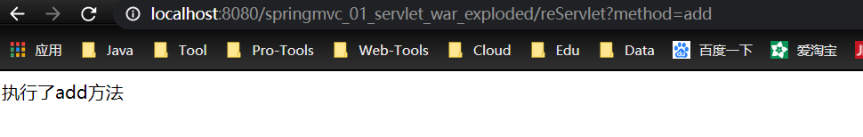

http://localhost:8080/springmvc_01_servlet_war_exploded/reServlet?method=delete

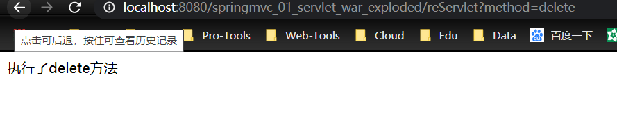

# 2、永远的HelloWorld

新建一个`module`,添加Web框架

## 1、在web.xml 中配置DispatcherServlet

```xml
<!-- 配置SpringMVC 核心控制器： -->
    <servlet>
        <servlet-name>springDispatcherServlet</servlet-name>
        <servlet-class>org.springframework.web.servlet.DispatcherServlet</servlet-class>
        <!-- 配置DispatcherServlet 的初始化參數：设置文件的路径和文件名称-->
        <init-param>
            <param-name>contextConfigLocation</param-name>
            <param-value>classpath:springmvc.xml</param-value>
        </init-param>
        <load-on-startup>1</load-on-startup>
    </servlet>
    <servlet-mapping>
        <servlet-name>springDispatcherServlet</servlet-name>
        <url-pattern>/</url-pattern>
    </servlet-mapping>
```

解释配置文件的名称定义规则:

- 实际上也可以不通过`contextConfigLocation `来配置SpringMVC 的配置文件, 而使用默认

	的.默认的配置文件为: /WEB-INF/<servlet-name>-servlet.xml

- 所有请求都将自动拦截下来，拦截下来后，请求交给` DispatcherServlet `去处理，在加载 DispatcherServlet 时，还需要指定配置文件路径。这里有一个默认的规则，如果配置文件放在 webapp/WEB-INF/ 目录下，并且配置文件的名字等于 `DispatcherServlet 的名字+ -servlet`（即这里的配置文件路径是 webapp/WEB-INF/springmvc-servlet.xml），如果是这样的话，可以不用添加 init-param 参数，即不用手动配置 springmvc 的配置文件，框架会自动加载。

## 2、加载 springmvc 配置文件

在 resources 目录下，创建一个名为 spring.xml 的 springmvc 的配置文件

```xml
<?xml version="1.0" encoding="UTF-8"?>
<beans xmlns="http://www.springframework.org/schema/beans"
       xmlns:xsi="http://www.w3.org/2001/XMLSchema-instance"
       xsi:schemaLocation="http://www.springframework.org/schema/beans http://www.springframework.org/schema/beans/spring-beans.xsd">
<!--spring mvc为我们做好的-->
    <bean class="org.springframework.web.servlet.handler.BeanNameUrlHandlerMapping" />
    <bean class="org.springframework.web.servlet.mvc.SimpleControllerHandlerAdapter" id="handlerAdapter"/>
    <!--视图解析器-->
    <bean class="org.springframework.web.servlet.view.InternalResourceViewResolver" id="viewResolver">
        <!--前缀-->
        <property name="prefix" value="/WEB-INF/jsp/"/>
        <!--后缀-->
        <property name="suffix" value=".jsp"/>
    </bean>

    <bean id="/hello" class="com.xiaobear.controller.HelloController"/>
</beans>
```

## 3、Controller，处理浏览器请求的接口

```java
public class HelloController implements Controller {
    /**
     * 这就是一个请求处理接口
     * @param httpServletRequest  这就是前端发送来的请求
     * @param httpServletResponse 这就是服务端给前端的响应
     * @return 返回值是一个 ModelAndView，Model 相当于是我们的数据模型 View 是我们的视图
     * @throws Exception
     */
    public ModelAndView handleRequest(HttpServletRequest httpServletRequest, HttpServletResponse httpServletResponse) throws Exception {
        ModelAndView view = new ModelAndView();
        view.addObject("msg","hello,spring mvc!");
        view.setViewName("hello");
        //WEB-INF/jsp/hello.jsp
        return view;
    }
}
```

## 4、创建视图

在WEB-INF下新建一个jsp目录,新建`hello.jsp`

```jsp
<%@ page contentType="text/html;charset=UTF-8" language="java" %>
<html>
<head>
    <title>Title</title>
</head>
<body>
${msg}
</body>
</html>
```

**访问出现404的原因：**

- 仔细检查自己的路径
- 在classes目录下新建一个lib目录，导入相关依赖
	- 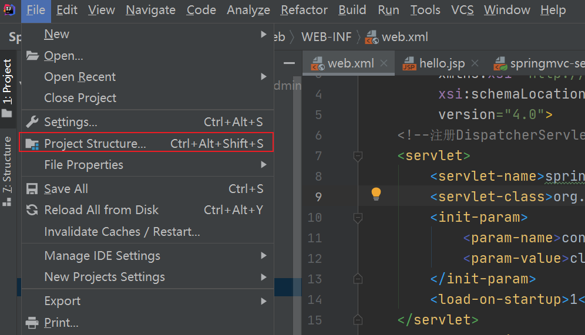
	- 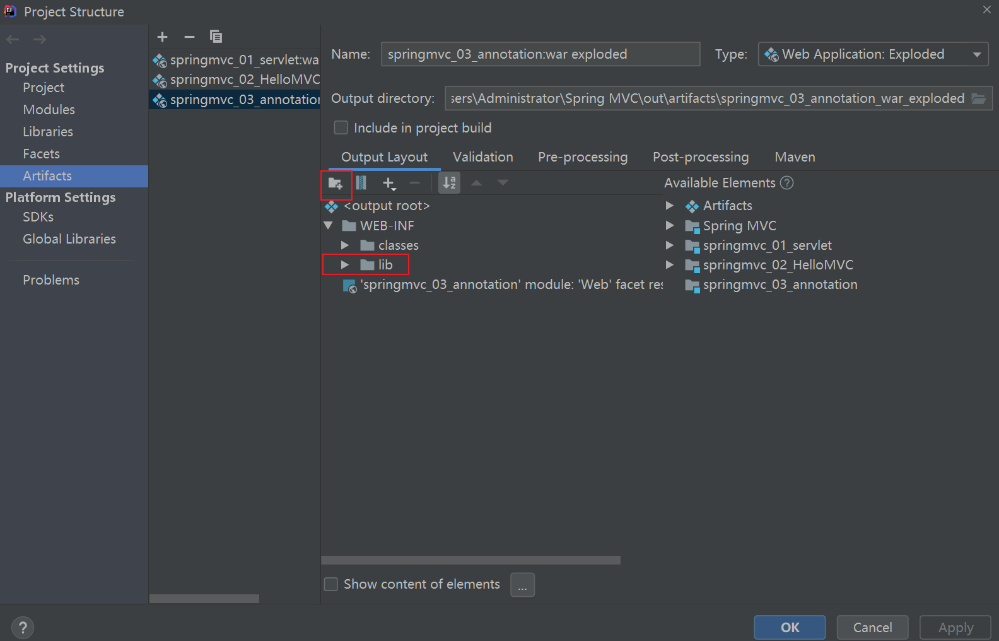
	- 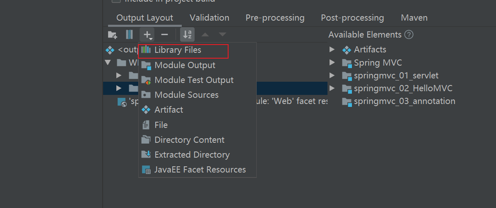
	- 

## 5、hello MVC深度解析

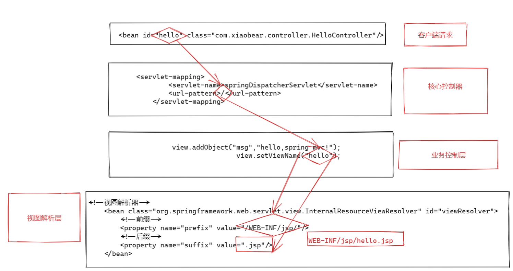

# 3、Spring MVC工作流程

**面试99%会问到**

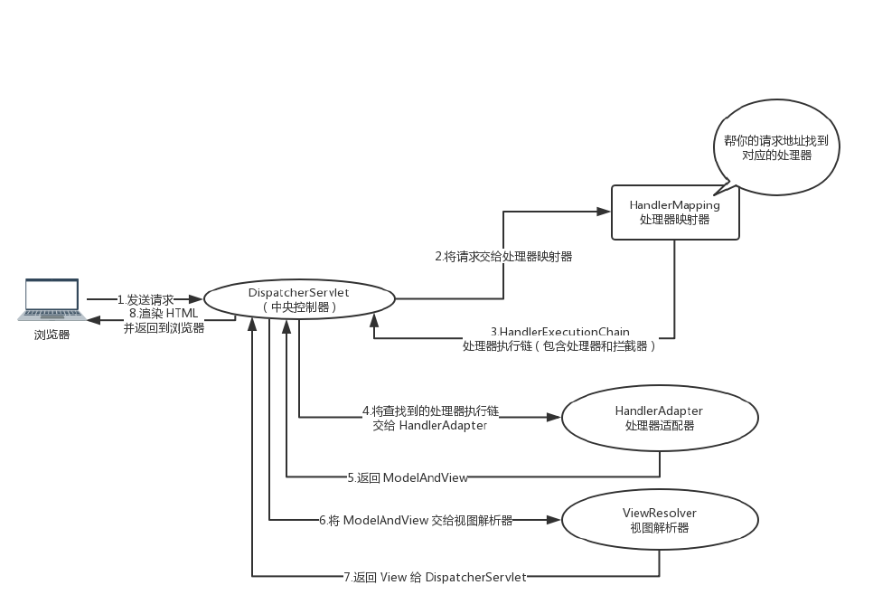

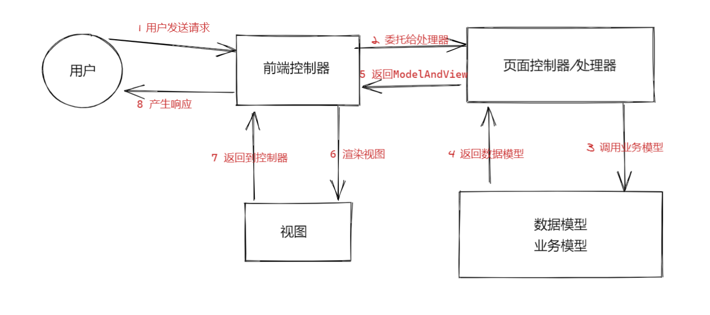

1. 客户端请求提交到`DispatcherServlet`
2. 由`DispatcherServlet` 控制器查询一个或多个`HandlerMapping`，找到处理请求的` Controller DispatcherServlet`
3. 请求提交到` Controller`（也称为`Handler`）
4. `Controller `调用业务逻辑处理后，返回 `ModelAndView`
5. `DispatcherServlet `查询一个或多个` ViewResoler` 视图解析器，找到` ModelAndView` 指定的视图
6. 视图负责将结果显示到客户端

# 4、基于注解开发Spring MVC

## 1、在 web.xml 中配置 DispatcherServlet

```xml
<!--注册DispatcherServlet-->
    <servlet>
        <servlet-name>springmvc</servlet-name>
        <servlet-class>org.springframework.web.servlet.DispatcherServlet</servlet-class>
        <init-param>
            <param-name>contextConfigLocation</param-name>
            <param-value>classpath:springmvc-servlet.xml</param-value>
<!--这里有一个默认的规则，如果配置文件放在 webapp/WEB-INF/ 目录下，并且配置文件的名字等于 DispatcherServlet 的名字+ -servlet（即这里的配置文件路径是 webapp/WEB-INF/springmvc-servlet.xml），如果是这样的话，可以不用添加 init-param 参数，即不用手动配置 springmvc 的配置文件，框架会自动加载。-->
        </init-param>
        <load-on-startup>1</load-on-startup>
    </servlet>
    <servlet-mapping>
        <servlet-name>springmvc</servlet-name>
        <url-pattern>/</url-pattern>
    </servlet-mapping>
```

## 2、新建spring配置文件：`springmvc-servlet.xml`

```xml
<!--自动扫描包-->
    <context:component-scan base-package="com.xiaobear.controller"/>
    <!--过滤-->
    <mvc:default-servlet-handler/>
    <!--自动配置 相当于HandleMapping和HandleAdapet-->
    <mvc:annotation-driven/>

    <!-- 配置映射解析器：如何将控制器返回的结果字符串，转换为一个物理的视图文件-->
    <bean id="InternalResourceViewResolver" class="org.springframework.web.servlet.view.InternalResourceViewResolver">
        <property name="prefix" value="/WEB-INF/jsp/"/>
        <property name="suffix" value=".jsp"/>
    </bean>
```

## 3、Controller

```java
@Controller
public class HelloController {

    @RequestMapping("/hello")
    public String hello(Model model) {
        model.addAttribute("msg","hello,spring mvc");
        return "hello";
    }
}
```

## 4、在/WEB-INF/新建jsp目录，新建hello.jsp视图

```jsp
<%@ page contentType="text/html;charset=UTF-8" language="java" %>
<html>
<head>
    <title>Title</title>
</head>
<body>
${msg}
</body>
</html>
```

总结：

- 后续我们都是基于注解开发的，感觉那就是非常爽的

- `springmvc`必须配置的三大组件

	- 处理器映射器

	- 处理器适配器

	- 视图解析器

		```xml
		<!--过滤-->
		<mvc:default-servlet-handler/>
		<!--自动配置 相当于HandleMapping和HandleAdapet-->
		<mvc:annotation-driven/>
		
		<!-- 配置映射解析器：如何将控制器返回的结果字符串，转换为一个物理的视图文件-->
		<bean id="InternalResourceViewResolver" class="org.springframework.web.servlet.view.InternalResourceViewResolver">
		    <property name="prefix" value="/WEB-INF/jsp/"/>
		    <property name="suffix" value=".jsp"/>
		</bean>
		```

- `Spring MVC`万能模板(基于注解)

	- 注册`DispatcherServlet`

		```xml
		<!--注册DispatcherServlet-->
		<servlet>
		    <servlet-name>springmvc</servlet-name>
		    <servlet-class>org.springframework.web.servlet.DispatcherServlet</servlet-class>
		    <init-param>
		        <param-name>contextConfigLocation</param-name>
		        <param-value>classpath:springmvc-servlet.xml</param-value>
		    </init-param>
		    <load-on-startup>1</load-on-startup>
		</servlet>
		<servlet-mapping>
		    <servlet-name>springmvc</servlet-name>
		    <url-pattern>/</url-pattern>
		</servlet-mapping>
		```

	- spring配置文件模板

		注：导入mvc命令空间的时候记得先导入过滤，如果先导入处理器的命令空间，就会报错

		```xml
		xmlns:mvc="http://www.springframework.org/schema/mvc"
		<!--下面是错误的-->
		xmlns:mvc="http://www.springframework.org/schema/cache"
		```

		```xml
		<!--自动扫描包-->
		<context:component-scan base-package="你自己的包"/>
		<!--过滤-->
		<mvc:default-servlet-handler/>
		<!--自动配置 相当于HandleMapping和HandleAdapet-->
		<mvc:annotation-driven/>
		
		<!-- 配置映射解析器：如何将控制器返回的结果字符串，转换为一个物理的视图文件-->
		<bean id="InternalResourceViewResolver" class="org.springframework.web.servlet.view.InternalResourceViewResolver">
		    <property name="prefix" value="/WEB-INF/jsp/"/>
		    <property name="suffix" value=".jsp"/>
		</bean>
		```

# 5、`DispatcherServlet`与处理器

## 1、`DispatcherServlet`

> DispatcherServlet 是前端控制器设计模式的实现，提供 Spring Web MVC 的集中访问点，而且负责职责的分派，而且与 Spring IoC 容器无缝集成，从而可以获得 Spring 的所有好处。DispatcherServlet 主要用作职责调度工作，本身主要用于控制流程，主要职责如下： 
>
> - 文件上传解析，如果请求类型是 multipart 将通过 MultipartResolver 进行文件上传解析
> - 通过 HandlerMapping，将请求映射到处理器（返回一个 HandlerExecutionChain，它包括一个处理器、多个 HandlerInterceptor 拦截器）
> - 通过 HandlerAdapter 支持多种类型的处理器(HandlerExecutionChain 中的处理器)
> - 通过 ViewResolver 解析逻辑视图名到具体视图实现
> - 本地化解析
> - 渲染具体的视图等
> - 如果执行过程中遇到异常将交给 HandlerExceptionResolver 来解析

### 1、`DispatcherServlet`配置详解

```xml
<!--注册DispatcherServlet-->
    <servlet>
        <servlet-name>springmvc</servlet-name>
        <servlet-class>org.springframework.web.servlet.DispatcherServlet</servlet-class>
        <init-param>
            <param-name>contextConfigLocation</param-name>
            <param-value>classpath:springmvc-servlet.xml</param-value>
        </init-param>
        <load-on-startup>1</load-on-startup>
    </servlet>
    <servlet-mapping>
        <servlet-name>springmvc</servlet-name>
        <url-pattern>/</url-pattern>
    </servlet-mapping>
```

•	`load-on-startup`：表示启动容器时初始化该` Servlet` 

•	`url-pattern`：表示哪些请求交给` Spring Web MVC `处理， "/" 是用来定义默认servlet 映射的。也可以如 

*.html 表示拦截所有以 html 为扩展名的请求

•	`contextConfigLocation`：表示 SpringMVC 配置文件的路径

**DispatcherServlet其他初始化参数**

| 参数                             | 说明                                                         |
| :------------------------------- | :----------------------------------------------------------- |
| `contextClass`                   | 实现类，`ConfigurableWebApplicationContext`由该Servlet实例化并在本地配置。默认情况下，`XmlWebApplicationContext`使用。 |
| `contextConfigLocation`          | 传递给上下文实例的字符串（由指定`contextClass`），以指示可以在哪里找到上下文。该字符串可能包含多个字符串（使用逗号作为分隔符）以支持多个上下文。对于具有两次定义的bean的多个上下文位置，以最新位置为准。 |
| `namespace`                      | `WebApplicationContext`命名空间。默认为`[servlet-name]-servlet`。 |
| `throwExceptionIfNoHandlerFound` | `NoHandlerFoundException`在找不到请求的处理程序时是否抛出。然后可以使用`HandlerExceptionResolver`（例如，通过使用 `@ExceptionHandler`控制器方法）捕获该异常并将其作为其他任何异常进行处理。默认情况下，它设置为`false`，在这种情况下，`DispatcherServlet`将响应状态设置为404（NOT_FOUND），而不会引发异常。请注意，如果还配置了[默认servlet处理](https://docs.spring.io/spring/docs/current/spring-framework-reference/web.html#mvc-default-servlet-handler)，则始终将未解决的请求转发到默认servlet，并且永远不会引发404。 |

## 2、处理器

### 1、HandlerMapping

HandlerMapping ，中文译作处理器映射器，在 SpringMVC 中，系统提供了很多 HandlerMapping

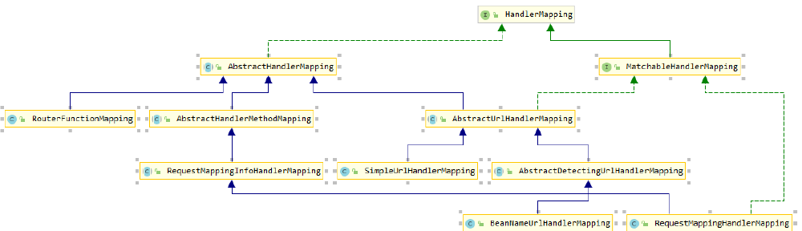

`HandlerMapping` 是负责根据 `request` 请求找到对应的` Handler` 处理器及` Interceptor` 拦截器，将它们封装在 `HandlerExecutionChain` 对象中返回给前端控制器。 

- `BeanNameUrlHandlerMapping`

	> BeanNameUrl 处理器映射器，根据请求的 url 与 Spring 容器中定义的 bean 的 name 进行匹配，从而从 Spring 容器中找到 bean 实例，就是说，请求的 Url 地址就是处理器 Bean 的名字。 
	>
	> ```xml
	> <bean class="org.springframework.web.servlet.handler.BeanNameUrlHand lerMapping" id="handlerMapping"> 
	>     <property name="beanName" value="/hello"/> 
	> </bean> 
	> ```

- `SimpleUrlHandlerMapping`

> SimpleUrlHandlerMapping 是 BeanNameUrlHandlerMapping 的增强版本，它可以将 url 和处理器 bean 的 id 进行统一映射配置: 
>
> ```xml
> <bean class="org.springframework.web.servlet.handler.SimpleUrlHandle rMapping" id="handlerMapping">
>     <property name="mappings">
>         <props>
>             <prop key="/hello">myController</prop> 
>             <prop key="/hello2">myController2</prop>
>             </props> 
>     </property> 
> </bean> 
> <!--注意，在 props 中，可以配置多个请求路径和处理器实例的映射关系。-->
> ```

### 2、`HandlerAdapter `

> HandlerAdapter 会根据适配器接口对后端控制器进行包装（适配），包装后即可对处理器进行执行，通过扩展处理器适配器可以执行多种类型的处理器，这里使用了适配器设计模式。 

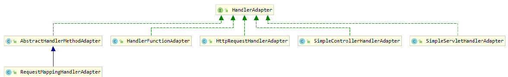

- `SimpleControllerHandlerAdapter`

> `SimpleControllerHandlerAdapter` 简单控制器处理器适配器，所有实现了 `org.springframework.web.servlet.mvc.Controller` 接口的 `Bean` 通过此适配器进行适配、执行，也就是说，如果我们开发的接口是通过实现 `Controller` 接口来完成的（不是通过注解开发的接口），那么 `HandlerAdapter` 必须是 `SimpleControllerHandlerAdapter`。
>
> ```xml
> <bean class="org.springframework.web.servlet.mvc.SimpleControllerHandlerAdapter" /> 
> ```

- `HttpRequestHandlerAdapter`

> HttpRequestHandlerAdapter，http 请求处理器适配器，所有实现了 
> org.springframework.web.HttpRequestHandler 接口的 Bean 通过此适配器进行适配、执行。
>
> ```java
> @Controller 
> public class MyController2 implements HttpRequestHandler { 
>     public void handleRequest(HttpServletRequest request, HttpServlet Response response) throws ServletException, IOException { 
>         System.out.println("-----MyController2-----");
>     } 
> } 
> ```
>
> ```xml
> <bean class="org.springframework.web.servlet.handler.SimpleUrlHandle rMapping" id="handlerMapping"> 
>     <property name="mappings">
>         <props> 
>             <prop key="/hello2">myController2</prop> 
>         </props> 
>     </property> 
> </bean> 
> <bean class="org.springframework.web.servlet.mvc.HttpRequestHandlerA dapter" id="handlerAdapter"/> 
> ```

# 6、@RequestMapping

- `@GetMapping` ==` @RequestMapping(method = RequestMethod.GET)`
- `@PostMapping` == ` @RequestMapping(method = RequestMethod.POST)`
- `@PutMapping ` == ` @RequestMapping(method = RequestMethod.PUT)`
- `@DeleteMapping ` == ` @RequestMapping(method = RequestMethod.DELETE)`
- `@PatchMapping ` == ` @RequestMapping(method = RequestMethod.PATCH)`

> 可以使用`@RequestMapping`批注将请求映射到控制器方法。它具有各种属性，可以通过URL，HTTP方法，请求参数，标头和媒体类型进行匹配。您可以在类级别使用它来表示共享的映射，也可以在方法级别使用它来缩小到特定的端点映射。
>
> - SpringMVC 使用@RequestMapping 注解为控制器指定可以处理哪些 URL 请求
> - 在控制器的类定义及方法定义处都可标注 @RequestMapping
> 	- 标记在类上：提供初步的请求映射信息。相对于 WEB 应用的根目录
> 	- 标记在方法上：提供进一步的细分映射信息。相对于标记在类上的 URL。	
>
> - 若类上未标注 @RequestMapping，则方法处标记的 URL 相对于 WEB 应用的根目录
> - 作用：DispatcherServlet 截获请求后，就通过控制器上 @RequestMapping 提供的映射信息确定请求所对应的处理方法。

```java
@Controller
public class ControllerTest3 {

    @RequestMapping("/test3")
    /**
     * 	映射请求的名称：用于客户端请求；类似Struts2 中action 映射配置的，action 名称
     * 	1 使用@RequestMapping 注解来映射请求的 URL
     * 	2 返回值会通过视图解析器解析为实际的物理视图,
     * 	对于 InternalResourceViewResolver 视图解析器,
     * 	会做如下的解析:
     * 	通过 prefix + returnVal + 后缀 这样的方式得到实际的物理视图, 然会做转发操作.
     * 	/WEB-INF/jsp/test.jsp
     */
    public String test3(){
        return "test";
    }
}

```

## 1、映射请求参数、请求方法或请求头

> 1. @RequestMapping 除了可以使用请求 URL 映射请求外，还可以使用请求方法、请求参数及请求头映射请求
>
> 2. @RequestMapping 的 value【重点】、method【重点】、params【了解】 及 heads 【了解】 分别表示请求 URL、请求方法、请求参数及请求头的映射条件，他们之间是与的关系，联合使用多个条件可让请求映射更加精确化。
>
> 3. params 和 headers 支持简单的表达式：
>
> 	- param1: 表示请求必须包含名为 param1 的请求参数
>
> 	- !param1: 表示请求不能包含名为 param1 的请求参数
>
> 	- param1 != value1: 表示请求包含名为 param1 的请求参数，但其值不能为 value1
> 		{"param1=value1", "param2"}: 请求必须包含名为 param1 和 param2 的两个请求参数，且 param1 参数的值必须为 value1
>
> 		```java
> 		@Controller
> 		public class RequestController {
> 		
> 		    @RequestMapping(value = "/t1",method = RequestMethod.POST)
> 		    public String test1(Model model){
> 		        model.addAttribute("msg","get请求方式成功");
> 		        return "test1";
> 		    }
> 		}
> 		```
>
> 		- 发生错误
>
> 			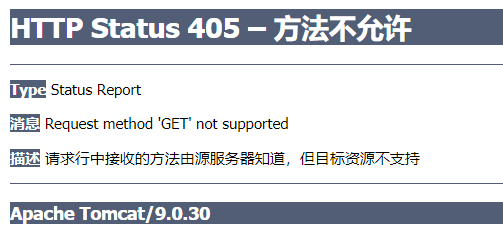

## 2、URL模式

| 模式            | 描述                                             | 例                                                           |
| :-------------- | :----------------------------------------------- | :----------------------------------------------------------- |
| `?`             | 匹配一个字符                                     | `"/pages/t?st.html"`比赛`"/pages/test.html"` 和`"/pages/t3st.html"` |
| `*`             | 匹配路径段中的零个或多个字符                     | `"/resources/*.png"` 火柴 `"/resources/file.png"``"/projects/*/versions"`匹配`"/projects/spring/versions"`但不匹配`"/projects/spring/boot/versions"` |
| `**`            | 匹配零个或多个路径段，直到路径结束               | `"/resources/**"`比赛`"/resources/file.png"`和`"/resources/images/file.png"` |
| `{name}`        | 匹配路径段并将其捕获为名为“ name”的变量          | `"/projects/{project}/versions"`比赛`"/projects/spring/versions"`和捕获`project=spring` |
| `{name:[a-z]+}` | 将正则表达式匹配`"[a-z]+"`为名为“名称”的路径变量 | `"/projects/{project:[a-z]+}/versions"`匹配`"/projects/spring/versions"`但不匹配`"/projects/spring1/versions"` |

```java
    /**
     *@RequestMapping("/t2/ab??") 匹配http://localhost:8080/springmvc_04_controller_war_exploded/t2/abcd。。。
     */
    @RequestMapping("/t2/ab??")
    public String testUrl(Model model){
        model.addAttribute("msg","请求成功！xiaobear");
        return "test1";
    }
}
```

## 3、`RequestMapping` 映射请求占位符`PathVariable `注解

### 1、`@PathVariable`

通过` @PathVariable` 可以将 URL 中占位符参数绑定到控制器处理方法的入参中

URL 中的 {xxx} 占位符可以通过` @PathVariable("xxx") `绑定到操作方法的入参中。

```java
@GetMapping("/t3/{a}/{b}")
    public String testPath(@PathVariable int a, @PathVariable int b, Model model){
        int restPath = a+b;
        model.addAttribute("msg","结果为："+restPath);
        return "test1";
    }
```

# 7、RestFul

## 1、REST 是什么？

> REST：即 Representational State Transfer。（资源）表现层状态转化。是目前最流行的一种互联网软件架构。它结构清晰、符合标准、易于理解、扩展方便，所以正得到越来越多网站的采用

1. 资源（Resources）：网络上的一个实体，或者说是网络上的一个具体信息。它可以是一段文本、一张图片、

	一首歌曲、一种服务，总之就是一个具体的存在。可以用一个 URI（统一资源定位符）指向它，每种资源对

	应一个特定的 URI 。获取这个资源，访问它的 URI就可以，因此 URI 即为每一个资源的独一无二的识别符。

2. 表现层（Representation）：把资源具体呈现出来的形式，叫做它的表现层（Representation）。比如，文本

	可以用 txt 格式表现，也可以用 HTML 格式、XML格式、JSON 格式表现，甚至可以采用二进制格式。

3. 状态转化（State Transfer）：每发出一个请求，就代表了客户端和服务器的一次交互过程。HTTP 协议，是一

	个无状态协议，即所有的状态都保存在服务器端。因此，如果客户端想要操作服务器，必须通过某种手段，

	让服务器端发生“状态转化” （State Transfer）而这种转化是建立在表现层之上的，所以就是 “表现层状态转

	化”。

4. 具体说，就是 HTTP 协议里面，四个表示操作方式的动词：GET、POST、PUT、DELETE。它们分别对应四种

	基本操作：GET 用来获取资源，POST 用来新建资源，PUT 用来更新资源，DELETE 用来删除资源。

## 2、URL风格

我们传统的传入参数是/xiaobear/id=1?method=add

```java
/order/1 HTTP GET ：得到 id = 1 的 order
/order/1 HTTP DELETE：删除 id = 1 的 order
/order HTTP PUT：更新 order
/order HTTP POST：新增 order
```

符合REST设计风格的Web API称为**RESTful API**。它从以下三个方面资源进行定义：

- 直观简短的资源地址：URI，比如：`http://example.com/resources`。
- 传输的资源：Web服务接受与返回的[互联网媒体类型](https://zh.wikipedia.org/wiki/互联网媒体类型)，比如：[JSON](https://zh.wikipedia.org/wiki/JSON)，[XML](https://zh.wikipedia.org/wiki/XML)，[YAML](https://zh.wikipedia.org/wiki/YAML)等。
- 对资源的操作：Web服务在该资源上所支持的一系列[请求方法](https://zh.wikipedia.org/wiki/超文本传输协议#请求方法)（比如：POST，GET，PUT或DELETE）。

|                          资源                          |                             GET                              |                          PUT                          |                             POST                             |       DELETE       |
| :----------------------------------------------------: | :----------------------------------------------------------: | :---------------------------------------------------: | :----------------------------------------------------------: | :----------------: |
|   一组资源的URI，比如`https://example.com/resources`   | **列出**URI，以及该资源组中每个资源的详细信息（后者可选）。  |       使用给定的一组资源**替换**当前整组资源。        | 在本组资源中**创建/追加**一个新的资源。该操作往往返回新资源的URL。 | **删除**整组资源。 |
| 单个资源的URI，比如`https://example.com/resources/142` | **获取**指定的资源的详细信息，格式可以自选一个合适的网络媒体类型（比如：XML、JSON等） | **替换/创建**指定的资源。并将其追加到相应的资源组中。 | 把指定的资源当做一个资源组，并在其下**创建/追加**一个新的元素，使其隶属于当前资源。 | **删除**指定的元素 |

## 3、`HiddenHttpMethodFilter`

浏览器 form 表单只支持 GET 与 POST 请求，而 DELETE、PUT 等 method 并不支持，Spring3.0 添加了一个过滤器，可以将这些请求转换为标准的 http 方法，使得支持 GET、POST、PUT 与 DELETE 请求。

#### 源码分析：

为什么请求隐含参数名称必须叫做”_method”

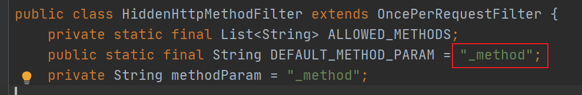

hiddenHttpMethodFilter 的处理过程

```java
protected void doFilterInternal(HttpServletRequest request, HttpServletResponse response, FilterChain filterChain) throws ServletException, IOException {
        HttpServletRequest requestToUse = request;
        if ("POST".equals(request.getMethod()) && request.getAttribute("javax.servlet.error.exception") == null) {
            String paramValue = request.getParameter(this.methodParam);
            if (StringUtils.hasLength(paramValue)) {
                String method = paramValue.toUpperCase(Locale.ENGLISH);
                if (ALLOWED_METHODS.contains(method)) {
                    requestToUse = new HiddenHttpMethodFilter.HttpMethodRequestWrapper(request, method);
                }
            }
        }

        filterChain.doFilter((ServletRequest)requestToUse, response);
    }

private static class HttpMethodRequestWrapper extends HttpServletRequestWrapper {
        private final String method;

        public HttpMethodRequestWrapper(HttpServletRequest request, String method) {
            super(request);
            this.method = method;
        }

        public String getMethod() {
            return this.method;
        }
    }
```

#### 代码测试

在web.xml中配置filter

```xml
<!-- 支持 REST 风格的过滤器：可以将 POST 请求转换为 PUT 或 DELETE 请求 -->
<filter>
    <filter-name>HiddenHttpMethodFilter</filter-name>
    <filter-class>org.springframework.web.filter.HiddenHttpMethodFilter</filter-class>
</filter>
<filter-mapping>
    <filter-name>HiddenHttpMethodFilter</filter-name>
    <url-pattern>/*</url-pattern>
</filter-mapping>
```

```java
@Controller
public class RestController {
    @GetMapping(value="/testRESTGet/{id}")
    public String testRESTGet(@PathVariable(value="id") Integer id, Model model) {
        model.addAttribute("msg","ID="+id);
        return "test1";
    }
    @PostMapping("/testRESTPost")
    public String testRESTPost( Model model) {
        model.addAttribute("msg","Post方式请求成功！");
        return "test1";
    }
    @PutMapping("/testRESTPut/{id}")
    public String testRESTPut(@PathVariable(value="id") Integer id, Model model) {
        model.addAttribute("msg","Put方式请求成功！id="+id);
        return "test1";
    }
    @PutMapping("/testRESTDelete/{id}")
    public String testRESTDelete(@PathVariable(value="id") Integer id, Model model) {
        model.addAttribute("msg","Delete方式请求成功！id="+id);
        return "test1";
    }
}
```

index.jsp

```jsp
<%@ page contentType="text/html;charset=UTF-8" language="java" %>
<html>
  <head>
    <title>$Title$</title>
  </head>
  <body>
  <!-- 实验 1 测试 REST 风格 GET 请求 -->
  <a href="testRESTGet/1">testREST GET</a><br/>
  <!-- 实验 2 测试 REST 风格 POST 请求 -->
  <form action="testRESTPost" method="POST">
    <input type="submit" value="testRESTPost">
  </form>
  <!-- 实验 3 测试 REST 风格 PUT 请求 -->
  <form action="testRESTPut/1" method="POST">
    <input type="hidden" name="_method" value="PUT">
    <input type="submit" value="testRESTPut">
  </form>
  <!-- 实验 4 测试 REST 风格 DELETE 请求 -->
  <form action="testRESTDelete/1" method="POST">
    <input type="hidden" name="_method" value="DELETE"> <input type="submit" value="testRESTDelete">
  </form>
  </body>
</html>
```

# 8、处理数据

## 1、处理请求数据

> 1. Spring MVC 通过分析处理方法的签名，HTTP 请求信息绑定到处理方法的相应参数中。
> 2. Spring MVC 对控制器处理方法签名的限制是很宽松的，几乎可以按喜欢的任何方式对方法进行签名。
> 3. 必要时可以对方法及方法入参标注相应的注解（ @PathVariable 、@RequestParam、 @RequestHeader 等）
> 4. Spring MVC 框架会将 HTTP 请求的信息绑定到相应的方法入参中，并根据方法的返回值类型做出相应的后续处理。

### 1、@RequestParam

> 1. 在处理方法入参处使用 @RequestParam 可以把请求参数传递给请求方法
> 2. value：参数名
> 3. required：是否必须。默认为 true, 表示请求参数中必须包含对应的参数，若不存在，将抛出异常
> 4. defaultValue: 默认值，当没有传递传递使用该值

```java
@RequestMapping("/a1")
public String requestParam(@RequestParam(value = "name") String name,
                           @RequestParam(value="age",required=false,defaultValue="0") int age, Model model){
    model.addAttribute("msg","name="+name);
    model.addAttribute("msg1","age="+age);
    return "a";
}
```

```jsp
<!--测试 请求参数 @RequestParam 注解使用 -->
<a href="a1?name=xiaobear&age=3">testRequestParam</a>
```

### 2、@RequestHeader

> 1. 使用 @RequestHeader 绑定请求报头的属性值
>
> 2. 请求头包含了若干个属性，服务器可据此获知客户端的信息，通过 @RequestHeader 即可将请求头中的
>
> 	属性值绑定到处理方法的入参中

```java
@RequestMapping("/a2")
public String testRequestHeader(@RequestHeader("Accept-Encoding") String encoding
                                ,Model model){
    model.addAttribute("msg","获取Accept-Encoding标头的值:"+encoding);
    return "a";
}
```

```jsp
<!-- 测试 请求头@RequestHeader 注解使用 -->
<a href="a2">testRequestHeader</a>
```

### 3、@CookieValue

> 1. 使用 @CookieValue 绑定请求中的 Cookie 值
> 2. @CookieValue 可让处理方法入参绑定某个 Cookie 值

```java
@RequestMapping("/a3")
public String testCookieValue(@CookieValue("JSESSIONID") String sessionId,Model model){
    model.addAttribute("msg","cookie="+sessionId);
    return "a";
}
```

```jsp
<!-- 测试 请求头@CookieValue 注解使用 -->
<a href="a3">testCookieValue</a><br>
```

### 4、使用POJO 作为参数

> 1. 使用 POJO 对象绑定请求参数值
>
> 2. Spring MVC 会按请求参数名和 POJO 属性名进行自动匹配，自动为该对象填充属性值。支持级联属性。
>
> 	如：dept.deptId、dept.address.tel 等

表单

```jsp
<!-- 测试 POJO 对象传参，支持级联属性 -->
<form action="a4" method="POST">
    username: <input type="text" name="username"/><br>
    password: <input type="password" name="password"/><br>
    email: <input type="text" name="email"/><br>
    age: <input type="text" name="age"/><br>
    city: <input type="text" name="address.city"/><br>
    province: <input type="text" name="address.province"/>
    <input type="submit" value="Submit"/>
</form>
```

```java
@RequestMapping("/a4")
public String testPojo(User user,Model model){
    model.addAttribute("msg",""+user);
    return "a";
}
```

实体类

```java
@Data
@AllArgsConstructor
@NoArgsConstructor
public class User {
    private Integer id ;
    private String username;
    private String password;
    private String email;
    private int age;
    private Address address;
}
```

```java
@Data
@AllArgsConstructor
@NoArgsConstructor
public class Address {
    private String province;
    private String city;
}
```

中文乱码解决：

```xml
<!--配置springMVC的乱码过滤-->
<filter>
    <filter-name>characterEncodingFilter</filter-name>
    <filter-class>org.springframework.web.filter.CharacterEncodingFilter</filter-class>
    <init-param>
        <param-name>encoding</param-name>
        <param-value>UTF-8</param-value>
    </init-param>
    <init-param>
        <param-name>forceEncoding</param-name>
        <param-value>true</param-value>
    </init-param>
</filter>
<filter-mapping>
    <filter-name>characterEncodingFilter</filter-name>
    <url-pattern>/*</url-pattern>
</filter-mapping>
```

## 2、处理响应数据

### 1、SpringMVC 输出模型数据概述

> 1. `ModelAndView:` 处理方法返回值类型为 ModelAndView 时, 方法体即可通过该对象添加模型数据
> 2. `Map 及 Model: `入参为 org.springframework.ui.Model、
> 	org.springframework.ui.ModelMap 或 java.uti.Map 时，处理方法返回时，Map 中的数据会自动添加到模型中。
> 3. `@SessionAttributes: `将模型中的某个属性暂存到 HttpSession 中，以便多个请求之间可以共享这个属性
> 4. `@ModelAttribute: `方法入参标注该注解后, 入参的对象就会放到数据模型中

- `ModelAndView`

	>- 控制器处理方法的返回值如果为 ModelAndView, 则其既包含视图信息，也包含模型数据信息。
	>- 添加模型数据:
	>	- MoelAndView addObject(String attributeName, Object attributeValue)
	>	- ModelAndView addAllObject(Map<String, ?> modelMap)
	>
	>- 设置视图:
	>	- void setView(View view)
	>	- void setViewName(String viewName)
	>
	>```java
	>@RequestMapping("/b1")
	>public ModelAndView testModel(){
	>    ModelAndView modelAndView = new ModelAndView();
	>    modelAndView.setViewName("success");
	>    modelAndView.addObject("time",new Date().toString());
	>    return modelAndView;
	>}
	>```

- `处理模型数据之 Map`

	> 1. Spring MVC 在内部使用了一个 org.springframework.ui.Model 接口存储模型数据具体使用步骤
	>
	> 2. Spring MVC 在调用方法前会创建一个隐含的模型对象作为模型数据的存储容器。
	>
	> 3. 如果方法的入参为 Map 或 Model 类型，Spring MVC 会将隐含模型的引用传递给这些入参。
	>
	> 4. 在方法体内，开发者可以通过这个入参对象访问到模型中的所有数据，也可以向模型中添加新的属
	>
	> 	性数据
	>
	> 	```java
	> 	@RequestMapping("/b2")
	> 	public String testMap(Map<String,Object> map){
	> 	    map.put("name", Arrays.asList("xiaobear","yhx","xiaohua"));
	> 	    return "success";
	> 	}
	> 	```

- `处理模型数据之 SessionAttributes `

	>1. 若希望在多个请求之间共用某个模型属性数据，则可以在控制器类上标注一个@SessionAttributes, Spring MVC 将在模型中对应的属性暂存到 HttpSession 中。
	>
	>2. @SessionAttributes 除了可以通过属性名指定需要放到会话中的属性外，还可以通过模型属性的对象
	>
	>	类型指定哪些模型属性需要放到会话中
	>
	>	例如：
	>
	>	- @SessionAttributes(types=User.class) 会 将 隐 含 模 型 中 所 有 类 型 为User.class 的属性添加到会话中。
	>	- @SessionAttributes(value={“user1”, “user2”})
	>	- @SessionAttributes(types={User.class, Dept.class})
	>	- @SessionAttributes(value={“user1”, “user2”}, types={Dept.class})
	>
	>	```java
	>	@RequestMapping("/b3")
	>	public String testSessionAttributes(Map<String,Object> map){
	>	    User user = new User("xiaobear","123","Xxx@qq.com",18);
	>	    map.put("user", user);
	>	    map.put("school", "xiaobear");
	>	    //默认是被存放到request 域，如果设置了@SessionAttribute 注解，就同时存放到session 域中
	>	    return "success";
	>	}
	>	```

- ` @ModelAttribute `

	> 1. 在方法定义上使用 @ModelAttribute 注解：Spring MVC 在调用目标处理方法前，会先逐个调用在方法级上标注了 @ModelAttribute 的方法。
	>
	> 2. 在方法的入参前使用 @ModelAttribute 注解：可以从隐含对象中获取隐含的模型数据中获取对象，再将请求参数绑定到对象中，再传入入参。
	>
	> 3. 将方法入参对象添加到模型中。
	>
	> 	```java
	> 	@RequestMapping("/b4")
	> 	public String testModelAttribute(User user){
	> 	    System.out.println(user);
	> 	    return "success";
	> 	}
	> 	@ModelAttribute
	> 	public void getUser(@RequestParam(value="id",required=false) Integer id,
	> 	                    Map<String,Object> map){
	> 	    if(id!=null){
	> 	        //模拟从数据库中获取到的user 对象
	> 	        User user = new User(1,"xiaobear","123456","xxx@qq.com",18);
	> 	        System.out.println("从数据库中查询的对象：user="+user );
	> 	        map.put("user", user);
	> 	    }
	> 	}
	> 	```
	>
	> 	```jsp
	> 	<form action="b4" method="POST">
	> 	    <input type="hidden" name="id" value="1"><br>
	> 	    username: <input type="text" name="username" value="xiaobear"/><br>
	> 	    email: <input type="text" name="email" value="xxx@qq.com"/><br>
	> 	    age: <input type="text" name="age" value="3"/><br>
	> 	    <input type="submit" value="Submit"/>
	> 	</form>
	> 	```

#### 1、 @ModelAttribute 之运行原理执行

1. @ModelAttribute 注解所修饰的方法，将从数据库中获取的对象存放到 Map 集合中，key 为 user
2. SpringMVC从Map集合中获取 user对象，将表单数据封装到与参数名称对应的user对象属性上
3. SpringMVC 将 user 对象作为参数，传递给目标方法。
4. 注意：@ModelAttribute注解修饰的方法中，放入到 Map 集合中的 key 值，应该和目标方法参数类型的类名称首字母小写一致。

#### 2、@ModelAttribute 之源码

```java
@Target({ElementType.PARAMETER, ElementType.METHOD})
@Retention(RetentionPolicy.RUNTIME)
@Documented
public @interface ModelAttribute {
    @AliasFor("name")
    String value() default "";

    @AliasFor("value")
    String name() default "";

    boolean binding() default true;
}
```

## 3、重定向

1. 一般情况下，控制器方法返回字符串类型的值会被当成逻辑视图名处理
2. 如果返回的字符串中带 forward: 或 redirect: 前缀时，SpringMVC 会对他们进行特殊处理：将 forward: 和 redirect: 当成指示符，其后的字符串作为 URL 来处理
3. `redirect:success.jsp`：会完成一个到 success.jsp 的`重定向`的操作
4. `forward:success.jsp`：会完成一个到 success.jsp 的`转发`操作

```java
@RequestMapping("/b5")
public String redirect(Model model){
    model.addAttribute("msg","sucess!");
    return "redirect:/index.jsp";
    //        return "forward:/index.jsp";
}
```

# 9、JSON

目前主流的 JSON 处理工具主要有三种：

- jackson

- gson

- fastjson

	> 在 SpringMVC 中，对 jackson 和 gson 都提供了相应的支持，就是如果使用这两个作为 JSON 转换器，只需要添加对应的依赖就可以了，返回的对象和返回的集合、Map 等都会自动转为 JSON，但是，如果使用 fastjson，除了添加相应的依赖之外，还需要自己手动配置 HttpMessageConverter 转换器。其实前两个也是使用 HttpMessageConverter 转换器，但是是 SpringMVC 自动提供的，SpringMVC 没有给 fastjson 提供相应的转换器。

## 1、Jackson

jackson 是一个使用比较多，时间也比较长的 JSON 处理工具，在 SpringMVC 中使用 jackson ，只需要添加 jackson 的依赖即可：

```xml
<!-- https://mvnrepository.com/artifact/com.fasterxml.jackson.core/jackson-databind -->
<dependency>
    <groupId>com.fasterxml.jackson.core</groupId>
    <artifactId>jackson-databind</artifactId>
    <version>2.11.1</version>
</dependency>
```

依赖添加成功后，凡是在接口中直接返回的对象，集合等等，都会自动转为 JSON.

- pojo类

```java
@Data
@AllArgsConstructor
@NoArgsConstructor
public class User {

    private String name;
    private int age;
    private String sex;
}
```

- controller层

	```java
	@RestController
	public class UserController {
	
	    @RequestMapping(value = "/j1"/*,produces = "application/json; charset=utf-8"*/)
	    public String json1() throws JsonProcessingException {
	
	        ObjectMapper mapper = new ObjectMapper();
	        User user = new User();
	        user.setName("鄢汉雄");
	        user.setAge(18);
	        user.setSex("boy");
	        String value = mapper.writeValueAsString(user);
	        return value;
	    }
	    @RequestMapping("/j2")
	    public String json2() throws JsonProcessingException {
	        ObjectMapper objectMapper = new ObjectMapper();
	        List<User> users = new ArrayList<User>();
	        User user = new User("yhx", 2, "boy");
	        User user1 = new User("yhx", 3, "boy");
	        User user2 = new User("yhx", 4, "boy");
	        User user3 = new User("yhx", 5, "boy");
	        users.add(user);
	        users.add(user2);
	        users.add(user3);
	        users.add(user1);
	        String s = objectMapper.writeValueAsString(users);
	        return s;
	
	    }
	     @RequestMapping("/j3")
	    public String json3() throws JsonProcessingException {
	        /**
	         * 修改配置文件
	          Date date = new Date();
	        return date;
	         */
	      
	        //时间格式一
	        /*SimpleDateFormat simpleDateFormat = new SimpleDateFormat("yyyy-MM-dd HH:mm:ss");
	        return objectMapper.writeValueAsString(simpleDateFormat.format(date));*/
	        /**
	         * 时间格式三
	         */
	        /*ObjectMapper objectMapper = new ObjectMapper();
	        objectMapper.configure(SerializationFeature.WRITE_DATE_KEYS_AS_TIMESTAMPS,false);
	        SimpleDateFormat simpleDateFormat = new SimpleDateFormat("yyyy-MM-dd HH:mm:ss");
	        objectMapper.setDateFormat(simpleDateFormat);
	        Date date = new Date();
	        return objectMapper.writeValueAsString(date);*/
	        Date date = new Date();
	        return JsonUtils.getJson(date,"yyyy-MM-dd HH:mm:ss");
	    }
	}
	```

### 1、json中文字符串乱码问题

1. 解决方案一，设置生成环境为UTF-8

	```java
	 @RequestMapping(value = "/j1",produces = "application/json; charset=utf-8")
	```

2. 在`spring`配置文件中配置属性

	```xml
	<!--处理json字符串乱码问题-->
	<mvc:annotation-driven>
	    <mvc:message-converters register-defaults="true">
	        <bean class="org.springframework.http.converter.StringHttpMessageConverter">
	            <constructor-arg value="UTF-8"/>
	        </bean>
	        <bean class="org.springframework.http.converter.json.MappingJackson2HttpMessageConverter">
	            <property name="objectMapper">
	                <bean class="org.springframework.http.converter.json.Jackson2ObjectMapperFactoryBean">
	                    <property name="failOnEmptyBeans" value="false"></property>
	                </bean>
	            </property>
	        </bean>
	    </mvc:message-converters>
	</mvc:annotation-driven>
	```

### 2、json处理时间格式问题

1. 解决方案一

	```java
	@RequestMapping("/j3")
	public String json3() throws JsonProcessingException {
	    ObjectMapper objectMapper = new ObjectMapper();
	    SimpleDateFormat simpleDateFormat = new SimpleDateFormat("yyyy-MM-dd HH:mm:ss");
	    Date date = new Date();
	    return objectMapper.writeValueAsString(simpleDateFormat.format(date));
	}
	```

2. 解决方案二

	```java
	@RequestMapping("/j3")
	public String json3() throws JsonProcessingException {
	    ObjectMapper objectMapper = new ObjectMapper();   objectMapper.configure(SerializationFeature.WRITE_DATE_KEYS_AS_TIMESTAMPS,false);
	    SimpleDateFormat simpleDateFormat = new SimpleDateFormat("yyyy-MM-dd HH:mm:ss");
	    objectMapper.setDateFormat(simpleDateFormat);
	    Date date = new Date();
	    return objectMapper.writeValueAsString(date);
	}
	```

3. 在spring配置文件中配置

	```xml
	<!--json日期格式化-->
	<mvc:annotation-driven>
	    <mvc:message-converters>
	        <ref bean="httpMessageConverter"/>
	    </mvc:message-converters>
	</mvc:annotation-driven>
	<bean class="org.springframework.http.converter.json.MappingJackson2HttpMessageConverter" id="httpMessageConverter">
	    <property name="objectMapper">
	        <bean class="com.fasterxml.jackson.databind.ObjectMapper">
	            <property name="dateFormat"> <bean class="java.text.SimpleDateFormat">
	                <constructor-arg name="pattern" value="yyyy-MM-dd HH:mm:ss"/>
	                </bean>
	            </property>
	            <property name="timeZone" value="Asia/Shanghai"/>
	        </bean>
	    </property>
	</bean>
	```

	```java
	@RequestMapping("/j3")
	public Date json3() throws JsonProcessingException {
	    /**
	         * 修改配置文件
	         */
	    Date date = new Date();
	    return date;
	}
	```

4. 针对方案二我们可以自己封装为一个工具类JsonUtils

	```java
	public class JsonUtils {
	
	    public static String getJson(Object object){
	        return getJson(object,"yyyy-MM-dd HH:mm:ss");
	    }
	    /**
	     * Json时间格式工具类
	     * @param o 时间对象
	     * @param dateFormat  时间格式
	     * @return json格式
	     */
	    public static String getJson(Object o,String dateFormat){
	        ObjectMapper objectMapper = new ObjectMapper();
	        objectMapper.configure(SerializationFeature.WRITE_DATE_KEYS_AS_TIMESTAMPS,false);
	        SimpleDateFormat simpleDateFormat = new SimpleDateFormat(dateFormat);
	        objectMapper.setDateFormat(simpleDateFormat);
	        try {
	            return objectMapper.writeValueAsString(o);
	        } catch (JsonProcessingException e) {
	            e.printStackTrace();
	        }
	        return null;
	    }
	}
	```

	```java
	@RequestMapping("/j3")
	public String json3() throws JsonProcessingException {
	    Date date = new Date();
	    return JsonUtils.getJson(date,"yyyy-MM-dd HH:mm:ss");
	}
	```

## 2、fastjson

- 提供服务器端、安卓客户端两种解析工具，性能表现较好。
- 提供了 toJSONString() 和 parseObject() 方法来将 Java 对象与 JSON 相互转换。调用toJSONString方 法即可将对象转换成 JSON 字符串，parseObject 方法则反过来将 JSON 字符串转换成对象。
- 允许转换预先存在的无法修改的对象（只有class、无源代码）。
- Java泛型的广泛支持。
- 允许对象的自定义表示、允许自定义序列化类。
- 支持任意复杂对象（具有深厚的继承层次和广泛使用的泛型类型）。

使用 fastjson，我们首先添加 fastjson 依赖

```xml
<!-- https://mvnrepository.com/artifact/com.alibaba/fastjson -->
<dependency>
    <groupId>com.alibaba</groupId>
    <artifactId>fastjson</artifactId>
    <version>1.2.72</version>
</dependency>
```

在 SpringMVC 并没针对 fastjson 提供相应的 HttpMessageConverter，所以，fastjson 在使用时，一定要自己手动配置 HttpMessageConverter

```xml
<mvc:annotation-driven> 
    <mvc:message-converters> 
        <ref bean="httpMessageConverter"/> 
    </mvc:message-converters> 
</mvc:annotation-driven> 
<bean class="com.alibaba.fastjson.support.spring.FastJsonHttpMessageConverter" id="httpMessageConverter">
    <property name="fastJsonConfig">
        <bean class="com.alibaba.fastjson.support.config.FastJsonConfig"> 
            <property name="dateFormat" value="yyyy-MM-dd"/> 
        </bean> 
    </property>
</bean>
```

### 1、fastjson 默认中文乱码

添加如下配置解决：

```xml
<mvc:annotation-driven> 
    <mvc:message-converters> 
        <ref bean="httpMessageConverter"/> 
    </mvc:message-converters> 
</mvc:annotation-driven> 
<bean class="com.alibaba.fastjson.support.spring.FastJsonHttpMessageConverter" id="httpMessageConverter">
    <property name="fastJsonConfig"> 
        <bean class="com.alibaba.fastjson.support.config.FastJsonConfig"> 
            <property name="dateFormat" value="yyyy-MM-dd"/>
        </bean> 
    </property> 
    <property name="supportedMediaTypes"> 
        <list> 
            <value>application/json;charset=utf-8</value> 
        </list> 
    </property> 
</bean>
```

### 2、使用

```java
@RequestMapping("/j4")
public String json4() throws JsonProcessingException {
    List<User> users = new ArrayList<User>();
    User user = new User("yhx", 2, "boy");
    User user1 = new User("yhx", 3, "boy");
    User user2 = new User("yhx", 4, "boy");
    User user3 = new User("yhx", 5, "boy");
    users.add(user);
    users.add(user2);
    users.add(user3);
    users.add(user1);
    String s = JSON.toJSONString(users);
    return s;
}
```

注：访问出现500的原因：**记得把fastjson依赖导入lib中**

# 10、文件上传

> SpringMVC 中对文件上传做了封装，我们可以更加方便的实现文件上传。从 Spring3.1 开始，对于文件上传，提供了两个处理器：
>
> - **CommonsMultipartResolver**
> - **StandardServletMultipartResolver**
> - 第一个处理器兼容性较好，可以兼容 Servlet3.0 之前的版本，但是它依赖了 commons-fileupload 这个第三方工具，所以如果使用这个，一定要添加 commons-fileupload 依赖。
> - 第二个处理器兼容性较差，它适用于 Servlet3.0 之后的版本，它不依赖第三方工具，使用它，可以直接做文件上传。

## 1、`CommonsMultipartResolver`

使用 CommonsMultipartResolver 做文件上传，需要首先添加 commons-fileupload 依赖

```xml
<!-- https://mvnrepository.com/artifact/commons-fileupload/commons-fileupload -->
<dependency>
    <groupId>commons-fileupload</groupId>
    <artifactId>commons-fileupload</artifactId>
    <version>1.4</version>
</dependency>
```

### 1、在 SpringMVC 的配置文件中，配置 MultipartResolver：

```xml
<!--配置 MultipartResolver id必须是multipartResolver-->
<bean class="org.springframework.web.multipart.commons.CommonsMultipartResolver" id="multipartResolver"/>
```

### 2、Jsp页面

```jsp
<form action="/upload" method="post" enctype="multipart/form-data"> 
    <input type="file" name="file"> 
    <input type="submit" value="上传"> 
</form>
```

注意文件上传请求是 POST 请求，enctype 一定是 multipart/form-data

- upload.jsp

	```jsp
	<%@ page contentType="text/html;charset=UTF-8" language="java" %>
	<html>
	<head>
	    <title>Title</title>
	</head>
	<body>
	<%
	    Object msg = request.getAttribute("msg");
	%>
	<%=msg%>
	</body>
	</html>
	```

### 3、controller

```java
@Controller
public class UploadController {

    @RequestMapping("/upload")
    public String upload(@RequestParam("file") List<MultipartFile> files, HttpServletRequest request) throws IOException {
        /*System.out.println("OriginalFilename : "+file.getOriginalFilename());
        InputStream inputStream = file.getInputStream();
        System.out.println("inputStream.available() : "+inputStream.available());
        System.out.println("inputStream : "+inputStream);*/
        String msg = "";
        // 判断文件是否上传
        if (!files.isEmpty()) {
            // 设置上传文件的保存目录
            String basePath = request.getServletContext().getRealPath("/upload/");
            System.out.println(basePath);
            // 判断文件目录是否存在
            File uploadFile = new File(basePath);
            if (!uploadFile.exists()) {
                uploadFile.mkdirs();
            }
            for (MultipartFile file : files) {
                String originalFilename = file.getOriginalFilename();
                if (originalFilename != null && !originalFilename.equals("")) {
                    try {
                        // 对文件名做加UUID值处理
                        originalFilename = UUID.randomUUID() + "_" + originalFilename;
                        file.transferTo(new File(basePath + originalFilename));
                    } catch (IOException e) {
                        e.printStackTrace();
                        msg = "文件上传失败！";
                    }
                } else {
                    msg = "上传的文件为空！";
                }
            }
            msg = "文件上传成功！";
        } else {
            msg = "没有文件被上传！";
        }
        request.setAttribute("msg", msg);
        return "upload";
    }
}
```

这里还有一个小问题，在 SpringMVC 中，静态资源默认都是被自动拦截的，无法访问，意味着上传成功的图片无法访问，因此，还需要我们在 SpringMVC 的配置文件中，再添加如下配置：

```xml
<mvc:resources mapping="/**" location="/"/>
```

当然，默认的配置不一定满足我们的需求，我们还可以自己手动配置文件上传大小等：

```xml
<bean class="org.springframework.web.multipart.commons.CommonsMultipartResolver" id="multipartResolver">
    <!--默认的编码--> 
    <property name="defaultEncoding" value="UTF-8"/> 
    <!--上传的总文件大小--> 
    <property name="maxUploadSize" value="1048576"/> 
    <!--上传的单个文件大小--> 
    <property name="maxUploadSizePerFile" value="1048576"/>
    <!--内存中最大的数据量，超过这个数据量，数据就要开始往硬盘中写了--> 
    <property name="maxInMemorySize" value="4096"/> 
    <!--临时目录，超过 maxInMemorySize 配置的大小后，数据开始往临时目录写，等全部上传完成后，再将数据合并到正式的文件上传目录--> 
    <property name="uploadTempDir" value="file:///E:\\tmp"/> 
</bean>
```

## 2、`StandardServletMultipartResolver`

这种文件上传方式，不需要依赖第三方 jar（主要是不需要添加 commons-fileupload 这个依赖），但是也不支持 Servlet3.0 之前的版本。
使用 StandardServletMultipartResolver ，那我们首先在 SpringMVC 的配置文件中，配置这个 Bean：

```xml
<bean class="org.springframework.web.multipart.support.StandardServletMultipartResolver" id="multipartResolver">
</bean>
```

**注意，这里 Bean 的名字依然叫 multipartResolver**

- 配置完成后，注意，这个 Bean 无法直接配置上传文件大小等限制。需要在 web.xml 中进行配置（这里，即使不需要限制文件上传大小，也需要在 web.xml 中配置 multipart-config）

	```xml
	<multipart-config> 
	    <!--文件保存的临时目录，这个目录系统不会主动创建--> 
	    <location>E:\\temp</location> 
	    <!--上传的单个文件大小--> 
	    <max-file-size>1048576</max-file-size> 
	    <!--上传的总文件大小--> <max-request-size>1048576</max-request-size> 
	    <!--这个就是内存中保存的文件最大大小--> 
	    <file-size-threshold>4096</file-size-threshold> 
	</multipart-config>
	```

配置完成后，就可以测试文件上传了，测试方式和上面一样。

## 3、多文件上传

主要是 input 节点中多了 multiple 属性。后端用一个数组来接收文件即可：

```java
@RequestMapping("/upload2")
public String uploadFile(MultipartFile[] files, HttpServletRequest req) throws IOException {
    for (MultipartFile file : files) {
        if(!file.isEmpty()){
            file.transferTo(new File("D:/"+file.getOriginalFilename()));
            req.getSession().setAttribute("msg","success");
        }
    }
    return "upload";
}
```

# 11、拦截器

SpringMVC 中的拦截器，相当于 Jsp/Servlet 中的过滤器，只不过拦截器的功能更为强大。

```java
public interface HandlerInterceptor {
    //这个是请求预处理的方法，只有当这个方法返回值为 true 的时候，后面的方法才会执行
    default boolean preHandle(HttpServletRequest request, HttpServletResponse response, Object handler) throws Exception {
        return true;
    }

    default void postHandle(HttpServletRequest request, HttpServletResponse response, Object handler, @Nullable ModelAndView modelAndView) throws Exception {
    }

    default void afterCompletion(HttpServletRequest request, HttpServletResponse response, Object handler, @Nullable Exception ex) throws Exception {
    }
```

> Spring MVC 也可以使用拦截器对请求进行拦截处理，用户可以自定义拦截器来实现特定的功能，自定义的拦截器必须实现HandlerInterceptor 接口
>
> - preHandle()：这个方法在业务处理器处理请求之前被调用，在该方法中对用户请求request 进行处理。如果程序员决定该拦截器对请求进行拦截处理后还要调用其他的拦截器，或者是业务处理器去进行处理，则返回true；如果程序员决定不需要再调用其他的组件去处理请求，则返回false。
> - postHandle()：这个方法在业务处理器处理完请求后，但是DispatcherServlet 向客户端返回响应前被调用，在该方法中对用户请求request 进行处理。
> -  afterCompletion()：这个方法在DispatcherServlet 完全处理完请求后被调用，可以在该方法中进行一些资源清理的操作。

## 1、单个拦截器

```java
public class MyInterceptor implements HandlerInterceptor {
    /**
     * 这个是请求预处理的方法，只有当这个方法返回值为 true 的时候，后面的方法才会执行
     * @param request
     * @param response
     * @param handler
     * @return
     * @throws Exception
     */
    public boolean preHandle(HttpServletRequest request, HttpServletResponse response, Object handler) throws Exception {
        System.out.println("==========处理前==========");
        return true;
    }
    public void postHandle(HttpServletRequest request, HttpServletResponse response, Object handler, ModelAndView modelAndView) throws Exception {
        System.out.println("==========处理后==========");
    }
    public void afterCompletion(HttpServletRequest request, HttpServletResponse response, Object handler, Exception ex) throws Exception {
        System.out.println("==========清理==========");
    }
}
```

- controller

```java
@Controller
public class InterceptorController {
    @RequestMapping("/t1")
    @ResponseBody
    public String test(){
        return "hello";
    }
}
```

- 在applicationContext.xml配置拦截器

```xml
 <!--配置拦截器-->
    <mvc:interceptors>
        <mvc:interceptor>
            <mvc:mapping path="/**"/>
            <bean class="com.xiaobear.config.MyInterceptor"/>
        </mvc:interceptor>
    </mvc:interceptors>
```

## 2、拦截登录实例

- 登录表单login.jsp

	```jsp
	<%@ page contentType="text/html;charset=UTF-8" language="java" %>
	<html>
	<head>
	    <title>登录页面</title>
	</head>
	<body>
	<form action="${pageContext.request.contextPath}/user/login" method="post">
	    用户名：<input type="text" name="username">
	    密码： <input type="text" name="password">
	    <input type="submit" value="login">
	</form>
	</body>
	</html>
	```

- index.jsp实现跳转

	```jsp
	<%@ page contentType="text/html;charset=UTF-8" language="java" %>
	<html>
	    <head>
	        <title>$Title$</title>
	    </head>
	    <body>
	        <h1>
	            <a href="${pageContext.request.contextPath}/user/toLogin">登录页面</a>
	            <a href="${pageContext.request.contextPath}/user/main">首页</a>
	        </h1>
	    </body>
	</html>
	```

- 登录成功后进入首页

	```jsp
	<%@ page contentType="text/html;charset=UTF-8" language="java" %>
	<html>
	    <head>
	        <title>Title</title>
	    </head>
	    <body>
	        <h1>首页</h1>
	        <h3>${username}</h3>
	        <p>
	            <a href="${pageContext.request.contextPath}/user/goOut">注销</a>
	        </p>
	    </body>
	</html>
	```

- 登录拦截器

	```java
	public class LoginInterceptor implements HandlerInterceptor {
	    public boolean preHandle(HttpServletRequest request, HttpServletResponse response, Object handler) throws Exception {
	        HttpSession session = request.getSession();
	        if (request.getRequestURI().contains("toLogin")){
	            return true;
	        }
	        if (request.getRequestURI().contains("login")){
	            return true;
	        }
	        if (session.getAttribute("userLoginInfo")!=null){
	            return true;
	        }
	        request.getRequestDispatcher("/WEB-INF/jsp/login.jsp").forward(request,response);
	        return true;
	    }
	}
	```

- controller层

	```java
	@Controller
	@RequestMapping("/user")
	public class LoginController {
	
	    @RequestMapping("/login")
	    public String login(String username, String password, HttpSession session, Model model){
	        session.setAttribute("userLoginInfo",username);
	        model.addAttribute("username",username);
	        return "main";
	    }
	    @RequestMapping("/goOut")
	    public String goOut(String username, String password, HttpSession session, Model model){
	        session.removeAttribute("userLoginInfo");
	        return "login";
	    }
	    @RequestMapping("/main")
	    public String main(){
	        return "main";
	    }
	    @RequestMapping("/toLogin")
	    public String main1(){
	        return "login";
	    }
	}
	```

- 配置拦截器

	```xml
	<!--配置拦截器-->
	<mvc:interceptors>
	    <mvc:interceptor>
	        <mvc:mapping path="/**"/>
	        <bean class="com.xiaobear.config.LoginInterceptor"/>
	    </mvc:interceptor>
	</mvc:interceptors>
	```

# 12、静态资源访问

在 SpringMVC 中，静态资源，默认都是被拦截的，例如 html、js、css、jpg、png、txt、pdf 等等，都是无法直接访问的。因为所有请求都被拦截了，所以，针对静态资源，我们要做额外处理，处理方式很简单，直接在 SpringMVC 的配置文件中，添加如下内容：

```xml
<mvc:resources mapping="/static/html/**" location="/static/html/"/>
```

mapping 表示映射规则，也是拦截规则，就是说，如果请求地址是 /static/html 这样的格式的话，那么对应的资源就去 /static/html/ 这个目录下查找。

- 在映射路径的定义中，最后是两个 *，这是一种 Ant 风格的路径匹配符号，一共有三个通配符：

| 通配符 |       含义       |
| :----: | :--------------: |
|   **   |   匹配多层路径   |
|   *    |   匹配一层路径   |
|   ？   | 匹配任意单个字符 |

一个比较原始的配置方式可能如下：

```xml
<mvc:resources mapping="/static/html/**" location="/static/html/"/> 
<mvc:resources mapping="/static/js/**" location="/static/js/"/> 
<mvc:resources mapping="/static/css/**" location="/static/css/"/>
```

但是，由于 ** 可以表示多级路径，所以，以上配置，我们可以进行简化：

```xml
<mvc:resources mapping="/**" location="/"/>
```

