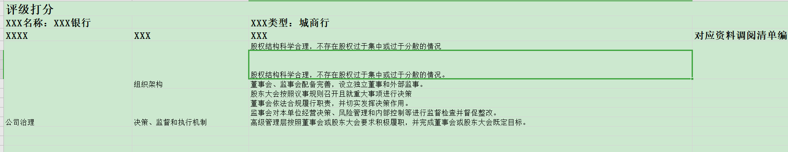
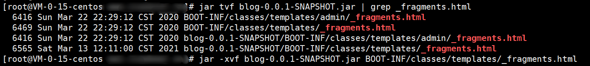
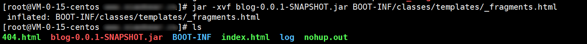
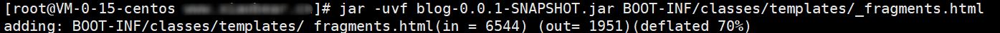

# 1、Mysql

## 1、mysql忘记密码解决方法

### 1、停止mysql服务

```shell
net stop mysql
```

### 2、以管理员身份运行cmd

进入mysql的bin目录下，开启跳过密码验证登录的mysql服务

```
mysqld --console --skip-grant-tables --shared-memory
```

这个界面不要关闭

### 3、以管理员身份打开第二个CMD，进入mysql的bin目录下

```shell
#第一步：
mysql
#刷新权限
flush privileges;
#第二步，MySQL 5.7.6及更高版本
ALTER USER 'root'@'localhost' IDENTIFIED BY 'MyNewPass';
#MySQL 5.7.5及更早版本
SET PASSWORD FOR 'root'@'localhost' = PASSWORD('MyNewPass');
```

### 4、关闭第一个CMD程序，启动mysql服务

```shell
#启动mysql服务
net start mysql
#登录
mysql -u root -p
```

# 2、EasyExcel

## 1、解决EasyExcel不支持解析List以及实体类对象问题

### 1、EasyExcel支持的类型

```java
public enum CellDataTypeEnum {
    STRING,
    DIRECT_STRING,
    NUMBER,
    BOOLEAN,
    EMPTY,
    ERROR,
    IMAGE;
    ......
}
```

EasyExcel默认支持的为我们常见的类型，但在实际项目中，可能会遇到一对一，一对多的关系，这时候EasyExcel就会报错

```java

```

### 2、解决办法

因为一对一或者一对多就相当于一个`list`里面又包含另一个list集合，这时候我们可以将`list`集合进行解析，换个思路：

- 返回的数据不包含集合，这时候就不能包含`association`、`collection`进行关联，这时候，我问了公司大佬，发现`Mybatis`可以继承，也就是`extends`进行关联

现在具体来看代码实现：

- 准备一个实体类来接收你要返回的数据，包括list集合里面的属性
- 如果有多个就进行继承，两个实体类就不需要新建一个实体类来进行接收，直接一个继承另一个

我现在是涉及到是三个类的连表查询：

- 新建一个实体类来接收返回的数

  ```java
  public class FirRatingcardTemplateVo extends FirRatingCard{
  
      private static final long serialVersionUID = 1L;
  //------------------------第一个类------------------------------//
      /** 评分模板ID */
      @ExcelIgnore
      private Long ratingTemplateId;
  
      /** 模板ID */
      @ExcelIgnore
      private Long templateId;
      
      ......
      
      //------------------------第二个类------------------------------//
      /** 评分资料ID */
      @ExcelIgnore
      private Long rmId;
  
      /** 任务ID */
      @ExcelIgnore
      private String taskId;
      ......
  }
  ```

  继承FirRatingCard是第三个类

- XXXmapper.xml的配置，也是继承

  ```xml
  <resultMap type="FirRatingcardTemplateVo" id="FirRatingMaterialResultVo" extends="FirRatingcardTemplateResultW1">
      
      ......
      </resultMap>
      <resultMap type="FirRatingcardTemplateVo" id="FirRatingcardTemplateResultW1" extends="FirRatingCardResult">
  
          ......
      </resultMap>
      <resultMap type="FirRatingCard" id="FirRatingCardResult">
  	......
      </resultMap>
  ```

- 业务成实现类Service

  ```java
  public List<FirRatingcardTemplateVo> selectFirRatingMaterialByRmId(Long rmId);
  ```

  用我们新建的实体类来接收

- 接口进行测试

  ```java
  @Controller
  public class ExcelController {
  
      @Autowired
      private IFirRatingMaterialService iFirRatingMaterialService;
  
      @RequestMapping(value = "/getExcel", method = RequestMethod.GET)
      public void getEXcel( HttpServletResponse response) throws IOException {
          //获取数据源
          List<FirRatingcardTemplateVo> list = iFirRatingMaterialService.selectFirRatingMaterialByRmId(1L);    
          //设置输入流，设置响应域
          response.setContentType("application/ms-excel");
          response.setCharacterEncoding("utf-8");
          //生成文件名
          String  fileName = URLEncoder.encode("xxx.xlsx","utf-8");
          response.setHeader("Content-disposition","attachment;filename="+fileName);
          //需要合并的列
          int[] mergeColumeIndex = {0, 1, 2};
          //需要从第一行开始，列头第一行
          int mergeRowIndex = 1;
          EasyExcel//将数据映射到DownloadDTO实体类并响应到浏览器
                  .write(new BufferedOutputStream(response.getOutputStream()), FirRatingcardTemplateVo.class)
                  //07的excel版本,节省内存
                  .excelType(ExcelTypeEnum.XLS)
                  //是否自动关闭输入流
                  .autoCloseStream(Boolean.TRUE)
  //               // 自定义列宽度，有数字会
                  .registerWriteHandler(new LongestMatchColumnWidthStyleStrategy())
                  //设置excel保护密码
  //                .password("123456")
                  .sheet().doWrite(list);
      }
  
  ```

## 2、解决EasyExcel不支持解析List以及实体类对象问题（优化版---推荐）

对于上述提到的问题，就不一一描述了，

## 3、EasyExcel自定义表头的内容

效果如下:



### 1、根据相同内容合并单元格

工具类`ExcelFillCellMergeStrategy`：可以直接使用，这是自定义的拦截器，使用在后面会提到

```java
@Data
public class ExcelFillCellMergeStrategy implements CellWriteHandler {
    private int[] mergeColumnIndex;
    private int mergeRowIndex;

    public ExcelFillCellMergeStrategy() {

    }

    public ExcelFillCellMergeStrategy(int mergeRowIndex, int[] mergeColumnIndex) {
        this.mergeRowIndex = mergeRowIndex;
        this.mergeColumnIndex = mergeColumnIndex;
    }

    @Override
    public void beforeCellCreate(WriteSheetHolder writeSheetHolder, WriteTableHolder writeTableHolder, Row row, Head head, Integer columnIndex, Integer relativeRowIndex, Boolean isHead) {

    }

    @Override
    public void afterCellCreate(WriteSheetHolder writeSheetHolder, WriteTableHolder writeTableHolder, Cell cell, Head head, Integer integer, Boolean aBoolean) {

    }

    @Override
    public void afterCellDataConverted(WriteSheetHolder writeSheetHolder, WriteTableHolder writeTableHolder, CellData cellData, Cell cell, Head head, Integer integer, Boolean aBoolean) {

    }

    @Override
    public void afterCellDispose(WriteSheetHolder writeSheetHolder, WriteTableHolder writeTableHolder, List<CellData> list, Cell cell, Head head, Integer integer, Boolean aBoolean) {
       //当前行
        int curRowIndex = cell.getRowIndex();
        //当前列
        int curColIndex = cell.getColumnIndex();

        if (curRowIndex > mergeRowIndex) {
            for (int i = 0; i < mergeColumnIndex.length; i++) {
                if (curColIndex == mergeColumnIndex[i]) {
                    mergeWithPrevRow(writeSheetHolder, cell, curRowIndex, curColIndex);
                    break;
                }
            }
        }
    }

    /**
     * 当前单元格向上合并
     *
     * @param writeSheetHolder
     * @param cell             当前单元格
     * @param curRowIndex      当前行
     * @param curColIndex      当前列
     */
    private void mergeWithPrevRow(WriteSheetHolder writeSheetHolder, Cell cell, int curRowIndex, int curColIndex) {
        //获取当前行的第一列的数据和上一行的第一列数据，通过第一行数据是否相同进行合并
//        Cell preCell_now = cell.getSheet().getRow(curRowIndex ).getCell(curColIndex);
//        Object curData = preCell_now.getCellTypeEnum() == CellType.STRING ? preCell_now.getStringCellValue() : preCell_now.getNumericCellValue();
//        Cell preCell = cell.getSheet().getRow(curRowIndex - 1).getCell(curColIndex - 1);
  //      Object preData = preCell.getCellTypeEnum() == CellType.STRING ? preCell.getStringCellValue() : preCell.getNumericCellValue();
        //获取当前行的当前列的数据和上一行的当前列列数据，通过上一行数据是否相同进行合并
        Object curData = cell.getCellTypeEnum() == CellType.STRING ? cell.getStringCellValue() : cell.getNumericCellValue();
        Cell preCell = cell.getSheet().getRow(curRowIndex - 1).getCell(curColIndex);
        Object preData = preCell.getCellTypeEnum() == CellType.STRING ? preCell.getStringCellValue() : preCell.getNumericCellValue();

        // 比较当前行的第一列的单元格与上一行是否相同，相同合并当前单元格与上一行
        //
        if (curData.equals(preData)) {
            Sheet sheet = writeSheetHolder.getSheet();
            List<CellRangeAddress> mergeRegions = sheet.getMergedRegions();
            boolean isMerged = false;
            for (int i = 0; i < mergeRegions.size() && !isMerged; i++) {
                CellRangeAddress cellRangeAddr = mergeRegions.get(i);
                // 若上一个单元格已经被合并，则先移出原有的合并单元，再重新添加合并单元
                if (cellRangeAddr.isInRange(curRowIndex - 1, curColIndex)) {
                    sheet.removeMergedRegion(i);
                    cellRangeAddr.setLastRow(curRowIndex);
                    sheet.addMergedRegion(cellRangeAddr);
                    isMerged = true;
                }
            }
            // 若上一个单元格未被合并，则新增合并单元
            if (!isMerged) {
                CellRangeAddress cellRangeAddress = new CellRangeAddress(curRowIndex - 1, curRowIndex, curColIndex, curColIndex);
                sheet.addMergedRegion(cellRangeAddress);
            }
        }
    }

}
```

### 2、自定义表头内容

#### 1、一些样式工具类，首行以及单元格，颜色什么的可以自己去弄，很简单，这里我就不写了，不会的可以私聊我

```java
public class EasyExcelUtils {

    /**
     * 首行单元格
     * @param workbook
     * @param fontSize
     * @return
     */
    public static CellStyle getColumnTopStyle(Workbook workbook, int fontSize) {
        if (fontSize == 0) {
            fontSize = 12;
        }
        // 设置字体
        Font font = workbook.createFont();
        //设置字体大小
        font.setFontHeightInPoints((short) fontSize);
        //字体加粗
        font.setBold(true);
        //设置字体名字
        font.setFontName("宋体");
        //设置样式;
        CellStyle style = workbook.createCellStyle();
        //在样式用应用设置的字体;
        style.setFont(font);
        //设置自动换行;
        style.setWrapText(false);
        return style;
    }

    /**
     *
     * @param workbook
     * @param indexedColors
     * @return
     */
    public static CellStyle getColumnTopStyle(Workbook workbook, IndexedColors indexedColors) {
        // 设置字体
        Font font = workbook.createFont();
        //设置字体大小
        font.setFontHeightInPoints((short) 14);
        //字体加粗
        font.setBold(true);
        //设置字体名字
        font.setFontName("宋体");
        //设置样式;
        CellStyle style = workbook.createCellStyle();
        //在样式用应用设置的字体;
        style.setFont(font);
        //设置自动换行;
        style.setWrapText(false);

        if(indexedColors != null){
            style.setFillForegroundColor(indexedColors.getIndex());// 设置背景色
            style.setFillPattern(FillPatternType.SOLID_FOREGROUND);
        }
        return style;
    }
    /*
     * 字段样式
     */
    public static CellStyle getColumnStyle(Workbook workbook) {
        // 设置字体
        Font font = workbook.createFont();
        //设置字体大小
        font.setFontHeightInPoints((short) 10);
        //设置字体名字
        font.setFontName("宋体");
        //设置样式;
        CellStyle style = workbook.createCellStyle();
        //在样式用应用设置的字体;
        style.setFont(font);
        //设置自动换行;
        style.setWrapText(true);
        return style;

    }
}
```

#### 2、自定义拦截器

```java
/**
 * @Author: Xiaobear
 * @Time: 2020/9/19 14:09
 * @Description: 自定义拦截，写入头部样式
 */
public class CustomCellWriteHandler extends AbstractCellStyleStrategy implements CellWriteHandler {

    Workbook workbook;

    @Override
    public void beforeCellCreate(WriteSheetHolder writeSheetHolder, WriteTableHolder writeTableHolder, Row row, Head head, Integer columnIndex, Integer relativeRowIndex, Boolean isHead) {
        super.beforeCellCreate(writeSheetHolder, writeTableHolder, row, head, columnIndex, relativeRowIndex, isHead);
    }

    @Override
    public void afterCellDispose(WriteSheetHolder writeSheetHolder, WriteTableHolder writeTableHolder, List<CellData> cellDataList, Cell cell, Head head, Integer relativeRowIndex, Boolean isHead) {
        super.afterCellDispose(writeSheetHolder, writeTableHolder, cellDataList, cell, head, relativeRowIndex, isHead);
    }

    @Override
    public void afterCellCreate(WriteSheetHolder writeSheetHolder, WriteTableHolder writeTableHolder, Cell cell, Head head, Integer relativeRowIndex, Boolean isHead) {
        this.initCellStyle(writeSheetHolder.getSheet().getWorkbook());
        this.setHeadCellStyle(cell,head,relativeRowIndex);
    }

    @Override
    protected void initCellStyle(Workbook workbook) {
        this.workbook = workbook;
    }

    @Override
    protected void setHeadCellStyle(Cell cell, Head head, Integer integer) {
        //第一行样式
        if (cell.getRowIndex() == 0) {
            cell.setCellStyle(EasyExcelUtils.getColumnTopStyle(workbook, 16));
        } else if (cell.getRowIndex() == 1) {  //第二行样式
            cell.setCellStyle(EasyExcelUtils.getColumnTopStyle(workbook, 14));
        }else if (cell.getRowIndex() == 2){    //第三行样式
            cell.setCellStyle(EasyExcelUtils.getColumnTopStyle(workbook,14));
        }
        //大于第二行的
        if(cell.getRowIndex() > 2){
            cell.setCellStyle(EasyExcelUtils.getColumnStyle(workbook));
        }
    }

    @Override
    protected void setContentCellStyle(Cell cell, Head head, Integer integer) {
    }
}

```

#### 3、加入头部的方法

```java
/**
     * 自定义头
     * @param headTitle   统一头
     *
     * @return   返回整个头list。 头部相同连续的单元格会自动合并。
     */
    private static List<List<String>> head(String headTitle, String deptName,String deptType,String ratingYear,String ratingPhase,String location){
        List<List<String>> list = new ArrayList<List<String>>();
        List<String> head1 = new ArrayList<String>();
        head1.add(headTitle);
        head1.add("金融机构名称："+deptName);
        head1.add("模块");
        List<String> head2 = new ArrayList<String>();
        head2.add(headTitle);
        head2.add("");
        head2.add("一级指标");
        List<String> head3 = new ArrayList<String>();
        head3.add(headTitle);
        head3.add("机构类型："+deptType);
        head3.add("二级指标");
        List<String> head4 = new ArrayList<String>();
        head4.add(headTitle);
        head4.add("");
        head4.add("对应资料调阅清单编号");
        List<String> head5 = new ArrayList<String>();
        head5.add(headTitle);
        head5.add("评级年份："+ratingYear);
        head5.add("评分内容ID");
        List<String> head6 = new ArrayList<String>();
        head6.add(headTitle);
        head6.add("");
        head6.add("评分内容");
        List<String> head7 = new ArrayList<String>();
        head7.add(headTitle);
        head7.add("评级期数："+ratingPhase);
        head7.add("评分方式");
        List<String> head8 = new ArrayList<String>();
        head8.add(headTitle);
        head8.add("");
        head8.add("问询");
        List<String> head9 = new ArrayList<String>();
        head9.add(headTitle);
        head9.add("所在地："+location);
        head9.add("现场核查");
        List<String> head10 = new ArrayList<String>();
        head10.add(headTitle);
        head10.add("");
        head10.add("打分");
        List<String> head11 = new ArrayList<String>();
        head11.add(headTitle);
        head11.add("");
        head11.add("打分指引依据");
        List<String> head12 = new ArrayList<String>();
        head12.add(headTitle);
        head12.add("");
        head12.add("资料调阅依据");
        list.add(head1);
        list.add(head2);
        list.add(head3);
        list.add(head4);
        list.add(head5);
        list.add(head6);
        list.add(head7);
        list.add(head8);
        list.add(head9);
        list.add(head10);
        list.add(head11);
        list.add(head12);
        return list;
    }
```

#### 4、接口调用

```java
@Controller
public class ExcelController {

    @Autowired
    private IFirRatingMaterialService iFirRatingMaterialService;

    @RequestMapping(value = "/getExcel", method = RequestMethod.GET)
    public void getEXcel( HttpServletResponse response) throws IOException {
        //获取数据源
        List<FirRatingcardTemplateVo> list = iFirRatingMaterialService.selectFirRatingMaterialByRmId(1L);
        for (FirRatingcardTemplateVo template : list) {
            System.out.println(template);
        }
        //设置输入流，设置响应域
        response.setContentType("application/ms-excel");
        response.setCharacterEncoding("utf-8");
        String  fileName = URLEncoder.encode(list.get(0).getRatingYear()+"年第"+list.get(0).getRatingPhase()+"期"+list.get(0).getDeptName()+".xlsx","utf-8");
        response.setHeader("Content-disposition","attachment;filename="+fileName);
        //需要合并的列
        int[] mergeColumeIndex = {0, 1, 2, 3, };
        //需要从第一行开始，列头第一行
        int mergeRowIndex = 1;
        EasyExcel//将数据映射到DownloadDTO实体类并响应到浏览器
                .write(new BufferedOutputStream(response.getOutputStream()), FirRatingcardTemplateVo.class)
                //07的excel版本,节省内存
                .excelType(ExcelTypeEnum.XLS)
            //头部信息
                .head(head("评级打分",list.get(0).getDeptName(),list.get(0).getDeptType(),list.get(0).getRatingYear(),list.get(0).getRatingPhase(),list.get(0).getLocation()))
                //是否自动关闭输入流
                .autoCloseStream(Boolean.TRUE)
            //自定义的表头拦截
                .registerWriteHandler(new CustomCellWriteHandler())
            //合并单元格拦截器
                .registerWriteHandler(new ExcelFillCellMergeStrategy(mergeRowIndex, mergeColumeIndex))
//               // 自定义列宽度，有数字会
                .registerWriteHandler(new LongestMatchColumnWidthStyleStrategy())
                //设置excel保护密码
//                .password("123456")
                .sheet().doWrite(list);
    }

```

# 3、Linux修改jar里的文件

1. 使用jar tvf jar名称 | grep 目标文件名 查询出目标文件在war包中的目录

2. 使用jar xvf jar名称 目标文件名(copy上面查出的全路径) 将目标文件及所在war包中的目录解压到当前路径

3. 修改目标文件的内容，或者将要新的目标文件替换掉提取出来的目标文件

4. 使用jar uvf jar名称 目标文件名（和步骤（2）中的目标文件名相同） 将新目标文件替换到 jar包中

## 1、具体

这里以blog.jar为例进行操作

1、首先，查找你需要修改的文件

```
jar tvf blog-0.0.1-SNAPSHOT.jar | grep _fragments.html
```



2、解压文件到当前目录

```
jar -xvf blog-0.0.1-SNAPSHOT.jar BOOT-INF/classes/templates/_fragments.html
```



3、如果你有替换的文件就直接替换，没有则修改你需要修改的部分

```
vim _fragments.html
cp 文件 目标文件
```

4、将修改的新文件替换到jar包中

```
jar -uvf blog-0.0.1-SNAPSHOT.jar BOOT-INF/classes/templates/_fragments.html
```



